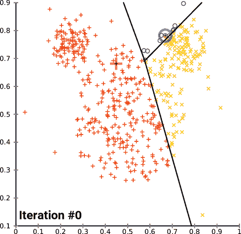
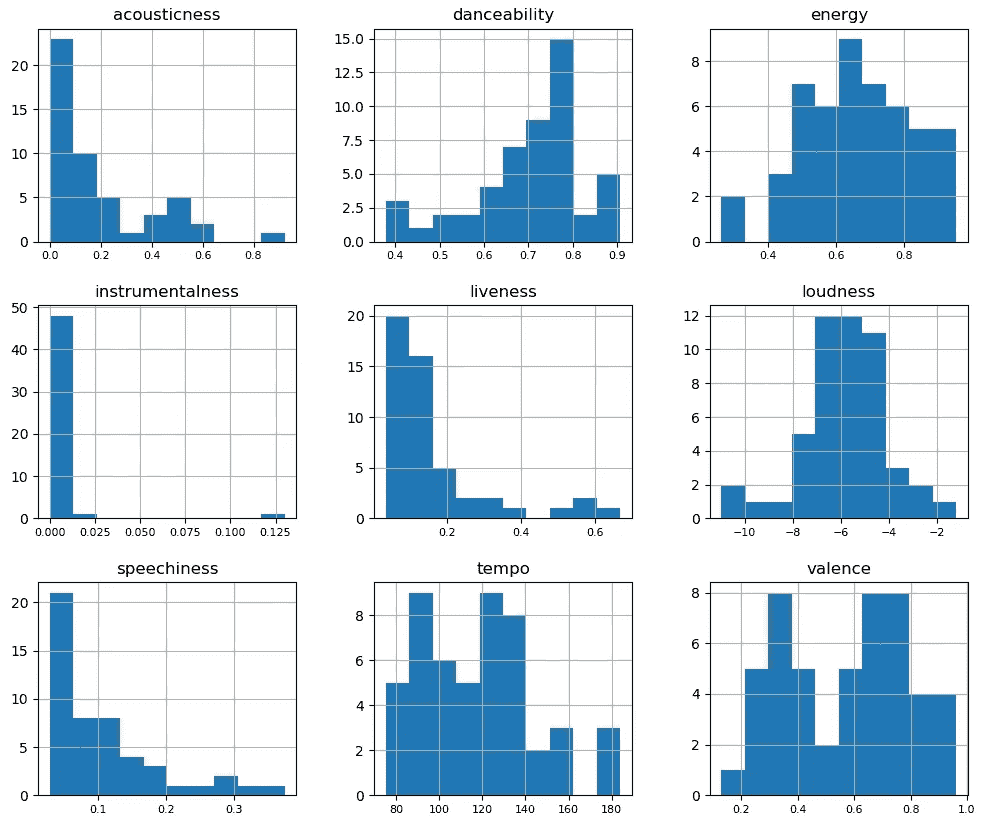
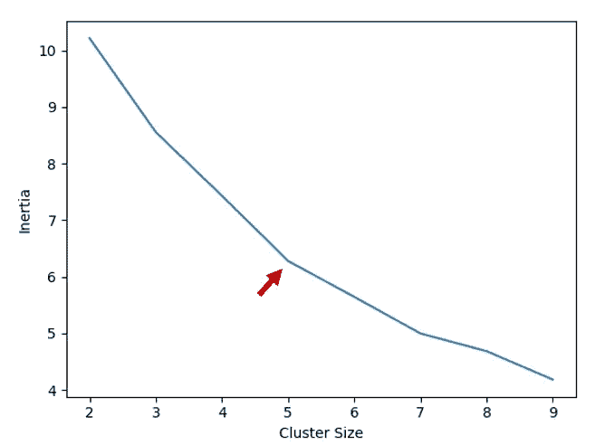
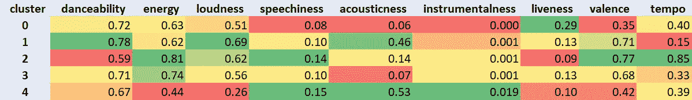

# 使用 Spotify 数据对 2010 年代听得最多的歌曲进行聚类。

> 原文：<https://medium.com/analytics-vidhya/clustering-most-listened-songs-of-the-2010s-using-spotify-data-8e25e8b082ce?source=collection_archive---------3----------------------->

## 使用 K-Means 算法创建您自己的基于内容的推荐引擎。


蒙德里安风格的 Spotify 标志

## 介绍

我认为将有趣的数据集与方便的机器学习方法结合在一起有助于形成对学习的促进作用。通过这种方式，用户可以更好地感受数据，并对实际机器学习实现的使用有清晰的看法。这是我为本文选择 Spotify 数据集的主要原因。

另一方面，聚类是无监督机器学习最受欢迎的领域之一，它可以用于客户、产品或每种类型的对象。它有助于:

*   **细分:**您可以对您的业务实体进行细分，并以更高的目标准确度来规划营销工作。
*   **探索性分析:**你可以更深入地理解数据集，并从中发现新的含义。
*   **衍生新特征:**通过解释聚类，可以为后续的机器学习模型获得新的可利用的输入。
*   **推荐:**如果一个人喜欢某样东西，同一细分市场中的其他实体也可以得到这个人的注意，这使得集群可以作为推荐列表。

上面的最后一项并不适合所有的情况，它可能不像其他推荐引擎算法那样成功，但是，我认为它非常适合我们的情况。在本文中，我将尝试解释如何应用它并添加所有必需的 python 脚本。我希望你喜欢它！

## 什么是 K-means？

K-means 是最基本和最流行的聚类算法之一。也被称为**劳氏算法。** **算法名称中的 k** 代表聚类数。数据集的所有要素都表示为空间中的一个矢量，所有样本都表示为该空间中的一个点。该算法的目的是确定**质心**，其在该空间中根据样本的位置对每个聚类进行有意义的分类。

基本上，它包括 4 个步骤:

**1 —** 用空间中随机创建的 k 个质心初始化。

**2** —根据欧几里德距离给每个样本分配最近的质心。

**3** —计算每个聚类的平均值，并将质心移动到这些平均值。

**4** —重复步骤 3 和 4，直到收敛。



k 均值过程的可视化。[来源](https://en.wikipedia.org/wiki/K-means_clustering)

**关于 k-means 的一些注释:**

*   就其本质而言，它容易受到异常值的影响，因此，在建模之前处理异常值是至关重要的。**缩放**对于特征也是必不可少的，否则，由于矢量空间中不同的缩放特征，预计会得到无意义的输出。
*   它用一个随机因子初始化，这使得 K-means 成为一个**非确定性**算法。由于这个原因，每次我们训练模型都可能以不同的输出结束。此外，还有机会获得收敛后的**局部极小值**。这意味着我们可以得到低绩效的结果，尽管我们有机会变得更好。为了克服这种情况，建议使用不同的种子对模型进行多次训练，并使用最成功的种子。

## 获取 Spotify 数据

在非常简要地解释了 k-means 之后，让我们用一些真实世界的数据来弄脏我们的手。我选择 Spotify 作为我的集群游乐场。这样选择的第一个原因是，处理这样的音乐数据很有趣。其次，使用 [**spotipy**](https://spotipy.readthedocs.io/) 库通过 python 访问 Spotify API 很容易。最后但同样重要的是，Spotify 正在免费提供一些**音频功能**，我们的聚类将基于这些歌曲的功能。

要访问 Spotify API，您需要登录到 [**开发者仪表盘**](https://developer.spotify.com/dashboard) 并为自己创建一个客户端 id。这是一个非常简单的过程，在获得客户端 id 和秘密 id 之后，我们将在 python 代码中使用它们。

作为输入数据集，我们使用 Spotify 列表中的曲目:十年来最热门的流媒体歌曲。这个列表包含了 2010 年代最受欢迎的 50 首歌曲，我们将根据它们的特点对它们进行分类。

[](https://open.spotify.com/playlist/37i9dQZF1DWYJ5kmTbkZiz) [## Spotify 播放的十年最热门流媒体歌曲

### 我们和我们的合作伙伴使用 cookies 来个性化您的体验，根据您的兴趣向您显示广告，以及…

open.spotify.com](https://open.spotify.com/playlist/37i9dQZF1DWYJ5kmTbkZiz) 

在脚本中，在访问 Spotify API 后，我们获得曲目信息，然后是这些曲目的音频特征。您可以在 Spotify API 文档网页中找到 [**功能说明**](https://developer.spotify.com/documentation/web-api/reference/tracks/get-several-audio-features/) 。

我们将使用的所有特征的直方图:

```
features_df.hist(xlabelsize=8, figsize=(12,10))
```



## 训练模型

聚类代码从带有缩放函数的列的**规范化**开始。正如你所注意到的，Spotify 提供的所有功能都在 0 到 1 之间，只有两项除外:音量和速度。我们将它们缩放到[0，1]以使它们与向量空间中的其他列兼容。

下一步是 k-means 算法中具有挑战性的部分之一，决定聚类的最佳大小，换句话说，就是 k。为此，我们将使用**肘方法**。在脚本中，它从 k=2 开始，并不断迭代增加到一个特定的数字，在每一步中，我们使用**惯性**测量模型的性能。惯性表示样本到其聚类质心的平方距离的总和。惯性值越低，表示模型越成功。当我们用不同的 k 值可视化每一步的惯性时，我们会看到一个类似于肘部形状的收敛点，这是对我们来说最佳的 k 值。

在这部分代码中，kMeans 函数的 **random_state** 参数对于使我们的模型具有确定性非常重要。这样，我们可以比较函数的输出。您可以随意更改它，但不要忘记以后使用相同的种子号。



不同 k 值的惯性可视化。

根据下面的图表，肘部形状不是很明显，但是在 **k=5** 处有轻微的弯曲，总比没有好。😏似乎对于某个收敛，聚类的大小应该大于 9，并且为了保持合理的解释，我在 k=5 处终止了这个搜索。k=7 看起来也是一个不错的选择。请记住，这个问题没有简单的解决方案，您可以继续尝试增加样本大小、处理异常值、改变特征分布、应用 PCA 等。关于**特征工程**技术的更多信息，你可以从[我的文章](https://towardsdatascience.com/feature-engineering-for-machine-learning-3a5e293a5114)中获得帮助。

## 解释集群

是时候看看我们模型的结果了。解释聚类的最佳方法之一是调查每个聚类的平均特征。这样我们就能感受到聚类背后的逻辑。例如，在下表中，您可以看到所有输入要素的平均值。具有鲜红色和鲜绿色的单元表示该集群的决定性特征。



每个聚类的平均特征

让我们考虑上表来解释我们的集群。请注意，群集的特征是通过相互比较推断出来的，因此它们是相对的。当我们说一个集群包括低节奏的歌曲时，这个短语并不适用于所有的音乐行业。

## **集群 0**

> | 0 |德雷克、威兹基德、凯拉|一舞|
> | 1 |少校雷泽、莫、DJ 蛇|倚(专长。m0&DJ 蛇)|
> | 10 |清洁盗贼，杰斯·格莱茵|宁为(壮举。杰斯·格莱茵)|
> | 16 |想象龙|放射性|
> | 23 |德雷克|上帝的计划|
> | 26 |波斯特马龙，21 野人|摇滚之星(专长。21 野人)|
> | 27 |布鲁诺·马斯|手雷|
> | 30 |达拉马|谦卑。|
> | 34 |凯蒂·佩里，Juicy J |黑马|
> | 41 |詹妮弗·洛佩兹，皮特保罗|在地板上—电台编辑|
> | 44 | LMFAO，劳伦·贝内特，GoonRock |派对摇滚颂歌|
> | 45 |德雷克|在我的感觉中|
> | 46 | The Chainsmokers，Coldplay |诸如此类|

这是我们的第一个具有高活性值的聚类，这意味着在歌曲中检测到了观众声音。低的语速、声音、乐器性和化合价是这个星团的其他重要特征。这个群集中有不同流派的歌曲。🎹

## 群组 1

> | 2 |波斯特马龙、斯威李|向日葵—蜘蛛侠：平行宇宙|
> | 13 |艾德·希兰|你的形状|
> | 14 |链锯、哈尔西| Closer(专长。哈尔西)|
> | 19 | XXXTENTACION | SAD！|
> | 20 |艾德·希兰|大声思考|
> | 49 |阿姆|不怕

这一组具有较高的舞蹈性、音响性和响度特征，节奏较慢。🎤

## 群组 2

> | 5 |麦克摩尔和瑞恩·刘易斯|撑不住我们—壮举。雷道尔顿|
> | 12 |好玩。，加奈儿·梦奈|我们年轻(壮举。加奈儿·梦奈)|
> | 24 | The Chainsmokers，Daya |别让我失望|
> | 29 | Luis Fonsi，Daddy Yankee | Despacito |
> | 37 | Luis Fonsi，Daddy Yankee，贾斯汀比伯| Despacito — Remix |
> | 40 |法瑞尔·威廉姆斯| Happy —出自《卑鄙的我 2》|

这是一个充满能量、活力和节奏的集群。这绝对是最有活力的集群。💃

## 第 3 组

> | 4 |阿黛尔|在深渊中翻滚|
> | 7 | Avicii |叫醒我|
> | 8 |阿姆、蕾哈娜|爱你说谎的方式|
> | 11 |卡莉·瑞·吉普森|给我打电话也许|
> | 15 | OMI、菲利克斯·杰恩|啦啦队长—菲利克斯·杰恩混音电台编辑|
> | 17 |肖恩·蒙德兹、卡米拉·卡贝洛|塞诺丽塔|
> | 18 |小鲍比·雷·西蒙斯、海莉·威廉姆斯|飞机(壮举。海莉·威廉姆斯)|
> | 22 |加尔文·哈里斯|夏天|
> | 25 |麦克摩尔&瑞恩·刘易斯，万兹|旧货店(专长。Wanz) |
> | 28 | Mike Posner，Seeb |我在伊比沙岛服了一粒药丸— Seeb Remix |
> | 31 | Lil Nas X，比利·雷·塞勒斯|老城路— Remix |
> | 32 | Shakira，Freshlyground | Waka Waka(这次是为非洲)|
> | 33 |唐·奥马尔，Lucenzo | Danza Kuduro |
> | 35 | Sia |廉价惊险片|
> | 36 |马克·龙森， 布鲁诺·马斯| Uptown Funk |
> | 38 |蕾哈娜|唯一的女孩(世界上)|
> | 42 |妮琪·米娜|星舰|
> | 43 |弗洛·里达|哨子|

另一个高能低声学团簇。这些看起来有点像集群 0 的全能分类歌曲。🎼

## 第 4 组

> | 3 | Gotye，Kimbra |某个我曾经认识的人|
> | 6 |爱莉安娜·格兰德| 7 环|
> | 9 |比莉·埃利什|坏蛋|
> | 21 |维兹·卡利法，查理·普斯|再见(壮举。查理·普斯)|
> | 39 |波斯特马龙，Ty Dolla $ign |惊魂记(专长。Ty Dolla $ign) |
> | 47 |约翰·传奇|我的全部|
> | 48 |乘客|放开她|

最后，我们的最后一组，高音质和高乐器性最好地描述了这一组。这个组合的音乐风格是其他组合中最慢的，带有一点 R&B 和摇滚风格。🎻

## 结论

最后，我们的分析完成了，我们得到了 5 个集群。聚类中的歌曲可能与你心目中的风格不一致，而且似乎不相关。但请记住，这项工作是基于 Spotify 提供的功能，这些功能大多是技术指标，输出高度依赖于它们。关于结果的质量，我认为它们不是完美的，但是合理的，并且它们便于用于推荐目的。一个人从一个集群中听一首歌，可能会很高兴听到同一列表中的另一首歌。以类似的方式，你可以分析你自己的播放列表，发现你可能喜欢的隐藏宝石。

> 如果您有进一步的评论，请不要犹豫，通过我的 [**LinkedIn** 账户](https://www.linkedin.com/in/emrerencberoglu/)联系我，如果您喜欢这篇文章，请不要忘记关注我的 **Medium，**敬请关注！

**参考文献**

*   [Scikit-learn k-means 文档](https://scikit-learn.org/stable/modules/clustering.html#k-means)
*   [Spotify API 文档](https://developer.spotify.com/documentation/)
*   [Spotipy 库文档](https://spotipy.readthedocs.io/)