# 聚类出租车地理位置数据以预测出租车服务站的位置-回答重要问题

> 原文：<https://medium.com/analytics-vidhya/clustering-taxi-geolocation-data-to-predict-location-of-taxi-service-stations-answering-important-82535ed9bf57?source=collection_archive---------13----------------------->

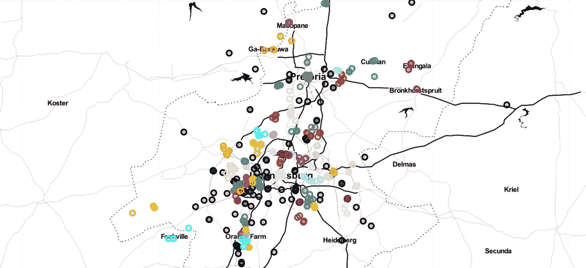

问候大家，欢迎回来！！

这是关于我的上一篇文章— [聚类出租车地理位置数据以预测出租车服务站的位置(Pt 1)](/analytics-vidhya/clustering-taxi-geolocation-data-to-predict-location-of-taxi-service-stations-pt-1-2471303e0965) 。

你们中的一些人提出了我在上一篇文章中没有解决的重要问题。所以在这一篇里，我会尽力回答他们。

# 1.理解问题陈述:

让我们考虑一下约翰内斯堡市。在这么大的城市跑出租车，应该有出租车服务站的接入。加油站建在哪里？嗯，我们已经可以访问出租车停靠站(出租车等待乘客的地方，例如在机场)的地理位置数据。

我们需要分析他们的地理位置数据，以了解在哪里建立服务站，我们可以使用聚类来实现这一点。一种简单的方法是在每个集群的中心建立一个服务站，为属于该集群的每辆出租车提供服务。在我的上一篇文章中，我们了解了如何通过使用简单的 k-means 方法来实现这一点。

有许多**集群**的模式。这里，我们选择了被认为是其中最简单的模型之一。尽管简单， **K-means** 在许多数据科学应用中广泛用于聚类，如果您需要从**未标记的数据**(这就是我们选择它的原因)**中快速发现洞察力，这一点尤其有用。**

# 2.什么是集群？

聚类可以认为是最重要的*无监督学习*问题；因此，和其他这类问题一样，它处理的是在一组未标记的数据中找到一个*结构*。
聚类的宽泛定义可以是**“将对象组织成其成员在某些方面相似的组的过程”。**
*群集*因此是它们之间“相似”并且与属于其他群集的对象“不相似”的对象的集合。

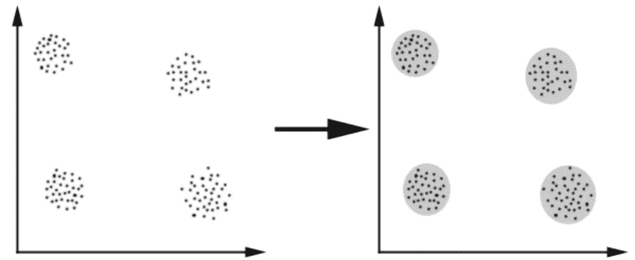

在这种情况下，我们很容易识别出数据可以分成的 4 个组；相似性标准是*距离*:如果两个或多个对象根据给定的距离(在这种情况下是几何距离)“接近”，则它们属于同一个集群。这被称为*基于距离的聚类*。

因此，聚类的目标是确定一组未标记数据中的内在分组。

而如果你想详细研究聚类分析-[https://www . analyticsvidhya . com/blog/2016/11/an-introduction-to-clustering-and-different-methods-of-clustering/](https://www.analyticsvidhya.com/blog/2016/11/an-introduction-to-clustering-and-different-methods-of-clustering/)

# 3.为什么我们需要为我们的问题陈述创建集群？

好吧。所以这将是一个漫长的过程。请务必打开我以前的文章作为参考。这可能会令人困惑。

在这一节我们将 ***测试*** 一个简单的聚类算法，看看它是如何工作的。您可以在“集群强度/性能指标”标题下找到这一点(在我以前的文章或 GitHub 中)。

你们中的一些人可能想知道为什么我们需要创建测试数据并在其上测试我们的聚类算法？嗯，首先，我们需要检查正在讨论的算法是否像我们希望的那样好，如果是的话，那么我们需要检查它的聚类强度。如果测试数据设法勾选了上面的两个复选框，那么我们就可以使用我们的原始数据集了。

因此，我们将从使用 scikit learn 的 [**make_blobs**](https://machinelearningmastery.com/generate-test-datasets-python-scikit-learn/#:~:text=The%20make_blobs()%20function%20can,a%20host%20of%20other%20properties.) 函数创建测试数据开始。

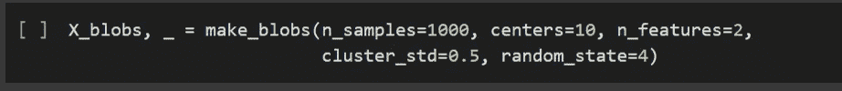

我们现在将理解 make_blobs 函数的这些特性的含义

1.  **n_samples: *int 或 array-like，可选(默认=100)*** *-* 如果是 int，则为聚类间等分的点的总数。如果**像数组** ( **是我们当前的情况**)，序列的每个元素表示每个聚类的样本数。
2.  **n_features: *int，可选(默认值=2)*** *-* 每个样本的特征数。
3.  **centers: *int 或 shape 的数组[n_centers，n_features]，可选*** *-* (默认=无)要生成的中心数，或固定的中心位置。如果 n_samples 是 int，centers 是 None，则生成 3 个中心。如果 n_samples 是类似数组的，则中心必须是零或长度等于 n_samples 长度的数组。
4.  **cluster_std: *float 或序列 float，可选(默认值=1.0)*** *-* 聚类的标准差。
5.  **random_state: *int，RandomState 实例，default = None****-*决定数据集创建的随机数生成。在多个函数调用之间传递一个 int 以获得可再现的输出。

接下来，我们将散点图测试数据。

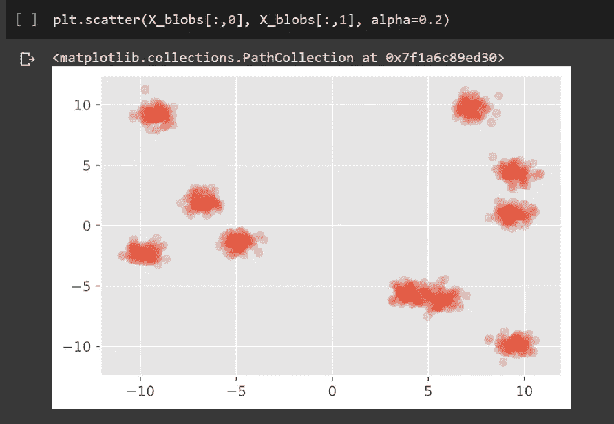

LHS 上有四个定义明确的集群，RHS 上有四个，右侧的一个看起来像是两个集群的融合。这是一个问题。我们需要修理它。

*   对于下一个片段，您将需要以下文件——“sample _ clusters . npy”和“sample_clusters_improved.npy”(来自[数据集](https://drive.google.com/drive/u/0/folders/1j31pTDkqjE3IK2fEunaUjUAzmjIy-hBF))。

现在，我们要做的是创建单独的聚类(以解决上述问题)，我们可以通过在“sample_clusters.npy”上运行 ***类预测*** 来完成。

(**类预测**是一种监督学习方法，其中算法从具有已知**类**成员资格(训练集)的样本中学习，并建立**预测**规则来对新样本(测试集)进行分类)

然后通过分配颜色(col)来区分它们，这样我们就可以区分每个集群。

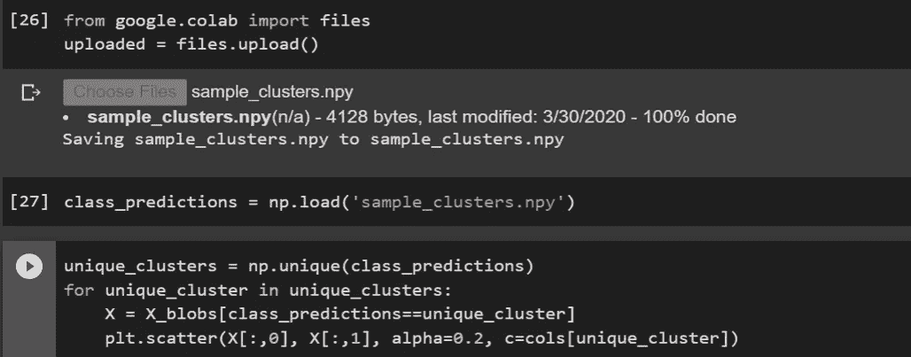

输出-

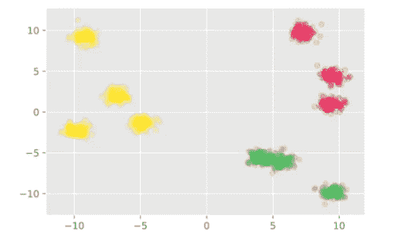

你对结果满意吗？很明显，它没有解决我们的半合并问题，但是我们可以区分一些集群，所以这是个好消息。我们可以做得更好。

我们现在将检查“**剪影得分**”。我们知道，它是用来给聚类算法打分的。它将为聚类算法分配一个介于-1 和 1 之间的分数，分数越接近 1 越好。它检查单个群集与相对群集的中心相比有多好。

0:表示聚类无关紧要，或者我们可以说聚类之间的距离不显著。

-1:表示以错误的方式分配簇。

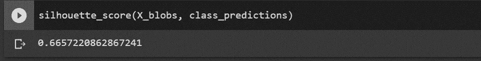

我们得到了大约 0.66 的分数，这很好。同样，我们可以做得更好。

因此，为了改进，我们将使用上面使用的相同代码，但是在“sample_clusters_improved.npy”上运行类预测。

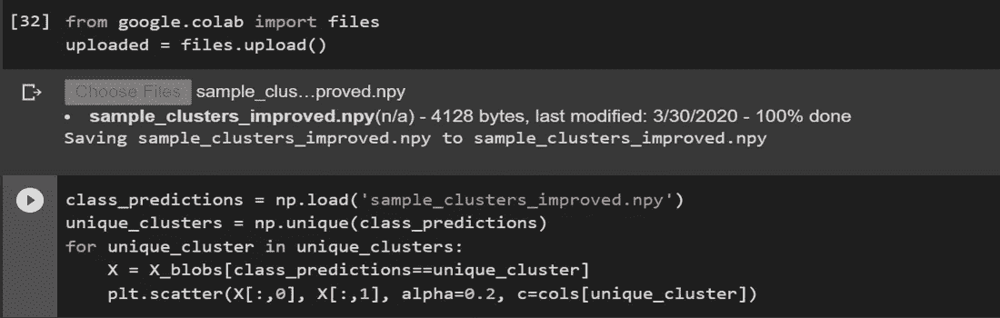

我们得到一个类似这样的图:

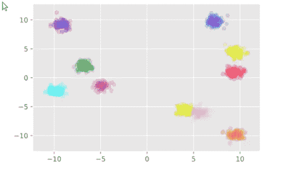

伙计们，现在怎么样了？我们不仅可以区分所有的簇，还可以区分重叠的簇。还有，剪影评分也提高了。

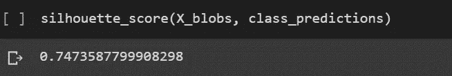

我们做到了！

因为我们的聚类算法在测试数据中表现得非常好，所以我认为现在是时候看看它在我们的原始数据集上表现如何了。

# 4.k 均值聚类:

你会在我之前的文章(或者 GitHub)中的“K-means 集群”下找到这一节，在那里我们已经深入讨论了一切。

我们已经在本文的第一部分讨论了为什么我们更喜欢使用 K-Means 进行聚类。

现在，K 均值聚类的步骤。

*   **第一步:选择聚类数 k**

k-means 的第一步是选择聚类的数量 k(我们如何做，将在下一节解释)。

*   **第二步:从数据中随机选择 k 个点作为质心**

接下来，我们随机选择每个聚类的质心。假设我们想要 2 个集群，那么这里 k 等于 2。然后我们随机选择质心:

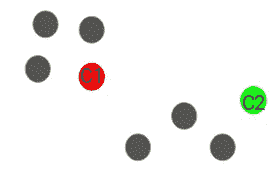

这里，红色和绿色的圆圈代表这些集群的质心。

*   **步骤 3:将所有点分配到最近的聚类质心**

初始化质心后，我们将每个点分配给最近的聚类质心:

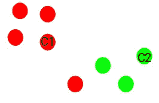

您可以看到，靠近红点的点被分配给红色簇，而靠近绿点的点被分配给绿色簇。

*   **步骤 4:重新计算新形成的星团的质心**

现在，一旦我们将所有的点分配给任何一个簇，下一步就是计算新形成的簇的质心:

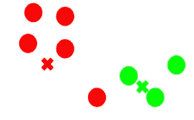

这里，红色和绿色的十字是新的质心。

*   **步骤 5:重复步骤 3 和 4**

*计算质心并基于所有点与质心的距离将所有点分配给聚类的步骤是单次迭代*。但是等等——我们什么时候应该停止这个过程？它不能运行到永远，对不对？

## K-均值聚类的停止准则

基本上有三个停止标准可以用来停止 K-means 算法:

1.  新形成的簇的质心不会改变
2.  点保持在同一个群集中
3.  达到最大迭代次数

如果新形成的聚类的质心没有变化，我们可以停止该算法。即使在多次迭代之后，如果我们得到所有聚类的相同质心，我们可以说该算法没有学习任何新的模式，这是停止训练的标志。

另一个明显的迹象是，即使在多次迭代训练算法之后，如果这些点仍然在同一个聚类中，我们应该停止训练过程。

最后，如果达到最大迭代次数，我们可以停止训练。假设我们将迭代次数设为 100。该过程在停止之前将重复 100 次迭代。

# 5.我们如何决定迭代的次数？

确定数据集中**最优聚类数**是划分聚类的一个基本问题，比如 [**k-means 聚类**](https://www.datanovia.com/en/lessons/k-means-clustering-in-r-algorith-and-practical-examples/) ，需要用户指定要生成的聚类数 k。

不幸的是，这个问题没有确定的答案。聚类的最佳数量在某种程度上是主观的，并且取决于用于测量相似性的方法和用于划分的参数。一个简单而流行的解决方案是检查使用 [**分层聚类**](https://www.datanovia.com/en/lessons/agglomerative-hierarchical-clustering/) 生成的树状图，看看它是否给出了特定数量的聚类。不幸的是，这种方法也是主观的。

有一些方法包括直接方法和统计测试方法:

1.  直接方法:包括优化标准，如组内平方和或平均轮廓。相应的方法分别命名为 ***肘*** 和 ***剪影*** 方法。
2.  统计测试方法:包括对比证据和无效假设。例如 ***缺口统计*** 。

我们将使用 ***剪影系数*** 的方法。这将在下一部分解释。

# 6.K 均值聚类的分数验证:

你可以在这里阅读所有这些-[https://towards data science . com/silhouette-coefficient-validating-clustering-techniques-e 976 bb 81d 10c](https://towardsdatascience.com/silhouette-coefficient-validating-clustering-techniques-e976bb81d10c)

这是一个非常简单的方法。我不会给你密码。这是一个小作业。我们已经详细讨论了一切，你应该能够自己做这件事。

根据我的结果，我可以推断 k=70 是聚类的理想值。

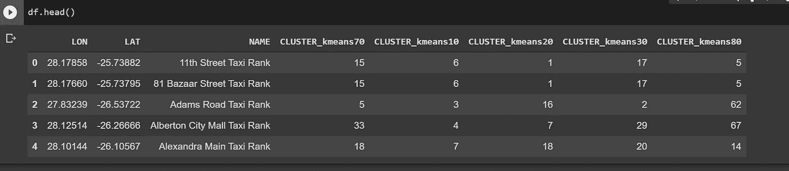

这就是本文的全部内容。我努力工作，尽我所能回答所有的问题。不过，如果你有任何问题，请随时询问。此外，请告诉我是否有我可以改进的地方。

在我的下一篇文章中，我们将通过使用一些先进的技术来改进我们目前的模型。这将是非常有趣的，相信我，一旦你理解了这一部分，你对这个项目的理解将完成一个完整的循环。

所以敬请关注，祝大家编码愉快！