# 聚类出租车地理位置数据以预测出租车服务站的位置(第 1 部分)

> 原文：<https://medium.com/analytics-vidhya/clustering-taxi-geolocation-data-to-predict-location-of-taxi-service-stations-pt-1-2471303e0965?source=collection_archive---------8----------------------->

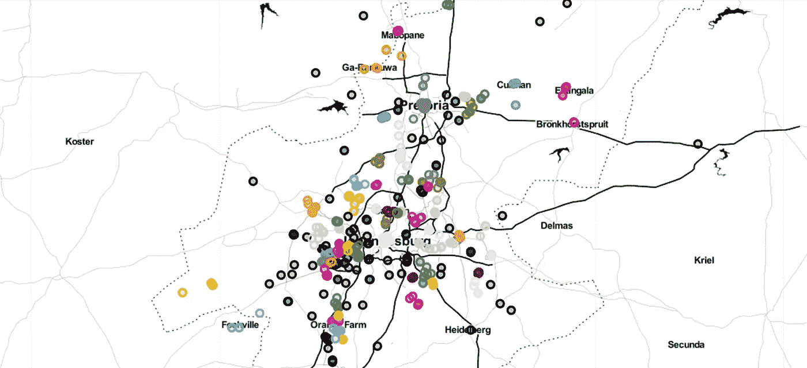

本文是*“聚类出租车地理位置数据以预测出租车服务站位置”的分步指南。*

这是一个很大的话题，所以我决定分成两部分，本文是第一部分。

对于这个领域的任何人，请不要被这个话题吓跑。一旦你掌握了窍门，这就很容易了。坚持到最后，好吗？这会很长(提前道歉)。

还有，这是我第一个真正意义上的机器学习项目。天知道我研究这个课题的时间和梅林的胡子变白的时间一样长。

总之，Coursera 提供了广泛的指导项目。这是其中之一。你可以在这里查看:

https://www.coursera.org/courses?query=guided%20projects

词。确保你花了大量的时间来理解你的项目。在谷歌上阅读背景资料，写一份个人报告可以创造奇迹。

# 关于 ML 你需要知道什么

**机器学习**是一个研究领域，它赋予计算机无需明确编程就能学习的能力。ML 是人们曾经遇到过的最令人兴奋的技术之一。顾名思义，它赋予了计算机使其更类似于人类的能力: ***学习*** 的能力。今天，机器学习正在被积极地使用，也许在比你想象的更多的地方。

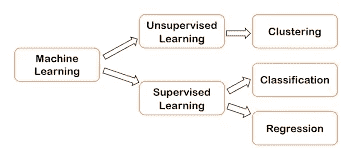

1.  **监督与非监督机器学习:**

 [## 机器学习:监督学习与非监督学习

### 这个博客是关于监督和非监督学习技术的简短讨论

medium.com](/@gowthamy/machine-learning-supervised-learning-vs-unsupervised-learning-f1658e12a780) 

2.**回归 vs 分类:**

 [## 监督机器学习:回归与分类

### 在这篇文章中，我将解释回归和分类监督机器学习之间的主要区别…

medium.com](/fintechexplained/supervised-machine-learning-regression-vs-classification-18b2f97708de) 

3.**聚类:**

 [## 聚类的介绍

### 聚类被认为是无监督学习中最重要的技术。在这篇博客中，我们将尝试…

medium.com](/datadriveninvestor/an-introduction-to-clustering-61f6930e3e0b) 

# 先决条件:

1.  [数据集](https://drive.google.com/drive/u/0/folders/1j31pTDkqjE3IK2fEunaUjUAzmjIy-hBF)
2.  [Github 代码](https://github.com/sanjanamops8752/Clustering-Taxi-Geolocation-Data-To-Predict-Location-of-Taxi-Stands/blob/master/Clustering_Geolocation_data_intelligently_in_Python.ipynb)
3.  熊猫
4.  [Matplotlib](https://jakevdp.github.io/PythonDataScienceHandbook/04.00-introduction-to-matplotlib.html)([py plot](http://matplotlib.sourceforge.net/api/pyplot_api.html#module-matplotlib.pyplot)
5.  [Numpy](https://www.edureka.co/blog/python-numpy-tutorial/)
6.  [叶子](https://www.kaggle.com/daveianhickey/how-to-folium-for-maps-heatmaps-time-analysis)
7.  [Scikit 学习](https://scikit-learn.org/stable/tutorial/basic/tutorial.html)
8.  [K-表示](https://books.google.co.in/books?id=bOh1DwAAQBAJ&pg=PA356&lpg=PA356&dq=X%5B50:100,+:%5D+in+python+meaning&source=bl&ots=oL0anyRPsk&sig=ACfU3U397lY-XN_eRAnCdhDauBbWW9v6ZA&hl=en&sa=X&ved=2ahUKEwjsht2L9-zpAhVizDgGHf-BBboQ6AEwCnoECAcQAQ#v=onepage&q=X%5B50%3A100%2C%20%3A%5D%20in%20python%20meaning&f=false)
9.  [K 均值聚类](https://towardsdatascience.com/understanding-k-means-clustering-in-machine-learning-6a6e67336aa1)
10.  [其他聚类形式](https://scikit-learn.org/stable/modules/clustering.html)

# 问题陈述和我们的解决方法:

出租车候客处是出租车待命时的位置。我们需要分析他们的地理位置数据，以了解在哪里使用集群建立服务站。一种简单的方法是在每个集群的中心建立一个服务站，为属于该集群的每辆出租车提供服务。在使用更复杂的基于密度的算法 DBSCAN 之前，您将学习如何首先使用 K-Means 方法进行聚类。我们将讨论如何评估这些模型，并通过引入 HDBSCAN 对 DBSCAN 进行改进。

# 开始使用:

我用 Google Colab 做编码。

1.  从本地系统导入文件:

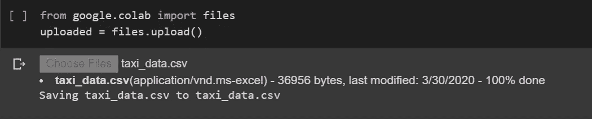

2.导入将在项目中使用的库和颜色(col)。

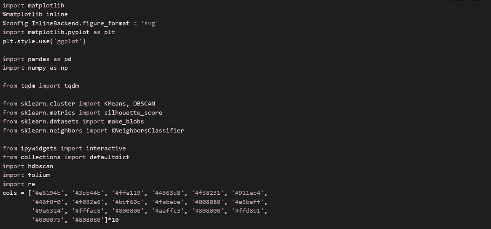

# 1.探索性数据分析

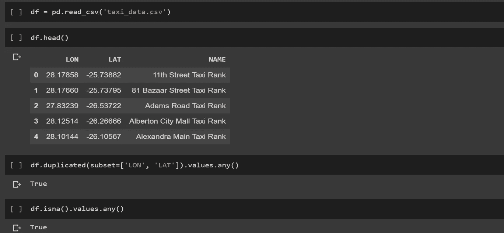

我们从数据帧中读取数据，并检查任何重复值和空值。我们有一些重复值和空值。我们的下一步是移除它们。

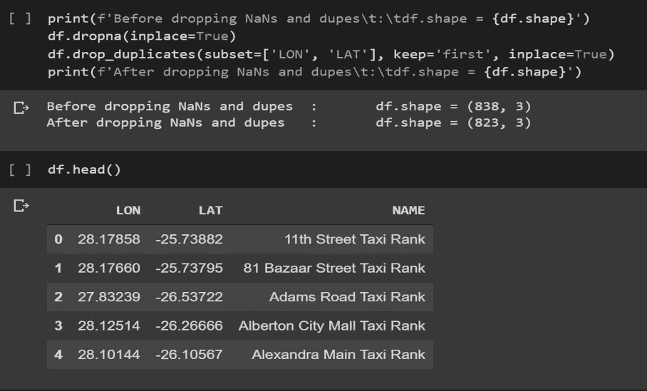

这是一个框架代码，它可以帮助我们查看这些更改前后的数据框。我们使用 df.head()来检查我们的数据帧看起来是否相同。是的，它是。

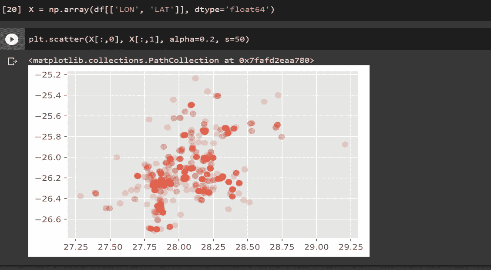

我们将纬度和经度值提取为一个 numpy 数组。数据类型是一种数据，我们希望可视化我们的 lat 和 lon，因为它们是很大的数字。

dt = np.dtype('float64') *# 64 位浮点数*

然后我们[散布图](https://matplotlib.org/3.1.0/api/_as_gen/matplotlib.pyplot.scatter.html) X

*   **alpha**:alpha 混合值，介于 0(透明)和 1(不透明)之间。帮助查看图表中人口密集的区域。
*   **s** :为点的大小。

在下一个可视化中，我们将在地图上看到相同的散点图。因为很难理解有多少小点属于一个区域。

# 2.可视化地理数据

为了绘制漂亮的交互式地理数据，我们使用了一个用 Python 编写的叫做 Folium 的漂亮的包。

在编写代码时，我们需要给出位置，以便 follow 可以处理我们最初想要可视化地图的位置。因为它需要纬度和经度的值，对我们来说最简单的方法就是从我们已经有的数据帧中取纬度和经度的平均值。我们的地图将从那里开始。然后我们给出缩放值和平铺值，这基本上是地图的颜色方案。我们运行**‘m’**来准备好地图。(Img1 中的输出由 Img2 中的前两行代码给出)

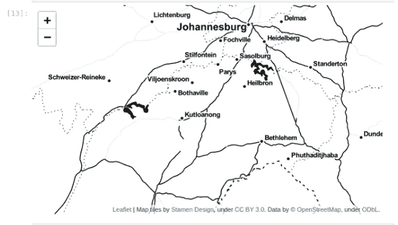

Img1

接下来，我们将出租车等级的数据添加到地图中，我们可以通过迭代添加数据框的所有行和列来完成此操作。这就是 leav 的工作方式，将来当我们给每个集群案例命名时，这将变得很容易。

代码中使用了“”,因为它返回了我们正在查看的行号的元组和实际的行信息。我们用一个圆形标记来标出纬度和经度。为了方便起见，我们给它一个半径值。然后是一个弹出值，即当我们单击圆圈时会弹出什么值。我们还通过指定颜色的十六进制值来设置颜色。然后我们设置填充颜色为真，用同样的颜色填充圆圈，因为它看起来很好。我们把圆圈标记加到 m 上。

我们运行代码 Img2，并再次运行**‘m’**以获取 Img2 输出作为输出。

Img2

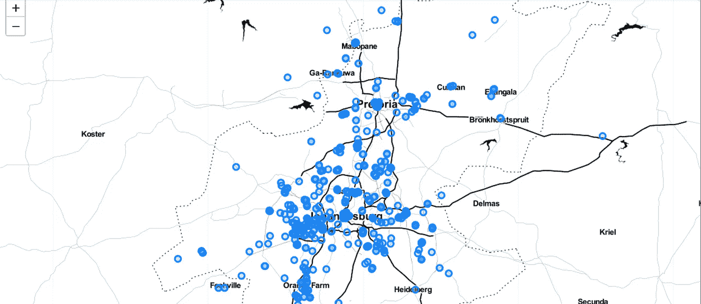

Img2 输出

如果我们单击小圆圈，我们将看到每个出租车等级详细信息的小弹出窗口。我们也可以放大并看到高度密集的点的位置。

接下来，我们将了解如何确定群集的强度。

# 3.聚类强度/性能指标

在这里，我们将测试聚类算法，并看看是否通过改变它在聚类方面有所改进。我们将通过使用 scikit-learn 的**‘make _ blobs’**函数创建测试数据来开始这一部分。 [**make_blobs** ()函数](https://machinelearningmastery.com/generate-test-datasets-python-scikit-learn/#:~:text=The%20make_blobs()%20function%20can,a%20host%20of%20other%20properties.)可用于生成具有高斯分布的点的斑点。您可以控制要生成的斑点数量和要生成的样本数量，以及许多其他属性。

我们使用[:，0]表示数组的所有行和第 0 列，使用[:，1]表示数组的所有行和第 1 列。

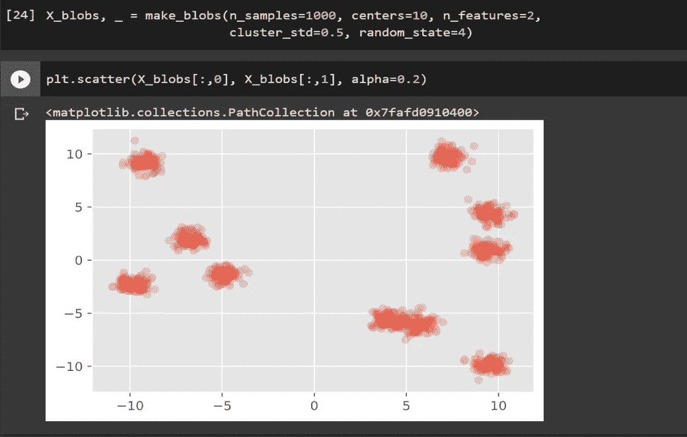

LHS 上有四个定义明确的集群，RHS 上有四个，右侧的一个看起来像是两个集群的融合。

现在我们要做的是通过运行类预测来创建单独的聚类。(**类预测**是一种监督学习方法，其中算法从具有已知**类**成员资格(训练集)的样本中学习，并建立**预测**规则来对新样本(测试集)进行分类。例如，该方法可用于**使用基因组表达谱预测**癌症类型

然后通过分配颜色(col)来区分它们。

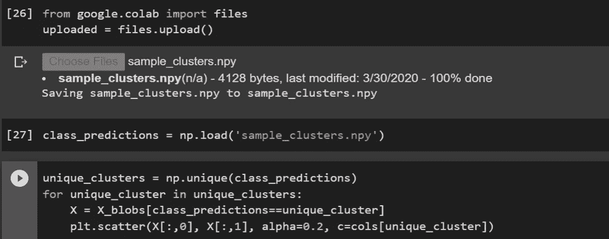

输出看起来像这样-

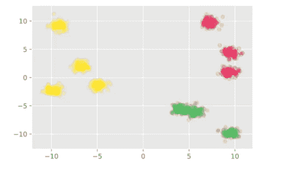

现在，我们将使用一个名为**剪影分数**的东西。它用于对聚类算法进行评分。它的工作原理是给聚类算法分配一个介于-1 和 1 之间的分数，分数越接近 1 越好。它检查单个群集与相对群集的中心相比有多好。

0:表示聚类无关紧要，或者我们可以说聚类之间的距离不显著。

-1:表示以错误的方式分配簇。

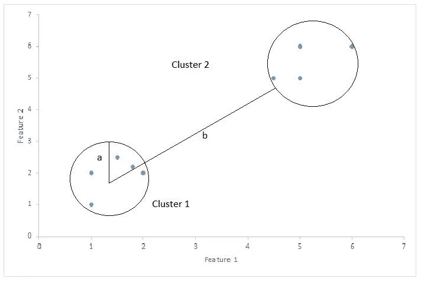

剪影得分= (b-a)/max(a，b)

在哪里

a=平均类内距离，即类内各点之间的平均距离。

b=平均聚类间距离，即所有聚类之间的平均距离。

score 函数将接受我们考虑的测试数据 X_blobs(一个数组)和 class_predictions。

我们得到了大约 0.66 的分数，这很好。现在我们将复制粘贴并再次运行上面的算法(名为改进的),只是为了看看剪影分数是否真的起作用。

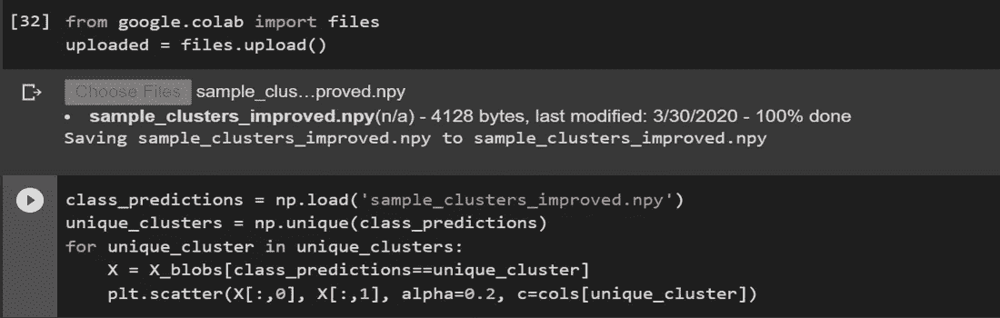

我们得到了一个类似这样的结果:

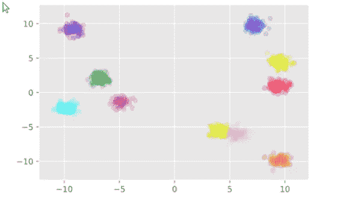

看到了吗？！我们现在可以区分重叠的星团了。这不是很棒吗？

现在我们将再次检查剪影分数，看看它是否有所改善。

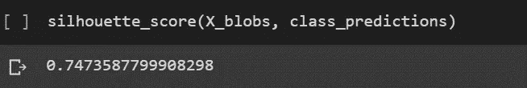

太棒了。它有！继续走。你做得很好。我们差不多完成了。

# 4.k 均值聚类

这里我们将看看我们的第一个聚类方法，即 K 均值聚类。我们使用 K-means 算法运行一些迭代，以便它学习如何以交互的方式对我们的数据进行聚类。

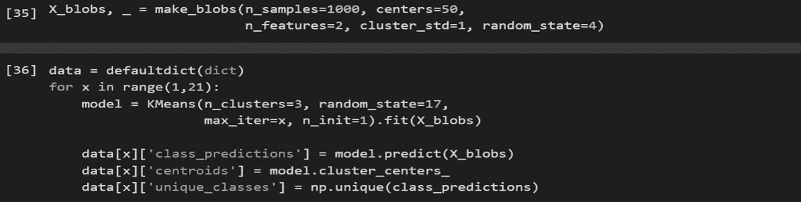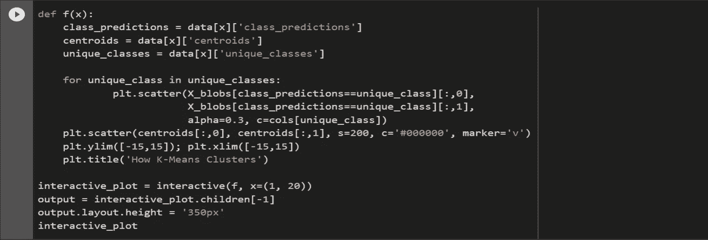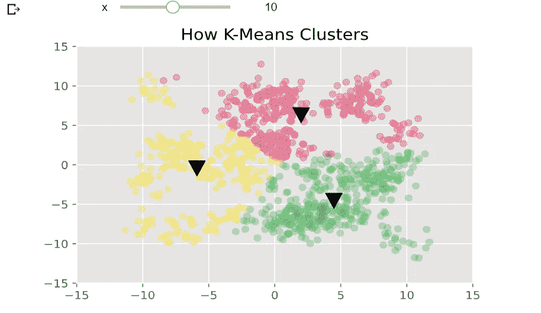

这就是我们正在谈论的互动情节。从虚拟数据中我们得到了这个图，很明显我们可以给出 K=3 的值(聚类数)。上面的图也是第 10 次迭代。

K-means 的工作原理是迭代地找到每个聚类的质心。(了解 k-means 背后的数学—[https://heart beat . fritz . ai/了解 k-means 背后的数学—聚类—40 E1 d 55 e 2 f 4c](https://heartbeat.fritz.ai/understanding-the-mathematics-behind-k-means-clustering-40e1d55e2f4c))

该算法将 3 个质心随机分配给测试数据聚类(黑色三角形)。

然后，它对靠近该质心的最近数据点进行聚类，一旦聚类完成(如上图所示)，它将再次迭代地进行聚类，并分配一个新的质心。目前, **x** 代表迭代，每次迭代分配一个新的质心(黑色三角形将轻微移动),直到没有发现变化。这是无监督学习，这就是算法如何从数据中学习。

它将它的点重新分配到最近的质心簇，这就是为什么我们看到红色黄色和绿色的点随着迭代次数的增加而相互推挤。

这是第一次和第二十次迭代的样子。

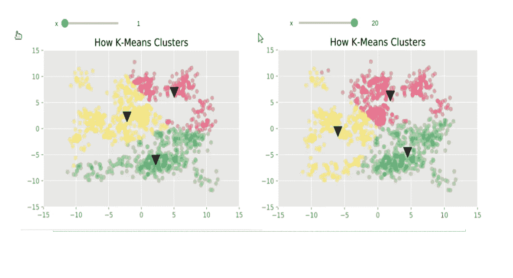

我们将继续编码。

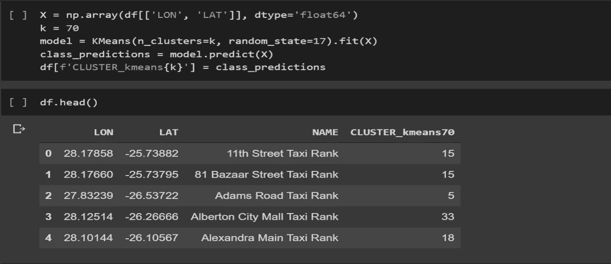

**‘k’**值通常基于直觉，很容易用 2D 数据来猜测，但不能用其他更高维度的数据来猜测。

让我们指定 k=70。然后我们用一些参数来建模。我们使用 fit(x)来改变权重(输入变量的系数),使它们符合训练数据集。并且还在数据帧中分配了一列。常见错误:不要忘记在代码中重新定义 X。

然后，我们调用 **df.head()** 来查看我们使用的 k 均值算法的前五个聚类预测。他们结果很好。

我们现在必须像前面一样在地图上想象它。我们需要调用一个函数来创建一个映射，该映射应该包括所讨论的数据帧以及集群列。我们还应该分配一个集群颜色。

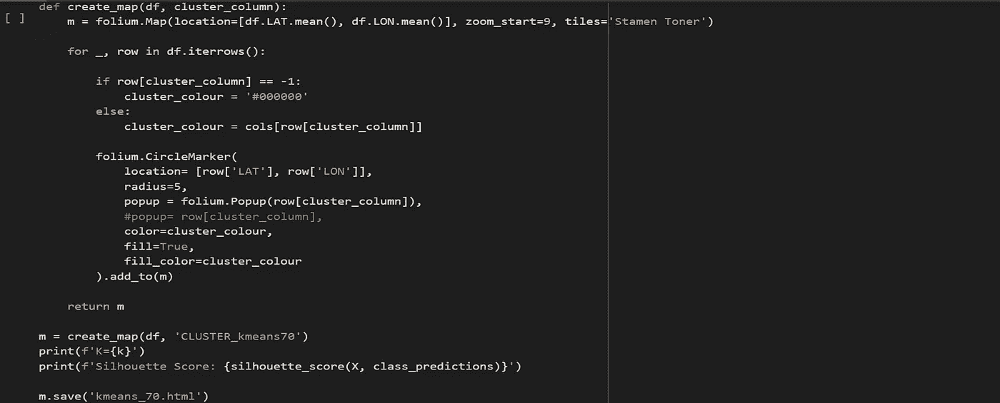

当我们运行代码时，我们得到 k 值和轮廓分数。然后我们可以在下一个内核中运行 m 来获得地图的可视化。

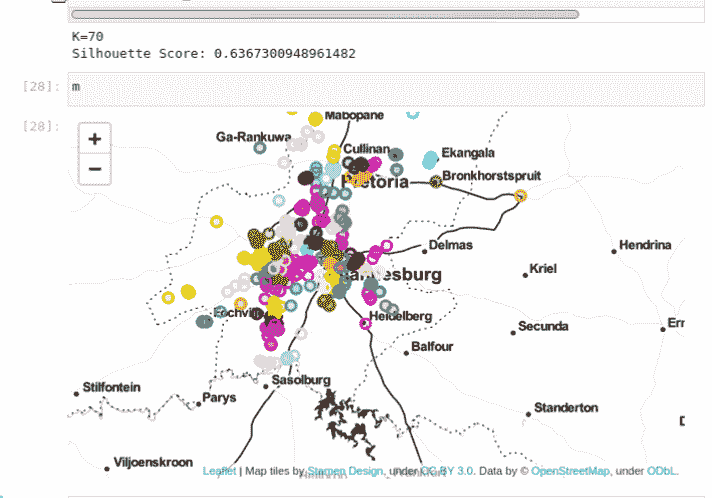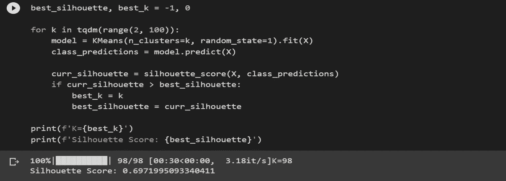

编写此代码是为了迭代“k”的各种值，以查看我们的数据如何工作，并找到此 k 值的最佳可能轮廓得分范围。我们可以调整我们想要的集群数量的值，但是它也有自己的限制。我们坚持 k=70，我们将在下一阶段看到为什么它对我们的数据是一个好值。

最终的剪影分数是 0.697，比之前的 0.637 有所提高(向上滚动查看地图上方)。地图出来也很好，但仍有改进的空间。

你不觉得地图上的点在中心看起来太拥挤了吗？嗯，这可能是因为 K-Means 在处理如此高度填充的数据时效果不太好。

市中心的出租车非常密集，随着我们向郊区移动，出租车的数量逐渐减少。我们需要在这样的人口密集地区建立更多的出租车服务站，显然目前的模式很难运作。我们需要其他方法来改进我们目前的模式。

我们将在我的下一篇文章中讨论更多的替代方法。

我真诚地希望你玩得开心，如果有任何改进的空间或者发现了任何错误，请在评论中告诉我。

我们很快会再见面的。

敬请期待！还有快乐编码！