# 聚类出租车地理位置数据以预测出租车服务站的位置(第二部分)

> 原文：<https://medium.com/analytics-vidhya/clustering-taxi-geolocation-data-to-predict-location-of-taxi-service-stations-pt-2-the-end-is-de13da87f3ff?source=collection_archive---------10----------------------->

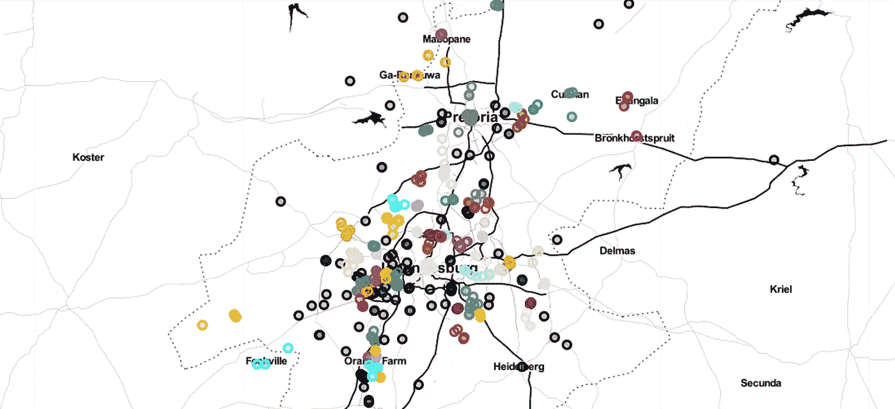

你好，欢迎回来！

首先谢谢你这么有耐心。我们差不多完成了。

本文是 ***【聚类出租车地理位置数据预测出租车服务站位置】*** *分步指南的*后续*。*

这是一个很大的话题，所以我决定分成两部分，本文是第 2 部分。

在我以前的文章中——“[聚类出租车地理位置数据以预测出租车服务站的位置(Pt 1)](/analytics-vidhya/clustering-taxi-geolocation-data-to-predict-location-of-taxi-service-stations-pt-1-2471303e0965) ”和“[聚类出租车地理位置数据以预测出租车服务站的位置——回答重要问题](/analytics-vidhya/clustering-taxi-geolocation-data-to-predict-location-of-taxi-service-stations-answering-important-82535ed9bf57)”我们讨论了如何使用 K-Means 聚类来分析出租车等级的地理位置数据以预测在哪里建立出租车服务站。尽管听起来感觉不错，但结果并不令人满意。我觉得我们可以做得更好，所以在这篇文章中，我将告诉你我们如何通过使用 DBSCAN(基于密度的带噪声应用空间聚类)、HDBSCAN(分层 DBSCAN)来改进我们现有的模型，然后通过使用 KNN(K-最近邻)来解决异常值来画龙点睛。

为什么我们需要改进我们当前的模型？-我们已经在前面的文章中详细讨论过了。

我们为什么使用 DBSCAN 和 HDBSCAN？K-means 在聚类大小和密度不同的数据时有困难。由于人口密度在我们的问题陈述中起着主要作用，DBSCAN 和 hdb 在这里可以占上风。

所以事不宜迟，让我们开始工作吧。

# **先决条件:**

1.  [DBSCAN(带噪声的应用程序的基于密度的空间聚类)](https://scikit-learn.org/stable/modules/generated/sklearn.cluster.DBSCAN.html)
2.  [HDBSCAN(分级数据库扫描)](https://hdbscan.readthedocs.io/en/latest/)
3.  [KNN (K 近邻)](https://towardsdatascience.com/machine-learning-basics-with-the-k-nearest-neighbors-algorithm-6a6e71d01761)

# 1.带噪声应用的基于密度的空间聚类

基于密度的噪声应用空间聚类。从名称中，我们可以假设 DBSCAN 查看区域的密度，并根据数据集中某个样本区域的密度来分配聚类。这可能对我们的事业有所帮助，因为我们知道市中心的出租车数量非常多，越往郊区越少。因此，这将有助于我们的重叠集群不同的集群。

我们在第一段代码中有一个虚拟数组，我们假设这些都是簇，-1，-1，-1 是噪声值，而不是实际的簇。假设我们希望将这些噪声值中的每一个作为一个集群来唯一地寻址。我想把第一个-1 指定为-2，其他的指定为-3，-4。

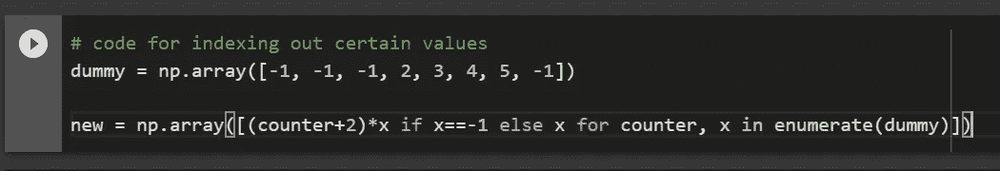

现在，当我们观察剪影分数时，这对我们很重要。我们想要表明，当我们有一个有噪声的数据(**有噪声的数据**是其中有大量额外的无意义信息的数据，称为噪声。这包括数据损坏，该术语通常用作损坏数据的同义词。它还包括用户系统不能正确理解和解释的任何数据)我们并没有完全忽略它。我们想观察如果它被选为**单例集群**会对我们的数据集产生什么影响。单个簇是指只有一个点的簇。

运行之后，我们可以开始训练我们的第一个 DBSCAN 模型。它有助于定义一个半径，在该半径内标记并考虑潜在的聚类。

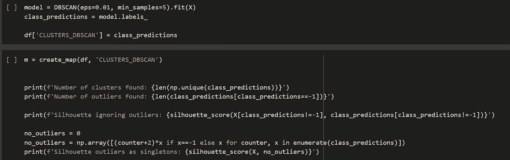

我们还需要找出以下参数——聚类数、原始侧影得分、离群值数、忽略离群值的侧影得分(其中类预测不等于-1)。我们将每个异常值视为一个单独的聚类。这是我们的输出结果--

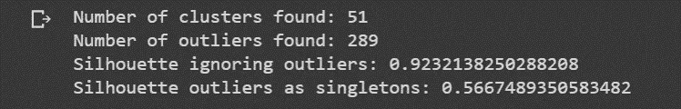

高轮廓分数(忽略异常值)表示那些被聚类的点被很好地聚类。但是当我们把异常值当作单值时，分数就很小了。我们需要努力解决这个问题。

这是我们现在的地图。

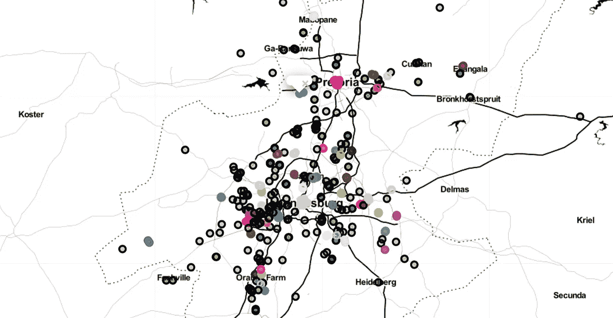

看起来不错，但是，你需要看看这个-

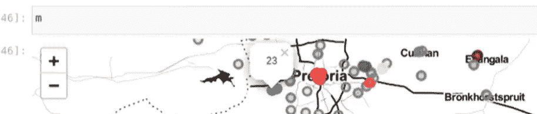

你看到了吗？

DBSCAN 的局限性:如果有两个人口密集的区域；一个比另一个稍大，它用相同的密度参数处理它们。这也需要修理。

这就引出了我们的下一部分——使用 HDBSCAN 改进我们当前的模型。

# 2.HDBSCAN(带噪声的应用程序的基于层次密度的空间聚类)

分级 DBSCAN。训练这个类似于 DBSCAN。HDBSCAN 会挑出异常值。这不是一个缺点，但鉴于我们的数据集，我们希望所有的点都以相同的方式聚集。

我们可以跳回到以前的代码，找到一种方法，让我们给离群值一个单独的颜色。

这是一个简单的 if 语句。这意味着，如果我们正在寻找的当前聚类是-1，那么它在我们的算法中被分类为异常值，并被设置为特定的颜色..说黑。我们在这里给出了颜色的十六进制代码。

其他一切都与我们在 DBSCAN 中所做的一样。

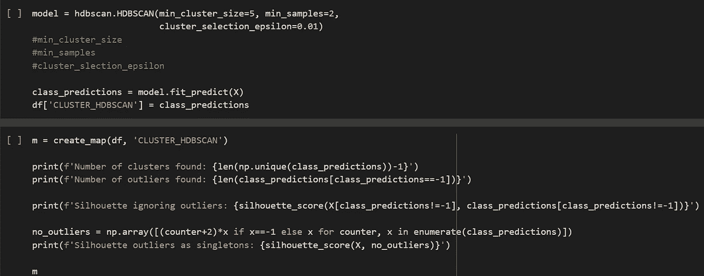

这是我们的输出，我们将观察我们的参数值来检查模型的性能。

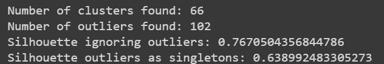

如果我们将此与我们在 DBSCAN 模型中获得的输出进行比较，我们可以看到这里有更多的聚类和更少的离群值。密度的变化很有帮助，因为我们发现了更多的集群和更少的异常值。这意味着当我们使用 HDBSCAN 时，那些被聚类的点被更好地聚类。此外，我们的侧影得分(忽略异常值和使用异常值作为单值，分别)比上次有更小的差异，并且肯定有所改善。

所以，我相信我们已经解决了目前面临的所有问题。这是一个好迹象。这是我们现在的地图。

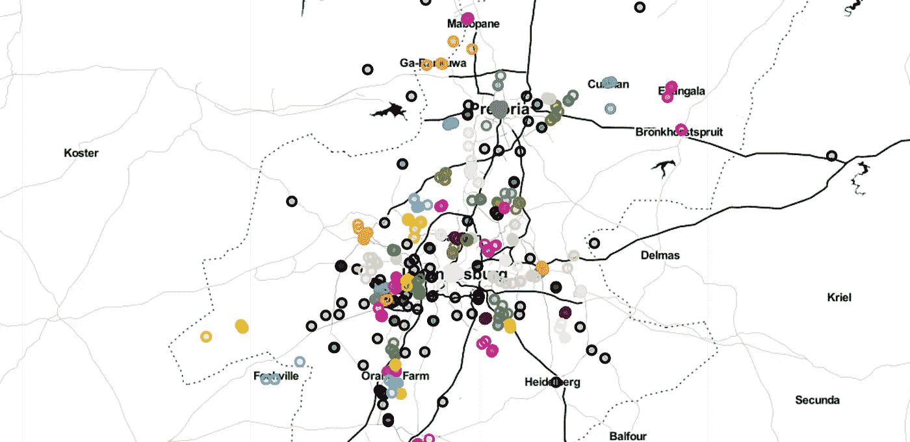

你怎么想呢?看起来比上次干净多了。异常值不仅仅是第一眼就能看出来，如果我们点击这些点也会看出来。标记的值是-1，这意味着这些点没有被聚类。

这里，看一下-

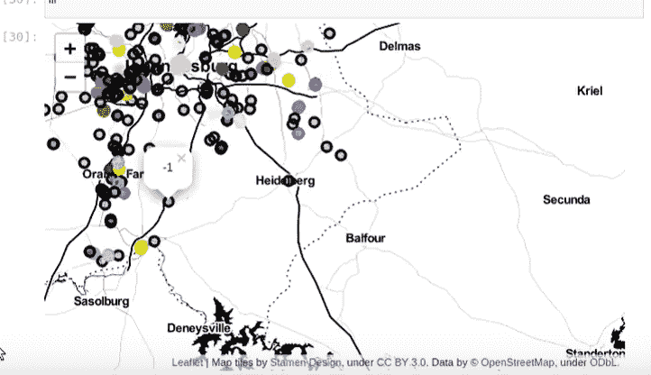

# 3.处理异常值

这里我们将定义一种方法来处理这些异常值。我们可以尝试使这些离群值成为其他现有集群的一部分。我们可以通过使用 **K 最近邻(KNN** )方法来做到这一点。

# KNN 算法是如何工作的？

我们举一个简单的案例来理解这个算法。以下是红色圆圈(RC)和绿色方块(GS)的分布:

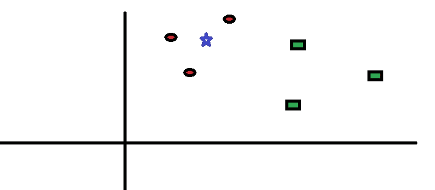

我们打算找出蓝星的等级(BS)。BS 可以是 RC，也可以是 GS，不能是别的。“K”是 KNN 算法，是我们希望进行投票的最近邻。假设 K = 3。因此，我们现在将画一个以 BS 为中心的圆，这个圆的大小正好能在平面上包含三个数据点。有关更多详细信息，请参考下图:

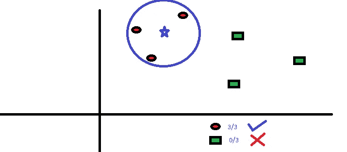

离 BS 最近的三个点都是 RC。因此，在良好的置信度下，我们可以说 BS 应该属于 RC 类。这里，选择变得非常明显，因为来自最近邻居的所有三张选票都投给了 RC。

在该算法中，参数 K 的选择非常关键。接下来，我们将了解得出最佳 k 需要考虑哪些因素。

# 我们如何选择因子 K？

首先让我们试着理解 K 在算法中到底影响了什么。如果我们看到最后一个例子，假设所有的 6 个训练观察值保持不变，用给定的 K 值我们可以做出每个类的边界。这些界限将 RC 从 GS 中分离出来。同样，让我们来看看值“K”对类边界的影响。以下是分隔具有不同 k 值的两个类别的不同边界。

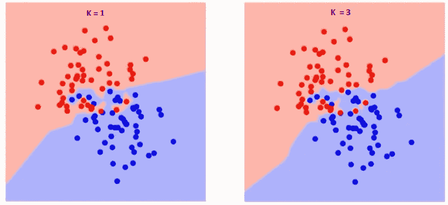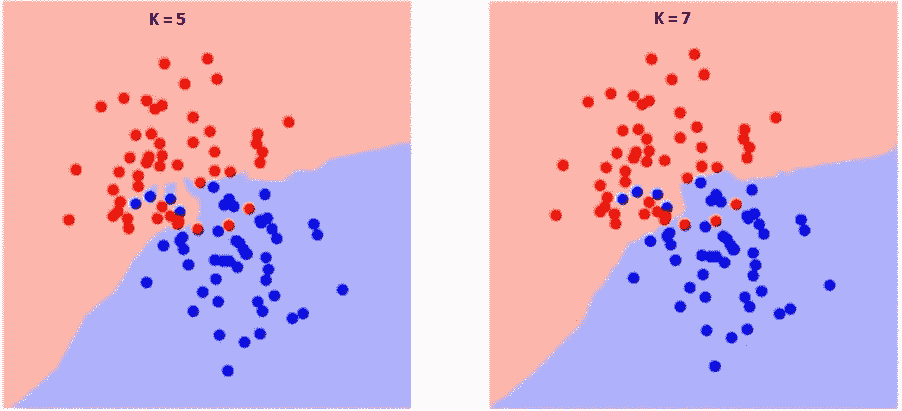

如果仔细观察，您会发现随着 K 值的增加，边界变得更加平滑。随着 K 值增加到无穷大，它最终会变成全蓝色或全红色，这取决于总多数。训练错误率和验证错误率是我们需要访问不同 K 值的两个参数。下面是具有不同 K 值的训练错误率的曲线:

如您所见，对于训练样本，K=1 时的错误率始终为零。这是因为最接近任何训练数据点的点是它本身。因此，当 K=1 时，预测总是准确的。如果验证误差曲线相似，我们选择的 K 应该是 1。以下是不同 K 值的验证误差曲线:

这让故事更加清晰。在 K=1 时，我们对边界进行了**过度拟合**(过度拟合是一种建模错误，当一个函数过于接近有限的数据点集合时就会出现这种错误)。因此，错误率最初降低并达到最小值。在最小值点之后，它随 K 的增加而增加。为了获得 K 的最佳值，可以将训练和验证与初始数据集分开。现在绘制验证误差曲线，以获得最佳 K 值。该 K 值应用于所有预测。

回到我们的讨论。现在我们必须在这里设置 n _ neighbour 参数。本质上，它所做的是找到离最近的分类样本最近的未分类样本，并将其设置为另一个聚类所属的任何点。我们在这里将其设置为 1，但我们可以将其设置为 3，这样它将挑选 3 个最近的邻居，并将其放入与这三个最相似的聚类中。

接下来，我们要做的是将现有数据分成训练和测试数据集。我们必须将聚类的点作为我们的训练数据，然后从没有聚类的点推断数据。一种简单的方法是创建两个新的数据框。一个是 HDBSCAN 不为-1 的数据，另一个是为-1 的数据。最后我们要做的就是预测和绘制地图。完美的教科书程序。你看了就明白了。

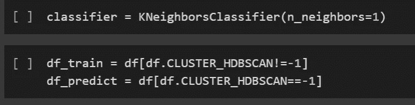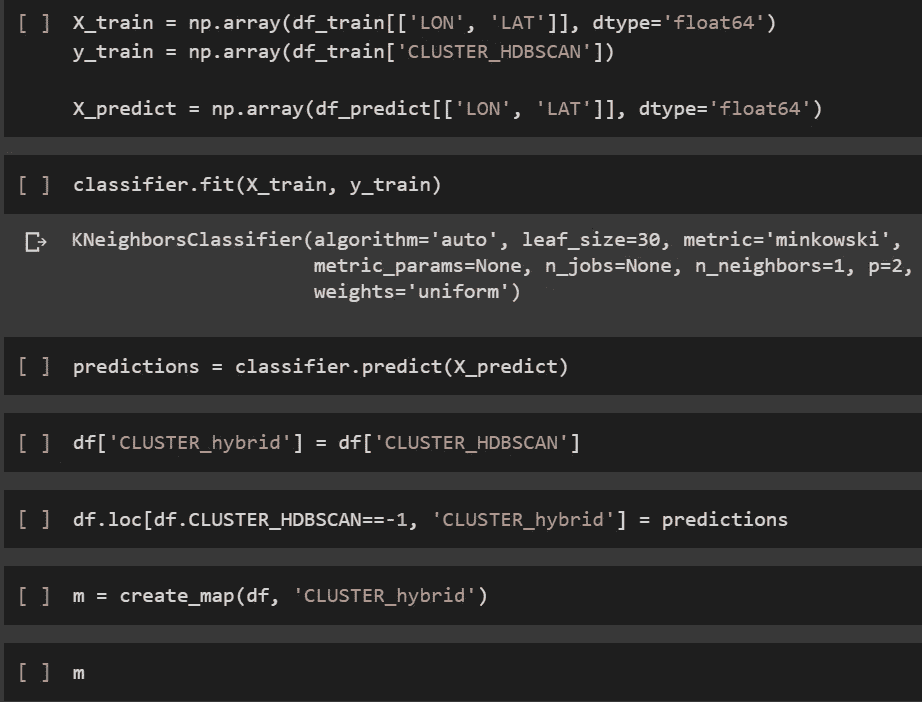

x 预测是以前被标记为异常值的值。所以预测给了我们很多非-1 的数字。

现在，理想情况下，我们想要做的是在数据集中创建一个新列，包括这个新的聚类算法，称为混合模型。我们创造了它。然后我们设定我们的预测。

现在，这个新的集群将为我们提供混合预测，现在我们只需像之前一样绘制它。我们使用原始数据框创建地图，并包含新的混合列。

混合地图看起来像这样:

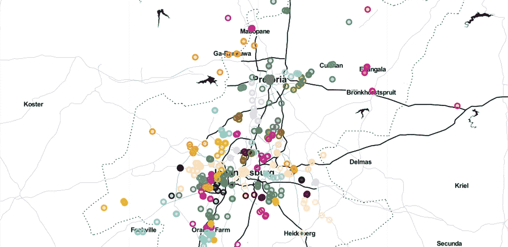

我们可以看到异常值在左侧是橙色的，这意味着它们已经与最近的组聚集在一起，因此我们已经消除了异常值的问题。

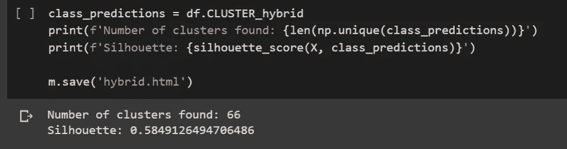

虽然剪影的分数比我们在 K 均值中的分数低，但是如果我们放大的话，聚类的效果会更好。

这种聚类更好，因为它是基于密度的，我们希望在人口密集的地区建立服务站，而 K-Means 没有考虑到这一点。

现在我们可以做的是通过直方图来比较 K-Means 和基于密度的方法。

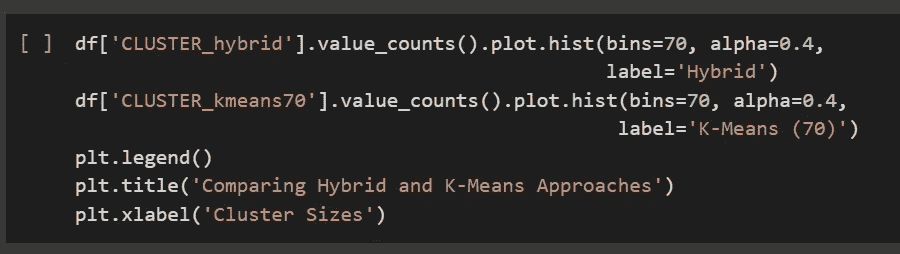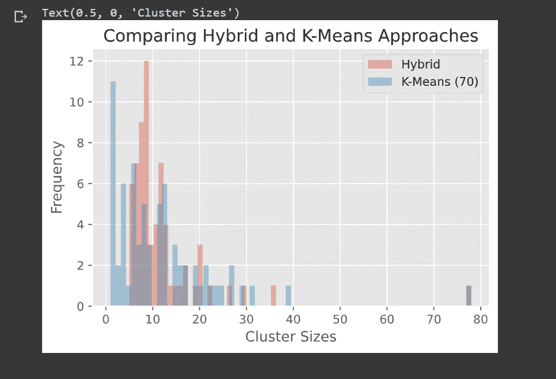

结论:混合方法有更多的聚类，给我们提供了一个更好的方法来建立服务站。

就这样了，伙计们。我很高兴地告诉你，我们的项目已经成功完成。

你是一个伟大的观众。谢谢你这么有耐心，这是一个很棒的项目，一开始有点吓人，但非常令人兴奋，你说呢？

我在这个项目上度过了一段美好的时光，在写作上更是如此。

下次我会带着更好的内容回来。

在那之前，再见！还有快乐编码！！