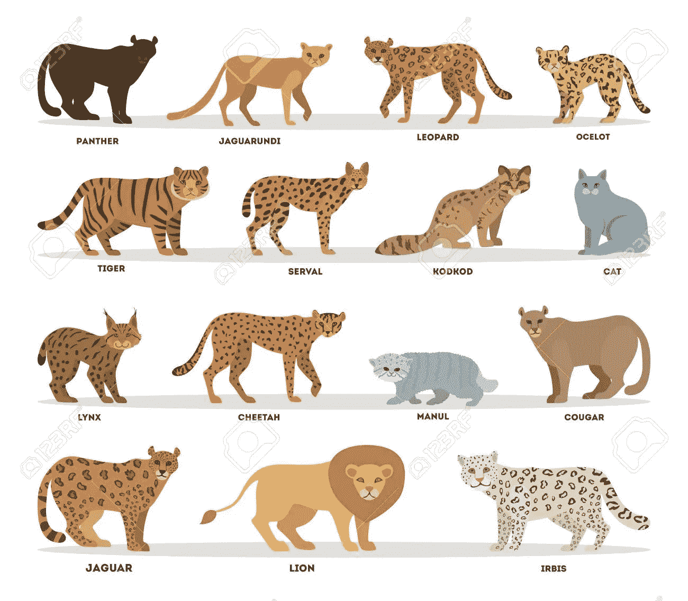
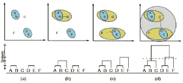
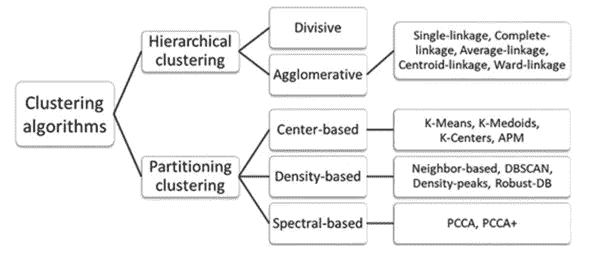
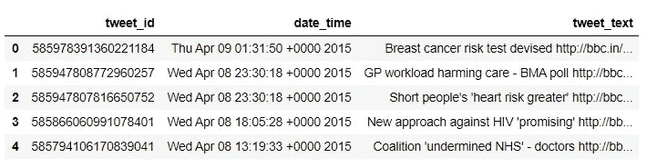
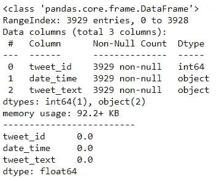
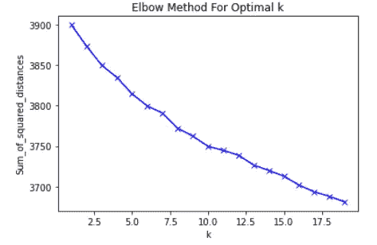
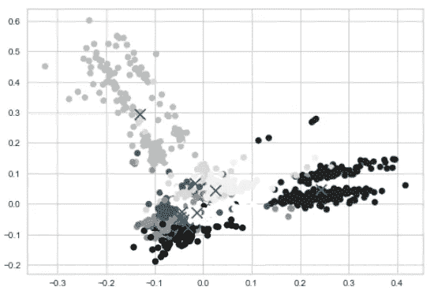
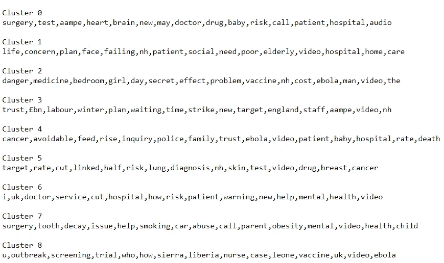
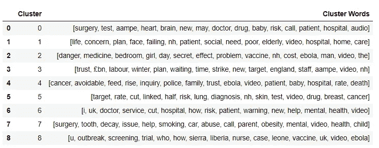

# 聚类| |原因和时间| |动手| |总结

> 原文：<https://medium.com/analytics-vidhya/clustering-why-and-when-hands-on-conclude-7c7c594f86c4?source=collection_archive---------13----------------------->

*建设性的、有效的、有益的、结论性的、明确的、*等。这样的单词是单词**的同义词**。现在如果有人让你把这些单词放在其中一个袋子里(**正面或反面**，你会选择哪个？

正右！。你会把写有这些字的包叫什么？**单词群**与 ***重要性相同/词根相同/甚至来源相同，*** 这就是我们有聚类概念和形成聚类的地方。。

如果上面的解释不清楚，让我说得更天真/正式些:**将动作电影组合在一个播放列表中，将所有不同类型的牙膏放在一个部分，然后根据价格/大小将它们分开，将不同类型的动物归为一个种类**(例如猫家族)。



猫科动物

> 聚类的任务是将人群或数据点分成不同数量的组，使得同一组中的**数据点比其他组中的数据点更类似于同一组中的其他数据点。**简而言之， ***目的是将具有相似特征的群体分离出来，并分配到聚类中。*** *聚类的应用:*

*   客户细分
*   数据分析
*   可用作**降维技术**
*   离群点检测
*   搜索引擎和分割图像。

现在，让我们从业务角度来理解集群。

在**商业智能**中，*聚类可以用来将大量的客户组织成组，其中一个组内的客户具有很强的相似特征。*这有助于加强客户关系管理的业务战略的发展。而且，考虑一个有大量项目的顾问公司。为了改进项目管理，可以应用聚类来根据相似性将项目划分为不同的类别，以便可以有效地进行项目审计和诊断(以改进项目交付和成果)。

# 聚类的类型

为了理解聚类的类型，理解我们如何判断一个聚类是合适的是很重要的。

*   高 ***类内*** 相似度
*   ●***类间*** 相似度

这意味着，为了获得良好的聚类结果，**类内距离必须高，类间距离必须低。**

***类内*** :

聚类内被定义为同一聚类中的数据点之间的距离。

***课间:***

类间是属于两个不同聚类的数据点之间的距离。


叙述

1.  *软聚类*:数据点可以共享/属于**一个或多个聚类**的技术。
2.  *硬聚类*:每一个数据点/对象只属于**一个聚类**的技术。将每个实例分配给一个集群。


硬集群与软集群

3.*层次聚类*:使用 **k-means 聚类**的一个主要考虑是预先通过**剪影评分或肘曲线法**决定 k 的值。层次聚类没有这种限制。这里使用**链接**的概念将多个子聚类合并成一个聚类，直到所有点都成为一个聚类的一部分。有两种类型/方法可以执行层次聚类 ***凝聚(自下而上)和分裂(自上而下)。***



凝聚层次聚类

# 让我们来谈谈剪影得分，肘部曲线，K-Means 和我们将要做的动手操作！

随便看看下面，**无监督聚类算法**有多少种不同的类型和方法，以及什么时候使用场景:



集群路线图！

**剪影得分**:剪影分析或剪影系数是一个数据点与自身聚类(*)相比与其他聚类(*)相似程度的度量。所以为了计算*轮廓度量*，我们需要比较两个度量，即 *a(i)* 和 *b(i)* ，其中**

*   ****a(I)是离自己星团的平均距离(****)******
*   *******(I)****b 是离最近邻簇的平均距离(***)******

******现在对于每一个**数据点(i)** ， *a(i)* **应该尽可能小**， *b(i)* **应该尽可能大。********

************

******剪影公式******

*   ******轮廓分数范围的值在 **-1 到+1 之间。********
*   ********接近+1 的分数表示该数据点与聚类中的其他数据点非常相似。********
*   ********分数越接近-1 表示该数据点与其聚类中的数据点不相似。********

********肘形曲线:**求样本距各自聚类中心距离的平方和**。要从 Elbow-Method 中选择最佳聚类数:********

*   ******针对不同的 k 值计算聚类算法(例如，k 均值聚类)。例如，通过将 k 从 1 变化到 10 个聚类。******
*   ******对于每个 k，计算总的类内平方和(wss)。******
*   ******根据簇数 k 绘制 wss 曲线。******
*   ******图中弯曲(拐点)的位置通常被认为是适当聚类数的指示。******

******嗯，以上两种方法都是用于**在 *K-MEANS 聚类算法中选择能够形成的最佳簇数！*********

******好了，到目前为止我们已经看到了，******

*   ******什么是聚类，什么时候应该进行聚类！******
*   ******不同类型的聚类。******
*   ******如何才能选择**最优聚类数**进行聚类。******

******现在，让我们看看**聚类方法**中的一种，以及我们如何继续实现它。******

********K-Means 聚类:**算法需要找到值彼此相似的数据点，因此这些点将属于同一个聚类。******

> ******任何聚类算法都是通过一种叫做 ***【距离度量】*** 的方法来实现的。在 **K-Means** 聚类中使用的距离度量被称为 ***“欧氏距离度量”。*********

************

********d** 是两点之间的**欧氏距离********

******大多数情况下，当我们执行聚类时，我们没有标签和质心。那么我们该如何进行呢？******

1.  ******我们从随机放置**质心**开始。******
2.  ******然后根据**欧氏距离**将实例标记到一个簇中，并更新质心，**标记实例，更新质心，标记实例，更新质心**，直到质心停止移动，即停止获得新的坐标。******

******该算法保证在有限步内收敛。就是这样，在仅仅两步**分配和优化**中，算法迭代收敛。算法的内部循环迭代 2 个步骤:******

*   ******将每个观察值 **X(i)** 分配到最近的群集质心。******
*   ******将每个质心更新为分配给它的点的平均值。******

******比较每簇的**平方和并显示**簇形成的 Gif 表示！**********

******如果仍有任何疑问，可以参考 Stat-Quest [集群视频](https://www.youtube.com/watch?v=4b5d3muPQmA&feature=youtu.be)，以获得更好的理解和更多的清晰度。这家伙真的解释得很好，唱得也很好！😛而如果你想玩 **k-means** ，[这个](https://www.naftaliharris.com/blog/visualizing-k-means-clustering/)可以帮到你！******

******终于，我们到了，我也渴望到达的地方！。******

# ******把手举起来。******

******问题陈述: ***使用聚类方法论进行词语聚类*** 。因此，我们有了**新闻推文的数据集，我们需要聚类出相似的词**。*我们如何继续这样做？*******

******让我引用一些关于数据集和方法的事情:******

*   ******它的功能包括: **tweet_id、tweet 的日期和时间以及 tweet_text** 。这些新闻推文是从 UCI 的 BBC 健康推文中获得的。总共有大约 **3929** 条推文，我们不会从整个数据中丢失任何值。******
*   ******现在，由于我们将对特征 **tweet_text** 进行聚类，我们删除了特征**日期和时间|| tweet_id** 。******
*   ******接下来，由于这是列中的文本数据，我们将执行一些基本的**文本清理和文本处理**步骤。******
*   ******然后经过清洗和处理，我们将从 **tweet_text** 特征中形成一个热编码词的 **tf-idf 词汇表**。因为聚类是在数值上执行的，所以我们需要构建一个单词词汇表并转换它们。******
*   ******然后使用**肘曲线法**并在**黄砖**库的帮助下，我们将找出**簇**的最佳数目，并将其传递给最终的聚类模型。**黄砖**库帮助我们在每次编译模型/脚本时传递最优的 ***k*** ，因此我们不需要硬编码该值。******

******最终的结果不是很精确，因为它是无监督的学习，并且我们在**范围 2 到 10** 之间寻找聚类，否则，由于句子的语言属性，相同的单词可能出现在 2 个不同的聚类中。******

## ******阅读数据集并探索一下:******

```
******data = pd.read_csv('Health-Tweets/bbchealth.txt', sep="|", header=None)
data.columns = ["tweet_id", "date_time", "tweet_text"]
data.head()******
```

************

```
******data.info() # Checking columns and number of entries
print('-------------------------')
print(round(data.isnull().sum()/len(data),2)) # Checking for any null values******
```

************

******这里我们看到了行和列名的总数。此外，与提到的特征/列相对应的行都不是空的。接下来，因为我们只需要**的 tweet_text** ，我们删除剩余的 2 列！******

```
******X_train = data.drop(columns=['tweet_id','date_time']).reset_index(drop=True)
X_train.head()
print(X_train.shape) #(3929, 1)******
```

## ******现在，处理我们功能中的文本:******

******首先，我们只是做一个普通的正则表达式过滤器来删除我们 tweets 中存在的所有 href 链接，然后我们建立一个 T2 函数，当我们开始形成 tf-idf 词汇表时，它被用作 T4 分析器。这有助于逐句应用功能**。********

> ******我们的函数**接受一个文本字符串，然后执行以下操作:**
> 1。删除所有标点符号
> 2。移除所有停用字
> 3。将清除的文本作为单词列表返回
> 4。删除单词******

```
******X_train['tweet_text'] = X_train['tweet_text'].apply(lambda x: re.split('https:\/\/.*', str(x))[0])
X_train['tweet_text'] = X_train['tweet_text'].apply(lambda x: re.split('http:\/\/.*', str(x))[0])# Our analyser function:
def text_process(text):
    '''
    Takes in a string of text, then performs the following:
    1\. Remove all punctuation
    2\. Remove all stopwords
    3\. Return the cleaned text as a list of words
    4\. Remove words
    '''
    stemmer = WordNetLemmatizer()
    nopunc = [char for char in text if char not in string.punctuation]
    nopunc = ''.join([i for i in nopunc if not i.isdigit()])
    nopunc =  [word.lower() for word in nopunc.split() if word not in stopwords.words('english')]
    return [stemmer.lemmatize(word) for word in nopunc]******
```

******矢量化无非是创建一个称为词汇的单词向量。
***TFIDF 矢量器用于创建一个词汇表。TFIDF 是一个单词在文档中的出现频率乘以该单词在整个语料库中的独特性。ngram_range 参数:这将有助于根据需求创建一个、两个或更多单词词汇表。*********

```
******tfidfconvert = TfidfVectorizer(analyzer=text_process,ngram_range=(1,3)).fit(X_train.tweet_text)X_transformed=tfidfconvert.transform(X_train.tweet_text)# Checking the length of the Vocabulary Created!
len(tfidfconvert.vocabulary_) # 3933******
```

## ******使用肘形曲线决定聚类数！：******

```
******Sum_of_squared_distances = []
K = range(1,20)
for k in K:
    km = KMeans(n_clusters=k)
    km = km.fit(X_transformed)
    Sum_of_squared_distances.append(km.inertia_)import matplotlib.pyplot as pltplt.plot(K, Sum_of_squared_distances, 'bx-')
plt.xlabel('k')
plt.ylabel('Sum_of_squared_distances')
plt.title('Elbow Method For Optimal k')
plt.show()******
```

************

******正常肘曲线法******

******但是，让我给你展示一下**黄砖库的魔法:********

```
******from yellowbrick.cluster import KElbowVisualizer
from yellowbrick.cluster.elbow import kelbow_visualizer
model = KMeans()
visualizer = KElbowVisualizer(model, k=(1,20))
# visualizer = kelbow_visualizer(KMeans(random_state=4), X_transformed, k=(2,50))
visualizer.fit(X_transformed)        # Fit the data to the visualizer
visualizer.show();        # Finalize and render the figure******
```

************

******黄砖弯头曲线图******

******只要看看它，多么漂亮，它看起来！我们可以看到所附的分数和 k 处的**弯头**值。对于每个集群计算，它甚至还有时间轴**和时间轴**！接下来，事情是:******

```
******optimal_k = visualizer.elbow_value_
print('Optimal K found is:', optimal_k) # 9****** 
```

******使用 yellowbrick 实现中的 **elbow_value_** 方法，**我们可以自动直接获取最佳 k 值**，这将用于最终建模。******

## ******建模:******

******现在，此时此刻，我们得到的最佳集群数是第 9 轮，因此同样的集群数将被向前传递。******

```
******# Clustering the training sentences with K-means techniquemodelkmeans = KMeans(n_clusters=optimal_k, init='k-means++', n_init=100)
modelkmeans.fit(X_transformed)******
```

******在我们形成模型后，我们也将可视化一些数据点来获得相同的感觉。******

```
******pca = PCA(n_components=2, random_state=42)
reduced_features = pca.fit_transform(X_transformed.toarray())# reduce the cluster centers to 2D
reduced_cluster_centers = pca.transform(modelkmeans.cluster_centers_)plt.scatter(reduced_features[:,0], reduced_features[:,1], c=modelkmeans.predict(X_transformed));
plt.scatter(reduced_cluster_centers[:, 0], reduced_cluster_centers[:,1], marker='x', s=150, c='b');******
```

************

******十字是模型选择的**形心**。最终的聚类形状是高度**不均匀的**，因此，如果我们选择更多数量的聚类，我们可能会得到更多**均匀的聚类**。接下来，我们按照我们的 ***数据科学项目*** 方法，在同一数据集上也尝试了 **MiniBatch KMEANS** 算法！******

## ******小批量意味着:******

******现在， *Mini Batch KMEANS* 只是对传统 KMEANS 算法的改进。这里，算法能够使用 ***小批量*** ，而不是在每次迭代中使用完整的数据集，在每次迭代中稍微移动质心。******

******这将算法的速度提高了 3 到 4 倍，使得对不适合内存的大数据集进行聚类成为可能。作为我们实验的一部分，我们打算使用相同的方法并观察最终的聚类结果。******

```
******clusters = MiniBatchKMeans(n_clusters=optimal_k, init_size=1024, batch_size=2048, random_state=20).fit_predict(X_transformed)# Looking at the Words Clustered out finally
def get_top_keywords(data, clusters, labels, n_terms):
    df = pd.DataFrame(data.todense()).groupby(clusters).mean()
    final_df = pd.DataFrame(columns=['Cluster','Cluster Words'])
    for i,r in df.iterrows():
        print('\nCluster {}'.format(i))
        print(','.join([labels[t] for t in np.argsort(r)[-n_terms:]]))
        x = i
        y = [labels[t] for t in np.argsort(r)[-n_terms:]]
        final_df = final_df.append({'Cluster' : x , 'Cluster Words' : y} , ignore_index=True)
    return final_df# print the top words
final_df = get_top_keywords(X_transformed, clusters, tfidfconvert.get_feature_names(), 15)******
```

************

******类似地，我们将这个结果累积到一个数据帧中:******

```
******pd.set_option("max_colwidth", None)
final_df.head(20)******
```

************

## ******结论:******

*   ******因此，我们研究了聚类算法的需求基础。******
*   ******不同类型的聚类技术以及 **K 均值和小批量 K 均值**的实现。******
*   ******我们甚至探索了一些**文本处理/清理**步骤，这些步骤可以帮助任何需要**清理/处理**文本数据的问题陈述。******
*   ******最后，您可以自己探索更多的聚类算法，如: **DBSCAN、BIRCH、Mean-Shift、Agglomerative、Affinity、Gaussian Mixture** 模型。******

******我希望这篇文章对读者有所帮助。更多的话题还在路上，如果有什么特别的话题，请在评论区告诉我，一如既往地…… **快乐学习！********

******请通过以下方式联系我:******

*   ******[领英](https://www.linkedin.com/in/atul-mishra-5001/)******
*   ******[Github](https://github.com/mishra-atul5001)******
*   ******邮件:**atul.mishra5001@gmail.com********