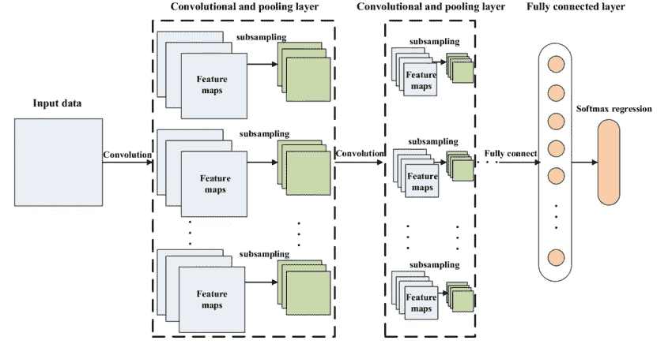
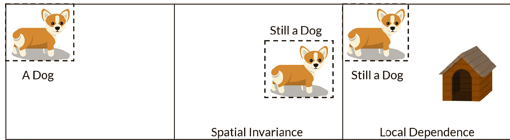

# CNN vs MLP 的图像分类

> 原文：<https://medium.com/analytics-vidhya/cnn-convolutional-neural-network-8d0a292b4498?source=collection_archive---------1----------------------->

CNN 的典型架构

***为什么 CNN 比 MLP (ANN)更适合用于图像分类？***

多层感知器([多层感知器](https://en.wikipedia.org/wiki/Multilayer_perceptron))对每个输入(例如图像中的像素)使用一个感知器，对于大图像，权重的数量很快变得难以管理。它包含太多参数，因为它是完全连接的。每个节点都与上下一层中的所有其他节点相连，形成一个非常密集的网络，导致冗余和低效。因此，训练时会出现困难，可能会出现*过拟合*，使其失去概括能力。

另一个常见的问题是 MLP 对输入(图像)及其平移版本的反应不同，它们不是平移不变的。例如，如果一张图片中的图像的左上方出现了一只猫，而另一张图片的右下方出现了一只猫，则 MLP 会尝试自我纠正，并假设图像的这一部分中总会出现一只猫。

因此，MLP 不是图像处理的最佳选择。一个主要问题是，当图像被展平(矩阵到矢量)成 MLP 时，空间信息丢失。

因此，我们需要一种方法来利用图像特征(像素)的空间相关性，这样无论猫出现在哪里，我们都可以在照片中看到它。解决方案？— **CNN** ！

[**卷积神经网络**](https://en.wikipedia.org/wiki/Convolutional_neural_network) **(CNN)** :更一般地说，CNN 很适合处理有空间关系的数据。因此，对于涉及图像数据作为输入的任何类型的预测问题，CNN 都是首选方法。
使用 CNN 的好处是它们能够开发二维图像的内部表示。这允许模型学习数据中不同结构的位置和比例，这在处理图像时很重要。

卷积运算

它可以说明*局部连通性*(每个滤波器根据一定的大小和步幅(在每个卷积步骤之后要移动的像素/块的数量)在整个图像[卷积]周围平移，允许滤波器找到并匹配模式，而不管模式位于给定图像中的什么位置)。重量更小，可以共享——更少浪费，比 MLP 更容易训练，也更有效。他们也可以更深入。层是稀疏连接的，而不是完全连接的。
它接受矩阵和向量作为输入。
这些层是*稀疏连接*或部分连接而不是*完全连接*。*并非每个节点都与其他节点相连。*

CNN 利用了这样一个事实，即附近的像素比远处的像素相关性更强。
我们通过使用一种叫做**过滤器/内核**的东西来分析附近像素的影响，并在图像中从左上向右下移动。对于图像上的每个点，使用卷积运算基于过滤器计算一个值。
过滤器可以与任何东西相关，对于人类的图片，一个过滤器可以与看到的鼻子相关联，我们的鼻子过滤器将向我们提供鼻子在我们的图像中出现的强烈程度以及出现的次数和位置的指示。与 MLP 相比，这减少了神经网络必须学习的权重数量，也意味着当这些特征的位置改变时，它不会扰乱神经网络。

CNN *中的滤波器平移(您可以设置步幅和滤波器大小)本质上允许参数共享*、*权重共享*，以便滤波器寻找特定的模式，并且*位置不变*——可以在图像中的任何地方找到模式。这对于物体检测非常有用。可以在图像的多个部分发现模式。
此外，它还可以使用一种称为池的概念找到相似的模式，即使对象有所旋转/倾斜，这使得 CNN 对图像中特征位置的变化更加鲁棒，这种变化由技术短语“*局部平移不变性*表示

在滤波器通过图像后，为每个滤波器生成一个**特征图**。然后通过激活函数获取这些图像，激活函数决定某个特征是否出现在图像中的给定位置。然后我们可以做很多事情，例如添加更多的过滤层和创建更多的特征地图，随着我们创建更深的 CNN，这些变得越来越抽象。我们还可以使用合并图层来选择要素地图上的最大值，并将其用作后续图层的输入。理论上，任何类型的操作都可以在池化图层中完成，但在实践中，仅使用最大池化，因为我们希望找到异常值-这些是我们的网络看到的要素！

在池中，它基本上需要一个过滤器和一个相同长度的步幅。然后将其应用于输入体积，并输出滤波器所卷积的每个子区域中的最大数量。这个*池*层背后的直观推理是，一旦我们知道特定的特征在原始输入体积中(将有一个高激活值)，它的确切位置就没有它与其他特征的相对位置重要。可以想象，这一层极大地减少了输入体积的空间维度(长度和宽度变化，但深度不变)。

神经网络(在 MLP)将学习对可能相同的东西的不同解释。但是在 CNN 中，权重的数量取决于内核大小*(参见权重共享)*，而不是对图像真正重要的输入大小。因此，通过在空间维度之间强制共享权重，极大地减少了参数的数量，卷积核充当了学习框架。
这就是卷积层减少内存使用和提高计算速度的方式。

**注 1:** 空间信息是指与其他信息有基于位置关系的信息。空间代表图像中的 2D 平面(x-y)。
CNN 的早期层是卷积层，它将图像视为 2D(空间)信息。然而，更深的层使第一 conv 层中的(复杂的)信息变平，它提取像边、角等空间信息。在其他 conv 层，它提取空间信息，如眼睛，鼻子等。
这是图像中的空间信息。CNN 不维护特征之间的空间关系。高级 capsnet 解决了这个问题。

 [## 胶囊神经网络:下一代神经网络？第一部分:CNN 及其问题。

### 卷积(“常规”)神经网络是机器学习的最新炒作，但它们也有缺陷。胶囊…

towardsdatascience.com](https://towardsdatascience.com/capsule-neural-networks-are-here-to-finally-recognize-spatial-relationships-693b7c99b12) 

**注 2:**CNN 被设计为*空间不变*，也就是说——它们对例如图片中物体的位置不敏感。你越深入图层，原本不太相似的物体(或者通常是物体的一部分)变得越相似(T4 是通过卷积实现的)。在最深层，我们提取的特征没有关于它们在原始图像上的位置的信息。我们甚至丢失了原始对象的像素大小的信息，因为 CNN 中的另一个过程叫做池化。卷积是为什么细胞神经网络在“类人”任务中表现优于任何其他模型的关键，如识别图片中的特定对象、录制语音中的单词和其他任务。

 [## 图像分类:MLP vs CNN

### 在这篇文章中，我将对标准 MLP(多层感知器，或饲料…

www.peculiar-coding-endeavours.com](https://www.peculiar-coding-endeavours.com/2018/mlp_vs_cnn/)