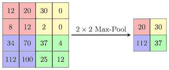

# CNN:深度学习中的卷积神经网络

> 原文：<https://medium.com/analytics-vidhya/cnn-convolutional-neural-network-in-deep-learning-5d8b39a3c283?source=collection_archive---------19----------------------->

什么是卷积神经网络？？

卷积神经网络是深度学习中的一类，它以图像为输入，识别图像之间的边缘和特征，并给出结果。

CNN 是如何运作的？

CNN 使用过滤器和最大池来识别水平和垂直的边缘，并仅获得所需的特征或给出相关信息的特征。

**过滤器:**

输入图像用滤波器执行卷积运算以提取边缘。有多个滤波器的例子:索贝尔滤波器，沙尔滤波器等。

假设有一个 7×7 矩阵和 3×3 滤镜的图像。


卷积函数

来自输入图像的第一个 3×3 块与滤波器(图像中的特征检测器)相乘，并且获得特征图的第一个值。如下图所示:

(0x 0)+(0x 1)+(0x 0)+(0x 0)+(1x 0)+(0x 1)+(0x 1)+(0x 0)+(0x 1)= 0

类似地，对于第一行中的第二块，

(0x 0)+(1x1)+(0x 0)+(0x 0)+(0x 0)+(0x 1)+(0x 1)+(0x 0)+(0x 1)= 1

像这样，取一个步长，计算每个块的值，这表示图像的边缘


特征映射矩阵的大小=输入图像的大小-滤波器的大小+ 1，即在给定的示例中，它将是 7–3+1 = 5，即 5×5。

但有时这会产生一个问题，即随着尺寸的减小，一些特征或信息会丢失。在将填充应用于输入图像的情况下，该信息可能很重要。


填充后，7x7 矩阵变为 9x9，因此特征图大小将为 9–3+1 = 7，即 7x7，这意味着没有信息丢失。

**最大池层:**

在 maxpooling 中，假设 maxpooling 层的矩阵大小为 2×2，则从输入图像中每个 2×2 矩阵的最大值中提取，并形成矩阵，该矩阵是 maxpooling 层的输出矩阵或输出，其包含重要特征或包含关于输入的更多信息的特征。



最大池层

filter 和 maxpooling 的一个优点是，我们从输入图像中获得了重要的特征，并且图像的大小也减小了。

现在让我们看看使用 keras 的 filter 和 maxpooling 的代码:

```
import tensorflow as tf

model = models.Sequential()

model.add(layers.Conv2D(64, (3, 3), activation='relu', input_shape=(32, 32, 3)))

model.add(layers.MaxPooling2D((2, 2)))

model.add(layers.Conv2D(32, (3, 3), activation='relu'))

model.add(layers.MaxPooling2D((2, 2)))

model.add(layers.Conv2D(32, (3, 3), activation='relu'))model.add(layers.Flatten())

model.add(layers.Dense(64, activation='relu'))

model.add(layers.Dense(10))
```

在上面的代码中，第一层包含 64 个大小为 3x3 的滤镜，输入形状为(32，32，3)，表示一个 32x32 的图像，有 3 个通道。层 1 的输出形状将是(30，30，3)。第二层是大小为 2x2 的 maxpooling 层。第二层的输出形状将是(15，15，3)。类似地，第三层具有 32 个大小为 3×3 的滤波器，输出形状为(13，13，3)，第四层的输出形状为(6，6，3)。最后 3 层是扁平化，密集和 10 类输出层。

```
model.summary()Model: "sequential_1" _________________________________________________________________ Layer (type)                 Output Shape              Param #    ================================================================= conv2d_3 (Conv2D)            (None, 30, 30, 64)        1792       _________________________________________________________________ max_pooling2d_2 (MaxPooling2 (None, 15, 15, 64)        0          _________________________________________________________________ conv2d_4 (Conv2D)            (None, 13, 13, 32)        18464      _________________________________________________________________ max_pooling2d_3 (MaxPooling2 (None, 6, 6, 32)          0          _________________________________________________________________ conv2d_5 (Conv2D)            (None, 4, 4, 32)          9248       _________________________________________________________________ flatten (Flatten)            (None, 512)               0          _________________________________________________________________ dense (Dense)                (None, 64)                32832      _________________________________________________________________ dense_1 (Dense)              (None, 10)                650        ================================================================= Total params: 62,986
Trainable params: 62,986 
Non-trainable params: 0 _________________________________________________________________
```