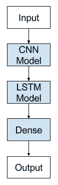
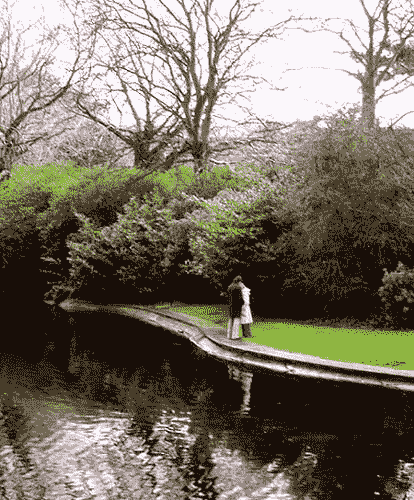

# CNN-LSTM 建筑和图像字幕

> 原文：<https://medium.com/analytics-vidhya/cnn-lstm-architecture-and-image-captioning-2351fc18e8d7?source=collection_archive---------0----------------------->

本文由 [Kanishkkalra](https://medium.com/u/7fb7afba1233?source=post_page-----2351fc18e8d7--------------------------------) 共同撰写。

深度学习是发展最快和研究最深入的研究领域之一，正在进入我们的日常生活。它只是使用重型和高端现代硬件的人工神经网络的应用。它允许开发、训练和使用比以前认为可能的更大(更多层)的神经网络。研究人员提出了数千种特定的神经网络，作为对现有模型的修改或调整。一些比较著名的如 CNN 和 RNN 的。

卷积神经网络被设计成将图像数据映射到输出变量。它们被证明是如此有效，以至于它们是任何类型的涉及图像数据作为输入的预测问题的首选方法。

递归神经网络(RNNs)被设计用于处理序列预测问题。这些序列预测问题包括一对多、多对一和多对多。

LSTM 网络可能是最成功的 RNN 网络，因为它们允许我们封装更广泛的单词或句子序列来进行预测。

# CNN-LSTM 模式

最有趣和实用的神经模型之一来自于将不同类型的网络混合成混合模型。

**举例**

考虑一下**为图像**生成字幕的任务。在这种情况下，我们有一个输入图像和一个作为输入图像标题的输出序列。

**我们可以将此建模为一对多序列预测任务吗？**

是的，但是 LSTM 或任何其他序列预测模型如何理解输入图像呢？我们不能直接输入 RGB 图像张量，因为它们不适合处理这样的输入。具有空间结构的输入，比如图像，不能用标准的香草 LSTM 来简单地建模。

**可以从输入图像中提取一些特征吗？**

是的，这正是我们需要做的，以便将 LSTM 架构用于我们的目的。我们可以使用深度 CNN 架构从图像中提取特征，然后将这些特征输入 LSTM 架构以输出字幕。

**这被称为 CNN LSTM 模型，**专门设计用于空间输入的序列预测问题，如图像或视频。该架构包括使用卷积神经网络(CNN)层对输入数据进行特征提取，并结合 LSTMs 对特征向量进行序列预测。简而言之，CNN LSTMs 是一类在空间和时间上都很深的模型，位于计算机视觉和自然语言处理的边界。这些模型具有巨大的潜力，正越来越多地用于许多复杂的任务，如文本分类、视频转换等。这是一个 CNN LSTM 模型的通用架构。

图片来源:[https://machine learning mastery . com/CNN-long-short-term-memory-networks/](https://machinelearningmastery.com/cnn-long-short-term-memory-networks/)

# 图像字幕

描述图像是生成图像的人类可读文本描述的问题，例如物体或场景的照片。它将计算机视觉和自然语言处理结合在一起。

用于字幕的神经网络模型包括两个主要元素:

1.  特征提取。
2.  语言模型。

文章的其余部分将阐明我们的想法和观察，同时实现一个 CNN-LSTM 模型的图像字幕。注意，这篇文章不是关于图像字幕实现的教程，而是旨在探索 CNN-LSTM 架构及其实际应用。代码用 python3 编写，用 Keras 实现。这里是您能够完全理解实现的必要要求和先决条件。如果你对实施教程感兴趣，可以去 https://bit.ly/2XFCEmN 的[。](https://bit.ly/2XFCEmN)

使用的数据集可以通过以下链接下载。

**Flickr8k_Dataset(** 包含 8092 张 JPEG 格式的照片)——[https://bit.ly/35shVWb](https://bit.ly/35shVWb)

**Flickr8k_text(** 包含多个文件，这些文件包含不同来源的照片描述。)——[https://bit.ly/2DcBAgF](https://bit.ly/2DcBAgF)

该数据集具有预定义的训练数据集(6，000 个图像)、开发数据集(1，000 个图像)和测试数据集(1，000 个图像)。

数据集信息以及模型的数据准备可以在上面的相同链接中看到。

在这里，我们将只展示用于创建和运行模型的重要代码片段。我们鼓励您使用不同的数据集，并相应地准备您的数据集。

# 特征抽出

特征提取模型是一种神经网络，给定一幅图像，它能够提取显著的特征，通常以固定长度向量的形式。深度卷积神经网络(CNN)被用作特征提取子模型。该网络可以直接在数据集中的影像上进行训练。或者，您可以使用如图所示的预训练卷积模型。

# 语言模型

对于图像字幕，我们正在创建一个基于 LSTM 的模型，用于根据从 VGG 网络获得的特征向量来预测单词序列，称为字幕。

语言模型被训练 20 个时期。您可以尝试其他参数，并根据自己的需要进行调整。我们在这里展示的是我们训练网络后得到的一个结果。

生成描述:两个女孩在水中玩耍。

# 结论

CNN-LSTM 架构具有广泛的应用，因为它是计算机视觉和自然语言处理的掌舵人。它允许我们将最先进的神经模型用于 NLP 任务，例如用于顺序图像和视频数据的转换器。同时，功能极其强大的 CNN 网络可以用于自然语言等序列数据。因此，它允许我们在以前从未使用过的任务中利用强大模型的有用方面。这篇文章只是介绍混合神经模型的概念，并鼓励人们越来越多地使用 CNN-LSTM 模型的不同架构。

**参考文献**

 [## 基于预训练模型的 VGG 特征提取

### 下载数千个项目的开放数据集+在一个平台上共享项目。探索热门话题，如政府…

www.kaggle.com](https://www.kaggle.com/insaff/vgg-feature-extraction-by-pretrained-model)  [## NLP-2019

### 基本概率和统计(ES 331/ MA 202)或对 Python 编程的同等基本理解(ES 102/ ES…

sites.google.com](https://sites.google.com/a/iitgn.ac.in/nlp-autmn-2019/)  [## 如何利用深度学习自动生成照片的文本描述

### 给图像加字幕涉及在给定图像(例如照片)的情况下生成人类可读的文本描述。它…

machinelearningmastery.com](https://machinelearningmastery.com/how-to-caption-photos-with-deep-learning/)  [## 何时使用 MLP、CNN 和 RNN 神经网络

### 什么样的神经网络适合你的预测建模问题？对初学者来说……可能很难

machinelearningmastery.com](https://machinelearningmastery.com/when-to-use-mlp-cnn-and-rnn-neural-networks/)  [## 如何从零开始开发深度学习照片字幕生成器

### 开发一个深度学习模型，用 Keras 一步一步地用 Python 自动描述照片。标题…

machinelearningmastery.com](https://machinelearningmastery.com/develop-a-deep-learning-caption-generation-model-in-python/)  [## CNN 长短期记忆网络

### 有线电视新闻网 LSTM 递归神经网络与示例 Python 代码的温和介绍。有空间结构的输入，像…

machinelearningmastery.com](https://machinelearningmastery.com/cnn-long-short-term-memory-networks/)