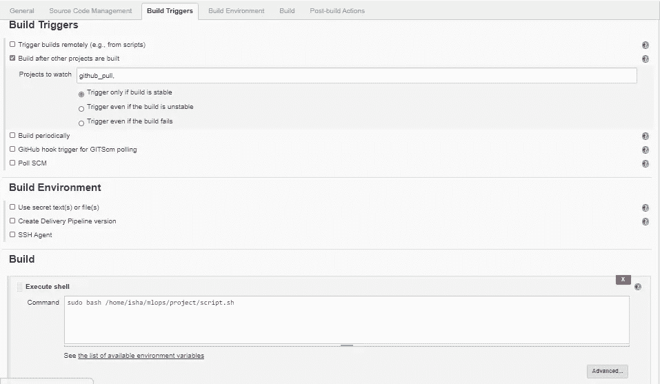

# 自动增加其准确性的 CNN 模型

> 原文：<https://medium.com/analytics-vidhya/cnn-model-that-auto-increases-its-accuracy-9571ec0bf926?source=collection_archive---------11----------------------->

> **创建一个机器学习模型，需要一次又一次地设置环境，对模型进行修改，编译模型，训练模型。因此，由于大量的人工工作，大多数机器学习项目都没有实现。**

所以，我努力寻找解决这个问题的方法。

问题陈述:1。使用 dockerfile 创建安装了 Python3 和 Keras 或 numpy 的容器映像

2.当我们启动这个图像时，它应该会自动开始训练容器中的模型。

3.使用 Jenkins 中的构建管道插件创建 job1、job2、job3、job4 和 job5 的作业链

4.Job1:部分开发者向 Github 推送回购时自动拉取 Github 回购。

5.Job2:通过查看代码或程序文件，Jenkins 应该自动启动相应的机器学习软件安装解释器安装映像容器，以部署代码并开始训练(例如，如果代码使用 cnn，则 Jenkins 应该启动已经安装了 CNN 处理所需的所有软件的容器)。

6.工作 3:训练你的模型并预测准确性或度量。

7.Job4:如果度量准确度低于 99%，那么调整机器学习模型架构。

8.Job5:重新训练模型或通知正在创建最佳模型。

9.为 monitor : If 容器创建一个额外的 job job6，其中应用程序正在运行。由于任何原因失败，则该作业应该从最后一个训练模型离开的地方自动再次启动容器。

方法论流程图

解决方案:我在系统中创建了一个本地存储库，包含文件 accuracy_check.txt、checking.py、maincode.py、script.sh、variable.txt 和一个 README.md 文件。

本地知识库

在 hooks 中制作了一个提交后文件，以便能够将提交的文件自动推送到 github，并在 jenkins 中自动运行作业 guthub_pull，以提取 github 代码并将其复制到我的 RHEL 8 系统中的文件夹/home/isha/mlops/project 中。

提交后文件。git/hooks/

一旦我的本地存储库中的文件上传到 github job*github _ pull*auto builds 中。

詹金斯的 github_pull 作业

这个作业 github_pull 是远程触发的。该作业将所有文件从 var/lib/Jenkins/workspace/github _ pull 文件夹复制到/home/isha/mlops/project 文件夹。

github _ 拉作业

现在，一旦作业 github_pull 成功构建，就会自动触发作业 model_train。

github_pull 中的后期构建

Job model_train 运行 script.sh 文件，并在成功构建后运行 job accuracy_compare。

模型 _ 火车

自动触发作业准确性 _ 比较

script.sh 文件首先检查 maincode.py 中的代码是否是 CNN 代码。(为此，它首先运行 checking.py 文件)

script.sh 文件

checking.py 文件首先以读取模式打开 maincode.py，并检查其中是否有类似“keras”或“tenserflow”的术语。这是因为这些词的存在确保了 CNN 的代码。如果找到这些术语，那么它在输出中打印 CNN。

正在检查. py

如果代码是 CNN，则 script.sh 文件使用 mlopsimage:v1 运行一个容器 cnn_os，并将 home/isha/mlops/project 文件夹挂载到容器中的/mlops 文件夹。

图像文件:v1

运行容器后的 script.sh 文件会删除 accuracy_check.txt 和 variable.txt 文件，并在容器中运行 python 代码 maincode.py。

制作了多种功能

maincode.py 有三个函数来提高模型的准确性。由于 N=1，最初将使用函数 make_model1()。N 的值存储在文件 variable.txt 中

一旦模型被训练，模型的精度值被存储在变量‘a’中。然后生成一个文件 accuracy_check.txt，并将“a”的值复制到其中。

成功建立模型 _ 训练作业后，触发精度 _ 比较作业。

模型 _ 列车的控制台输出

初步达到的准确率为 98.53%。作业 accuracy_compare 首先读取存储在文件 accuracy_check.txt 中的精度值，然后将其存储在变量 read_accuracy 中，然后与 99%的 final_accuracy 进行比较。如果达到的准确度小于 99，则触发作业准确度提高，否则使用远程触发器运行作业成功通知程序。

作业*精度 _ 比较*

作业 accuracy_improve 读取存储在 variable.txt 中的 N 值，并将 maincode.py 中的 N 值增加 1，以便这次运行 maincode.py 中的下一个函数。现在，容器 cnn_os 再次被删除，一个同名的新容器启动。删除具有旧精度值的 accuracy_check.txt 文件和具有旧 N 值的 variable.txt 文件，并再次运行 maincode.py。maincode.py 的再次运行会再次生成这两个文件，并在其中复制一个新值。

工作准确度 _ 提高

N 值增加到重新训练模型

再次比较精确度，并通过重新训练模型来提高精确度，一旦精确度达到 99%,就会触发作业成功通知程序，向开发人员发送成功邮件。

准确率达到 99%以上

发送给开发人员的成功邮件

这项任务让我了解了如何通过改变模型的卷积层数或采用不同类型的池(平均或最大)来改进 cnn 模型。如需完整代码，请访问我的 github 资源库:

https://github.com/ishajain140/model_accuracy[。](https://github.com/ishajain140/model_accuracy)