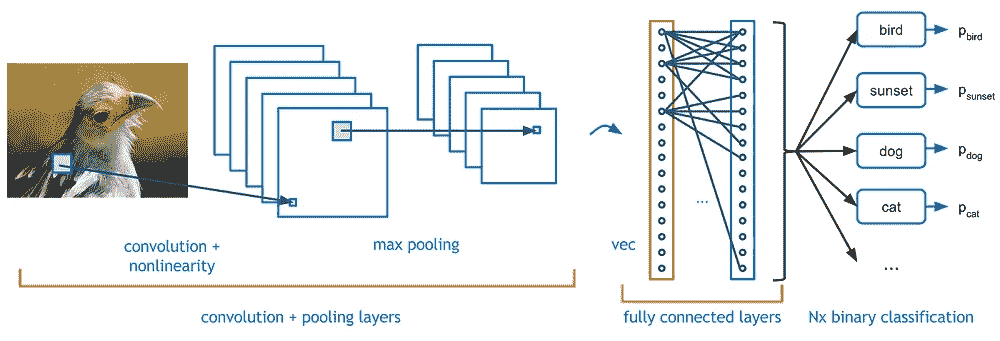

# CNN——快速学习

> 原文：<https://medium.com/analytics-vidhya/cnn-quick-learn-12dced578b01?source=collection_archive---------16----------------------->

快速简单地了解卷积神经网络的概念。

# 关于 CNN 你应该知道的一切

*   *CNN 是什么？*
*   *为什么是 CNN？*
*   *什么是卷积层？*
*   *什么是池层？*
*   *什么是填充？*
*   *什么是跨步？*
*   *什么是展平层？*
*   *什么是密层？*

# 美国有线新闻网；卷积神经网络

*   > CNN 是一种深度学习算法，主要用于图像分类
*   >它可以获取输入图像，为图像中的各个方面分配重要性(可学习的权重和偏差)，并能够区分它们。
*   >与其他分类算法相比，ConvNet (CNN)中所需的预处理要低得多。虽然在原始方法中，过滤器是手工设计的，但是通过足够的训练，ConNet 有能力学习这些过滤器或图像的特征

# 为什么是 CNN？

你可能会认为一个正常的机器学习分类器也可以做同样的事情，所以我们为什么需要这个 CNN，嗯，这都是关于速度，计算和准确性。

*   >与 ML 分类器相比，CNN 有许多主要优势，但是您想知道真正的原因，使用 CNN 的原因是它在处理器上的开销比 ML 分类器少，并且准确性更高。随着世界向云基础设施转变，云机器上的低处理模型是最合适的。
*   如果你认为我们可以使用简单的神经网络。请听我说，在一个简单的神经网络中，一个 3×3(像素分辨率)的图像矩阵被转换为一个 9×1 的矩阵，即所谓的向量，这样我们就可以将它输入到一个有 9 个起始节点的神经网络中。通常，不使用 3x3 图像，而是使用更大的图像，并且图像矩阵的维度也更多，这将导致非常大且宽的神经网络。
*   >由于所涉及的参数数量减少，ConvNet 对数据集的拟合更好。并且没有通过使用还原 CNN 不丢失图像的特征。

# 卷积层

> **卷积层不是神经网络的一部分，它只是在将图像发送到神经网络之前，对图像进行预处理并从图像中提取特征信息的一种技术。**

*   > Filter =就在此下方，作为仅过滤图像特定信息的普通过滤器，例如，将返回图像中所有直线或图像中所有曲线的过滤器。
*   >如果您将这样的过滤器放在图像上，它会返回过滤后的信息。但是当然，整个图像不会仅仅由一条直线组成，这就是为什么我们选择一个小的过滤器，然后一次一个地应用到图像的一小部分，直到整个图像被覆盖。
*   >假设图像分辨率为 5x5 px，我们选择大小为 3x3 px 的滤镜，这意味着图像矩阵为 5x5 矩阵，滤镜为 3x3 矩阵。

*   >首先，我们从图像中选择一个 3x3 的矩阵(这应该与我们的过滤器尺寸相同)。然后，图像的这个 3x3 子部分与我们的滤波器进行点积(矩阵乘法)，这将返回一个值，我们将这个值存储在一个新的矩阵中，称为卷积矩阵。
*   >我们通过选择图像的不同部分重复这一过程，直到我们得到所有的值。具有滤波器的图像点积的特定部分将在我们的卷积矩阵中具有固定的位置
*   >例如:从一个 5x5 的图像中，我们可以选择一个 3x3 的矩阵，9 个不同的时间。因此，我们的卷积矩阵等于我们的滤波器的维数。
*   >这个卷积矩阵现在是我们的新矩阵，以更高的直线检测精度来表示我们的图像。
*   >现在您可以通过多个卷积层提取图像所需的所有信息。
*   >真正的问题是，您不必选择哪个图层过滤哪个要素，也不必设置过滤器。这都是由算法本身完成的，你只需要给模型分配一个卷积层，权重会在训练时分配。

## 卷积运算的目的是从图像中提取高级特征，如边缘、线条、曲线、阴影等。

# 汇集层

*   >池层用于减少卷积特征的尺寸大小。
*   >这样做是为了通过降维来降低处理数据所需的计算能力
*   >它有助于提取主要特征并减少噪声
*   >用简单的语言来说，假设您在卷积层后得到的卷积矩阵是 4x4，合并会将其简化为 2x2 矩阵。
*   >你可能会说，数据丢失或特征丢失，但事实并非如此，它更像是只降低了维度，但仍保留了特征，为此，我们可以使用不同的轮询技术。
*   **MAX Pooling =** 我们从 4x4 矩阵中选择一个 2x2 子矩阵，从中取出最大值，并将其保存在新矩阵中。我们重复地取一个 2x2 矩阵(总共 4 次),直到我们完成我们的 2x2 简化矩阵。
*   **平均池** =我们从 4x4 矩阵中选择一个 2x2 子矩阵，取所有 4 个值的平均值，并将其保存在我们的新矩阵中。我们重复地取一个 2x2 矩阵(总共 4 次),直到我们完成我们的 2x2 简化矩阵。

现在，“带滤波器+池的 ConvNet”是一个卷积层。我们可以添加许多卷积层，这会给我们带来更好的结果。

## Conv 层之后我们得到了什么结果

我们输入的原始图像有许多我们不需要的不必要的特征和数据，但我们仍然必须将它们作为矩阵中的一个像素输入，

在卷积层之后，来自图像的所有噪声和不想要的数据被移除，并且我们有一个只包含主要特征的矩阵。

考虑这个例子:你想训练模型，以便它可以预测照片是否是你的。你给训练的样本照片让你站在一些照片的中间，在边缘，远离相机，靠近相机，不同类型的背景等，所有这些图像将在卷积层预处理，只有那些具有一些主要特征的像素才会被发送。

*   >经过以上过程，我们已经成功地使模型理解了特征。
*   接下来，我们将展平 convnet 的最终输出，并将其输入常规神经网络进行分类

# 填料

*   >这是一个与 convNet 相关的术语，指的是 CNN 内核处理图像时添加到图像中的像素数量。
*   >每次我们使用滤镜时，图像的大小都会变小，如果我们不想这样，并且希望保留图像的原始大小，以提取我们使用填充的相同低级特征
*   >当我们在 5x5 图像上使用 3x3 滤镜时，我们会得到一个 3x3 卷积矩阵，如果我们不想发生这种情况，我们可以使用填充。
*   >在使用 3x3 滤镜将 5x5 图像发送到 Conv 层之前，我们对图像进行像素填充，使其成为 6x6 图像，现在，如果我们将此 6x6 图像发送到 Conv 层，并对其应用 3x3 滤镜，我们将获得 5x5 分辨率的卷积矩阵。
*   >这不会增加图像的大小，因为增加的新像素 a 的密度可能最低。(不作为功能)

# 进展

*   >它是在输入矩阵上移动的像素数。
*   >记得在 Conv 层中，我们从原始图像矩阵(相同大小的过滤器)中选择一个子矩阵来与过滤器进行点积，Stride 决定从哪里获取下一个子矩阵，下一个子矩阵应该离当前有多远。
*   >当 Stride 为 1 时，我们将子矩阵一次移动 1 个像素。

# 变平

它是将数据转换为一维数组以输入到神经网络中。

*   >现在，在 covn 层之后，它缩小了图像的大小，并将其转换为功能包图像数组，然后我们将该数组输入到普通的神经网络中。
*   >正如我们所知，正常的神经网络采用图像的向量，简单来说，图像的每个像素都需要输入到神经网络的一个节点中。
*   >因此，我们将涉及的数组转换为一维数组，这个过程称为展平

# 致密层

它只是神经网络中一层规则的神经元。每个神经元接收来自前一层的所有神经元的输入，这是一种密集连接。密集层是典型的全连接神经网络层:每个输入节点连接到每个输出节点。

这一层给你模型的输出。

这一层的节点数等于我们需要的输出数。