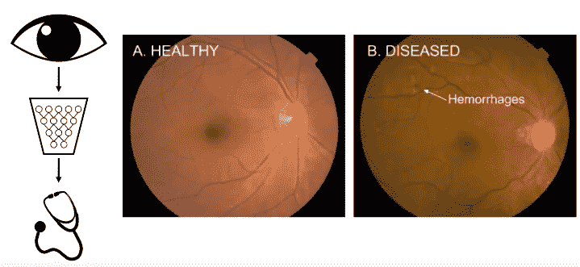

# CNN 系列第一部分:计算机是如何看到图像的？

> 原文：<https://medium.com/analytics-vidhya/cnn-series-part-1-how-do-computers-see-images-32462a0b33ca?source=collection_archive---------5----------------------->

在本文中，我们将了解计算机如何看待图像&在执行计算机视觉任务时面临的问题。我们将看到深度学习如何进入画面&如何利用神经网络的力量，我们可以建立一个强大的计算机视觉系统，能够解决非凡的问题。

深度学习如何改变计算机视觉的一个例子是*面部识别或面部检测。*在左上方，您可以看到人眼的图标，它以图像、像素、视频的形式直观地表示进入深度神经网络的视觉。&在底部的输出上，您可以看到人脸的描绘或人脸的检测，或者这也可以是识别不同的人脸或脸上的情绪以及关键的面部特征等。

现在深度学习已经特别改变了这个领域，因为这意味着这个人工智能的创造者不需要专门为面部检测定制算法，而是他们可以为这个算法提供大量的数据，并将这个结尾部分(左脸图标)与面部检测或许多其他类型的检测或识别类型进行交换，神经网络可以尝试并学习解决这项任务。

例如，我们可以用眼睛视网膜中的疾病检测来代替面部检测任务&类似的技术也可以应用于医疗保健中的疾病检测、分类等。

现在我们已经对一些计算机视觉任务有了很高的认识，我们人类每天都可以解决这些任务，我们也可以训练机器来为我们解决这些任务。所以下一个自然的问题是

***电脑怎么能看见？？具体来说，计算机是如何处理图像或视频的？他们如何处理来自这些图像的像素？***

> 对电脑来说，图像只是数字。

假设我们有一张*手写数字 8* 的图片，它是由像素&组成的，因为它是一张灰度图像，这些像素中的每一个都可以用一个数字来表示&现在 ***我们可以将我们的图像表示为一个二维数字矩阵，图像中的每一个像素对应一个数字，这就是计算机如何看到图像*** 。它看到一个二维数字矩阵。

图像只是数字

现在，如果我们有一个彩色图像，即 RGB 图像，而不是灰度图像，我们可以将这些二维图像中的 3 个连接或堆叠在一起，每个通道一个，即红色、绿色和蓝色，这就是 RGB。

现在，在你刚刚学习的基础上，我们可以应用两种常见的机器学习类型，即分类和回归。在回归中，我们取一个连续值&在分类中，我们的输出取一个标签。

所以让我们从分类开始，具体到图像分类，我们希望为每张图像预测一个标签。

例如，我们这里有一串手写的数字&我们想要建立一个分类管道来确定我们正在查看的这个图像中有哪个数字。输出该图像是那些手写数字中的每一个的概率。

> 为了正确地对这个图像进行分类，我们的管道需要能够理解&说出一张手写的 8 号 v/s 的图片有什么独特之处一张手写的 4 号的图片有什么独特之处。一张 7 岁的照片。它需要了解这些图像或特征的独特差异。

现在，从高层次上考虑这个图像分类管道的另一种方式是根据特定类别的特征*来考虑。*

> 特征是特定类别的特征。

让我们确定每个图像类别中的关键特征。

> 通过检测每一类中这些特征的类型来进行分类。您检测到足够多的这些特征，特别是针对该类，您可以非常自信地说您正在查看该类，即我们的模型需要知道这些特征是什么，并且它需要能够检测这些特征以生成预测。

解决这个问题的一个方法是利用你所在领域的知识。

手动特征提取

假设我们想要检测人脸，那么我们可以利用我们关于人脸的知识。我们可以先检测眼睛、鼻子、嘴巴、耳朵等。一旦我们有了检测管道，我们就可以开始检测这些特征，确定我们是否在看人脸。

现在这种方法有一个很大的问题，在初步检测管道中， ***我们如何检测那些耳朵、眼睛、鼻子、嘴巴？*** 而像这样的等级制度是我们的一种瓶颈。

请记住，图像只是数字的三维阵列。它们是亮度值的三维阵列&图像可以包含很多很多的变化，比如照明条件、背景混乱&还有组内和组间的变化。

我们需要对类内变化保持不变，对类间变化保持敏感

现在首先让我们理解我们所说的类内和类间变异是什么意思？**类内变异**可分为两种: **内在因素**和**成像条件。**在内在因素中，每个对象类别可以具有许多不同的对象实例，可能在颜色、纹理、材料、形状和大小中的一个或多个方面变化，例如“椅子”类别。在“椅子”类别的例子中，所有的图像都属于椅子类，但是椅子的外观有很多变化。我们的模型需要理解单个对象类中的所有这些变化。

“椅子”类别的不同实例。

**成像条件变化**是由**不受约束的环境**对物体外观的显著影响引起的，例如照明(黎明、白天、黄昏、室内)、物理位置、天气条件、摄像机、背景、照明、遮挡和观看距离。所有这些条件都会产生物体外观的显著变化，例如照明、姿态、比例、遮挡、杂乱、阴影、模糊和运动等

组内变异:同一类别的外观随着成像条件的变化而变化

相反，**类间变化**测量具有不同类标签的**图像**之间的**差异**。例如，在第一行， ***我们的模型需要能够区分玛丽莲·梦露&和玛丽莲·梦露*长得像的人。**

另一个例子可能是看起来相似但实际上来自四个不同对象类或四个不同品种的动物物种。

组间变异

而如果我们要建立一个健壮的模型来做这个图像分类任务，目标就是 ***最大化类间差异，最小化类内差异。*** 即每一个类中的人必须尽可能相似，不同组中的人必须尽可能不同。

***我们需要对类间(类间)的变异保持敏感，对单个类内的变异保持不变。*** *现在*由于图像数据中不可思议的不规则性，这些特征的检测在实践中是超级困难的，定义手动提取这些特征会非常成问题。那么我们如何解决这个问题呢？？？

一种方法是提取这些视觉特征，并以分层的方式同时检测它们在图像中的存在，为此我们可以使用神经网络。

我们是否可以直接从数据中而不是手工工程中学习一个**特征层次结构**？

> 我们的方法是直接从数据中学习视觉特征&学习这些特征的层次结构，这样我们就可以重建构成最终类标签的表示。鼻子或眼睛的特征(线条、曲线等)。

既然我们已经有了图像如何工作的基础，我们可以继续问自己如何用神经网络学习视觉特征？

在下一篇文章中，我们将看到神经网络如何允许我们使用卷积直接从视觉数据中学习那些特征&我们将理解卷积在卷积神经网络中扮演什么角色。

*快乐学习。(^_^)*