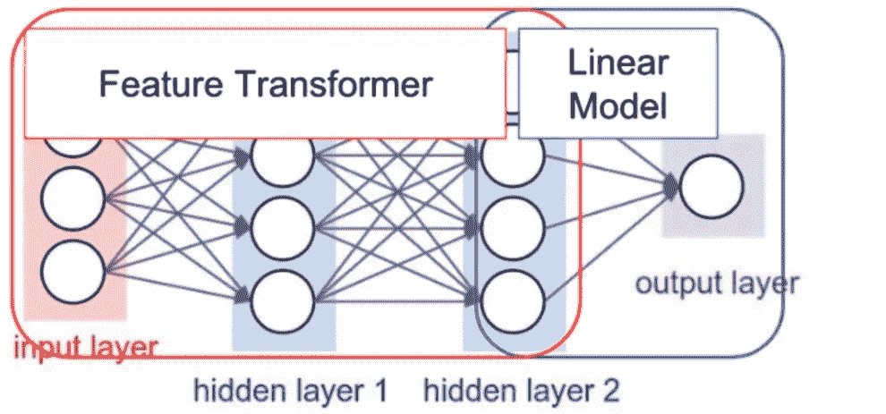
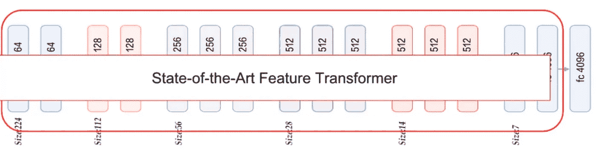
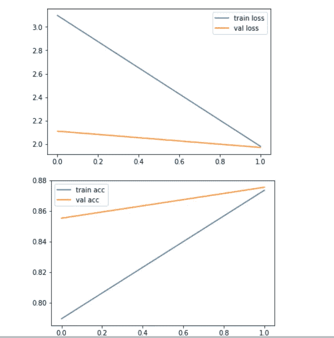

# 使用 Keras 的 VGG16 的 CNN 迁移学习

> 原文：<https://medium.com/analytics-vidhya/cnn-transfer-learning-with-vgg16-using-keras-b0226c0805bd?source=collection_archive---------9----------------------->

*如何使用 VGG-16 预训练 Imagenet 权重识别物体*


来源( [Unsplash](https://unsplash.com/?utm_source=medium&utm_medium=referral)

## **什么是迁移学习**

> 将从一项任务中学到的知识转移到另一项相关任务的认知行为。每当我们试图学习新技能时，我们人类天生就使用这一点。一些例子是

*   知道如何骑 cycle⮫学习如何骑摩托车。
*   知道如何骑摩托车⮫学习如何骑汽车。

同样的类比，它也适用于深度学习 CNN，其中我们可以使用来自预训练网络的学习/权重来预测或分类另一个数据集上的标签。

## **为什么要为 CNN 转学**

*   通常很少有人从零开始(随机初始化)训练卷积网络，因为很少能得到足够的数据集。因此，我们通常使用预先训练好的网络权重作为解决大部分问题的初始值。
*   训练非常深的网络是昂贵的。最复杂的模型需要数周时间，使用数百台配备昂贵 GPU 的机器进行训练。

幸运的是，我们有预先训练的模型，这些模型通常以数百万个参数/权重的形式共享，这些参数/权重是模型在被训练到稳定状态时获得的。

*   [VGG-16](https://www.kaggle.com/keras/vgg16/home)
*   [VGG-19](https://www.kaggle.com/keras/vgg19/home)
*   [盗梦空间 V3](https://arxiv.org/abs/1512.00567)
*   [异常](https://arxiv.org/abs/1610.02357)
*   [ResNet-50](https://www.kaggle.com/keras/resnet50/home)

## **迁移学习是如何工作的？**

让我们看看神经网络结构如何寻找任何模型

*   我们有第一个部分是特征转换器。
*   最后一部分是线性模型。



神经网络视角

现在，我们将了解如何使用 VGG-16 作为预训练模型来实现迁移学习并预测水果数据集的标签。



VGG 迁移学习

以下是实施迁移学习的步骤

*   加载在大数据集上训练的预训练 VGG-16 CNN 模型。
*   断开头部(冻结模型较低卷积层中的参数(权重))。
*   直到倒数第二层的所有东西都是最先进的特性转换器，可以直接使用。
*   在最先进的特征转换器上添加我们自己的自定义分类器，并对其进行训练。

## **Keras 实施**

我们将使用 kaggle 的 fruits-360 数据集来应用迁移学习和预测水果标签。([](https://www.kaggle.com/moltean/fruits)*)。*

*它被称为 fruit-360，因为它可以从各个视角拍摄水果图像。*

***1。装载 VGG-16 预训练模型***

*我们将在 VGG-16 上装载预先训练好的图像净重。*

```
*vgg**=**VGG16(include_top**=False**,weights**=**'imagenet',input_shape**=**(100,100,3))*
```

***2。冻结所有 VGG-16 层，只训练分类器***

```
*for layer in vgg.layers:
   layer.trainable = False
#Now we will be training only the classifiers (FC layers)*
```

***3。添加 Softmax 分类器***

*展平 vgg 下层输出，用 activation softmax 创建致密层。*

```
*x=Flatten()(vgg.output)
prediction=Dense(len(folders),activation='softmax')(x)
model=Model(inputs=vgg.input,outputs=prediction)*
```

***4。编译模型***

```
*model.compile(optimizer=’rmsprop’,loss=’categorical_crossentropy’,metrics=[‘accuracy’])*
```

***5。图像增强和预处理***

*图像增强是通过对图像应用随机变换来人为增加我们的模型看到的训练图像的数量。例如，我们可以随机旋转或裁剪图像，或者水平翻转它们。*

*我们有最后一个参数`preprocess_input`，它的意思是使你的图像符合模型要求的格式。它将按照 VGG-16 对图像进行预处理。*

```
*gen=ImageDataGenerator(rotation_range=20,width_shift_range=0.1,height_shift_range=0.1,shear_range=0.1,zoom_range=0.2,horizontal_flip=True,vertical_flip=True,preprocessing_function=preprocess_input)*
```

***6。拟合模型***

*我们将使用 Keras*flow _ from _ directory*方法创建训练和测试数据生成器，并将训练和验证目录作为输入。*

```
*batch_size = 32
train_generator = gen.flow_from_directory(
  train_path,
  target_size=IMAGE_SIZE,
  shuffle=True,
  batch_size=batch_size,
)
valid_generator = gen.flow_from_directory(
  valid_path,
  target_size=IMAGE_SIZE,
  shuffle=True,
  batch_size=batch_size,
)*
```

*然后用 fit_generator 方法拟合模型。*

```
*epochs=2# fit the model
r = model.fit_generator(
 train_generator,
 validation_data=valid_generator,
 epochs=epochs,
 steps_per_epoch=len(image_files) // batch_size,
 validation_steps=len(valid_image_files) // batch_size,
)*
```

***7。预测模型***

```
*STEP_SIZE_TEST=valid_generator.n//valid_generator.batch_size
valid_generator.reset()
pred=model.predict_generator(valid_generator,
steps=STEP_SIZE_TEST,
verbose=1)predicted_class_indices=np.argmax(pred,axis=1)*
```

*8。获取混淆矩阵*

*为了生成混淆矩阵，我们需要相同顺序的预测和实际标签。但是这里由于使用了 flow_from_directory，所以我们不确定它们的顺序。所以我们将创建自己的函数来获得混淆矩阵*

```
*image_files = glob(train_path + '/*/*.jp*g')
valid_image_files = glob(valid_path + '/*/*.jp*g')def get_confusion_matrix(data_path, N):
  # we need to see the data in the same order
  # for both predictions and targets
  print("Generating confusion matrix", N)
  predictions = []
  targets = []
  i = 0
  for x, y in gen.flow_from_directory(data_path, target_size=IMAGE_SIZE, shuffle=False, batch_size=batch_size * 2):
    i += 1
    if i % 50 == 0:
      print(i)
    p = model.predict(x)
    p = np.argmax(p, axis=1)
    y = np.argmax(y, axis=1)
    predictions = np.concatenate((predictions, p))
    targets = np.concatenate((targets, y))
    if len(targets) >= N:
      breakcm = confusion_matrix(targets, predictions)
return cmcm = get_confusion_matrix(train_path, len(image_files))
print(cm)
valid_cm = get_confusion_matrix(valid_path, len(valid_image_files))
print(valid_cm)*
```

**生成混淆矩阵* ***需要一些时间，所以要有耐心*** *！**

***9。绘图损失和精确度***

*我们将绘制验证和训练集的损失和准确性。*

```
*#loss
plt.plot(r.history['loss'], label='train loss')
plt.plot(r.history['val_loss'], label='val loss')
plt.legend()
plt.show()# accuracies
plt.plot(r.history['acc'], label='train acc')
plt.plot(r.history['val_acc'], label='val acc')
plt.legend()
plt.show()*
```

**

*损耗和精度图*

*我已经训练了 epochs=2 的模型，我们可以尝试用更多的数字来查看更多的变化和洞察力。*

*因此，我们能够使用 VGG-16 预训练权重从 fruits-360 数据集预测水果，准确率超过 85%。它可以通过更多次数的训练来进一步提高。*

## ***代码***

*([**https://github.com/jhanwarakhil/vgg16_transfer_learning**](https://github.com/jhanwarakhil/vgg16_transfer_learning)**)***

## *参考*

1.  *[https://www.kaggle.com/moltean/fruits](https://www.kaggle.com/moltean/fruits)*
2.  *[keras.io](http://keras.io/)*