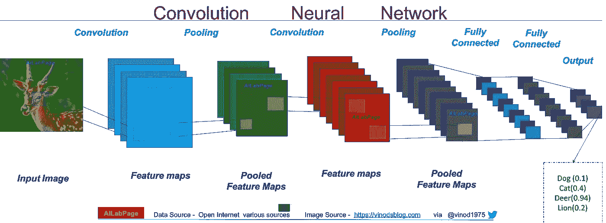
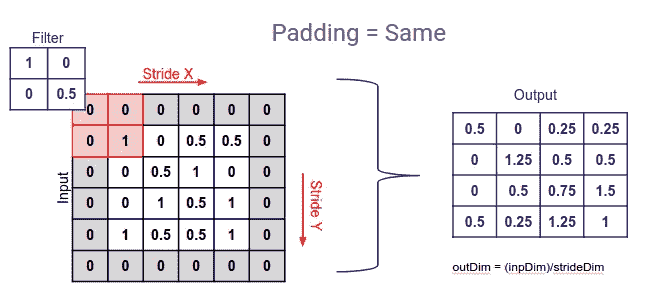
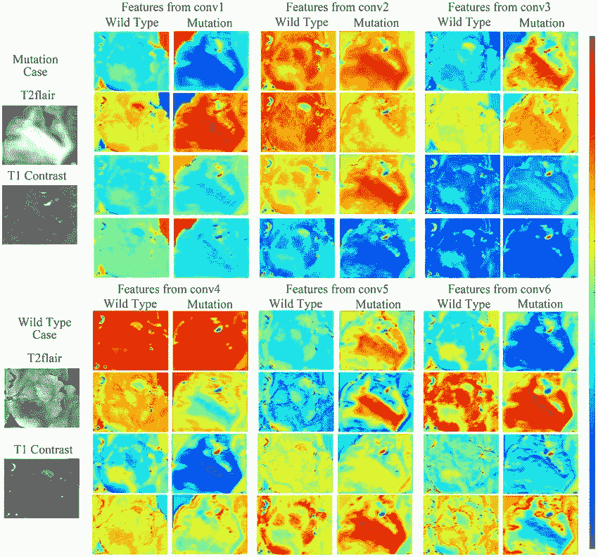
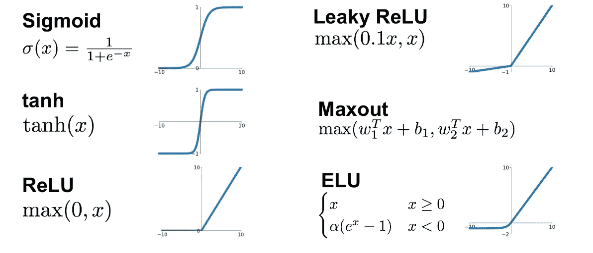
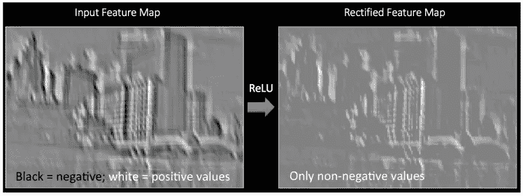
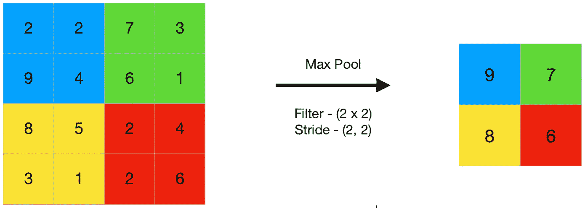

# CNN 与自定义数据集的功能。

> 原文：<https://medium.com/analytics-vidhya/cnn-with-custom-dataset-8cdd153f5c9e?source=collection_archive---------4----------------------->

你会在 Youtube 上找到许多关于 CNN 运作的文章和视频。写这篇文章背后的想法是改变常规，在现有信息的基础上分享一些额外的信息。
因此，在这个尝试中，解释了卷积神经网络在定制数据集上的功能。文章以问答的形式撰写，涵盖了所有相关的话题以及关于这个话题的常见问题。

你可以使用任何语言 Python 或 R，也可以使用任何库，如 Tensorflow、TFlearn 或 keras 等..只要你清楚这个概念，这其实并不重要。

**这篇文章的目的是教你如何使用 TFlearn 创建自己的数据并将 CNN 应用于这些数据，我在 Google Colab 上运行了这段代码。**

根据定义: ***TFlearn 是构建在 Tensorflow 之上的模块化、透明的深度学习库。它旨在为 TensorFlow 提供一个更高级别的 API，以促进和加速实验，同时保持完全透明并与之兼容。***

***问:为什么选择 CNN？***

**A.** CNN 是卷积神经网络，通常用于图像识别。实际好处是，参数越少，学习时间就越短，训练模型所需的数据量也就越少。CNN 不是一个由每个像素的权重组成的完全连接的网络，它只有足够的权重来查看一小块图像。

问:但是为什么要去定制数据呢？

**答:**MNIST 数据集中会有成千上万篇文章，但在这些预处理过的数据集中，你实际上不知道如何提取新图像并自己创建数据集，调整图像大小，对图像排序并给它们加标签。
安装 google_images_download 将自定义图片下载到我们的选择中。将此输入 cmd。

`! pip install google_images_download`

# 卷积神经网络



# CNN 层

这一层帮助我们检测图像中的特征。如第一幅图像所示，有一个 2*2 的过滤器以 1 的步幅移动。该滤波器与输入图像相乘以获得输出图像。



问:但是这些过滤器能做什么呢？
答:现在，每个过滤器实际上都是一个特征检测器。例如，在下图中，您可以看到每个过滤器检测不同的特征。为了更好地理解这一点，如果你的图像是一只“猫”，那么也许一个特征检测过滤器检测眼睛，另一个检测鼻子和耳朵等等…同样在下图中每个滤镜搜索并检测一个特征，我们得到一个特征图。最后，在使用不同的过滤器后，我们得到了一组特征图，这就是我们的卷积层。
至于如何理解特征检测过程，[吴恩达的这个](https://www.coursera.org/lecture/convolutional-neural-networks/edge-detection-example-4Trod)视频是你能找到的最好的。



**问:为什么把 ReLU 作为激活函数？答:我们选择 ReLU in 作为激活函数来增加非线性度。那么为什么是非线性的问题就出现了。
Well ReLU 为整流线性单元，定义为 *y = max(0，x)* 其中 *x* 为神经元的输入。**



图像本身是高度线性的，但是在卷积之后，线性降低了，为了增加图像的线性，我们使用 ReLU。你说的非线性是什么意思？当从一个像素过渡到另一个像素时，由于颜色、形状、边界和不同的元素，存在非线性。



这里我们有一个来自一个过滤器的特征图，它是黑白的，现在在应用 ReLU 后，我们只有非负值，即所有的黑色都被去除了。现在，从黑色区域到白色区域的特征图中的像素过渡是线性的，即首先是黑色，然后是深灰色，然后是灰色，然后是白色。但是在应用 ReLU 时，我们在颜色上有明显的对比，因此增加了非线性。

# 汇集层

池层用于查找矩阵中的最大值。通常采用的步幅是 2，通常的滤波器大小是 2。

**问:但是这个最大池有什么作用呢？
A.** 最大池化是为了在 a 池中获得最大值。现在这一步是在卷积层之后完成的，在卷积层中我们检测特征。因此，让我们举一个例子来更好地理解。如果图像是猫的，那么卷积层检测到的特征之一可能是眼睛，现在这些眼睛可以位于图像中的任何位置，一些图像可能只有猫的脸，一些可能有整个身体，一些可能是侧视图等等…但我们的 CNN 应该识别所有的“CATS”。因此，汇集所做的是，它有助于识别特征，即使它们略有失真。通过 2*2 滤波器，我们将尺寸和参数减少了 75%。因此，这防止了过度拟合。

问:它是如何达到处理特征失真的目的的？
A. 当滤镜以 2*2 的尺寸和 2 的步幅移动时。它扫描并从 2*2 的组中获取最大值，从而确保获取所有组的主要特征，并因此处理空间失真。只是一个直观的例子，数字 9 向我们展示了一只猫的耳朵，它位于第 2 行第 1 列，现在如果图像被扭曲，而 9 碰巧向上或向右移动，那么在合并后，我们仍然可以使用最大合并来恢复该特征。不要把这当作字面上的解释，而是作为一个直观的例子来理解池的概念。



对于好奇的人来说…
问:一个有趣的疑问是，为什么只采用最大池，而不采用任何其他类型的池，如平均池？答:请参考张秀坤·舍雷尔、安德烈亚斯·穆勒和斯文·本克的研究论文。它只是一篇 10 页的研究论文，深入解释了这个主题。
也可以访问[这个](https://cs.ryerson.ca/~aharley/vis/conv/flat.html)网站，体验 CNN 功能的乐趣。

代码:

```
**import** **tflearn
from** **tflearn.layers.core** **import** input_data, fully_connected, dropout **from** **tflearn.layers.conv** **import** conv_2d,max_pool_2d **from** **tflearn.layers.estimator** **import** regression **import** **numpy** **as** **np** **import** **matplotlib.pyplot** **as** **plt** 
**import** **cv2** 
**import** **os** 
**from** **random** **import** shuffle 
***from google_images_download import*** *google_images_download* 
**from** **PIL** **import** Image
```

**此处:**
**关键词:**需要下载图片的对象名称。
**限制:**您想一次下载的图片数量。
**:Print _ URLs:**打印所有正在下载的图片的网址。

这里的限制是 100，我们得到了 94 个图像，因为有些图像会被破坏。参考[本页](https://google-images-download.readthedocs.io/en/latest/examples.html#)以更好地了解各种参数和示例。

```
*# getting random images of* Forest Fire *and* Natural Vegetation *in*
response  = google_images_download.googleimagesdownload()
arguments = {"keywords":"Forest Fire,Natural Vegetation","limit":100,"print_urls":**False**}

path = response.download(arguments)
print(path)

*# got 94 images of forest_fire and 94 images of natural vegetation*
```

上述代码确保下载的图像不会被破坏。如果没有这一点，以后在调整图像大小和转换图像时会产生很多问题。

```
*# removing corrupted images*

FOREST_FIRE_DIR = '/content/downloads/Forest Fire'
NATURAL_VEG_DIR = '/content/downloads/Natural Vegetation'

url_list = [FOREST_FIRE_DIR,NATURAL_VEG_DIR]
**for** i **in** url_list :

  **for** image **in** os.listdir(i):

    **try**:
      **with** Image.open(i+"/"+image) **as** im :
        **pass**

    **except**:
      print(i+"/"+image)
      os.remove(i+"/"+image)
```

现在，我们重命名现有的图像。这样做是为了给两组图像添加标签，我们将使用 CNN 对这两组图像进行分类。稍后将解释标签部分。

```
*# renaming the files*
**for** i **in** url_list:

  **for** num , image **in** enumerate(os.listdir(i)):

    **if** i == '/content/downloads/Forest Fire':
      os.rename(i+"/"+image,i+"/"+"forest_fire."+str(num)+".jpg")
    **else**:
      os.rename(i+"/"+image,i+"/"+"natural_veg."+str(num)+".jpg")
```

如果你没有使用 Google Colab，你可以跳过这几行代码。Google colab 创建的检查点经常会带来问题，通过这段代码，问题得到了解决。

```
*# removing corrupted images*  
FOREST_FIRE_DIR = '/content/downloads/Forest Fire' 
NATURAL_VEG_DIR = '/content/downloads/Natural Vegetation' url_list = [FOREST_FIRE_DIR,NATURAL_VEG_DIR]
**for** i **in** url_list :

  **for** image **in** os.listdir(i):

    **try**:
      **with** Image.open(i+"/"+image) **as** im :
        *# print(i+"/"+image)*
        **pass**

    **except**:
      print(i+"/"+image)
      **if** image == '.ipynb_checkpoints':
        **pass**
      **else**:
        os.remove(i+"/"+image)*# getting the count of the no of images available under each category* 

print("forest fire image count: "+ str(len([x **for** x **in** os.listdir(FOREST_FIRE_DIR)])))

print("natural vegetation image count: "+ str(len([x **for** x **in** os.listdir(NATURAL_VEG_DIR)])))
```

如果图像的名称以 forest_fire else [0，1]开头，则将图像标记为[1，0]。在这里，图像的早期重命名很有帮助。

```
**from** **tqdm** **import** tqdm

**def** label_img(img):

  word_label = img.split('.')[0]
  **if** word_label == "forest_fire":
    **return** [1,0]

  **else**:
    **return** [0,1]
```

我们现在需要一个训练集，并从现有的数据集中进行测试。我将分析这几行代码中发生了什么。
两组步骤相同。

1.从文件中读取图像:

> train_url = [TRAIN_DIR_Fire，TRAIN _ DIR _ Nature]
> **for**I**in**TRAIN _ URL:
> **for**image**in**tqdm(OS . listdir(I)):
> label = label _ img(image)
> path = OS . path . join(I，image)

2.在这里，我们读取图像并将其调整到图像大小，这个图像大小将在以后定义。
3。然后图像和标签都被一个接一个地添加到 numpy 数组中
4。你的数据被打乱以改变图像的顺序

> **else**:
> image = cv2 . resize(cv2 . im read(path)，(IMG_SIZE，IMG _ SIZE))
> training_data . append([NP . array(image)，NP . array(label)])
> shuffle(training _ data)
> NP . save(' training _ data . npy '，training _ data)

```
**'''TRAIN SET '''
def** create_train_set(): 
  training_data = []
  TRAIN_DIR_Fire = '/content/downloads/Forest Fire'
  TRAIN_DIR_Nature = '/content/downloads/Natural Vegetation'

  train_url = [TRAIN_DIR_Fire,TRAIN_DIR_Nature]
  **for** i **in** train_url:
    **for** image **in** tqdm(os.listdir(i)):
      label = label_img(image)
      path  = os.path.join(i,image)
      **if** path **in** ["/content/downloads_img/ForestFire/.ipynb_checkpoints"]:      
        **pass** **else**:

        image = cv2.resize(cv2.imread(path),(IMG_SIZE,IMG_SIZE))

        training_data.append([ np.array(image),np.array(label)])

  shuffle(training_data)
  np.save('training_data.npy',training_data)
  **return** training_data**'''TEST SET'''****def** create_test_set():
  testing_data = []
  TEST_DIR_Fire = '/content/test/Forest_Fire'
  TEST_DIR_Nature = '/content/test/Natural_Vegetation'
  test_url = [TEST_DIR_Fire,TEST_DIR_Nature]
  **for** i **in** test_url:

    **for** image **in** tqdm(os.listdir(i)):
      label = label_img(image)
      path  = os.path.join(i,image)
      **if** path **in** ["/content/downloads_img/Forest Fire/.ipynb_checkpoints"]:

        **pass**
      **else**:

        image = cv2.resize(cv2.imread(path),(IMG_SIZE,IMG_SIZE))
        testing_data.append([ np.array(image),np.array(label)])

  np.save('testing_data.npy',testing_data)
  **return** testing_data
```

在这里，我们声明图像的大小，学习速度和纪元的数量，请随意试验。我们现在创建训练和测试集。

本文之所以关注自定义数据集，是因为在大多数例子中，CNN 是在 MNIST 或时尚 MNIST 数据集上完成的。问题在于，我们到目前为止所做的所有上述预处理都已经完成并为我们准备好了，我们没有任何知识来处理现实生活中的项目。在现实生活项目中，我们需要:提取自定义数据
2。清理图像，并将不同的图像分离到文件夹中。
3。然后调整大小并重命名
4。标记图像
5。将图像转换为 Numpy 数组的。

所有这些步骤都是在现有的数据集中完成的。

```
IMG_SIZE = 50
learning_rate = 1e-3
N_EPOCH = 5

MODEL_NAME = "fireVSnature-**{}**-**{}**-**{}**.model".format(learning_rate,'6-conv-basic',N_EPOCH)*train_data = create_train_set()
test_data = create_test_set()*
```

在这段代码中，我们使用 tflearn 构建了 CNN。我们有 2 个卷积和最大池层，其中 2 个是全连接层，使用的优化器是“adam”，分类的度量是“准确性”。

```
convnet = input_data([**None**,IMG_SIZE,IMG_SIZE,3],name='inputs')

convnet = conv_2d(convnet,64,3,activation='relu')
convent = max_pool_2d(convnet,2)

convnet = conv_2d(convnet,32,3,activation='relu')
convent = max_pool_2d(convnet,2)

convnet = fully_connected(convnet,512,activation='relu')

convnet = fully_connected(convnet,2,activation='sigmoid')
convnet = regression(convnet,optimizer='adam',name='targets',learning_rate=learning_rate,loss='binary_crossentropy',metric = 'accuracy')model = tflearn.DNN(convnet,tensorboard_dir='log')
```

从测试和训练数据中获取图像和标签。

```
*X = np.array( [ i[0] for i in train_data ])*
*y = np.array([i[1] for i in train_data])*

*test_X = np.array( [ i[0] for i in test_data ])*
*test_y = np.array([i[1] for i in test_data])*
```

拟合模型。

```
model.fit({'inputs':X},{'targets':y},n_epoch=3,validation_set=({'inputs':test_X},'targets':test_y}),show_metric=**True**,snapshot_step=10,run_id=MODEL_NAME,batch_size=10)
model.save(MODEL_NAME)
```

预测分类和可视化结果。如果你有像我一样少的图片数(少于 100 张)，那么你的准确度不会很高。

```
%matplotlib inline
fig = plt.figure(figsize=(10,6))
**import** **matplotlib.image** **as** **mpimg****for** num, image **in** enumerate(test_data):
  *# image = mpimg.imread(image)*
  y_plot = fig.add_subplot(3,6,num+1)
  model_out = model.predict([image[0]])[0][0]
  *# print(model_out)* **if**  model_out == 1:
    label = "FOREST_FIRE"
  **else**:
    label="NATURAL_VEG" y_plot.imshow(image[0])
  plt.title(label)
  y_plot.axis('off')plt.show()
```

用于检查完整的代码。参见[这](https://github.com/AjayJohnAlex/ANN/blob/master/tf_learn_custom_images_CNN.ipynb)页。

如果对这篇文章有任何疑问，请在评论区添加。我很乐意尽快回答他们。我也会相应地对文章进行充分的修改。