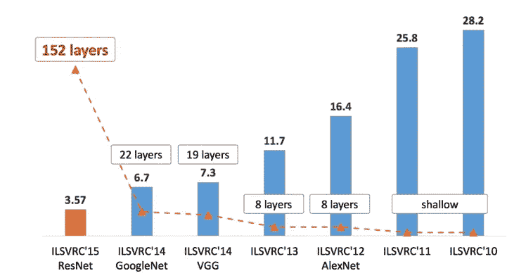
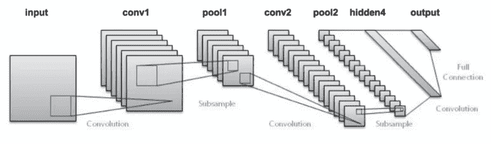
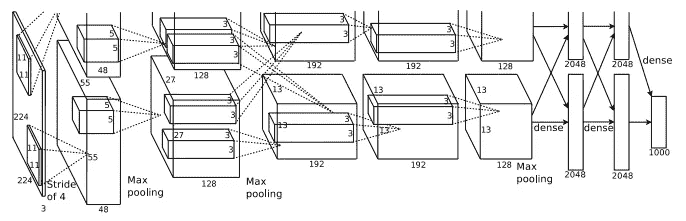
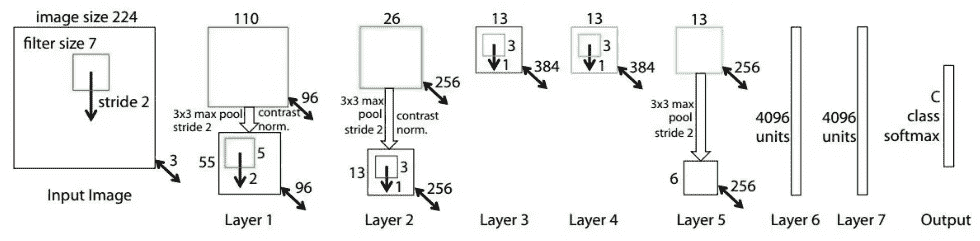
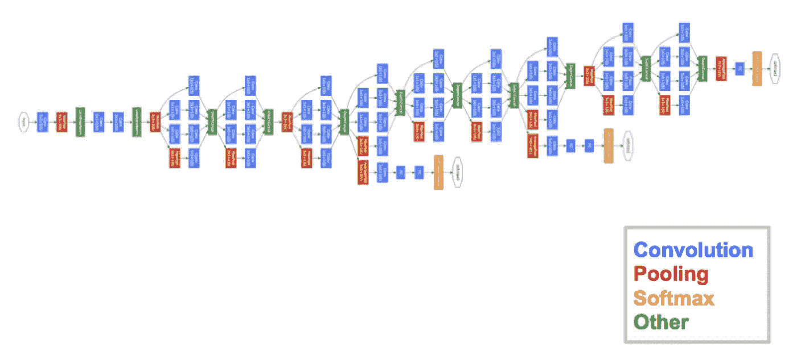
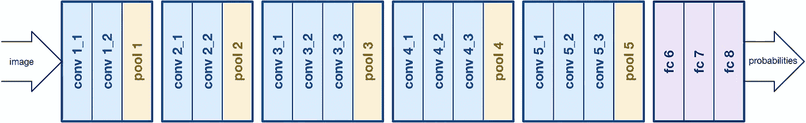
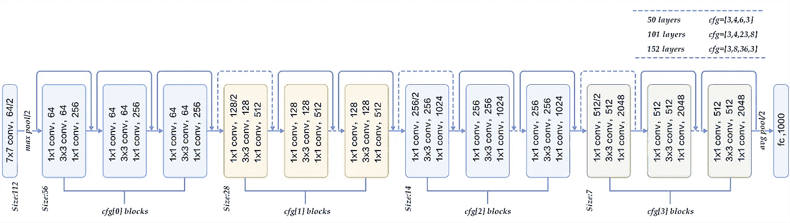
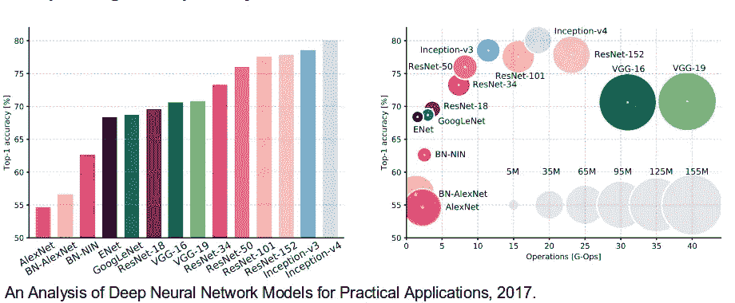
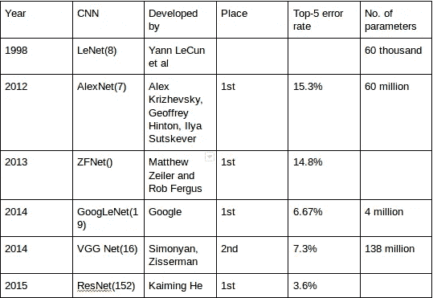

# CNN 架构:LeNet，AlexNet，VGG，GoogLeNet，ResNet 等等…

> 原文：<https://medium.com/analytics-vidhya/cnns-architectures-lenet-alexnet-vgg-googlenet-resnet-and-more-666091488df5?source=collection_archive---------0----------------------->

**卷积神经网络** ( **CNN** ，或 **ConvNet** )是一种特殊的多层神经网络，旨在通过最少的预处理直接从像素图像中识别视觉模式..ImageNet 项目是一个大型视觉数据库，设计用于视觉对象识别软件研究。ImageNet 项目举办了一年一度的软件竞赛，即 **ImageNet 大规模视觉识别挑战赛(**[**ils vrc**](https://en.wikipedia.org/wiki/ImageNet#ImageNet_Challenge)**)**，软件程序在比赛中竞争正确分类和检测对象和场景。这里我将谈谈 ILSVRC 主要竞争对手的 CNN 架构。

# LeNet-5 (1998 年)

LeNet-5 是 LeCun 等人在 1998 年开发的一种 7 级卷积网络，用于对数字进行分类，被几家银行用于识别以 32×32 像素灰度输入图像数字化的支票上的手写数字。处理更高分辨率图像的能力需要更大和更多的卷积层，因此该技术受到计算资源可用性的限制。

# AlexNet (2012 年)

在 2012 年， [AlexNet](https://papers.nips.cc/paper/4824-imagenet-classification-with-deep-convolutional-neural-networks.pdf) 显著超越了所有之前的竞争对手，通过将前 5 名的误差从 26%降至 15.3%赢得了挑战。排在第二位的前 5 名错误率，不是 CNN 的变化，大约是 26.2%。

该网络的架构与 Yann LeCun 等人的 LeNet 非常相似，但更深入，每层有更多的滤波器，并有堆叠的卷积层。它包括 11x11、5x5、3x3、卷积、最大池化、丢弃、数据扩充、ReLU 激活、带动量的 SGD。它在每个卷积和全连接层之后附加 ReLU 激活。AlexNet 在两个 Nvidia Geforce GTX 580 GPU 上同时接受了 6 天的训练，这就是为什么他们的网络分成两个管道的原因。AlexNet 由监督小组设计，该小组由 Alex Krizhevsky、Geoffrey Hinton 和 Ilya Sutskever 组成。

# ZFNet(2013 年)

毫不奇怪，ILSVRC 2013 年的获奖者也是 CNN，后来被称为 ZFNet。它实现了 14.8%的前 5 名错误率，现在已经是前面提到的非神经错误率的一半。这主要是通过调整 AlexNet 的超级参数，同时保持与本文前面讨论的额外深度学习元素相同的结构来实现的。

# GoogLeNet/Inception(2014 年)

ILSVRC 2014 竞赛的获胜者是来自谷歌的 GoogLeNet(又名 Inception V1)。取得了 6.67%的前 5 名错误率！这非常接近人类水平的表现，挑战的组织者现在被迫评估。事实证明，这实际上很难做到，需要一些人工训练才能击败谷歌的准确性。经过几天的训练，人类专家(Andrej Karpathy)能够实现 5.1%(单个模型)和 3.6%(整体)的前 5 名错误率。该网络使用了受 LeNet 启发的 CNN，但实现了一个被称为 inception 模块的新颖元素。它使用批量标准化，图像失真和 RMSprop。该模块基于几个非常小的卷积，以便大大减少参数的数量。他们的架构由 22 层深度 CNN 组成，但将参数数量从 6000 万(AlexNet)减少到 400 万。

# VGGNet (2014 年)

ILSVRC 2014 竞赛的亚军被社区称为 VGGNet，由 Simonyan 和 Zisserman 开发。VGGNet 由 16 个卷积层组成，由于其非常统一的架构而非常吸引人。类似 AlexNet，只有 3x3 的卷积，但是很多滤镜。在 4 个 GPU 上训练 2-3 周。它是当前社区中从图像中提取特征的最优选选择。VGGNet 的权重配置是公开可用的，并且已经在许多其他应用和挑战中用作基线特征提取器。然而，VGGNet 包含 1.38 亿个参数，处理起来可能有点困难。

# ResNet(2015 年)

最后，在 ILSVRC 2015 上，由何等人提出的所谓残差神经网络(ResNet)介绍了一种具有“跳过连接”的新架构，其特点是大量的批处理规范化。这种跳跃连接也被称为门控单元或门控循环单元，并且与最近在 RNNs 中应用的成功元素非常相似。由于这种技术，他们能够训练 152 层的神经网络，同时仍然具有比 VGGNet 更低的复杂性。它实现了 3.57%的前 5 名错误率，在这个数据集上击败了人类水平的性能。

AlexNet 具有在具有交叉连接的两个 GPU 上训练的并行的两条 CNN 线路，GoogleNet 具有初始模块，ResNet 具有剩余连接。

**汇总表**

*如果我说错了，如果你想让我补充什么，请评论指正:)*