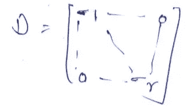

# 共生矩阵和奇异值分解

> 原文：<https://medium.com/analytics-vidhya/co-occurrence-matrix-singular-value-decomposition-svd-31b3d3deb305?source=collection_archive---------1----------------------->

# 什么是单词嵌入？

单词嵌入是转换成数字的文本。同一文本可能有不同的数字表示。

# **为什么我们需要单词嵌入？**

许多机器学习算法和几乎所有深度学习架构都无法处理原始形式的*字符串*或*纯文本*。它们需要数字作为输入来执行任何种类的工作，无论是分类、回归等等。广义而言。

# **单词嵌入有哪些不同的类型？**

不同类型的单词嵌入可以大致分为两类

## **基于频率的嵌入**

在这一类别下，我们通常会遇到三种类型的向量:计数向量、TF-IDF 向量、具有固定上下文窗口的共生矩阵。

## **基于预测的嵌入**

在这一类别下，我们通常会遇到两种类型的向量:连续单词包(CBOW)和跳格。

在本文中，我们将关注具有固定上下文窗口的共现矩阵(一种基于频率的技术)。

在深入研究具有固定上下文窗口的共现矩阵之前，让我们讨论另外两种基于频率的技术的缺点。

Count Vector 和 TF-IDF 不捕获语义中的位置、文档中的共现等。

# **具有固定上下文窗口的共生矩阵**

**大意** —相似的单词往往会一起出现，并且会有相似的上下文，例如——苹果是一种水果。芒果是一种水果。

苹果和芒果往往有一个相似的上下文，即水果。

*   共现-对于给定的语料库，一对词如 w1 和 w2 的共现是它们在上下文窗口中一起出现的次数。
*   上下文窗口-上下文窗口由数字和方向指定。

**如何形成共生矩阵:**

*   矩阵 A 存储单词的共现。
*   在这种方法中，我们计算每个单词在感兴趣的单词周围的特定大小的窗口中出现的次数。
*   计算语料库中所有单词的数量。

让我们借助一个例子来理解这一切。

让我们的语料库包含以下三个句子:

1.  我喜欢飞行
2.  我喜欢 NLP
3.  我喜欢深度学习

设窗口大小=1。这意味着每个单词的上下文单词都是一个单词在左边，一个单词在右边。上下文单词:

*   我=享受(1 次)，喜欢(2 次)
*   享受=我(1 次)，飞行(2 次)
*   飞行=享受(1 次)
*   like = I(2 次)，NLP(1 次)，deep(1 次)
*   NLP =喜欢(1 次)
*   深=喜欢(1 次)，学习(1 次)
*   学习=深入(1 次)

因此，具有固定窗口大小 1 的结果共生矩阵 A 看起来像:

共生矩阵 A

**问题** —对于一个巨大的语料库，这个共现矩阵可能会变得非常复杂(高维)。

**解** —奇异值分解(SVD)和主成分分析(PCA)是两种特征值方法，用于将高维数据集降维，同时保留重要信息。

# 矩阵的奇异值

设 A 是一个 m*m 矩阵。乘积 Aᵀ A 是对称矩阵。

因此，Aᵀ A 具有 n 个线性独立的特征向量 v₁ ,v₂…vₙ和实特征值λ₁、λ₂… λₙ。

我们知道 Aᵀ A 的特征值也全部是非负的。

设λ是具有相应特征向量 v 的 Aᵀ A 的特征值。那么，

将特征向量标为 v₁ ,v₂…vₙ，使得λ₁ ≥λ₂ ≥… λₙ.让σᵢ= **√** λᵢ.

因此，σ₁ ≥σ₂ ≥… σₙ ≥0。σ₁和σ₂,… σₙ这两个数称为矩阵 a 的奇异值

# 奇异值分解

设 A 是一个 m*n 矩阵。那么存在一个 A 的因式分解，

其中 U 是 m*m 正交矩阵，V 是 n*n 正交矩阵，σ是以下形式的 m*n 矩阵:

其中σ₁ ≥σ₂ ≥… σₙ ≥0

对于 r ≤m，n

任何这样的因式分解称为矩阵 a 的奇异值分解。矩阵 U 和 V 不是唯一的。然而，σ是唯一的。d 对角线上的元素，即σ₁、σ₂,… σₙ是 a 的非零奇异值，u 的列称为 a 的左奇异向量，v 的列称为 a 的右奇异向量

你可以在这里找到 SVD [的例子](https://github.com/AparGarg99/NLP_BU_6thSem/blob/master/Lab%202/SVD__examples.pdf)。

# 对共生矩阵 X 应用奇异值分解

这里，x、u、σ和 Vᵀ的维数是|V|*|V|。

通过选择前 k 个奇异特征来降低维数。

现在，

*   X 的维数是|V|*|V|。
*   U 的维数是|V|*k。
*   σ的维数是 k*k。
*   Vᵀ的维数是 k*|V|。

让我们通过前面的例子来理解这一点。我们有 7*7 维的共生矩阵 A。最初，在分解之后，u，σ和 Vᵀ的维数也是 7*7。

矩阵 U(在选择 k 个奇异特征之前)

现在在通过选择前 k 个奇异特征来降低维数之后，

*   A 的维数是 7*7。
*   U 的维数是 7*3。
*   σ的维数是 3*3。
*   Vᵀ的面积是 3*7。

矩阵 U(在选择 k 个奇异特征之后)

# **共生矩阵的优势**

1.  它保留了单词之间的语义关系。也就是说，男人和女人比男人和苹果更亲近。
2.  它在其核心使用 SVD，这产生了比现有方法更精确的单词向量表示。
3.  它使用因式分解，因式分解是一个定义明确的问题，可以有效地解决。
4.  它只需计算一次，一旦计算出来就可以随时使用。从这个意义上说，它比其他的要快。

# **共生矩阵的缺点**

1.  它需要巨大的内存来存储共生矩阵。
    但是，这个问题可以通过在系统外分解矩阵来解决，例如在 Hadoop 集群等中。并且可以被保存。

# 奇异值分解方法的问题

1.  矩阵的维度经常变化(新词的添加非常频繁，语料库的大小也在变化)。
2.  矩阵非常稀疏，因为大多数单词不同时出现。
3.  矩阵通常是非常高维的(106 *106)
4.  训练的二次成本(即执行奇异值分解)
5.  需要在 X 上加入一些 hacks 来解决词频的严重不平衡

你可以在这里找到共生矩阵和奇异值分解[的实现。](https://github.com/AparGarg99/NLP_BU_6thSem/blob/master/Lab%202/English_Code.ipynb)