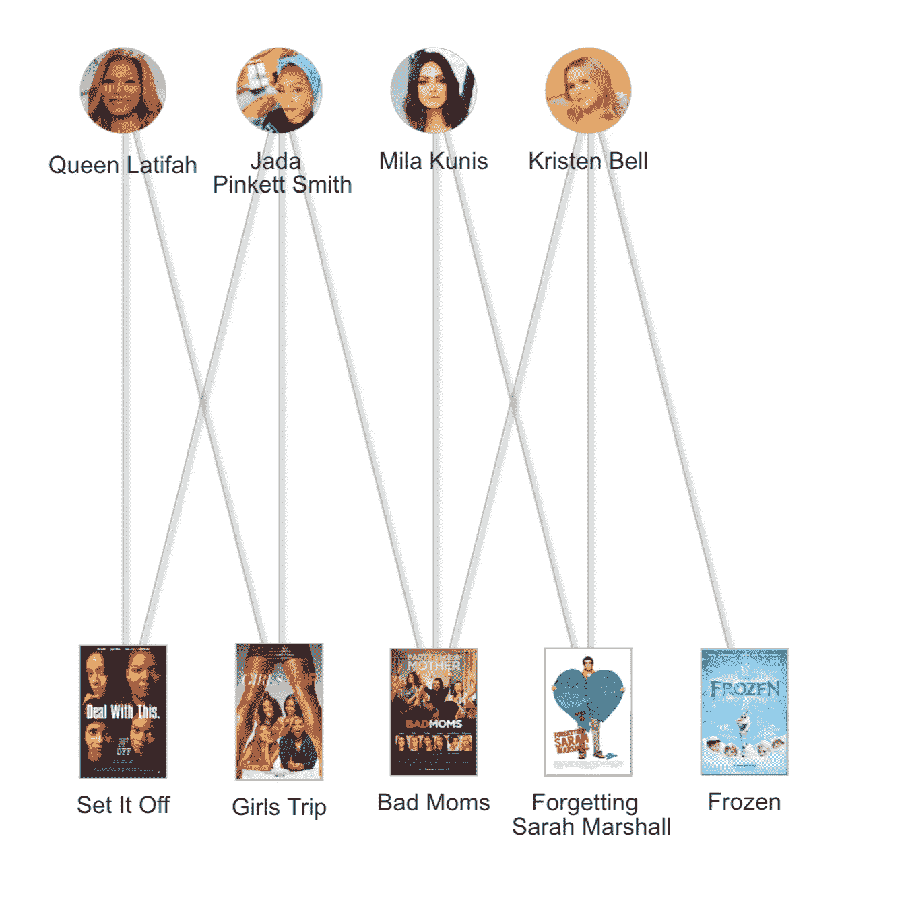

# plotly 共现网络

> 原文：<https://medium.com/analytics-vidhya/co-occurrence-networks-in-r-with-plotly-1d4354c463a4?source=collection_archive---------25----------------------->


Ahmet Yal nkaya 在 [Unsplash](https://unsplash.com/s/photos/movies?utm_source=unsplash&utm_medium=referral&utm_content=creditCopyText) 上拍摄的照片。

回到 IMDb 存在之前的日子(*我们是如何生活的？*)，以前人们玩电影琐事游戏。这些游戏中最著名的是凯文·贝肯六度。如果你不熟悉，这是一个游戏，你试图找到任何演员和凯文·贝肯之间最短的联系。

让我们来看一个不可思议的米拉·乔沃维奇的例子:米拉和威尔·法瑞尔一起出演了《超级名模 2》。威尔·法瑞尔和约翰·利特高一起参加竞选，约翰·利特高和凯文·贝肯一起自由自在。那是三个步骤。你能打败它吗？

但是假设你想对这个游戏变得真正严肃。你不想猜测最短的连接，你需要知道它。嗯，如果你能构建一个所有电影和主演这些电影的所有演员的网络，那么你就能找到两个演员之间所有可能的最短路径。让我们用一个由一些非常有才华的女性组成的非常小的网络来尝试一下。我们将首先创建一个电影/演员关系的二分网络，然后使用二分网络的单模投影来可视化显示演员之间直接联系的同现网络。

# 演员和他们主演的电影

二分网络是两种不同节点类型之间的关系或边的图形表示。为了检查演员和他们出演的电影之间的联系，一个节点类将代表演员，另一个节点类将代表他们主演的电影。对于一个二分网络来说，一条边只能在演员和电影之间运行，而不能从电影到电影或者从演员到演员。让我们从关联矩阵 ***I*** 生成一个图来表示一个二分网络。 ***I*** 中的每一行代表一部电影，每一列代表一个演员。

[**代码沿着**](https://github.com/thatdarndata/BlogPosts/tree/master/SixDegrees) **进行交互图形。你可以通过点击和拖动来移动节点！**

```
library(igraph) 
library(visNetwork) # Incident matrix to represent bipartite graph. 
# Columns are actresses and rows are movies. 
# 1: actress is in movie; 0: not in movie. 
I <- matrix(c(1, 1, 0, 0, 0, 1, 1, 1, 
              0, 0, 0, 0, 1, 1, 0, 0, 
              0, 1, 1, 1), 
              nrow = 5) # Name distinct node classes. 
colnames(I) <- c("Queen Latifah", 
                 "Jada \n Pinkett Smith", 
                 "Mila Kunis", "Kristen Bell") 
rownames(I) <- c("Set It Off", "Girls Trip", 
                 "Bad Moms", "Forgetting \n Sarah Marshall", 
                 "Frozen")# Converting incident matrix to visNetwork object. 
net <- toVisNetworkData(graph_from_incidence_matrix(I)) # Use images in nodes. 
pathname <- "https://raw.githubusercontent.com/thatdarndata/BlogPosts/master/Graphs/Pics/" 
net$nodes$image <- paste0(pathname, 0:8, ".png") 
net$nodes$shape <- c(rep("image", 5), 
                     rep("circularImage", 4)) # Plot. 
visNetwork(nodes = net$nodes, edges = net$edges) %>%           visIgraphLayout(layout = "layout_as_bipartite") %>% visNodes(shapeProperties = list(useBorderWithImage = TRUE), 
         color = list(border = "BDBDBD", background = "BDBDBD",   highlight = "BDBDBD")) %>% 
visEdges(shadow = TRUE, color = list(color = "BDBDBD", highlight = "3D3D3D")) %>% 
visOptions(highlightNearest = list(enabled = T, hover = T),    nodesIdSelection = T)
```



双边演员电影网络。

# 演员与演员的关系

现在，为了查看节点类中的关系*，我们可以使用二分网络的单模投影。例如，这将允许我们想象贾达·萍克特·史密斯和米拉·库妮丝一起出现在多少部电影中。在单模投影中，如果两个演员节点一起出演一部或多部电影，它们将有一条连接它们的边。数学上，这可以用矩阵来表示， ***P*** ，其中 ***P = (I^T)I*** 。*

矩阵 ***P*** 的对角线代表每个演员主演的电影总数。非对角线代表每个演员对共享的共同电影的数量。我们现在将绘制单模投影，其中节点大小取决于每个演员主演的电影总数，边由每个演员对出演的电影数加权。

```
# Calculate weighted one-mode projection. 
P <- t(I) %*% I # Convert to visnetwork object. 
projNet <- toVisNetworkData(graph_from_adjacency_matrix(P, weighted = TRUE, diag = FALSE, mode = 'undirected')) # Add weights according to edge strength and node size according to diagonals. 
projNet$edges$width <- projNet$edges$weight * 2 
projNet$nodes$size <- diag(P) * 10 # Use images in nodes. 
projNet$nodes$image <- paste0(pathname, 5:8, ".png") projNet$nodes$shape <- "circularImage" # Plot. 
visNetwork(nodes = projNet$nodes, edges = projNet$edges) %>% 
      visNodes(shapeProperties = list(useBorderWithImage = TRUE), 
      color = list(border = "BDBDBD", background = "BDBDBD", 
      highlight = "BDBDBD")) %>% 
visEdges(color = list(color = "BDBDBD", highlight = "3D3D3D"))
```


我们的天才喜剧演员的单模式投影网络，或共现网络。

从图表中我们可以看到，贾达和克里斯汀出演的电影比米拉和奎恩·拉提法多(仅考虑二分网络，而不是他们的实际电影记录)。我们还可以看到，奎恩·拉提法只和贾达一起出演了一部电影，而没有和克里斯汀或米拉一起。也许一个坏妈妈客串女孩之旅 2 可以解决这个问题？！Jada 拥有最多的连接数，因为她与网络中的每个人都有联系。然而，根据边缘权重，我们可以看到贾达与奎恩·拉提法一起主演的电影比米拉或克里斯汀更多。另一方面，克里斯汀和米拉一起出演的电影比贾达多。

现在我们已经从一个小例子开始，[你能扩展这个网络以包括更多的电影和演员吗？爆笑的凯瑟琳·哈恩怎么样？](https://github.com/thatdarndata/BlogPosts/tree/master/SixDegrees)

请务必关注更多类似的文章！

*原载于 2020 年 5 月 21 日 https://thatdarndata.com**T21*[。](https://thatdarndata.com/6-degrees-of-talented-ladies/)