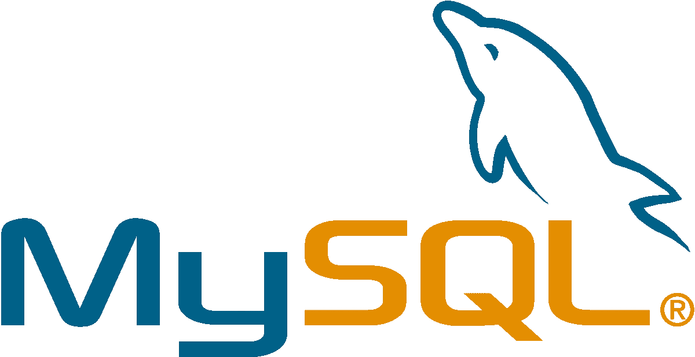
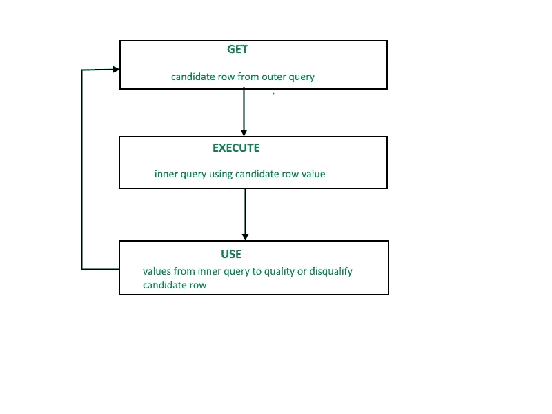
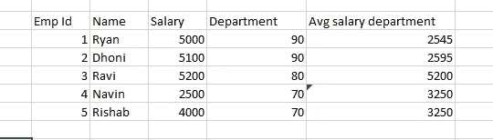
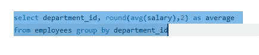
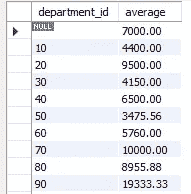
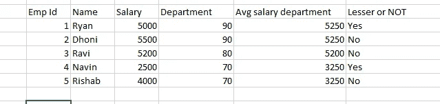
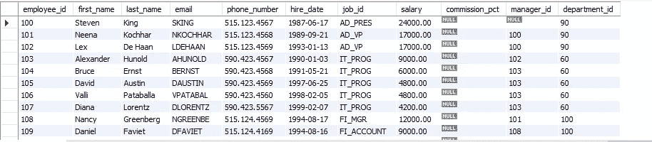
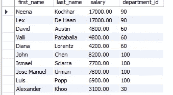
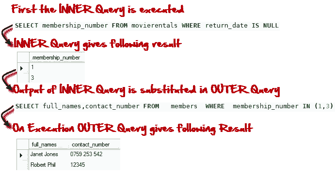

# Co 相关的子查询

> 原文：<https://medium.com/analytics-vidhya/co-related-sub-queries-7d2c872d2341?source=collection_archive---------9----------------------->

在 SQL 中，最令人困惑的话题是—子查询和 co 相关子查询之间的区别。这是因为在大多数情况下，我们尽量避免使用 co-related 子查询，因为这种东西太慢，占用内存太多。

在本文中，我们将了解为什么使用相关子查询，以及它与自连接之间的区别(这通常类似于自连接，但它不是)

什么是相关子查询:

> 根据维基百科，相关子查询(也称为同步子查询)是一个子查询(嵌套在另一个查询中的查询)，它使用来自外部查询的值。因为子查询可能对外部查询处理的每一行计算一次，所以它可能会很慢 [*。*](https://en.wikipedia.org/wiki/Correlated_subquery)
> 
> 根据 W3schools，SQL 相关子查询用于从外部查询中引用的表中选择数据。子查询被称为相关子查询，因为子查询与外部查询相关。在这种类型的查询中，必须使用表别名(也称为相关名)来指定要使用哪个表引用。

虽然这看起来像教科书上的东西，但他们在这里说的是——有两个查询内部和外部，内部查询完全依赖于外部查询。

演职员表:极客的极客

**什么是内外查询:**

*   子查询也称为**内部查询或内部选择**，而包含子查询的**语句也称为**外部查询或外部选择**。**
*   内部查询在其父查询之前首先执行，以便内部查询的结果可以传递给外部查询

我将用一个代码来解释这一点:对于这个细节，我们采用雇员模式。

查询:我需要找到平均工资的人谁得到低于平均工资的人在自己的部门。

**为此:**

抽样资料

我们使用以下代码计算平均值:**从雇员中选择平均值(薪金)**

在这个数据集中，我们得到了平均工资，并按部门进行了分组:

> *我们已经得到了平均工资，并按照他们各自的部门 id 进行了分组*

现在，我们必须弄清楚，一个部门的雇员的平均工资是否低于他们自己部门的平均工资。为了执行这个查询，我们使用别名。这是因为如果我们不使用别名，就会产生歧义。

**我们再回到 excel 表:**

示例数据

在这里，我检查了工资是否低于他们部门的平均工资。在部门 80 中，由于没有其他员工，Ravi 成为该部门的唯一员工，因此平均值是他的工资。换句话说，他没有同事，因此无法计算他所在部门的平均水平。但在其他情况下，瑞安、纳文在各自部门获得的薪水低于他们的平均薪水。

**如何在 MySQL 中编写代码:**

*   我们需要从雇员表中得到什么—全名、雇员标识、部门标识、薪水。这是外部查询
*   我们从内部查询中需要什么—基于他们部门的平均工资。
*   我们在 where 条件中匹配外部查询部门 id 和内部查询部门 id

我们经营它。

**员工表:这个表可以在 W3schools 下载。**

因此，我们需要内部查询:之前我们看到，我们如何根据平均工资进行分组，现在我们必须编写一个内部查询来查找。

> *内部查询:从员工内部—(此处内部是内部查询的别名)*中选择 avg(薪金)
> 
> *外部查询:从 employees outer(这里 Outer 是外部查询的别名)中选择 employee_id，concat(first_name，' '，last_name)，salary，avg(salary)*

我们该如何加入呢？我们将使用 where 子句将内部查询嵌入到外部查询中:where salary< (select avg(salary) from employees iq where iq.department_id = oq.department_id)

> select first_name, last_name, salary, department_id
> from employees OQ
> where salary<
> (select avg(salary)from employees IQ where IQ . department _ id = OQ . department _ id)

这个 yeilds，

这些人的工资低于他们部门的平均工资。

**说明**:对于每一个外部查询，内部查询都会执行并检查值是否更小。如果该值较小，则打印，否则不打印。它跳过。

摘自 Guru99

## 易:这些家伙是甲骨文公司的员工。莱克斯·德·汉去世了，他是甲骨文中的一个传奇人物

**面试的一些问答:**

1.  **可以嵌套多少层？:**

*   它等于表的数量
*   从技术上讲，oracle 允许您嵌套大约 255 个级别
*   使用 255 级在技术上是不明智的。
*   这将占用大量内存。

2.**为什么我们使用子查询而不是连接？**

*   因为我们不需要其他表中的列，只需要数据，这就是为什么我们使用子查询而不是连接。
*   如果我们需要其他表中的列，我们可以使用 join

**3。子查询的规则？**

*子查询必须遵循一些规则—*子查询必须用括号括起来。子查询在 SELECT 子句中只能有一列，除非主查询中有多列，以便子查询比较其选定的列。返回多行的子查询只能用于多值运算符，如 IN 运算符。选择列表不能包含对计算结果为 BLOB、ARRAY、CLOB 或 NCLOB 的值的任何引用。子查询不能立即包含在集合函数中。BETWEEN 运算符不能用于子查询。但是，BETWEEN 运算符可以在子查询中使用。

**4。我们可以使用 orderby 吗？**

尽管主查询可以使用 ORDER BY，但 ORDER BY 命令不能用在子查询中。GROUP BY 命令可用于执行与子查询中的 ORDER BY 相同的功能。

**5。嵌套子查询 vs 相关子查询？**

对于普通的嵌套子查询，内部的 **SELECT** 查询首先运行并执行一次，返回主查询要使用的值。但是，相关子查询会对外部查询考虑的每个候选行执行一次。换句话说，内部查询由外部查询驱动。

感谢阅读。