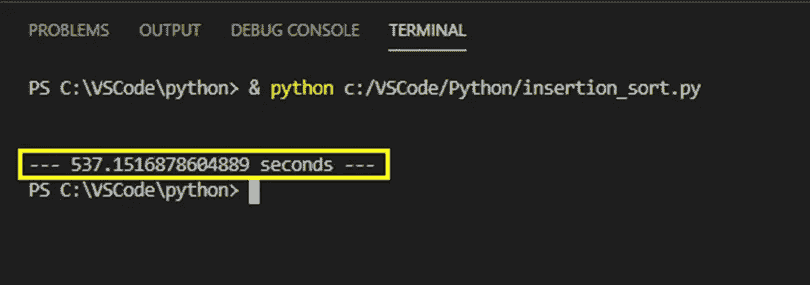
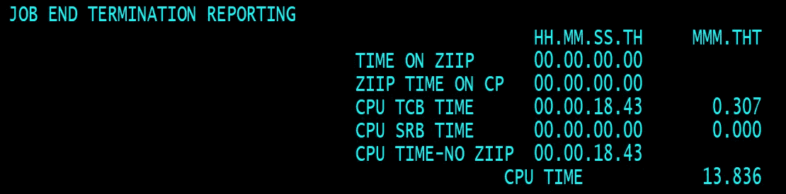
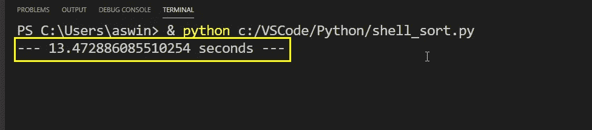
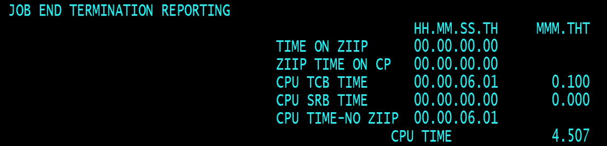
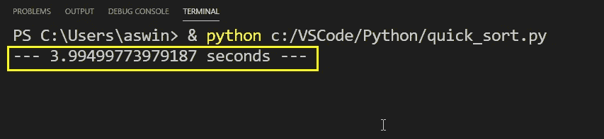
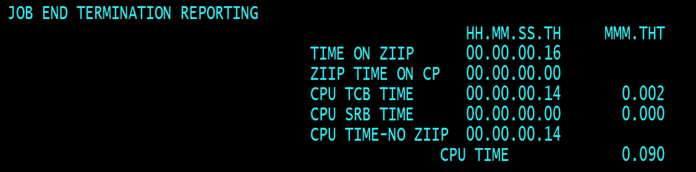
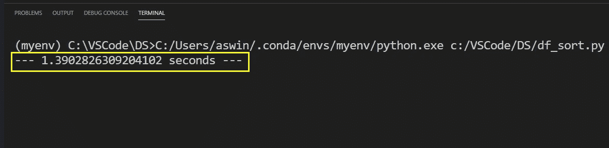
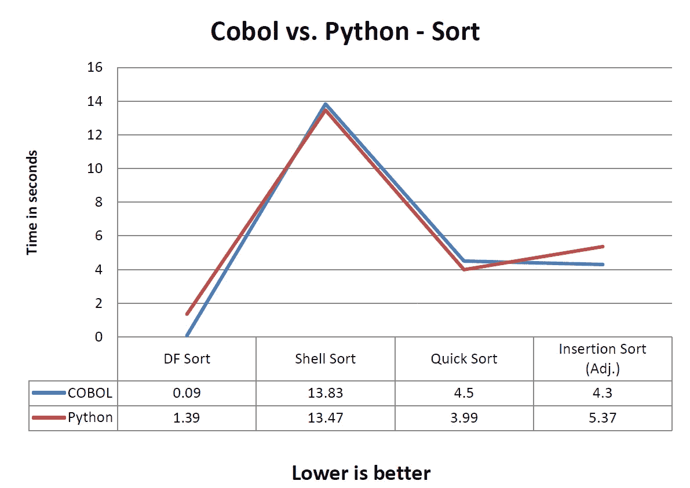

# COBOL vs . Python——一场排序战

> 原文：<https://medium.com/analytics-vidhya/cobol-vs-python-a-sort-battle-b23bc1d5fcf4?source=collection_archive---------11----------------------->

Python 是一种编码语言，虽然它在 20 世纪 80 年代就已经出现了，但在过去的几十年里取得了巨大的成功，而另一方面，COBOL(有些人可能甚至没有听说过)是在 20 世纪 50 年代创立的。

这两种开发软件的格式非常不同，使用它们的人也是如此。Python 主要用于开源系统和各种初创企业，而 COBOL 是一种企业语言，主要用于大型银行、汽车和零售公司。

> **COBOL 简史**
> 
> 因为大多数读者可能熟悉 Python。COBOL 是一种编译的、自顶向下的过程化编程语言，主要用于大型机上，这些大型机为高度关键的系统提供动力，如银行业、许多财富 500 强公司，甚至 NASA。尽管 COBOL 已经有 70 多年的历史了，但我坚信它仍然是一种很好的编码和工作语言，因为它很容易理解(像英语一样),并且仍然有超过 500 亿行代码是用 COBOL 运行的。每当你刷卡时，COBOL 和大型机很可能是后端处理你的数据，以确保你不必在咖啡店排队时多等一秒钟。

因此，为了证实我的上述观点，我将 COBOL 与 21 世纪最流行、最广泛使用的语言之一(显然是 Python)进行对比。这里的测试是在不同的时间复杂度水平上采用一些排序算法，并在 COBOL 和 Python 中运行它们，看看谁领先。我会支持 COBOL。你呢。

1.  **插入排序**

这是继冒泡排序之后最简单的排序算法之一。我选择了这种方式，因为它比冒泡排序更快，而且对于一个巨大的数据集来说并不可取。但是，我们将立即忽略这一点，并在两个系统上运行它，数据集有十万行(100，000)未排序，等待它排序并写入输出文件供我们验证。

插入排序— COBOL 性能

插入排序— Python 性能

我猜它是 COBOL 1 和 Python 0。由于这种类型在处理大量数据时具有最糟糕的时间复杂性，所以两个程序都需要很长时间来运行

2.**贝壳分类**

外壳排序是一种更有效的算法，其中在间隙中应用插入排序以减少由于插入排序所做的大量交换而造成的性能影响。因为 shell sort 可以处理更多的记录，所以我将输入数据从 100，000 增加到 100 万。从现在开始，一百万将是两种语言的基线。但是请注意，两个竞争者必须处理相同数量的记录。

Shell 排序— COBOL 性能

外壳排序— Python 性能

该死，太接近了，Python 以不到半秒的优势赢了。但不管怎样，比分是 1 比 1。

3.**快速排序**

与 shell sort 相比，Quicksort 是一种更省时的处理大型数据集的方法。它的工作方式是从数组中选择一个“pivot”元素，并根据其他元素是小于还是大于 pivot 将它们划分为两个子数组。然后对子数组进行递归排序。我用 COBOL 语言写了一个球。

快速排序— COBOL 性能

快速排序— Python 性能

Python 再次领先于 COBOL 半秒。Python 2，COBOL 1。对一个大了 30 岁的人来说还是如此接近。

4. **DF 排序与 df.sort_values**

而不是合并或堆排序。我想我可以尝试一些不同的东西来演示股票可用的方法如何帮助快速排序数据集，而不是为此编写自己的代码。

在这里，我们将使用 DF sort(一种基于 JCL(作业控制语言)的排序方法，这种方法适用于(几乎)所有大型机安装和 df.sort_values，这是 Python 中一种现成的数据帧排序方法，它使用 Timsort(插入和合并排序的组合，用于对列表中的元素进行排序)

DF 排序—大型机性能

df . sort _ values()-Python 性能

DF 排序刚刚在这里创建了 DF . Sort _ values**T3，它完成的时间不到数据帧方法的十分之一。女士们先生们，我想我们打成平手了(这不是我想要的结果)。但是，你仍然不得不把它交给 COBOL，它离 Shell 和 Quicksort 不远。**

下面是对每一个方面的总结。

好吧，我想最快的是那些我们没有编写任何代码，只是使用已经可用的工具(机器人起义？).这是否意味着我是一个糟糕的程序员，或者只是股票方法只是使用更快的方法来排序？。无论如何，在某些情况下，我们可能需要编写自己的方法/过程来排序和定制给定的数据。

**注意:**这并不是对 COBOL 和 Python 中所有可用排序方法的全面分析，可能有方法可以提高这两个领域的效率(希望大家对此有所贡献)。