# 使用 Python 进行鸡尾酒分析

> 原文：<https://medium.com/analytics-vidhya/cocktail-analysis-using-python-b94b1cf7d2e6?source=collection_archive---------20----------------------->

大家好，希望大家都平安。这是我的第一篇博客，希望能对你有所帮助。我想从非常简单的数据集开始，我发现了这个鸡尾酒数据集。您可以在以下链接中找到数据集。[https://www.kaggle.com/shuyangli94/cocktails-hotaling-co](https://www.kaggle.com/shuyangli94/cocktails-hotaling-co)。我正在对这个数据集进行简单的分析。

鸡尾酒分析是分析美国不同地区鸡尾酒的过程。首先我们导入库，然后加载数据。我们可以看到有许多值是 Null，所以我们用 No_value 替换 Null。有不同的方法来处理空值，但我们只是删除所有的空值。

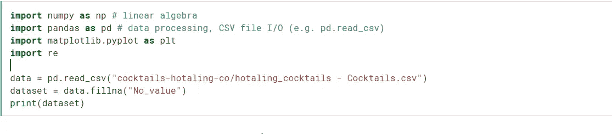

```
/kaggle/input/cocktails-hotaling-co/hotaling_cocktails - Cocktails.csv
               Cocktail Name          Bartender      Bar/Company  \
0             Flor de Amaras     Kelly McCarthy         No_value   
1            The Happy Place  Elizabeth Montana  Forgery & Verso   
2     Bon Voyage Pisco Punch        Jon Morales         No_value   
3  Still Life of a Pineapple    Daniel Braganca          Backbar   
4        The Bittered Valley         Nik Virrey         No_value   

        Location                                        Ingredients  \
0         Boston  1.5 oz Mezcal, 1 oz Hibiscus Simple Syrup*, .5...   
1  San Francisco  2 oz Junipero Gin, .75 oz House-made Cranberry...   
2  San Francisco  1500 ml BarSol Selecto Italia Pisco, 750 ml Le...   
3     Somerville  1.5 oz BarSol Primero Quebranta Pisco, .75 oz ...   
4        Seattle  1.25 oz Luxardo Maraschino Liqueur, 4 drops Ac...   

                                     Garnish   Glassware  \
0                            Marigold Petals    No_value   
1  Dehydrated Lemon Wheel, Sprig of Rosemary    No_value   
2                                   No_value  Punch Bowl   
3                                   No_value    No_value   
4                                   No_value    No_value   

                                         Preparation  \
0  *Hibiscus Simple Syrup:\n1:1 w/ a cup of dried...   
1  *House-made Cranberry syrup: \n-- 2 cups Fresh...   
2  *Pineapple Gomme: \nMix equal parts (1.5 cups)...   
3  *Pineapple Syrup:\n<em>Equal parts pineapple b...   
4  1st glass ingredients:\nLuxardo Maraschino, Ac...   

                                              Notes  
0                                          No_value  
1  Junipero Gin 20th Anniversary Signature Cocktail  
2                                          No_value  
3                                          No_value  
4                                          No_value
```

所以我们有九列。对于这个博客，我将使用前六个专栏进行分析。现在我们将使用 describe 函数来理解有关数据的内容。**描述** () **函数**计算与 DataFrame 列相关的统计汇总。

dataset.describe()

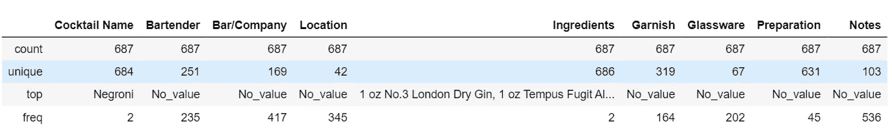

从上面我们可以发现有 687 行，在 687 行中，有 684 行是独特的鸡尾酒名称。有 251 个调酒师，169 个酒吧/公司，42 个地点。

我们将使用 value_counts()函数来计算每个唯一值以及它们在位置、酒保、酒吧/公司中的数量。通过这种方式，我们可以发现哪个位置的鸡尾酒数量最多，哪个调酒师制作的不同种类的鸡尾酒数量最多，以及哪个酒吧或公司拥有的鸡尾酒数量最多。

我们将打印前 20 名调酒师、位置、酒吧/公司及其鸡尾酒数量。

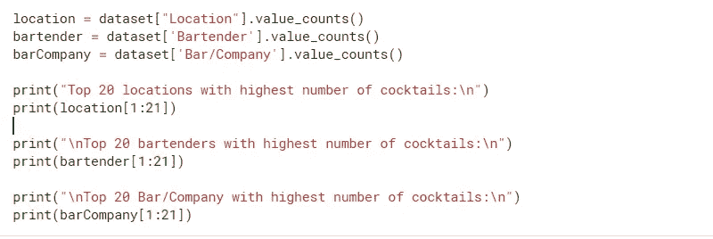

```
Top 20 locations with highest number of cocktails:

San Francisco     156
New York           26
Houston            22
Los Angeles        21
New Orleans        15
Chicago            12
Austin             11
Boston              8
Miami               6
Washington DC       6
United Kingdom      6
Seattle             5
Dallas              4
Brooklyn            4
Atlanta             4
Denver              4
Somerville          3
Westport            2
Fort Worth          2
St. Louis           2
Name: Location, dtype: int64

Top 20 bartenders with highest number of cocktails:

Francesco Lafranconi     38
Brian Means              20
Sean McClure             19
Kevin Diedrich           16
Kate Grutman             13
Morgan Schick             8
Caterina Miltenberger     7
Russell Davis             6
Jeff Hollinger            5
Brian Floyd               5
Enrique Sanchez           5
Tyler Chauvin             5
Douglas Ford              4
Ryan Chetiyawardana       4
Matt Grippo               4
Lynnette Marrero          4
Joaquin Simo              3
Ken Luciano               3
William Golde             3
Lauren Sanchez            3
Name: Bartender, dtype: int64

Top 20 Bar/Company with highest number of cocktails:

Dirty Habit                      29
Death & Co.                       8
Treo                              5
The Forgery                       5
Gastronomista.com                 5
Blackbird                         5
Bon Vivants                       4
Cold-Glass.com                    4
Jupiter Olympus                   4
Trick Dog                         4
Bonneville                        3
Michael Mina Restaurant Group     3
The Commissary                    3
The Soigne Group                  3
Jazz Kitchen                      3
ABV                               3
Land and Water Co.                3
Cherry Blossom PUB                3
Mourad                            3
Backbar                           3
Name: Bar/Company, dtype: int64
```

我们发现的是顶级位置、调酒师和酒吧/公司。因此，我们知道我们的数据集不准确，并且有更多的无值，从 describe()函数中，我们还知道该列中的最高计数是 No_value。所以我们把答案从 1 分到 21 分，而不是从 0 分到 20 分。数据分析的好处是我们可以使用不同的库来可视化数据。

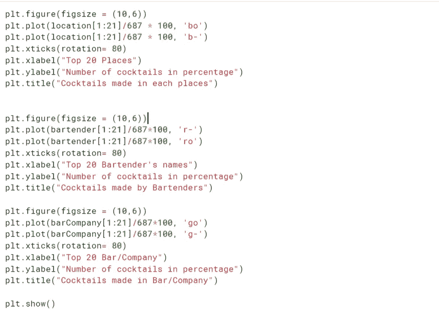

我总是试图把标签和标题，这有助于任何人理解图像。有不同类型的图表，如条形图、饼图、箱线图、直方图、散点图等。但是我们将使用简单的线图，它给出了可读的图像。选择给出可读输出图像的图形。否则没有任何用处。

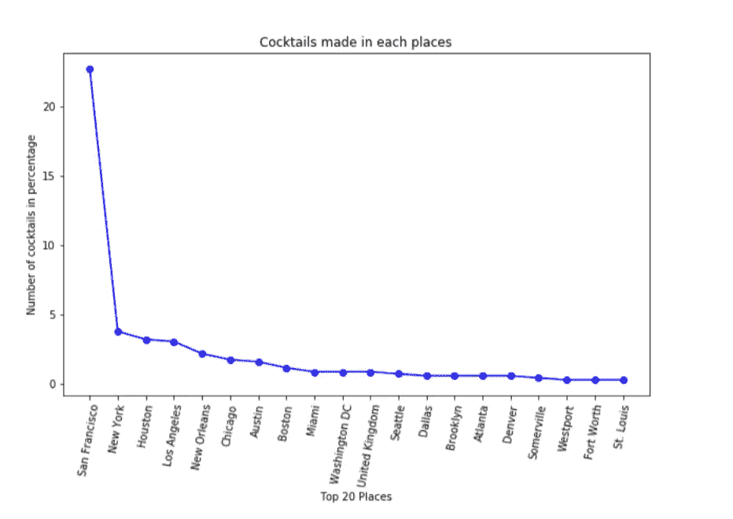

所以我们的第一个情节已经准备好了。从这张图表中我们可以发现，超过 20%(约 24%)的鸡尾酒产于旧金山。所以我们可以说大部分鸡尾酒都是旧金山产的。

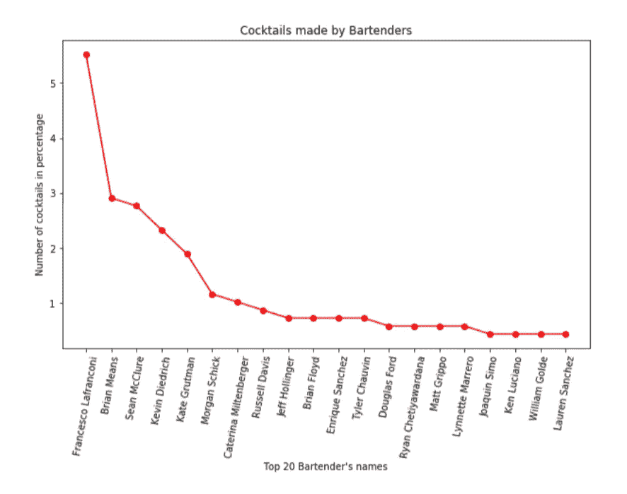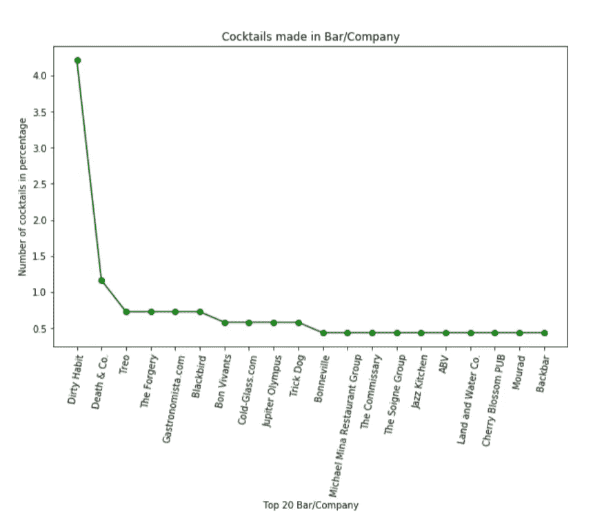

我们写了几行代码来找出重要的东西。现在我们来分析一下成分。哪一种是鸡尾酒中用量最大的配料？我们知道，要素是简单的文本格式列。我们需要取出每种成分，并对其进行计数。

成分栏是由许多其他符号组成的字符串。我们需要从配料中提取每个单词。所以通过分析数据集，我们发现“(“，”)、“*”、“\xa0”都是不需要的字符。所以我们将它们替换为" "。然后我们将从配料中提取每个单词。

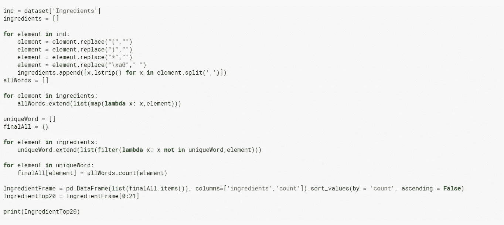

```
 ingredients  count
                   .75 oz Lemon Juice    44
          1.5 oz No.3 London Dry Gin     33
         .5 oz King's Ginger Liqueur     30
    .25 oz Luxardo Maraschino Liqueur    29
                  1.5 oz Junipero Gin    25
                     .5 oz Lemon Juice   24
            1 dash Angostura Bitters     23
            2 dash Angostura Bitters     19
                   .5 oz Lemon juice     17
                    1.5 oz H by HINE     17
                    .75 oz Lime Juice    16
    .5 oz Luxardo Maraschino Liqueur     16
            .75 oz Fresh Lemon Juice     15
                  .5 oz Simple Syrup     15
            1 oz No.3 London Dry Gin     15
                    1 oz Junipero Gin    15
                      .5 oz Lime Juice   15
                      2 oz H by HINE     14
               1.5 oz Pink Pigeon Rum    14
             .5 oz Fresh Lemon Juice     14
              .5 oz Fresh Lime Juice     14
```

我们现在有顶级配料及其测量的信息。我们将绘制图表并查看前 20 种成分

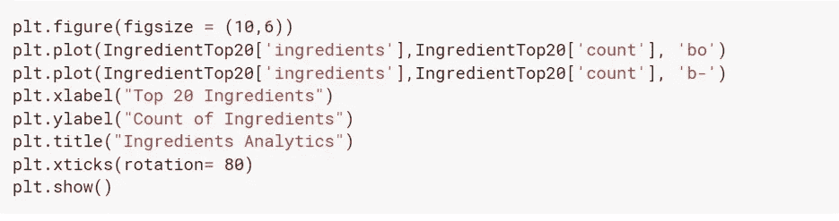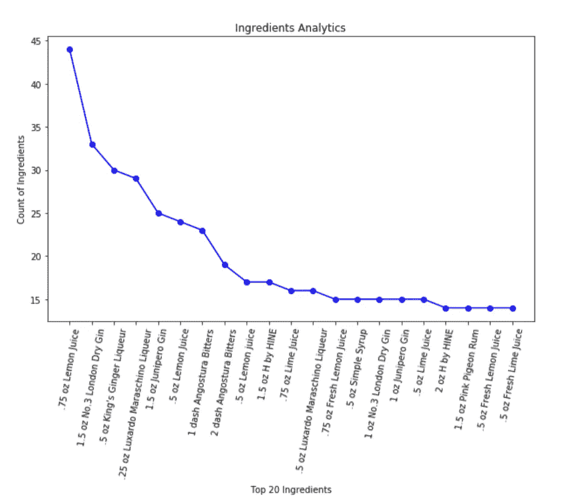

这里的技巧是不断地查看数据集，并首先删除不需要的字符。所以它会给出准确的答案。我们将使用与配料相同的技术。我们会把每种配菜和它们的数量一起拿出来。这样我们可以找到鸡尾酒中使用的顶部装饰。

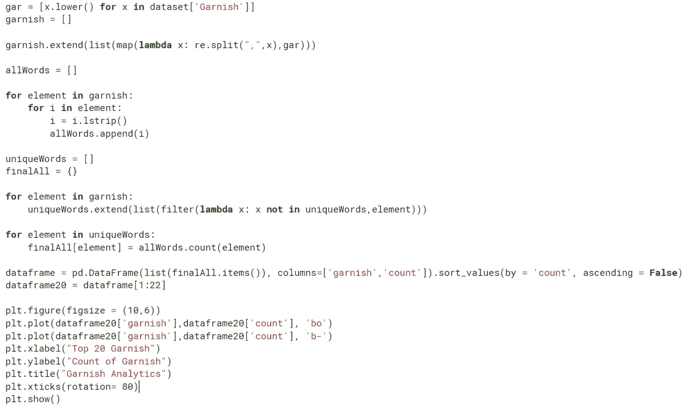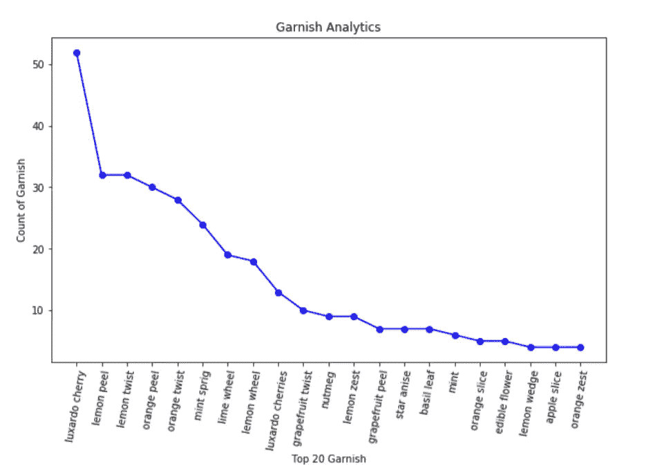

所以，就这样了。我们有顶级的配料和装饰。这是分析任何数据集的非常基本的方法。你可以用数据集做更多的事情。你可以做泛化功能，找到酒精百分比在每一个鸡尾酒，顶级酒精，使用不同的列，尝试使用不同的可视化，等等..希望你懂基本分析。代码可在[https://www.kaggle.com/dhruvilshah35/cocktails-analytics](https://www.kaggle.com/dhruvilshah35/cocktails-analytics)上获得。