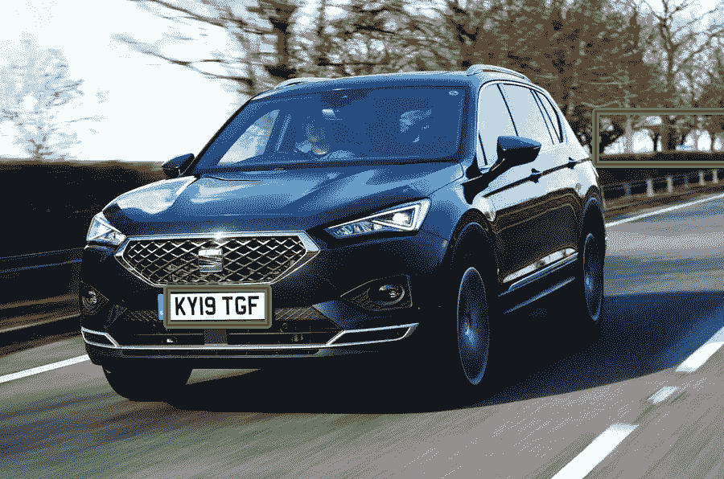
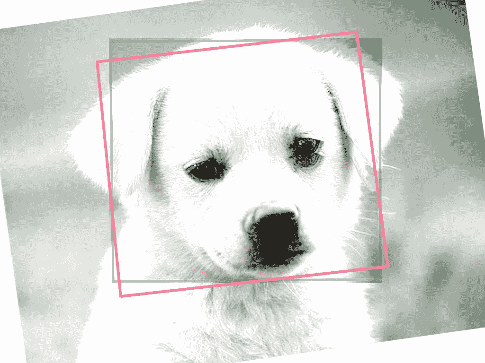

# COCO 图像增强评估器

> 原文：<https://medium.com/analytics-vidhya/coco-evaluator-on-image-augmentation-ec6f9d25c8cc?source=collection_archive---------6----------------------->



[*COCO 数据集*](https://cocodataset.org/#home) *由带有面部关键点和对象检测关键点的注释图像组成，并且还包含执行边界框测量的评估器。*

COCO 数据集可用于将图像分割问题的数据集训练到深度学习模型中。在计算机视觉中，图像分割是一种以边界框格式或关键点格式解决图像像素分割的技术。

让我们考虑一个场景，其中我们训练 Pascal VOC 数据集进行边界框检测，并最终进行映射计算以提取深度学习模型的基准测试结果。第一步是定义网络和预处理功能。

一旦布置好网络，在本例中就是 caffe，我们就将 Pascal VOC 结果序列化到 TensorFlow 的 tfrecord 文件中。

使用 tf train Coordinator 和 TFRecordReader 训练 tfrecord，如下所示:

我们没有定义的一个函数是序列化 tfrecord 样本的预处理函数。下面给出的代码示例演示了我们如何预处理 Pascal VOC 边界框。

# 图像增强

进行图像增强是为了训练数据集以适合图像的旋转、缩放、翻转。图像增强大大提高了预测模型的准确性。如果您需要使用 COCO 评估模型，并将图像增强应用到测试样本中，我们使用类似于下面给出的代码:

最终的 COCO 评估器图像类似于下图所示:



从 COCO 评估器获得的检测框输出样本表示这两个边界框的面积变化。重叠区域和剩余区域在确定比率时起着关键作用，该比率称为**交集/并集** (IoU)。

使用 IoU、训练样本中的检测数和区域随机数生成器的网格搜索，得到如下所示的输出:

```
 **DetectionBoxes_Precision/mAP': 1.5104485276902977e-07
 DetectionBoxes_Precision/mAP (large)': 4.6072545830664966e-07
 DetectionBoxes_Precision/mAP (medium)': 0.0
 DetectionBoxes_Precision/mAP (small)': 0.0
 DetectionBoxes_Precision/mAP@.50IOU': 1.5104485276902977e-06
 DetectionBoxes_Precision/mAP@.75IOU': 0.0
 DetectionBoxes_Recall/AR@1': 0.0
 DetectionBoxes_Recall/AR@10': 0.0
 DetectionBoxes_Recall/AR@100': 0.00016863406408094435
 DetectionBoxes_Recall/AR@100 (large)': 0.00024213075060532688
 DetectionBoxes_Recall/AR@100 (medium)': 0.0
 DetectionBoxes_Recall/AR@100 (small)': 0.0**
```

获得该结果的代码示例如下所示:

请在 github 上查看代码，网址为:

[](https://github.com/aswinvk28/coco-evaluator-image-augment) [## aswinvk 28/coco-评估工具-图像-增强

### COCO 评估器包含涉及地图的边界框测量。此处的示例使用应用的检测边界框…

github.com](https://github.com/aswinvk28/coco-evaluator-image-augment)