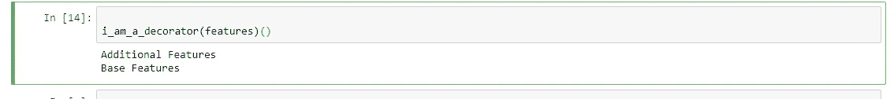

# 代码糖果 2:学习 Python 中的装饰器

> 原文：<https://medium.com/analytics-vidhya/code-candy-learning-about-decorators-3e93d4752ab?source=collection_archive---------0----------------------->

在从事大型项目时，你难道没有看到一些代码离你想要它做的事情只有几英寸远，你会想，如果这个函数能把松散的部分绑起来以适合我的应用程序，如果我能调整这个现有的函数。

Python 通过提供重用和扩展功能的特殊功能来帮助我们。你可以将一段运行良好的现有代码添加到其中。这是元编程作为现有程序一部分的一个例子。

## Python 是如何做到这一点的？

Python 将所有东西都视为对象类、数据和函数。函数是具有属性的简单对象。同一个函数可以有不同的名字，函数可以从函数中返回，甚至可以作为参数传递。

装饰器所做的是将一个函数作为参数，添加更多的特性并返回它。这在扩展现有功能以满足新需求或迎合新界面方面可能是有用的。

## 定义装饰器的代码

定义一个装饰器很简单，作为一个函数，它接受一个函数作为参数，并在其主体中添加一些更多的特性。请查看下面的 python 快照，了解需要完成的任务。

## 打电话给装潢师

以下是如何得到一个装饰。因为装饰器返回一个函数，所以它被赋值给 b，b 也是一个函数，需要用括号括起来才能执行代码。只需输入 print(b)就会给出函数的地址，不会执行 decorator。

下面是输出

调用装饰器生成与上面相同的输出的另一种方式是这样的。

## 使用装饰器时要小心

在定义装饰器时，记住整个系统的设计是很重要的，深度嵌套和包装的函数可能会导致系统变慢，Python 2.3 和更早的版本也不支持这个特性。

在你的脑海中弹出这个代码糖果来体验一下装饰者的味道..离代码启蒙又近了一步。

希望你能用这个来设计更好的代码！编码快乐！