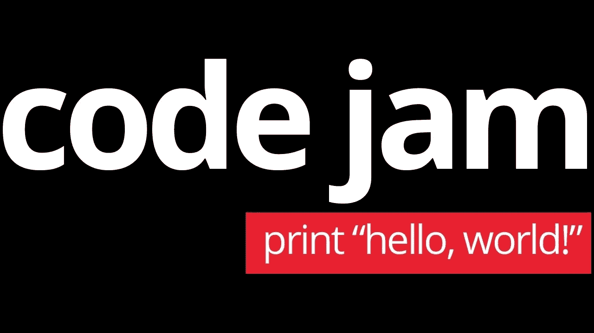

# 代码堵塞 2020 解决方案

> 原文：<https://medium.com/analytics-vidhya/code-jam-2020-solutions-3d3528fcdd10?source=collection_archive---------9----------------------->

# ***什么是代码堵塞？***

谷歌持续时间最长的全球编码竞赛 Code Jam 号召全世界的程序员分秒必争地解决具有挑战性的算法难题。参赛者通过四轮在线主办的比赛晋级，参加每年在不同的国际谷歌办公室举行的年度 Code Jam World 总决赛。每一轮都带来新的挑战，最终，25 名参赛者将有最终的机会检验他们的技能，在世界总决赛上争夺现金奖励和梦寐以求的冠军头衔。

code jam 徽标

长达 27 小时的编码比赛于 4 月 5 日上午 7:30(IST)结束。总共有 5 个问题，我成功地解决了 3 个。在这里，我将用通俗易懂的语言和代码来解释这 3 个问题。

# **残迹(7 分)**

你可以在这里阅读问题陈述[。](https://codingcompetitions.withgoogle.com/codejam/round/000000000019fd27/000000000020993c)

C++中的解决方案

问题的第一部分，我们需要计算矩阵的轨迹，这很简单，只需要一个 for 循环就可以完成。如果你不知道什么是矩阵的迹，那么迹被定义为主对角线上元素的和。如果有 3×3 矩阵 A，那么迹将是主对角线元素的和(即 A[1][1]+A[2][2]+A[3][3])。

现在下一部分是检查矩阵是否是拉丁方。如果你不知道什么是拉丁方块，那么点击[这里](https://mathworld.wolfram.com/LatinSquare.html)。这里使用 set 数据结构是一个更好的选择，因为我们想检查一行和一列中的所有元素是否都是唯一的，set 不能存储重复值。因此，逻辑将以[行主顺序和](https://en.wikipedia.org/wiki/Row-_and_column-major_order)列主顺序遍历矩阵，并将它们存储在一个集合中。如果集合的长度小于行或列的大小，则它包含重复值，因此它不是拉丁方。

现在把所有东西放在一起，最终的代码看起来像这样。

# **嵌套深度(5 磅，11 磅)**

你可以在这里阅读问题陈述[。](https://codingcompetitions.withgoogle.com/codejam/round/000000000019fd27/0000000000209a9f)

Python 解决方案

在这个问题中，我们将为括号保留一个计数器。左括号“(”是+1，右括号“)”是-1。我们将这个计数器与遍历输入时遇到的数量进行比较。将有三种情况:

1.  当计数器的整数值大于指针所在的数字时。所以，我们将在数字前加上右括号，并从计数器中减去 1，直到计数器的值和数字不相等。
2.  当计数器的整数值小于指针所在的数字时。因此，我们将在数字前添加左括号，并将计数器加 1，直到计数器的值和数字相等。
3.  当计数器的整数值等于指针所在的数字时。我们将跳过这个数字，不添加右括号或左括号。

以下是解决方案

# **亲子关系回报(7 分，12 分)**

你可以在这里阅读问题声明[。](https://codingcompetitions.withgoogle.com/codejam/round/000000000019fd27/000000000020bdf9)

Python 解决方案

我用贪婪算法解决了这个问题(也可以有其他方法)。在这里，我们必须为 Cameron 和 Jamie 安排活动，以便其他活动不会在他们的计划中重叠，并将 Jamie 'J '和 Cameron 完成的活动打印为' C '(解决方案看起来类似于' JCCCJCCJ ')，如果不可能，则打印“不可能”。因为每个活动调度问题都按开始时间对数组进行排序。现在，我们必须遍历这个排序后的数组，通过比较 Cameron 或 Jamie 最后一次活动的结束时间，开始将活动放在他们的下面。为此，我们将存储他们最后一次活动的索引。在每个测试用例中，我们将把第一个活动交给 Cameron。接下来是三种情况:

1.  我们将通过比较上一个活动和当前活动的开始时间和结束时间来检查是否可以为 Cameron 安排活动。如果可以安排给 Cameron，那么我们将更新存储上次安排给 Cameron 的活动的索引的变量。
2.  如果不可能将它安排给 Cameron，那么我们将它安排给 Jamie，因为 Jamie 没有安排任何活动，并且更新存储安排给 Jamie 的最后活动的索引的变量。
3.  当杰米安排好一项活动后，我们将开始比较。现在，当下一个活动到来并且无法安排给 Cameron 时，我们将比较前一个活动的结束时间和该活动的开始时间。如果可以安排给 Jamie，那么我们将更新存储安排给 Jamie 的最后一个活动的索引的变量。如果不能安排给 Jamie，那么就不可能安排，然后我们将打印“不可能”并打破循环。

在打印最终答案时(当答案并非不可能时)，我们必须注意按照活动提供给我们的格式打印。为此，在对所有活动进行排序之前，我对包含这些活动的数组做了一个[深度拷贝](https://stackoverflow.com/questions/184710/what-is-the-difference-between-a-deep-copy-and-a-shallow-copy)。现在，当调度活动时，在重复数组中搜索它们，并在重复数组中的索引处添加字符“J”或“C”。

这是代码

这些是我在《代码堵塞 2020》中用通俗语言解决的 3 个问题的答案。

别忘了留下评论！在评论区留下建设性的反馈。