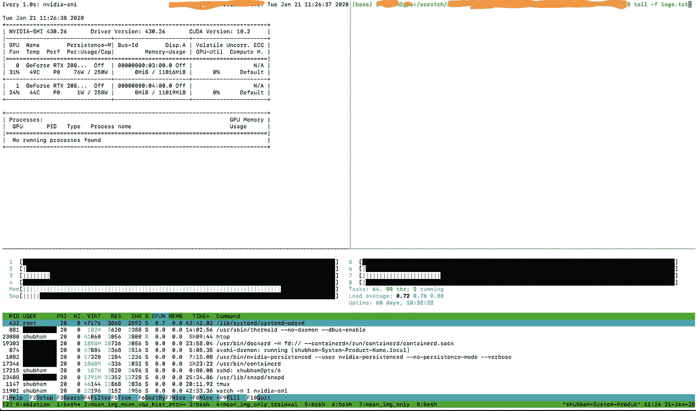

# 代码像亲(-ish)；从 101 开始——从深度学习的角度看工具

> 原文：<https://medium.com/analytics-vidhya/code-like-a-pro-ish-right-from-101-tools-from-a-deep-learning-perspective-34d8df1e38e?source=collection_archive---------14----------------------->

凯文·Ku 在 [Unsplash](https://unsplash.com?utm_source=medium&utm_medium=referral) 上的照片

TL；DR:这篇文章是关于以下几个项目的，我相信当你作为深度学习实践者开始用 Python 编码时，这些项目是有帮助的。希望这篇文章能帮助你至少学到一些新的和相关的东西！

1. [IDE](#42e8) : PyCharm +配置远程 SSH
2。[环境](#737b) : Conda、pip、Python3
3。[终端复用器](#2946) : Tmux vs 屏幕
4.a [Github 库](#6183):贡献 PRs 提出问题；开源；GSoC
4.b [要点](#6183):维护你常用的代码
5。[笔记本](#1866):可视化你的数据+配置远程 SSH
6。[深度学习具体](#940d) :
6.a: [框架](#df6f):py torch vs tensor flow
6 . b:[Shell 脚本](#71ee):迈向可复制性的一步
6.c: [重用代码](#d072):少写代码，多做研究！
6.d: [监控使用](#a688):一些要点
6.e: [调试 DL 代码](#9180):a . Karpathy 的好建议
7 .[代码质量](#5a27):注释、命名约定、巧妙与简单

假设你在做一道咖喱/饭(DL 模型)，你可以很容易找到菜谱(数学/概念)。但是你使用的原料(工具)会直接影响最终结果。*了解正确的工具不应该是奢侈品，而是获得期望结果/研究的必需品。*这篇文章主要讨论了 Python 的一些最好的学习工具。Python 开发人员最近在总体上超过了 Java，而且它也是深度学习实践者中最受欢迎的语言。参考:[这个](https://www.statista.com/statistics/793628/worldwide-developer-survey-most-used-languages/)、[这个](https://www.zdnet.com/article/programming-languages-python-developers-now-outnumber-java-ones/)、[这个](https://www.benfrederickson.com/ranking-programming-languages-by-github-users/)和[这个](https://stackoverflow.blog/2015/07/29/why-are-there-so-many-programming-languages/)。让我们深入研究构建 DL 模型所必需的成分。

## IDE:

永远不要低估 IDE 的力量:皮查姆拯救世界

在我看来，IDE 可以大大减少你的编码和调试时间，同时也有助于符合行业标准。作为一名数据科学家，我喜欢用 R studio(R 的 IDE)编程。然而，当我转向 Python 时，我努力寻找一个合适的 IDE。问了那么多周围的人，崇高的文本在那些日子里主要是一个可行的意见。到目前为止，我知道有两个 ide 对 Python 程序员来说非常酷:VSStudio 和 PyCharm。

我喜欢 PyCharm，大部分后续材料都是关于它的。我强烈推荐将 PyCharm 安装为 Python IDE(特别是如果你在 Windows 上的话)。上[网站](https://www.jetbrains.com/pycharm/download/)下载`community`版本，开源免费。一些非常*基本的* *功能*是我在学习 PyCharm 时[做的](https://gist.github.com/shubhamagarwal92/47d8d5ffa5793a8430dd9b389d9f33f5)——显然不是完整的列表，但可以让你开始。PyCharm 远不止这些。PyCharm 还提供了多种扩展，如 [md viewer](https://whatis.techtarget.com/definition/WYSIWYG-what-you-see-is-what-you-get) ，jupyter 和 bash 支持(仅举几例)。

SSH 安装:如果你正在用 DL 进行严肃的工作，那么你很有可能在本地开发并在服务器上运行你的代码。
1。一种选择是使用 [sshfs](https://www.digitalocean.com/community/tutorials/how-to-use-sshfs-to-mount-remote-file-systems-over-ssh) 在本地机器上挂载远程服务器的存储库。这里的代码实际上**驻留在服务器**上，并在你的机器上创建一种“符号链接”。您所做的一切最终都会反映在服务器上。
2。使用 PyCharm 的 ssh 挂载功能，您的代码**驻留在您的** **本地**机器上，它以完全相反的方式工作，在服务器上投影和同步代码。它的另一个优点是将代码分布在多个服务器上。假设您在不同的服务器上拥有资源(GPU ),但没有共同的底层目录结构，PyCharm 允许您在所有服务器上维护本地代码的完全相同的副本。另外，您可以直接调试和使用服务器的 [conda](#737b) 环境。

按照我的[要点](https://gist.github.com/shubhamagarwal92/ca010e3345e276801d7e10bfd7f0a79f)使用 PyCharm 配置 ssh 挂载。

# Python 环境

你可能同时在做不同的项目，有些需要 Python2/3.7/3.6。我个人推荐改用 Python3+和最新版本的库。但是如果您正在复制代码，那么坚持指定的需求可能对避免破坏他们的代码是有意义的。无论如何，我个人会为不同的项目创造不同的环境，并且更喜欢 [Conda 而不是 virtualenv](https://stackoverflow.com/a/34398794) 。参见[中的一些说明](https://github.com/shubhamagarwal92/CA_2020#anaconda-installation)作为安装参考。

升级到 Python 3+

换成最新版本的 Python/PyTorch，所有这些 bug 都会消失！

## 末端的

当你是一个编码员时，你肯定需要一个终端多路复用器(见下面的[图](#a688))。以前是跟着 Screen，后来换成了 Tmux。Tmux vs 屏幕见[本](https://unix.stackexchange.com/a/586/300978)。此外，参见此 tmux [备忘单](https://gist.github.com/MohamedAlaa/2961058)以供参考。非常得心应手！

出于同样的原因，我个人倾向于在我的实验中使用 bash，同时我也尝试了 iTerm 和 ZSH。一些[比较](https://www.howtogeek.com/362409/what-is-zsh-and-why-should-you-use-it-instead-of-bash/)和[博客](/ayuth/iterm2-zsh-oh-my-zsh-the-most-power-full-of-terminal-on-macos-bdb2823fb04c)。随便你！

## Git — Github / Gists

让你所有的代码在 git 的仓库中更新。这允许您进行适当的版本控制，跨平台共享您的代码，并在发生任何意外时保护您的代码。看这个关于如何安装 git 的公共[要点](https://gist.github.com/shubhamagarwal92/012034f23fc04a00897d8bd24a39f740)。我个人更喜欢 Github——因为 2019 年 Github 允许你制作私有库。

关于 git 有很多概念，比如分支、合并、cherrypicking 等等。实践证明这是会发生的。关于[资源](https://try.github.io/)见此。我个人的建议是为其他开源库贡献很多——提出 PRs/issues: 1。你试图从其他人那里学习编码标准。2.你对社会和你自己的形象都有好处。3.当你的公关在一次著名的回购中被接受时，作为一名程序员，这给了你巨大的快乐。

如你所见，我维护了很多代码的 Git gists，我很确定我会重用它们。我绝对推荐一样的。在 IMO 看来，这促进了编写清晰和标准的函数/类(OOPS 概念),可以在不同的项目中重用。

如果你是一名本科生/硕士生，我肯定会建议你尝试使用谷歌代码之夏(GSoC)这样的程序为开源组织做贡献。参考见我的[博客](/@shubhamagarwal92/google-summer-of-code-2017-pecan-daa2fd11755a)。这并非不可能，但需要一些努力——他们只是想看看你有多热情，以及你是否知道基本的编码技能(比如 OOPS 概念)。我用 Shiny (R)制作了一个[仪表板](https://shubhamagarwal92.shinyapps.io/shinyapp/)作为我的 GSoC 应用程序的样本。:)要创新！

# 笔记本— Jupyter

成为专业人士—关注数据！

大多数可用的数据集都有某种偏见。事先知道我们正在处理什么样的数据是有益的。垃圾输入=垃圾输出。数据分析非常重要，jupyter 笔记本在这方面非常方便。在现有环境中安装 jupyter 作为`conda install jupyter.`您可以在服务器上启动 jupyter 并使用 ssh 访问它，如这里提到的。

## DL 相关:

## 1.结构

虽然有很多文章区分可用的 DL 框架(如[这个](https://towardsdatascience.com/which-deep-learning-framework-is-growing-fastest-3f77f14aa318)、[这个](https://thegradient.pub/state-of-ml-frameworks-2019-pytorch-dominates-research-tensorflow-dominates-industry/)、[这个](/@UdacityINDIA/tensorflow-or-pytorch-the-force-is-strong-with-which-one-68226bb7dab4)和[这个](https://cv-tricks.com/deep-learning-2/tensorflow-or-pytorch/))，但其中两个最受欢迎:PyTorch(在研究人员中)和 Tensorflow(在行业中)。PyTorch 由 FB 支持，Tensorflow 由 Google 支持。我在不同的项目中使用过这两种代码，我个人认为 PyTorch 代码更加 pythonic 化，并且因为有了动态图形而易于调试。在做研究时，如果我在 TF 中为我的项目找到了一个非常好的代码，我会坚持使用它(至少对于复制来说)，否则对于重新实现，PyTorch 就成了我的首选。没有明确的赢家，应该由您根据应用(研究与部署)来决定哪个更直观。我听到了关于带有 Keras APIs 的 TF2.0 的非常好的反馈。

## 2.外壳脚本

Shell 脚本简化了管道/模块化 python 代码的流程，同时确定性地传递参数。这对再现性也很重要。当从 shell 脚本运行 python 脚本时，我尝试使用相对路径。一些非常基本的命令[这里](https://gist.github.com/shubhamagarwal92/f777e748a0f0df5a39a2477410302be3)和[这里](https://gist.github.com/shubhamagarwal92/4c2f10da3fcd69d0b0fb299a1e82d2b1)。

## 3.监控您的模型运行

使用 Tmux 拆分窗格。看到这个[要点](https://gist.github.com/shubhamagarwal92/a072ca6b06f312f241bd46a4ffe27a27)来主动监控你的模型运行。试着为你的代码计时。见此[要诀](https://gist.github.com/shubhamagarwal92/f5eafbb21f8c5974dbd4d1e6a01b6bfd)。

使用 Tmux 拆分窗格。看到这个[要点](https://gist.github.com/shubhamagarwal92/a072ca6b06f312f241bd46a4ffe27a27)来主动监控你的模型运行。

## 4.重用代码

一些研究人员告诉我尽可能少写代码。多做研究！“这个我完全同意。你的研究想法比代码更重要(如果你在读博士的话)。总是试图找到一个起始代码，并在它的基础上进行构建。或者，如果你在跟踪一篇研究论文，而他们提供了代码，那么从复制他们的代码开始。不要犹豫，给他们发邮件，寻求帮助。千万不要一个人承受痛苦，寻求帮助！

虽然一些高级研究人员认为我们应该从头开始实现，但是，DL 领域发展如此之快，事情不会一成不变。我觉得这是一种权衡。seq2seq 统治了 NLP 一段时间，但是现在每个人(大部分)都转向了变形金刚和它们的变种。我认识的大多数人都是通过拥抱脸来建造这个很酷的[变形金刚回购。](https://github.com/huggingface/transformers)

我不同意这一点。尝试在他人代码的基础上构建，而不是从头开始实现。

我的两点意见:寻找一个至少有 10 颗星或叉的回购协议(以获得对代码基本上没有错误的信任),并在一个月内提交。没有硬性规定。你肯定可以探索一下，看看你觉得可以理解的代码。

## 5.调试 DL 代码

一个不错的食谱[博客](http://karpathy.github.io/2019/04/25/recipe/)作者[安德烈·卡帕西](https://medium.com/u/ac9d9a35533e?source=post_page-----34d8df1e38e--------------------------------)和另一个不错的[资源](http://josh-tobin.com/assets/pdf/troubleshooting-deep-neural-networks-01-19.pdf)。我的建议是:尽可能模块化，并为每个特定模块编写测试用例。模型错误真的很难发现，模块化单元案例是安全网。

## 代码质量

在你的代码中添加注释真的真的很重要——我认为这是给你未来的自己或者任何正在阅读它的人的一个信息。在编写“己所不欲，勿施于人”的代码时，我试图遵循[黄金法则](https://en.wikipedia.org/wiki/Golden_Rule)。对函数/变量/类使用有指导意义的名字。一生中至少要读一遍[谷歌的 Python 风格指南](https://google.github.io/styleguide/pyguide.html)。使用 Python 3.6+中的类型([参考](https://docs.python.org/3/library/typing.html#module-typing)和[备忘单](https://mypy.readthedocs.io/en/stable/cheat_sheet_py3.html#when-you-re-puzzled-or-when-things-are-complicated))。我个人也在组织中协作时使用我的首字母(如 SA: commit)来区分我的提交(在 git 上)。这有助于我快速提交我的提交。此外，指的是重要的变化和问题修复。与多人合作时使用分支，并对您的代码负责。参见 [AI2 研究人员](https://github.com/allenai/writing-code-for-nlp-research-emnlp2018/blob/master/writing_code_for_nlp_research.pdf)关于编码实践的一篇非常好的文章。写干净、简单、可理解和聪明的代码。

@fchollet 的聪明与简单编码

感谢你是一个勇敢的读者！工具总是在变化，然而，编码实践通常不会。这些是截至 2020 年 1 月的一些最佳工具。

编码就像一门艺术——最好的编码者总是谦逊的；他们始终相信有改进的空间。学习永不停止！我也渴望写出完美的代码。编写简单、干净、简洁、可复制和负责任的代码。编码快乐！

鸣谢:感谢所有帮助过的人！特别感谢[团队 Alana](https://twitter.com/shubhamag1992/status/1066913018196320256) ，在参加 [Alexa Prize 2018](https://twitter.com/alanathebot) 时，我们也试图专注于编码实践。在我们合作[2018 年 Visdial Challenge](https://arxiv.org/pdf/2001.05865.pdf)的同时，也要感谢 Raghav Goyal。请随时回复并提出您的合作改进建议！