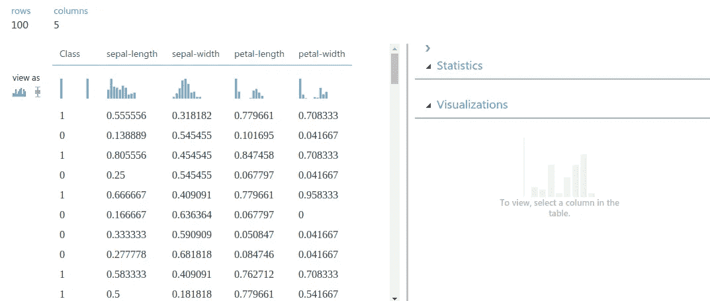
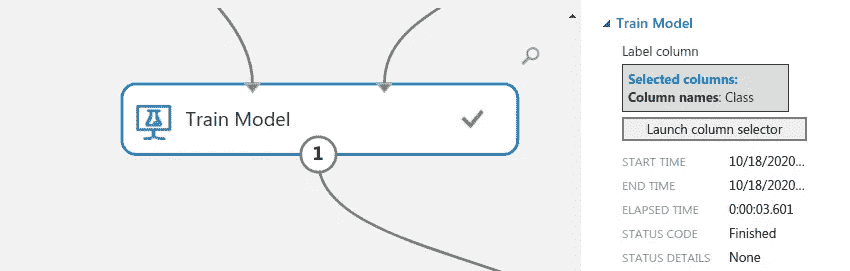

# 有代码还是没有代码？在 Jupyter 笔记本和微软 Azure Studio 上构建模型

> 原文：<https://medium.com/analytics-vidhya/code-or-no-code-build-a-model-on-jupyter-notebook-and-microsoft-azure-studio-3340fe1fcc8e?source=collection_archive---------24----------------------->

新数据黎明，图片来源:[安德鲁·金优](https://medium.com/u/b3f3d388ad80?source=post_page-----3340fe1fcc8e--------------------------------)

欢迎光临！距离我上次在平台上发帖已经有一段时间了。然而，这一次，我将只关注数据科学的专门领域，而不是我的意识形态观点。多年来，这个领域伴随着巨大的创新而发展。作为数据科学领域的学习者/贡献者/初学者，真的需要学习编码来建立模型吗？

在本帖中，我们将回顾使用 **Jupyter** **笔记本实验室**和**微软 Azure 平台**构建预测模型的两个不同步骤。这篇文章的主要目的是了解构建模型的步骤，以及我们如何使用这两个平台来实现它。

***注意:我不以任何方式隶属于上述任何平台。***

让我们开始吧！

通常，构建模型有几个步骤，如下所述:

1.  **数据收集** —基本上需要回顾、理解问题，并选择适当的数据集。
2.  **准备数据** —该步骤包括数据清洗、数据标记、数据可视化、数据规范化和数据拆分。
3.  **模型选择** —本质上，这需要选择正确的算法来解决问题。这可以基于先前对算法在类似问题上的性能的研究来完成。
4.  **训练** —通常，这一步涉及在所选数据集上训练模型以提高最终预测输出的过程。
5.  **评估** —模型需要在未经训练的数据上进行评估，这一步包括将模型暴露给看不见的数据。这是模型在真实场景中表现的最佳指标。
6.  **参数调整** —评估完模型后，我们需要通过微调特定参数来改善模型的性能。这一步骤类似于调谐你的无线电频率，以获得你收听的特定无线电频道的更清晰的信号。
7.  **预测** —这是你生成的模型用于预测/解决问题的最后一步。

在这篇文章中，我们将采取步骤，目的是理解使用“普通”Jupyter 笔记本和 MS Azure 平台的步骤。

为帖子选择的数据集是经典的 ***虹膜数据集*** ，然而在这种情况下，我们将使用在 MS Azure 数据集上找到的*虹膜两类数据集*。后者有两个类、100 行和 4 个特性。

# **数据收集/数据集加载**

***微软 Azure 平台***

要检索 Iris Two Class 数据集，请在 Microsoft Azure Machine Learning Studio 上单击保存的数据集，并选择样本，然后向下滚动以检索数据集，如下所示-(数据集是第二个图像上的最后一项)。选择并将其拖至您的工作区:

Iris 两类数据集加载

现在，我们可以通过以下方式在 MS Azure 上可视化数据集的详细信息，例如数据集中的类的数量:

1.  *右击数据集。*
2.  *选择数据集*
3.  *选择可视化*

可视化页面(如下所示)将为您提供每列数据集的统计数据，例如每列中的唯一值、平均值、最大值、最小值、缺失值和标准偏差。要查看任何列的统计数据，您必须选择特定的列。不是很容易吗？

数据集描述/可视化

让我们回顾一下如何使用 Jupyter Notebook 实现同样的功能。

***朱庇特笔记本***

通过加载数据集 Excel 文件(CSV ),可以在 Jupyter 笔记本上实现相同的过程，如下所示(CSV 文件应与 Jupyter 笔记本位于同一目录中):

Iris 两类数据集加载

然后，我们还可以借助一些内置的 Pandas Dataframe 函数预览数据集的描述，这些函数将提供数据集的描述。

数据集描述/可视化

我们还可以通过计算每个类中的行数来检查类的不平衡。在这种情况下，每个类有相同数量的行:

数据集中的类的数量

此外，我们可以检查数据集的任何列中是否存在任何空值。在这种情况下，我们必须遍历每一列，如果有空值，则返回 True，否则返回 False。：

检查空值

由此，我们知道数据集没有任何空值并且是平衡的。该信息对于下一步很重要，即**数据准备**

# **数据准备**

在这一步中，由于我们的数据集是“干净的”,我们将把重点放在数据的规范化和数据分割上。根据数据集的描述，当您分析每个列中最大值和最小值之间的差异时，每个列的值范围都很小。这里的标准化步骤基本上是为了展示我们如何在每个平台中实现它。

***微软 Azure 平台***

要在实验中添加标准化步骤，需要:

1.  *在 MS Azure studio 工作区的左上角，点击数据转换下拉菜单*
2.  *点击缩放和缩小下拉菜单。*
3.  *选择规格化数据并将其拖到你的工作区。*

数据标准化

***注意:您必须将工作空间中的数据集与规格化数据链接起来。连接箭头，使链接成功。***

该平台提供了不同的变换/规范化方法，可用于其数据集，如下图所示:

标准化方法

人们可以从 ZScore/MinMax/Logistic/log normal/Tanh 中选择他们的归一化方法。对于这篇文章，我们将使用最小最大变换方法。

此时，您的工作区应该如下所示:

数据规范化工作空间

要规范化数据集，您可以单击 Run。容易吗？

最小最大归一化后的数据集值:

标准化数据集

**分割数据**

既然我们已经规范化了数据集，那么我们可以将数据拆分为训练和测试数据集。为此，我们加载了拆分数据模块:

1.  *点击数据转换下拉菜单*
2.  *在列出的选项上点击样本和分割下拉菜单*
3.  *点击分割数据并将其拖至工作区。*

分割数据

要拆分数据，必须连接规范化数据箭头作为拆分数据的输入。此外，分割数据的输出由两个箭头组成，因为我们分别拥有训练数据和测试数据，如下所示:

分割数据

要选择如何分割数据，请单击工作区上的分割数据模块，在右侧窗口中会出现不同的选项:

分割数据

在拆分数据时有不同的选项，对于拆分模式，您可以选择:

1.  拆分行:如果您只想将数据分成两部分，请使用此选项。您可以指定要放入每个分割的数据百分比。默认情况下，数据对半分割。
2.  正则表达式拆分:当您希望通过测试单个列的值来拆分数据集时，请选择此选项。
3.  相对表达式拆分:每当要对数字列应用条件时，请使用此选项。该数字可以是日期/时间字段、包含年龄或金额的列，甚至可以是百分比。

这是根据 MS Azure 文档，可以在这里找到:[*https://docs . Microsoft . com/en-us/Azure/machine-learning/algorithm-module-reference/split-data*](https://docs.microsoft.com/en-us/azure/machine-learning/algorithm-module-reference/split-data)

在这种情况下，数据按行拆分，分别选择 70%到 30%的训练和测试数据。

***Jupyter 笔记本***

数据集标准化可以通过使用 sklearn 内置的缩放函数来进行。在这种情况下，我们将展示如何分别通过 MinMax 和 ZScore(在 sklearn 中称为标准缩放器)进行转换。

我们首先加载数据作为 NumPy 数组进行处理，然后将数据放在创建的 MinMaxScaler 对象上( *scaler* )，最后将数据作为 NumPy 数组(new_data)返回。我们打印出 MinMaxScaler 的值来与 MS Azure 进行比较，它们是相同的。我们将使用最小最大归一化进行训练。

最小最大标准化步长

对于 Z 分数，我们采取与最小最大缩放器相同的步骤，但是，我们将最小最大缩放器函数更改为标准缩放器。

ZScore / StandardScaler 归一化步骤

我们的数据集现在已经标准化了。

关于 MinMax / ZScore 的详细解释，请查看下面由 [Serafeim Loukas](https://medium.com/u/325d0d6c848b?source=post_page-----3340fe1fcc8e--------------------------------) 提供的链接

 [## 关于 Python 中的最小-最大规范化，您需要知道的一切

### 在这篇文章中，我将解释什么是最小-最大缩放，什么时候使用它，以及如何使用 scikit 在 Python 中实现它

towardsdatascience.com](https://towardsdatascience.com/everything-you-need-to-know-about-min-max-normalization-in-python-b79592732b79)  [## Scikit-Learn 的标准定标器如何工作

### 在这篇文章中，我将解释为什么以及如何使用 scikit-learn 应用标准化

towardsdatascience.com](https://towardsdatascience.com/how-and-why-to-standardize-your-data-996926c2c832) 

**拆分数据**

由于我们的数据是标准化的，我们现在可以将数据拆分以进行训练和测试。我们利用 sklearn 上的 *train_test_split* 模块，如下所示:

分割数据

sklearn 中的 *train_test_split* 模块按行分割数据集。测试规模设置为 30%，训练为 70%。

我们的数据集现在已经标准化，并且已经分为训练和测试。快速灵活？

# **型号选择**

***天蓝色女士***

对于数据集，选择的模型是 MS Azure 平台上的两类神经网络(二元分类器)。您可以选择它，如下所示:

型号选择

然后，我们可以预览可用于所选模型的不同参数:

型号选择

从上面可以看出，可以改变模型的不同参数来影响模型的性能。两类神经网络只有一个隐藏层，并且只能改变该层中隐藏神经元的数量。**灵活**？

***朱庇特笔记本***

选择的模型被加载到 Jupyter 笔记本~多层感知器上，利用 *sklearn* 库*。*

型号选择

为该模型设置的参数不同于在 MS Azure 上设置的参数。值得注意的是，激活参数和求解器可以使用笔记本进行调整，我没有在 MS Azure 中找到类似的参数。因此，不能确定这两个参数的默认值。

# **训练**

**蔚蓝女士**

为了用设定的参数训练模型，我们添加了如下所示的*训练模型*模块:

模型火车

我们必须选择“类”/目标列，因此启动列选择器，并在数据集中选择类/目标列，如下所示:

目标变量选择器

**Jupyter 笔记本**

对于 Jupyter Notebook，我们*在数据集上拟合*模型如下:

拟合模型

# **评估**

然后，在测试数据集上评估经过训练的模型，以测试性能。

***天蓝色女士***

为了测试模型，我们将分数模型模块加载到工作区。我们通过将分数模型拖到工作区来实现这一点:

得分模型

要检索模型的输出，右键单击评分模型->评分数据集，然后选择可视化:

输出应该是:

分数模型输出

分数模型输出不提供模型的性能，因此我们必须包括评估模型模块，以使用不同的指标检索模型的性能。

我们可以通过以下方式添加它:

1.  *点击左边的机器学习下拉菜单。*
2.  *点击评估下拉菜单*
3.  *将评估模型拖放到您的工作区*

评估模型

现在我们可以根据测试数据清楚地评估模型的性能:

模型评估

我们可以评价和回顾，模型在测试数据上的精度为 **0.40** ，阈值为 **0.5** 的 AUC 为 **0.500。**

**丘比特笔记本**

我们可以用一些代码行类似地进行评估步骤:

模型评估

由此我们可以看出，模型的精度为 **0.43** ，AUC 为 **0.23。**

***免责声明:此处的模型评估不包括交叉验证，交叉验证将更好地代表生成的模型在两个平台上的整体性能。强烈建议实现交叉验证，以便更好地评估您的模型。***

为了提高模型的性能，可以修改几个参数，例如:

1.  隐藏层中隐藏神经元的数量。
2.  创建的神经网络的学习速率。
3.  最大迭代次数。

此外，还可以进行 **GridSearchCV** 来确定模型的最佳参数。

你可以在这里找到 **Jupyter 笔记本**的代码:[https://github . com/ankin 01/Build-a-model-using-Jupyter-Notebook](https://github.com/Ankin01/Build-a-model-using-Jupyter-Notebook)

你可以在这里找到 **MS Azure** 步骤的完整图解:

[https://github . com/ankin 01/Build-a-model-using-Microsoft-Azure](https://github.com/Ankin01/Build-a-model-using-Microsoft-Azure)

现在您已经看到了两种方法:

你的偏好是什么？**码还是没码**？给你的反馈&连接:

领英:[安德鲁·金尤亚](http://www.linkedin.com/in/andrekinyuakin)

推文[@ kinyuaandruw](https://twitter.com/KinyuaAndrew)

***开心数据扯皮！***