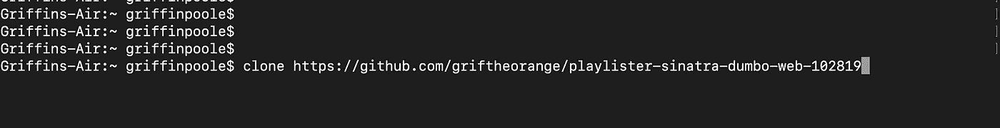
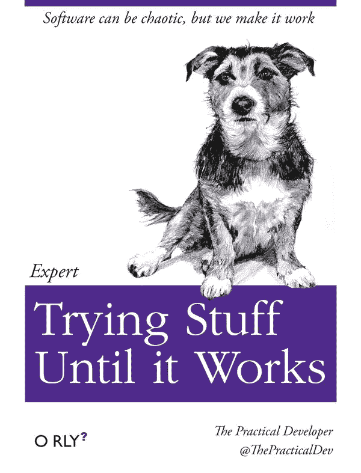
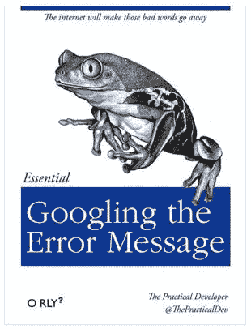
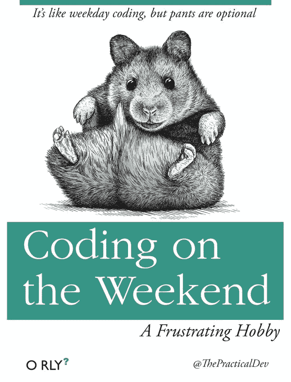
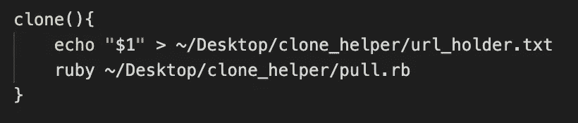
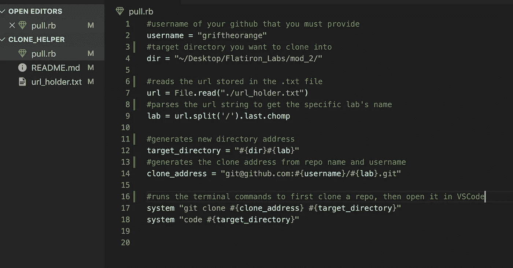

# 代码转换:编程中模块化和通信的魔力

> 原文：<https://medium.com/analytics-vidhya/code-switching-the-magic-of-modularization-and-communication-in-programming-2e8a927c38c4?source=collection_archive---------12----------------------->

## 语言学如何让我成为更好的程序员。

作为一个孩子，我在一个多元文化的家庭中长大，父母在我 13 岁左右再婚。在那之前，我一直是我父母的独生子，突然之间，我被三个兄弟姐妹包围着，他们的种族背景与我完全不同。它们是发生在我身上的最好的事情之一，但是尽管这种经历是我想分享的，我不会在这篇博客中深入探讨。我想说的是语言。

对于任何一个在你周围的人会说多种语言的环境中长大/经历过这种环境的人来说，你可能见过一个语言学术语叫做语码转换。代码转换被定义为:

> "在交谈中交替使用两种或多种语言或语言变体的实践."

虽然人们在对话中进行代码转换有几个原因，但我个人在编写代码时有两个原因(是的，我保证这篇文章是关于代码的)。

1.  人们可能使用语码转换来掩盖第二语言的流利性或记忆问题
2.  语码转换被用来标记从非正式场合到正式场合的转换

代码转换可用于适应扬声器的技巧和灵活性，也可用作工具，根据您的需求提供最合适的设置。

现在想象一下，我们讨论的不是说话，而是编码。

归根结底，编码语言只是工具；其他人构建的工具，让我们作为开发人员的生活变得更加轻松。任何用 Java、LISP(或者上帝禁止的 [Malbolge](https://en.wikipedia.org/wiki/Malbolge) )编写代码，然后转换到 Ruby/Python 的人都可以证明，当迭代一个数组时，你可能不会选择前者。每种工具都有其优缺点和特点。

1.  Python 是当今数据科学和分析方面的领先语言，这要归功于它庞大的开源库(Pandas、NumPy、SciPy、MatPlotLib 等)。)
2.  由于其神奇的 Rails web 应用程序框架，Ruby 是最受初创公司青睐的 web 开发语言之一
3.  SQL 是一种广泛使用的数据库查询语言，它被大量集成到高级语言(包括 Ruby 和 Pandas)的许多函数中
4.  Java 很好，因为它无处不在

这些语言中有很多做类似的事情，有些只是做得更好或者更简单。但是我们可以利用代码转换背后相同的思维过程来编写我们的代码！

如果您在某一种语言上有流畅性或记忆问题，而您已经多年没有使用这种语言了，但却知道另一种语言的一行解决方案，那么简单地获得它，然后告诉您生疏的代码在哪里可以找到它，这不是很好吗？或者说，您正在使用看起来像是胡言乱语的遗留 C++代码，而您的老板希望您将代码一次性转移到它所连接的 SQL 数据库中。没人说你必须用 C++完成转换，用 Ruby 就行了。

最后，也许你正试图制作一个高级数据库分析网页，而且需要尽快完成。嗯，如果我们可以用 Python 为后端编写复杂的数据集系统，将其与 SQL 数据库接口，将其链接到 Rails web 应用程序，并且仍然有时间睡觉，这不是很好吗？

当您能够将编程语言用于它们最擅长的领域(或您最擅长的领域)，并将弱点转移到更适合这项工作的语言时，编程语言的真正力量就会显现出来。将文件模块化，并准确地计划出一个块需要放入什么，以及您希望它输出什么。当你学会如何让你的语言互相交流时，你就打开了一个充满发展可能性的世界(或游乐场)。你也省去了每次换工作时学习如何用一种新语言进行全栈开发的麻烦。你已经成为一名通晓多种语言的程序员。

Factorio，一个关于提前计划、组织和优化的游戏。如果你喜欢那种东西，那很有趣。(我的 go to game 享受模块化设计的乐趣！)

# 结束故事

我想以一个小实现的描述作为结束，这个小实现是我在本周完成的，它启发了我写这篇文章。在写这篇文章的时候，我正在参加熨斗学校的网络开发沉浸式训练营，目前已经玩了四周了。

一周前，我经历了一个程序员最可怕的噩梦，我惯用的手受伤了。哦，太可怕了。我从能以我所能想到的最快速度写一行又一行代码，变成了必须用一只手打字，在项目周还要开机。我认为学习如何避免过多的输入是一个很好的投资，并开始使用 bash 别名。别名只是终端输入，您可以在。 *bash_profile* 或您的。*Mac 上你用户文件夹里的 bashrc* 文件。

> 。 **bash_profile** 在登录时设置一个 shell 环境。bashrc 设置一个没有登录要求的环境。然而，OS X 码头的默认运行方式使得这种差异对我们来说意义不大。

但是他们不是什么都做。别名只能用于单行终端命令。更复杂的行为不起作用。此外，您不能将参数传递给别名。

我想要的一行命令

## **问题:**

我想编写一个单行命令，可以传递一个 github url，该 url 将在指定目录下的新文件夹中克隆 repo，然后在 VSCode 中自动打开该目录。这样，我可以键入“clone *paste-url-here* ”，它将创建一个新文件夹，将回购克隆到该文件夹，并在一个步骤中为我打开它。但是:

1.  别名不能带参数
2.  我对 bash 脚本几乎一无所知
3.  bash 中的函数接受参数，但是除了更多的 bash 脚本之外，我不知道如何在任何地方传递 bash 参数

也就是说，我确实知道如何在 Ruby 中完成所有这些步骤。我可以在 Ruby 可执行文件中一行一行地生成我需要的 url 和目录地址，然后一步一步地运行一切。所以我函数的最后一部分会执行这个文件。但是我想每次在命令行中传递一个新的 url 来改变 ruby 代码的运行方式，而且我不知道如何向 Ruby 传递一个 bash 函数参数。

因此，我使用了一种我知道 bash 和 ruby 都能轻松沟通的文件类型。更重要的是，我已经知道如何与之合作。一个简单的. txt。

如果你曾经因为编码问题而感到压力，你应该知道有一个社区专门通过假冒的奥赖利教学书籍封面来表达 CS 的挫败感。他们真的很有帮助。

## **解决方法:**随机应变！

我知道在我的 bash 函数中，我可以接受 url 并使用 echo 将其写入一个. txt 文件，我的函数和我的 ruby 代码都知道如何访问该文件。

> $1 表示 bash 函数接受的第一个参数。
> 
> echo "" > filename 将覆盖该文件中的任何文本，并用提供的字符串替换它
> 
> echo "" >> filename 会将提供的字符串追加到文件的末尾，但我们在这里不需要这样做

保存我的 url 后，我可以在一个易于编码的 ruby 文件中处理我所有的逻辑，然后执行这个文件。

在 ruby 文件中，我预先定义了我的特定用户名和我希望我的实验室克隆到的目录。然后我读了网址新鲜回显到我的。txt 并使用这三个变量来解析和连接运行系统命令所需的字符串。第一个克隆 repo，第二个打开新文件。

> Ruby 中的“系统”命令执行 shell 命令，就像您在终端中输入命令一样。关于在 Ruby 中执行 shell 命令的更多方法:[https://red panthers . co/different-ways-to-run-shell-commands-in-Ruby/](https://redpanthers.co/different-ways-to-run-shell-commands-in-ruby/)

当我第一次运行这个程序并成功运行时，我非常兴奋。这是我第一次使用两个独立的工具相互交流，而没有内置的库来为我处理所有的细节。事实上，我非常兴奋，我和我的同学们分享了我做的这个很酷的小东西。

然后，我们可爱的导师(我是真心的)告诉我们，我们的学习套件中内置了一个工具，它做的事情与我做的非常相似。当我说类似的时候，我的意思是它做了我的工作，然后做得更多更好。当我的捷径出现时，它很快就被带进了轮子的世界，这个世界已经被重新发明了，除了我的轮子是方形的，因为我只有一个钢制的方形来工作。

不管怎样，这是一个有趣的练习，尽管相对简单，但我个人对此感到非常自豪。知道如何在你所掌握的不同工具之间进行交互有助于提高生产力和创造力，并驱使你追求精通。

这是一个在语言学、代码和所有解决问题的方法中显示出实用性的概念。所以我会继续在实践中锻炼它，我也鼓励任何对建筑有热情的人也这样做。谢谢你，祝你好运！

 [## 多语言编程-多语言开发

### 《计算机世界》涵盖了一系列的技术主题，重点是 IT 的核心领域:Windows、移动…

www.computerworld.com](https://www.computerworld.com/article/2467812/polyglot-programming----development-in-multiple-languages.html)  [## 什么是语码转换？

### 语码转换是在两种语言或两种语言之间来回转换的练习

www.thoughtco.com](https://www.thoughtco.com/code-switching-language-1689858)  [## 会谈和论文

### GOTO Chicago Nights，2019 年 4 月 2 日看看快速处理数据的日益重要性是如何推动…

deanwampler.github.io](https://deanwampler.github.io/polyglotprogramming/papers/)