# 匿名机器学习招聘黑客马拉松中的代码演练-第 1 部分

> 原文：<https://medium.com/analytics-vidhya/code-walkthrough-in-an-anonymous-machine-learning-hiring-hackathon-82a9b3f99e1d?source=collection_archive---------9----------------------->

以下是我参与的一个机器学习招聘黑客马拉松的代码演练；然而，我没有被选中。这是一次有趣的经历，我希望我在这个过程中学到了一些新的东西，我也希望读者能从中学到一些东西。这是**匿名**因为我会尽我最大的努力对组织的身份保密，这样有助于学习，同时也不会影响组织。如果它成功地实现了我的愿望，我会试着写更多这样的文章。

照片来自 Unsplash

该演练包括关于**问题陈述**、**数据集**和**的信息，以及代码和我解决问题的方法**(数据预处理、模型构建和截止微调)。

## **问题陈述**

提供数据集的组织拥有其产品和销售这些产品的销售团队。销售部门的经理雇用申请人并对他们进行一段时间的培训，这取决于他们在试用期的表现；他们被雇用或被解雇。招聘和培训申请人是一个成本高昂的过程，因此该组织转向数据科学来帮助他们找到可能的申请人。

## **数据集**

该数据集包含有关申请人及其经理的各种信息，以及他们是否被雇用。大多数列名都是不言自明的，但下面仍然是数据集中的列列表以及它们的含义。

**ID** :申请人的唯一 ID

**Office_PIN** :办公室的 PIN 码

**申请 _ 接收 _ 日期**:收到申请人申请的日期

**申请人城市密码**:申请人城市密码

申请人 _ 性别:申请人性别

**申请人 _ 出生日期**:申请人的出生日期

**申请人 _ 婚姻状况**:申请人的婚姻状况

**申请人 _ 职业**:申请人申请前的职业

**申请人 _ 资格**:申请人资格

**经理 _DOJ** :经理入职日期

**管理者 _ 加入 _ 指定**:管理者的加入指定

**经理当前职务**:经理当前职务

**经理级别**:经理级别

**经理状态**:经理状态(已确认或试用)

**经理 _ 性别**:经理的性别

**经理 _ 出生日期**:经理的出生日期

**经理数量申请**:经理收到的申请数量

**经理 _ 编号 _ 编码**:(不记得了)😅

**Manager_Business** :申请人在 Manager 下销售初级产品的总成本。

**Manager_Num_Products** :申请人在 Manager 下销售的初级产品数量

**Manager_Business2** :申请人在经理管理下销售的次级产品的总成本。

**Manager_Num_Products2** :申请人在经理领导下销售的次级产品数量

**Business_Sourced** :试用期结束后，申请人是否被录用。

接下来的部分看**导入数据**、**库**、**数据预处理**和**训练 ML 模型**和 **Auto-ML 模型**。

## **进口**

1.  导入库

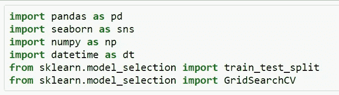

Raghuvansh 导入库

将数据(训练和测试)导入 Pandas 数据框架，将它们合并成一个名为“数据”的数据框架。在组合称为“Split”的列之前，该列被添加到训练和测试数据帧中以区分两个数据帧的行，然后删除训练和测试数据帧以减少内存消耗。

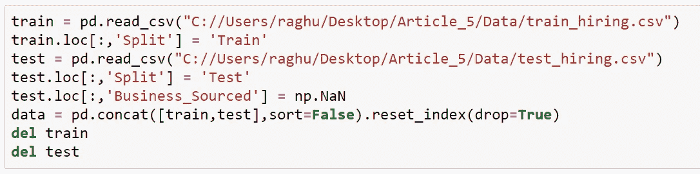

通过 Raghuvansh 导入数据

## 数据预处理

1.  检查空值并检查数据的统计。

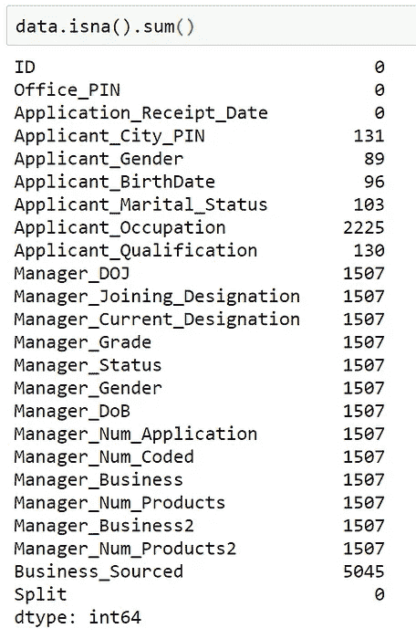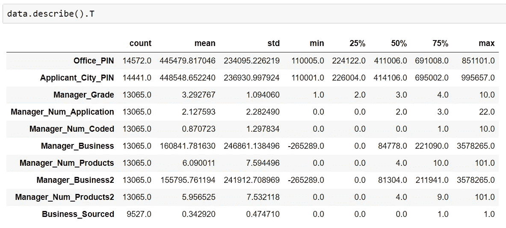

由于有许多列中存在空值，我们将查看一些示例，rest 预处理将出现在源代码中。

**经理 _ 性别**

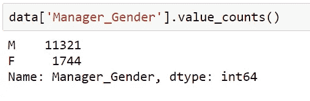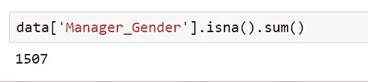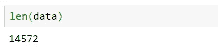

我们可以清楚地注意到，out 14572 中的 1507 个空值对应于值的大约 **10%** ，因此我们不能使用集中趋势(模式)估算这些值，并且我们不能删除该列，因为有许多列具有类似数量的空值，因此我们必须使用其他方法来估算。可能有很多选择，像 KNN，神经网络，老鼠。不过，我还是使用了一些基于简单统计的方法，即根据总体中存在的各种类别来分配这些空值，简单地说，根据它们在非空值中的比率在“M”和“F”类别之间分配 1507 个值。我在之前的一篇**文章**中写过这个技巧。

 [## 数据预处理:减少分类数据中的类别

### 下一篇文章将着眼于各种数据类型，重点是分类数据，并回答为什么以及如何…

medium.com](/analytics-vidhya/data-preprocessing-decreasing-categories-in-categorical-data-132e8b4a4fd) 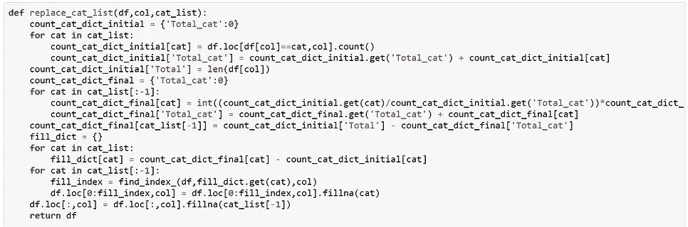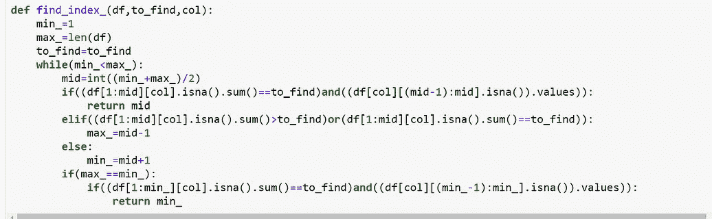

用于插补的函数

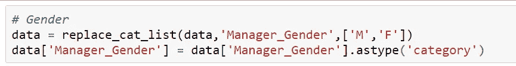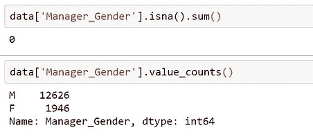

插补代码和检查

在插补并确认没有空值后，将该列转换为类别。

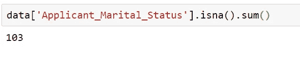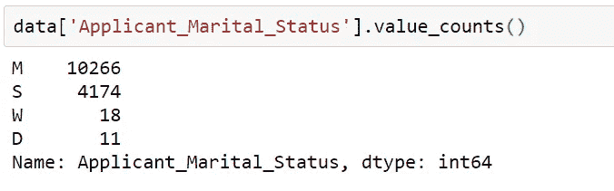

**申请人 _ 婚姻状况**

在此栏中，空值的数量较少，因此可以使用模式进行插补。但是类别“W”和“D”出现的次数很少，所以我认为这些类别可以转换为空值并进行估算，因为 ML 模型从数据中学习应该有足够的出现次数。**我很想听听这方面的意见，所以请评论你是否同意我的观点**。

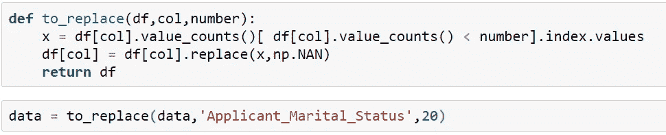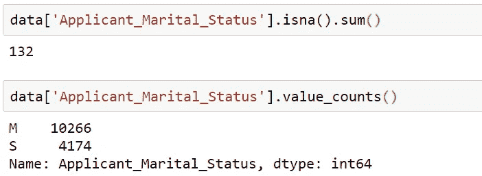

为了替换出现次数较少的类别，我创建了“to_replace”函数，该函数采用数据帧、列名和一个数字，并将出现次数少于数字的每个值替换为 NULL。

现在我们可以根据我们的意愿来估算它。

**经理 _ 业务 2**

Manager_Business 是一个连续变量，所以均值或中位数也可以估算它。不过，也可以通过使用**宁滨、**将其转换为分类，然后可以估算缺失值。

类似地，所有其他列也被估算，空值被删除。现在，一旦从组合数据中恢复了训练和测试数据，我们就可以在这些数据上建立我们的机器学习模型。在这里，我们之前添加的拆分列的值将会很有帮助。

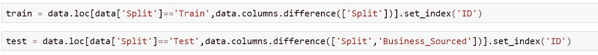

从组合数据中获取训练和测试数据

因为我们恢复了我们的训练和测试数据，所以我们可以拆分训练数据用于模型训练和验证。

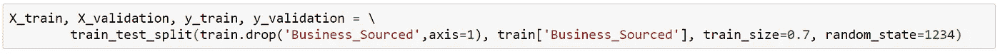

将数据分为训练和验证

为此，我使用了 CatBoost 分类器，因为它可以处理分类列，内置了对 RandomSearchCV 和 GridSearchCV 的支持，而且速度也很快。

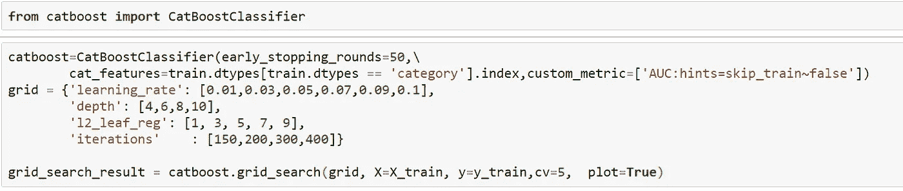

Catboost 中的网格搜索参数

为了得到更好的结果，寻找最优参数是一个很好的方法。我已经尝试了各种参数'学习率'，'深度'，' l2_leaf_reg '和'迭代'。CatBoostClassifier 也用“early_stopping_rounds”进行初始化，以防止过度拟合，并使用没有编码的分类特征。分类特征的名称作为列表传递给“cat_features”参数。

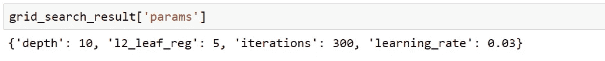

使用网格搜索的 Catbbost 模型的最佳参数

“grid_search_reult”变量包含最佳参数，这些参数可用于构建我们的最终模型。

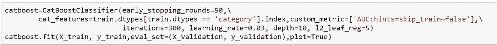

最终 Catboost 模型

检查结果以防止过度拟合是重要的一步。这可以通过查看混淆度量或一些数字，如准确性或 Roc_auc 得分来完成。

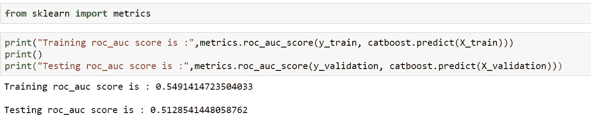

训练和测试数据 Roc_auc_score

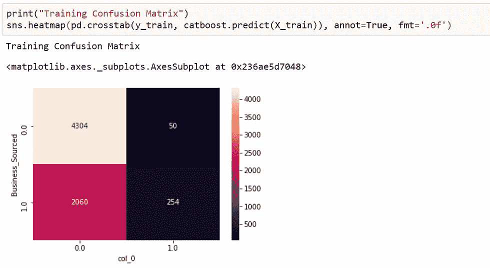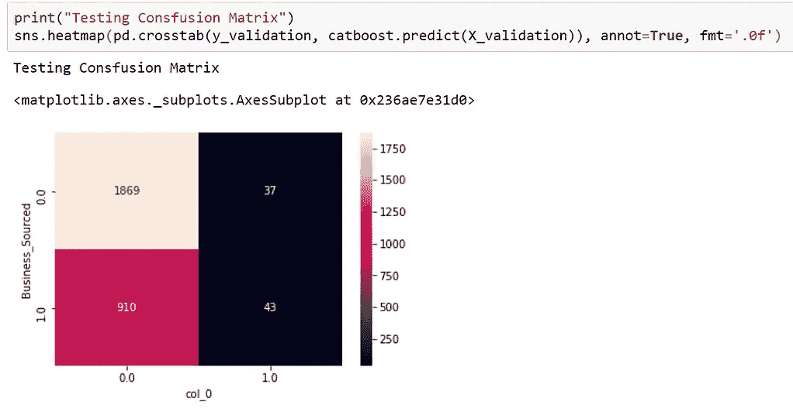

训练和测试混淆度量

我相信混淆矩阵是结果的真实指示，因为我们可以看到哪类值被准确预测，哪类值没有被准确预测。我们可以看到，假阳性少了，这是好事，假阴性多了，这可不好。我们还可以得出结论，我们的模型未能识别业务来源值为真的许多情况。

当一个模型表现不佳时，有各种各样的原因，比如模型可能没有被正确训练或者缺乏预测特征等等。纠正这些错误也是一个重要的过程，可以通过特征工程或微调模型来完成。**但是大多数人忘记了模型的截止值也可以微调**。

**截止微调**

我遵循两个过程来微调截止频率:

**2。最大化灵敏度和特异性的总和**

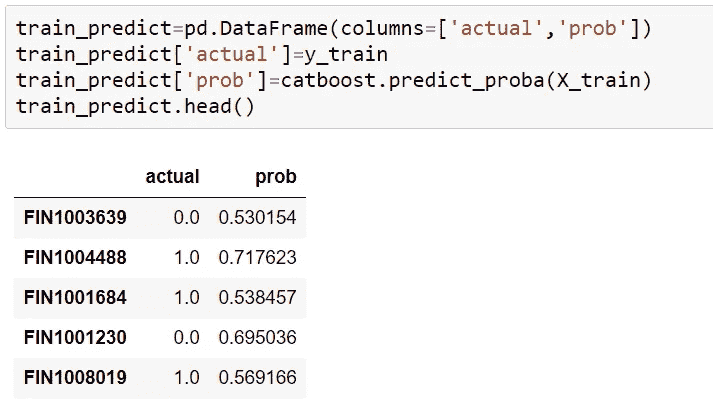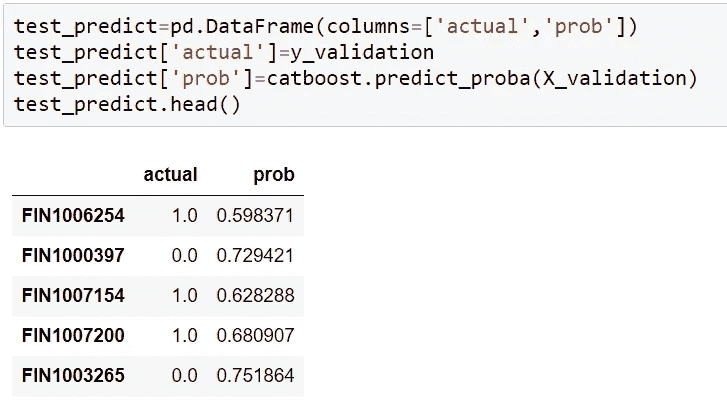

首先将训练和验证数据的实际值和概率相加，然后计算每个截止点的灵敏度和特异性值。

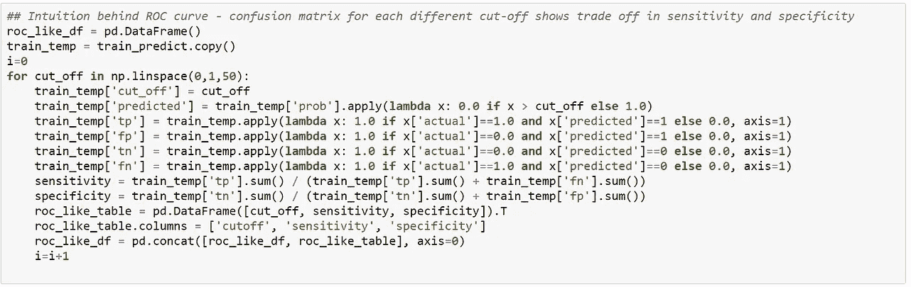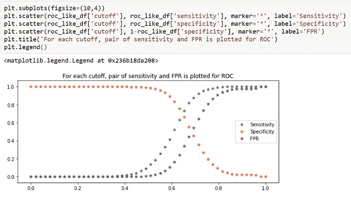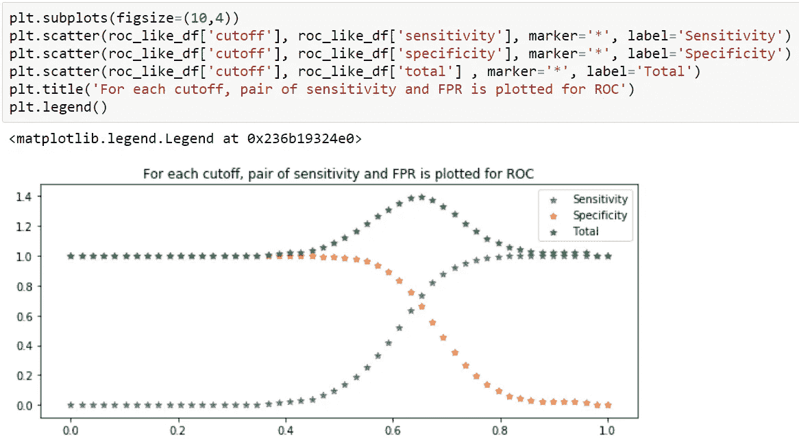

灵敏度和特异性以及两者之和的图

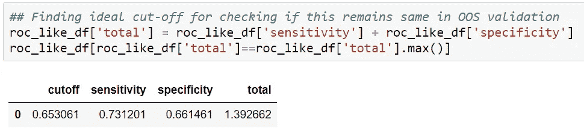

我们试图最大化的敏感性和特异性的总和开始增加，并在截止值 0.65 处达到最大值

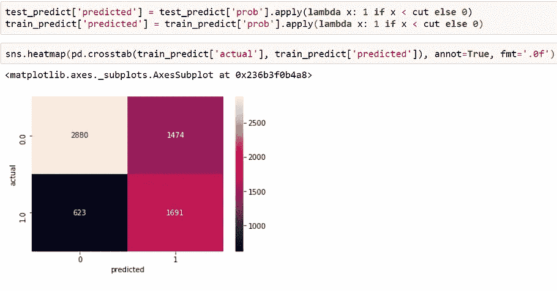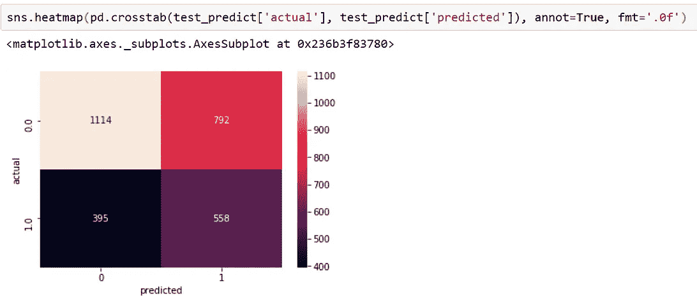

微调截止值后的混淆矩阵。

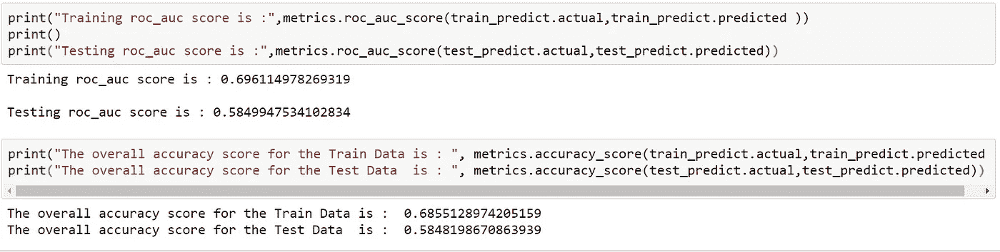

我们无法检查整体结果是否从混淆指标得到了改善，因此我们需要检查 roc_auc 得分，这也表明得分得到了改善。

**2。最大化 Roc_Auc 分数**

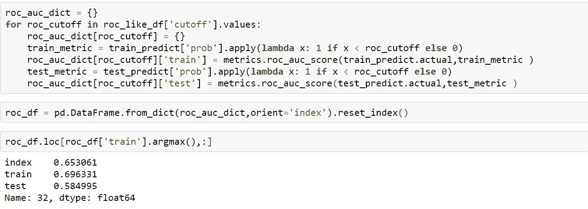

正如我们可以确认的，不同临界值的 Roc_auc 分数也表明 0.65 是最适合的临界值。

**根据测试数据进行预测**

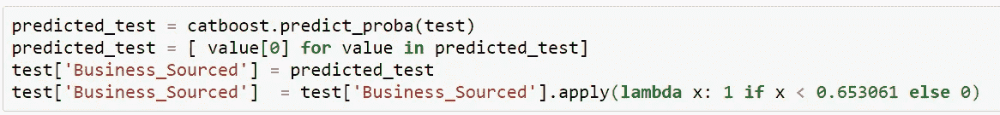

CatBoost 的“predict_proba”方法为每一行提供了两个值的数组，因此列表理解为在列表中获得其中一个值，然后使用 apply 方法使用截止值获得二进制预测。

这是两部分系列的第 1 部分的结尾。在这一部分，我们主要关注数据预处理、数据建模和截止值微调。在下一部分中，我们将使用 Google Colab 研究自动化特征工程和 Auto-ML。

本文的数据文件和 IPYNB 文档被添加到我的 Github 中，请随意下载并运行它们。

 [## rvt123/Medium_Articles

### 此时您不能执行该操作。您已使用另一个标签页或窗口登录。您已在另一个选项卡中注销，或者…

github.com](https://github.com/rvt123/Medium_Articles/tree/main/Code%20Walkthrough%20in%20An%20anonymous%20Machine%20Learning%20Hiring%20Hackathon) 

喜欢文章请鼓掌，评论分享观点并连接 over[**LinkedIn**](https://www.linkedin.com/in/raghuvansh-tahlan/)**。**

 [## raghuvansh tah LAN-Guru Gobind Singh Indraprastha 大学-新德里，德里，印度| LinkedIn

### 查看 Raghuvansh Tahlan 在世界上最大的职业社区 LinkedIn 上的个人资料。Raghuvansh 列出了 2 项工作…

www.linkedin.com](https://www.linkedin.com/in/raghuvansh-tahlan/)