# 匿名机器学习招聘黑客马拉松中的代码演练—第 2 部分

> 原文：<https://medium.com/analytics-vidhya/code-walkthrough-in-an-anonymous-machine-learning-hiring-hackathon-part-2-17f5df32ba43?source=collection_archive---------19----------------------->

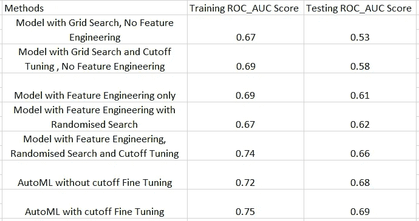

所有模型的比较结果

在本文的第 1 部分中，我们介绍了如何导入数据和库，预处理数据，使用 CatBoost 分类器模型和网格搜索来查找最佳参数，并通过最大化灵敏度和特异性之和以及最大化 Roc_Auc 分数来调整分类器截止值。

在这一部分中，我们将重点讨论特征工程、特征选择和自动机器学习(AutoML)。

## 特征工程

特征工程是 ML 管道中的重要步骤，因为机器学习模型只能和它的数据一样好。特征工程是通过经验、领域知识和一些尝试来学习的。我们将使用将生成列的组合或一些数学变换的技术来生成新的特征，因为它们可以在任何 ML 竞赛中使用，而不需要对特征进行太多的头脑风暴。

它在数据预处理之后，但在分割数据用于模型训练之前进行。当我们从组合数据中恢复了训练和测试数据后，我们将从上一篇文章中分支出来。


## 列的组合

大多数列是“分类”或“对象”类型，因此创建了由两列组成的要素。

让我们考虑这样一种情况，其中一列是“Office_PIN”和“Manager_Num_Products ”,那么这两列的组合将被称为“Office _ PIN _ and _ Manager _ Num _ Products ”,并且所有的值将使用“_”连接，因此将创建许多新的类别。

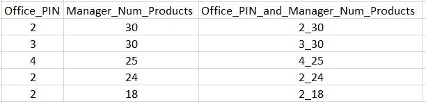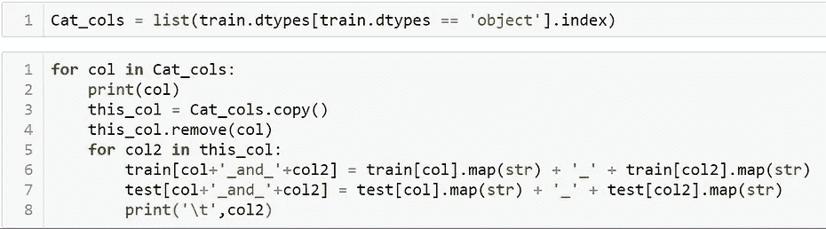

列的组合

**赔率日志**

这是分类问题中使用的一种技术，将分类变量转换为数字变量。数值变量可进一步用于特征工程。

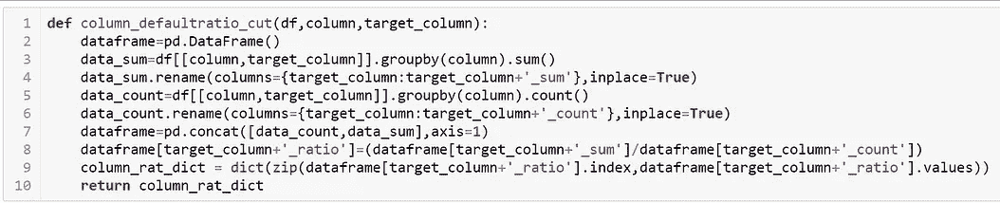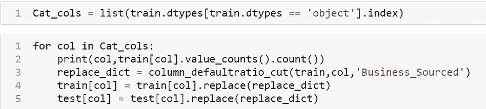

“column_defaultratio_cut”函数采用数据帧、要对其执行比值对数转换的列名以及目标变量，并返回字典。

**平方、平方根和对数变换**

因为在执行了对数概率转换后，所有列都是数字，所以我们可以执行平方、平方根和对数转换，因为有时这些转换后的变量具有更好的预测能力。

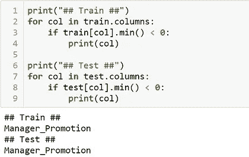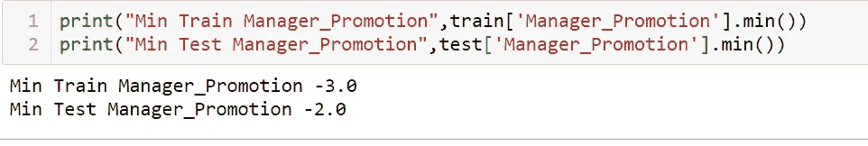

因为有一列的最小值为负，所以平方根和对数转换可能会显示一些错误，所以建议添加一个常数值以避免错误。

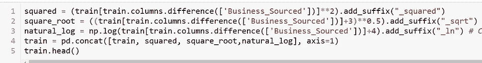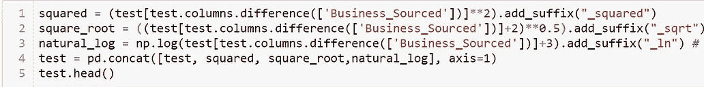

所有转换都经过计算并与原始数据帧合并，并检查在此过程中创建的任何空值。

经过这些转换后，我们的数据帧中有 1768 列，因此我们需要执行特征选择来选择一些最具预测能力的特征。

**功能选择**

可以有许多技术来选择最佳特征。尽管如此，我还是使用了一个 CatBoost 分类器，并根据特性的重要性对这些特性进行了排序，并选择了这些特性，直到它们的累积和达到 98%左右。这个过程重复多次，以减少变量的数量。其他技术，如使用 VIF 或相关，也可以用于特征选择。

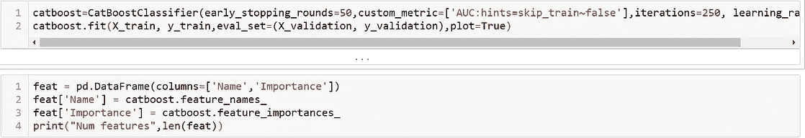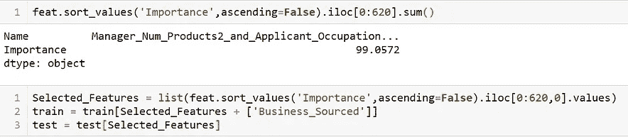

这是一个非常耗时的过程，所以用一个循环来自动化这个过程将会非常有益。重复这个过程 5-6 次后，我选择了 175 个特征。

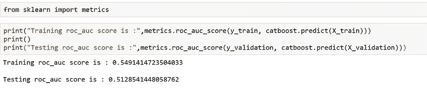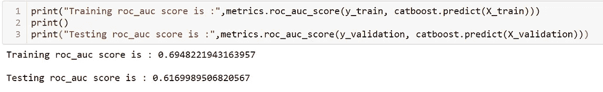

特征工程前后 ROC_AUC 的差异。

最初，当我们没有进行临界值调整时，我们的测试 ROC_AUC 得分是 0.51，现在已经增加到 0.61。然而，在使用 AutoML 技术、找到最佳参数和截止调谐之后，它仍然可以增加。

**随机搜索最佳参数**

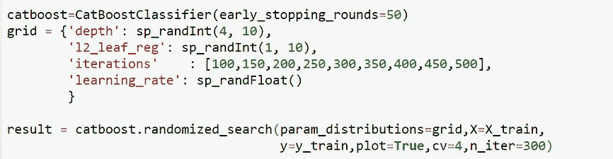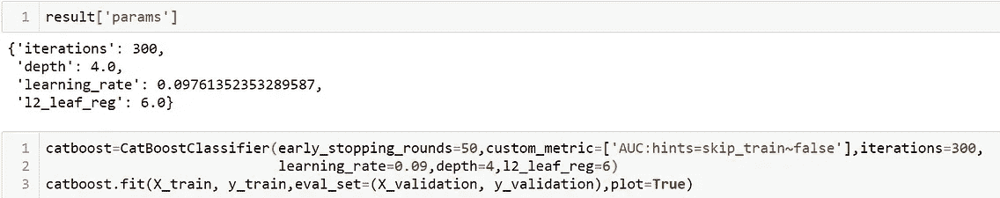

它类似于网格搜索，因为两者都使用参数范围。尽管如此，在网格搜索中，我们用整数来定义参数的范围，并且尝试所有的组合。相反，在随机搜索中，尝试由“niter”参数定义的有限数量的组合。网格搜索有效但速度慢；随机搜索速度很快，但并不总是有效。

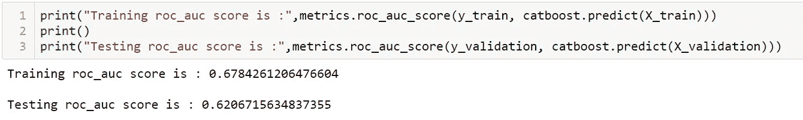

随机搜索后的 ROC_AUC 得分

**通过最大化 ROC_AUC 得分**进行临界值调整，使用“predict_proba”函数预测训练和验证集的概率，然后尝试不同的临界值，以找到 ROC_AUC 最大的临界值。

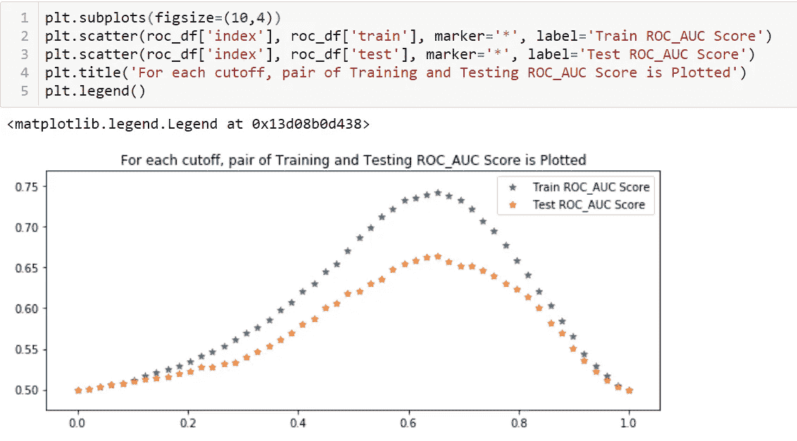

训练和测试 ROC_AUC 分数

使用调整的截止值 0.65，我们得到训练和测试 ROC_AUC 分数为 0.74 和 0.66。

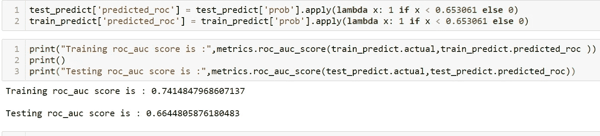

到目前为止，我们已经看到我们的测试 ROC_AUC 分数有了相当大的改进，但是我们仍然有一些东西，那就是 AutoML。一些人认为 AutoML 会吞噬掉工作岗位，另一些人则认为它还有很长的路要走。让我们把它看作一种工具，如果它能产生好的结果，就使用它。AutoML 有很多种，比如 Google、AWS、Azure、H2O、AutoKeras、Auto Sklearn、TPot 和 Pycaret，有些是付费的，有些是开源的，但我在黑客马拉松中不使用付费工具。我发现[的 MLJAR](https://mljar.com/) 非常有用并且易于使用。他们有开源代码和付费网络服务。我会推荐在 Google Colab 上或者在虚拟环境中使用 MLJAR。

因此，保存我们的数据集用于 Colab。

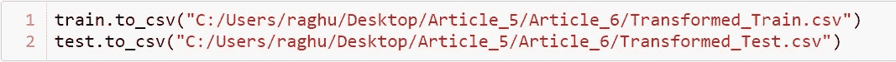

## **MLJAR**

我们需要的大多数库都是预装在 Google Colab 上的，但是我们必须安装 MLJAR。使用下面的命令非常简单，安装完成后，会提示重启运行时来完成我们的安装。

```
!pip install mljar-supervised
```

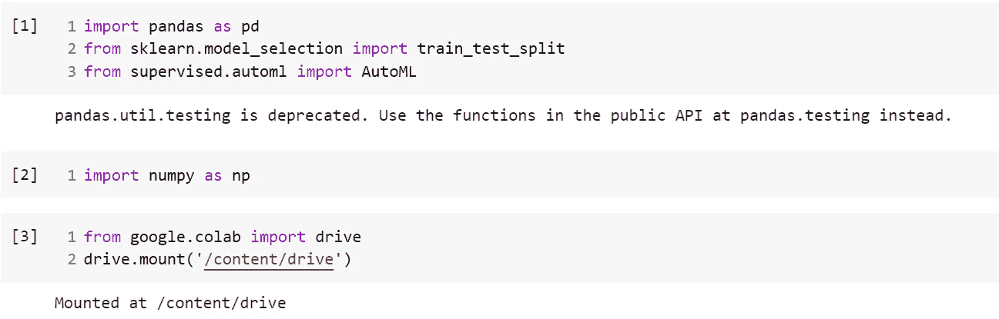

我们将不得不导入一些库来开始。

```
from google.colab import drivedrive.mount('/content/drive')
```

我们可以在 Colab 和 Google drive 上上传我们的数据集，我已经使用了后者，然后我们可以使用上面的命令导入我们的驱动器。

成功导入驱动器后，我们可以读取数据文件。

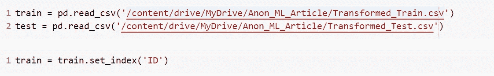

MLJAR 有许多模式，因为我们将它用于黑客马拉松/竞赛，我们将使用“竞争”模式。关于不同模式的信息可以在他们的 Github 库中找到。

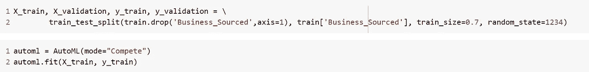

这将需要一些时间，具体取决于数据集的大小。测试 ROC_AUC 分数有显著改善，我们将检查调整截止值是否能显示更多改善。

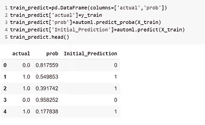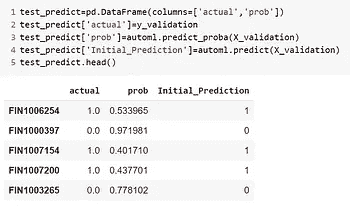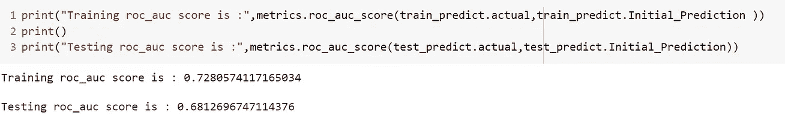

## AutoML 模型上的微调截止值

之前用于调节临界值的两种方法都在 Jupyter 笔记本中执行过，结果相似，都将测试 ROC_AUC 分数提高了一点，达到 0.693。

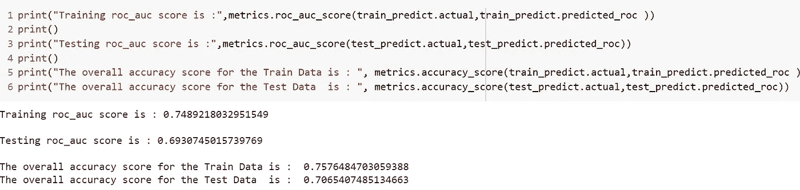

**结果**


所有模型的比较结果

在这两篇文章中，我们已经从第一个模型开始构建了许多模型，在第一个模型中，我们使用了带有 Catboost 的网格搜索来自动进行截止微调。这次旅程向我们展示了大约 30%的测试分数提高，从 0.53 提高到 0.69。

## 遗言

虽然我参加了这次黑客马拉松，但还是没能取得这个好成绩。我类似地做了所有的步骤，除了特性工程，在编译这篇文章时我增加了一个步骤，这确实有所不同。所有的数据文件和 Jupyter 笔记本都是到 Github 的资源库。欢迎评论和建议。

[](https://www.linkedin.com/in/raghuvansh-tahlan/) [## raghuvansh tah LAN-Guru Gobind Singh Indraprastha 大学-新德里，德里，印度| LinkedIn

### 查看 Raghuvansh Tahlan 在世界上最大的职业社区 LinkedIn 上的个人资料。Raghuvansh 列出了 2 项工作…

www.linkedin.com](https://www.linkedin.com/in/raghuvansh-tahlan/) [](https://github.com/rvt123/Medium_Articles/tree/main/Code%20Walkthrough%20in%20An%20anonymous%20Machine%20Learning%20Hiring%20Hackathon) [## rvt123/Medium_Articles

### 此时您不能执行该操作。您已使用另一个标签页或窗口登录。您已在另一个选项卡中注销，或者…

github.com](https://github.com/rvt123/Medium_Articles/tree/main/Code%20Walkthrough%20in%20An%20anonymous%20Machine%20Learning%20Hiring%20Hackathon)