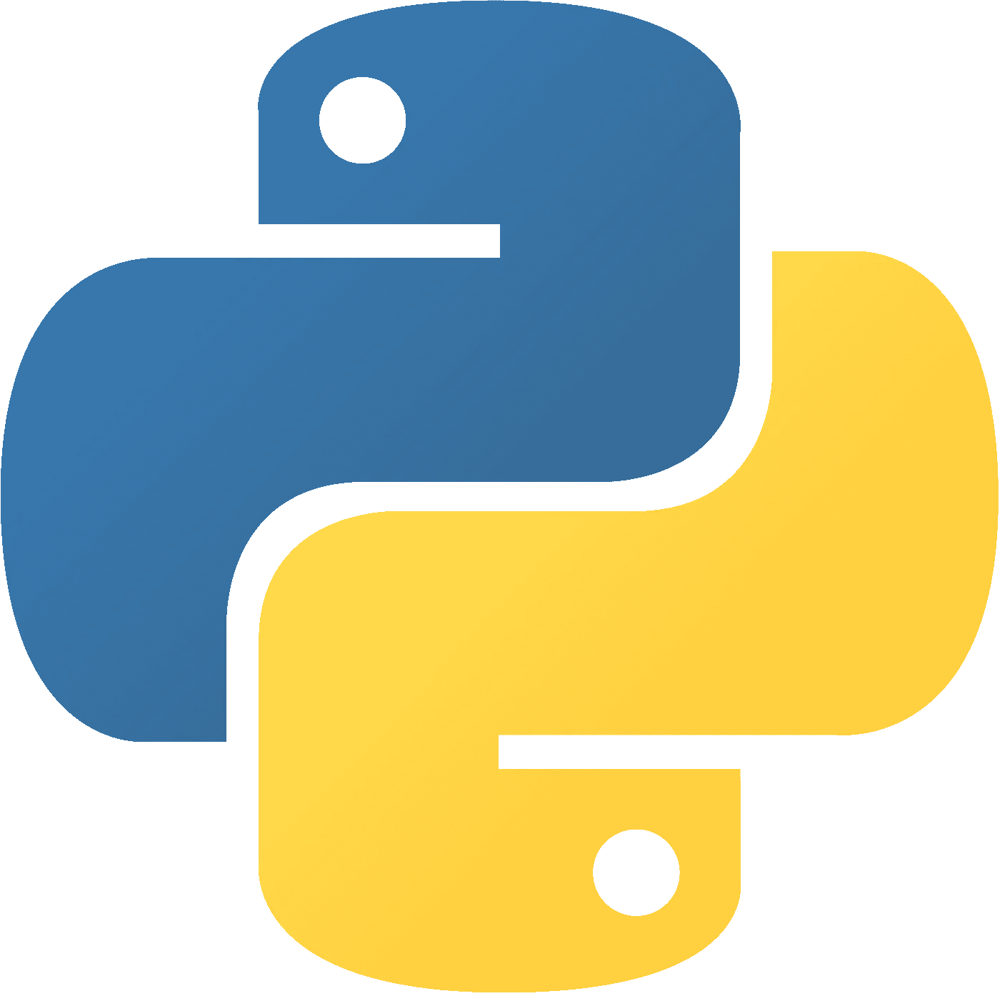
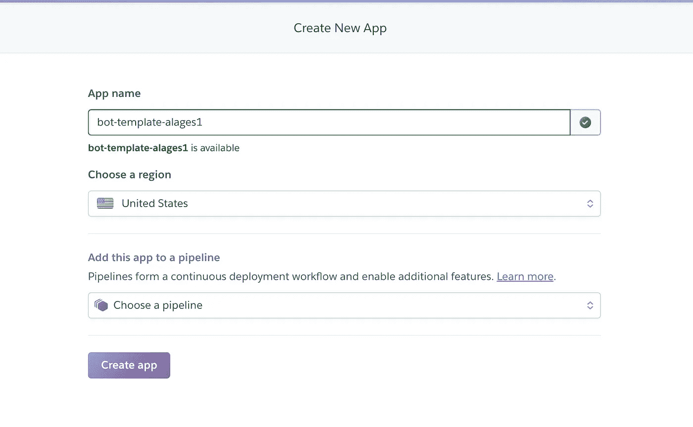
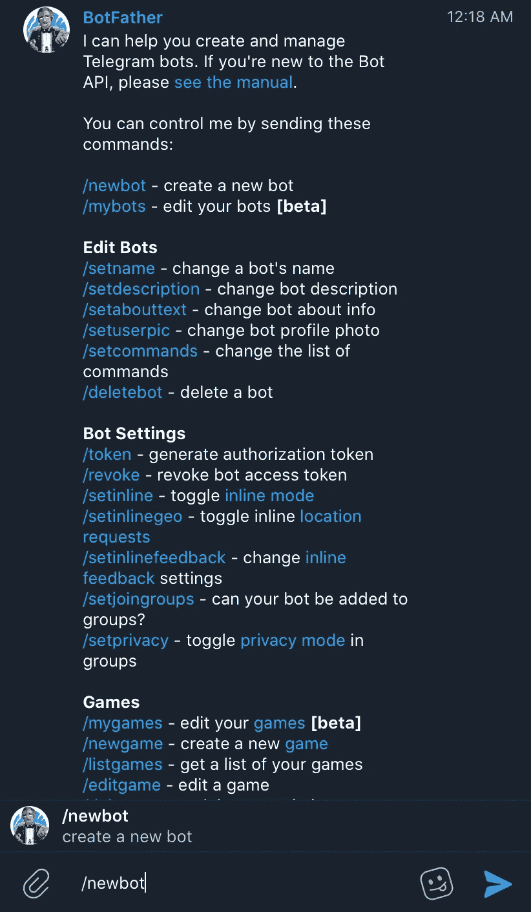
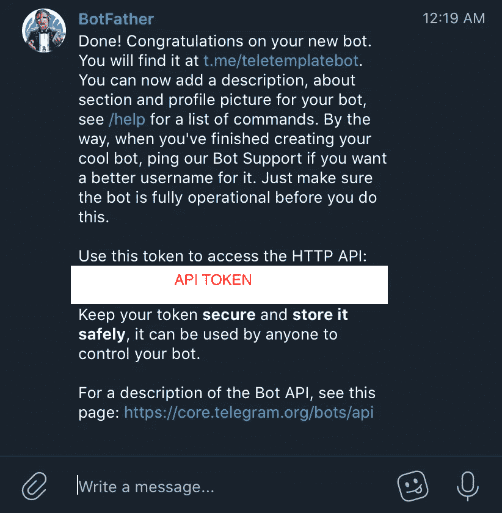
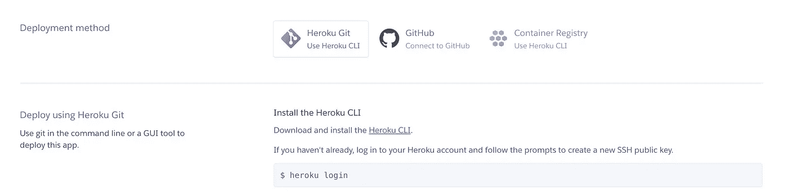

# 用 pyTelegramBotAPI 编写你的第一个电报机器人

> 原文：<https://medium.com/analytics-vidhya/code-your-first-telegram-bot-with-pytelegrambotapi-1e6108cfa3b7?source=collection_archive---------4----------------------->

*在线部署电报机器人的最快方法！*



当我第一次对如何创建自己的电报机器人感到好奇时，我在互联网上寻找最简单的方法。我偶然遇到的每一个优步似乎都以自己独特而乏味的方式做这件事，这对新手来说似乎令人生畏。

不要担心，在做了一些研究后，我现在介绍一种方法，让你的电报机器人在大约一个小时内启动并运行。(如果您已经熟悉编程概念，例如 Python/Git/Heroku，速度会更快)

对于本教程，我们需要(假设您已经在本地安装了 git 和 python):

*   赫罗库
*   计算机编程语言
*   电报帐户

首先，你需要建立一个 [Heroku](https://www.heroku.com) 账户，如果你还没有的话。
注册后，继续创建新的应用程序。



此时不要添加管道，只需填写前两个并单击 create app。

创建应用程序后，我们将过渡到 telegram。您需要在 BotFather 下创建一个 bot，如下所示。



/newbot

相应地填写所有信息，如果 bot 创建成功，您应该会看到如下内容:



您将很快需要从 BotFather 获得的 API 令牌

接下来，打开终端/cmd 并运行以下命令

`virtualenv botenv
source botenv/bin/activate`

这样做的目的是创建一个虚拟环境，将随后使用 pip3 安装的依赖项与其他 python 项目分开。

`pip3 install pyTelegramBotAPI Flask`

上面这段代码安装了我们的电报机器人运行所需的所有依赖项。

之后，在同一个目录下创建一个 bot.py 文件，并将以下代码粘贴到该文件中:

```
import telebot
import os
from flask import Flask,request TOKEN = "Insert API Token from BotFather here"
bot = telebot.TeleBot(token=TOKEN)
server = Flask(__name__)
```

这将导入我们之前用 pip3 安装的所有依赖项。我们还需要用 BotFather 提供的令牌替换令牌变量。请注意，令牌应该封装在左引号和右引号中。

接下来，我们可以将下面的代码粘贴到文件中，以定义我们的机器人的行为(即:如果我们发送'/help '，机器人将回复' Help message ')。更多信息请看一下 [API](https://gist.github.com/alages97/af3308d291551d7443e8b39dce787076) ！

请注意，第 9–11 行的函数基本上是让机器人模仿用户发送给它的任何东西，使用这个函数来实现您想要的输出！

为了设置 webhook，bot.py 文件的最后一部分由以下代码行组成。

将 url 的第一部分替换为您之前创建的 Heroku 应用程序的名称。在我的例子中，URL 将是“https://bot-template-alages 1 . heroku app . com”

现在，为了将我们的代码安装到 Heroku 的服务器上，它需要一个名为 Procfile 的文件，该文件指定了应用程序在启动时执行的命令。

在与 bot.py **相同的目录中创建‘Procfile’(注意，proc file 没有文件扩展名)**

因为我们的 python 代码位于 bot.py 中，所以我们将以下代码复制到 Procfile 中:

```
web: python3 bot.py
```

现在，我们需要一个 requirements.txt 文件来让 Heroku 知道我们在项目中安装了哪些依赖项。在与 bot.py 和 Procfile 相同的目录中创建 requirements.txt 文件，并在 terminal/cmd 上运行以下命令

```
pip3 freeze > requirements.txt
```

如果您成功地完成了这一步，requirements.txt 现在应该包含我们的 bot 正常运行所需的所有依赖项。

回到你的浏览器，你现在应该在 https://dashboard.heroku.com/apps/[<](https://dashboard.heroku.com/apps/bot-template-alages)app _ name>上。导航到页面的部署部分，您应该看到以下内容:



对于这个项目，我们将使用 Heroku CLI 将我们的 bot 部署到服务器，所以继续下载并安装 Heroku CLI。之后，在您的 cmd/终端上，键入上面的命令(heroku 登录)。通过身份验证后，请执行以下操作:

```
git init
heroku git:remote -a <app_name>
git add .
git commit -am "make it better"
git push heroku master
```

如果到目前为止您已经正确执行了上述所有步骤，您应该会看到以下内容:

```
[https://<app_name>.herokuapp.com/](https://bot-template-alages.herokuapp.com/) deployed to Heroku
```

就是这样！您已经成功地将您的机器人部署到 Heroku。现在你可以去给你的机器人发电报了，看看它会有什么反应！

[](https://github.com/alages97/telebot_template) [## alages97/telebot_template

### 电报机器人模板，在 Heroku 上运行。为 alages97/telebot_template 开发做出贡献，创建一个…

github.com](https://github.com/alages97/telebot_template) 

如果你喜欢我与你分享的内容，表现出一些爱，并留下一些评论/掌声。也接受关于接下来分享什么的建议！