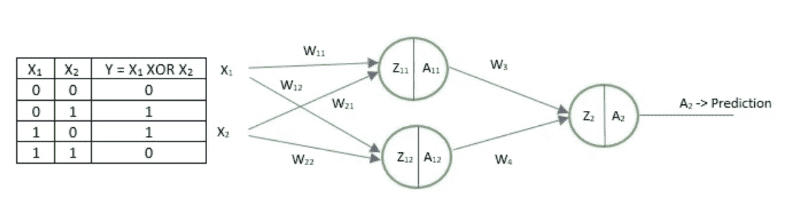
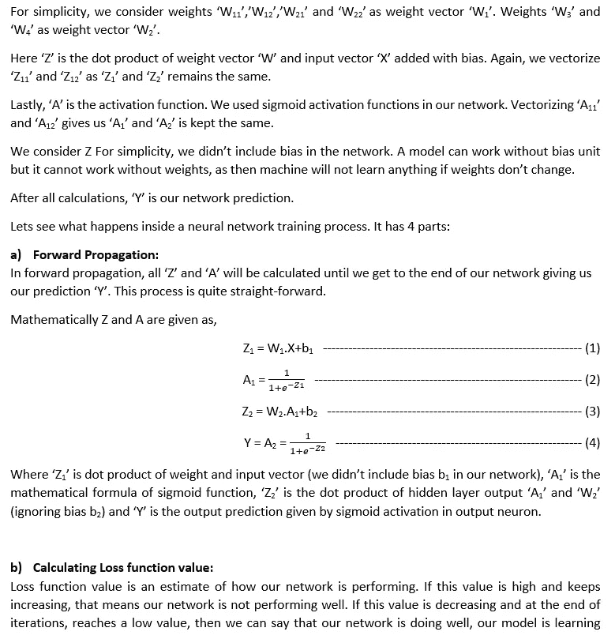
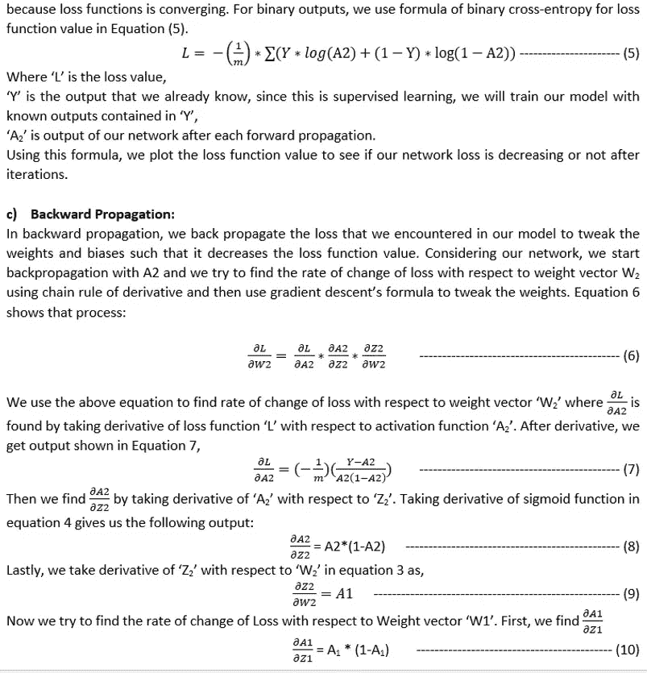
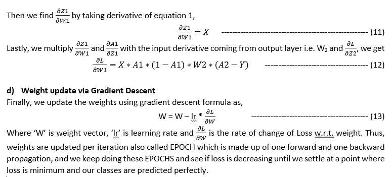
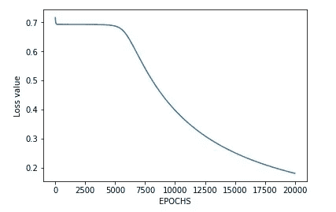
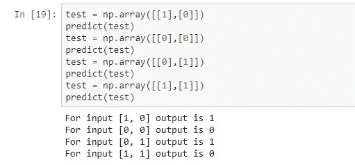

# 从零开始理解和编码用于 XOR 逻辑分类器的神经网络

> 原文：<https://medium.com/analytics-vidhya/coding-a-neural-network-for-xor-logic-classifier-from-scratch-b90543648e8a?source=collection_archive---------4----------------------->

在这个项目中，我实现了我所有神经网络理论知识的概念证明，以便在不使用任何机器学习库的情况下，从零开始用 Python 编写一个简单的神经网络。

# **简介**

一些像神经网络这样的机器学习算法已经是一个黑盒，我们在其中输入输入，并期待奇迹发生。尽管如此，理解神经网络中幕后发生的事情是很重要的。我们可以使用 Keras 等库来简化我们的生活，但如果我们不了解神经网络内部发生了什么，那么我们很容易陷入无限循环，而不知道我们的神经网络出了什么问题。从零开始编码一个简单的神经网络作为这方面的概念证明，并进一步加强我们对神经网络的理解。

在该项目中，使用单个隐藏层神经网络，隐藏层单元中具有 sigmoid 激活函数，输出层也具有 sigmoid 激活函数，因为 XOR 逻辑的输出是二进制的，即 0 或 1，在输出层中只有一个神经元。神经网络背后的数学原理解释如下:

# **神经网络背后的数学解释:**

以下工作显示了单个隐藏层神经网络背后的数学原理:

# 密码

以下代码要点显示了神经网络参数的初始化。

下面的代码要点展示了 Python 中的激活函数和向前向后传播函数

最后，我们运行神经网络 10000 个时期，并查看损失函数如下:

# **结果**

下图显示了我们网络的损耗函数，可以看出它正在下降。

以下是神经网络对测试输入的预测:

众所周知，对于 XOR，输入 1，0 和 0，1 将产生输出 1，输入 1，1 和 0，0 将产生输出 0。这正是神经网络正在做的。

# **代码**

请在[https://Github . com/shayanalibhatti/Coding-neural _ network-for-XOR-logic-from-scratch](https://github.com/shayanalibhatti/Coding-neural_network-for-XOR-logic-from-scratch)查看 Github 上的完整代码，代码带有注释，便于读者理解。

# **结论**

从头开始编写一个神经网络增强了我对神经网络幕后发生的事情的理解。我希望神经网络的数学解释以及它在 Python 中的编码将帮助其他读者理解神经网络的工作。