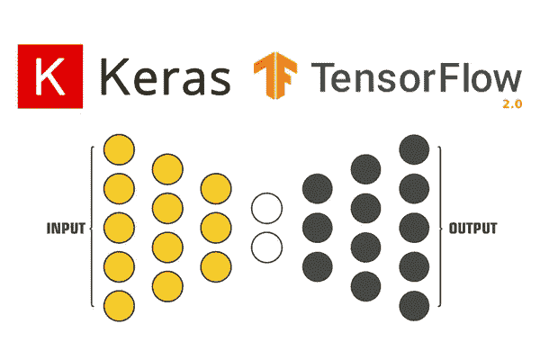
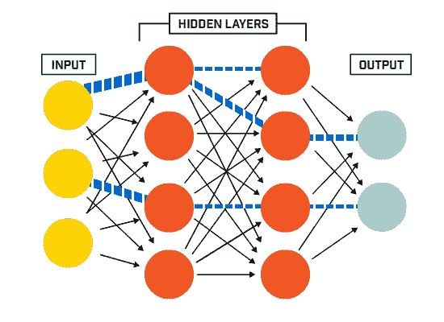
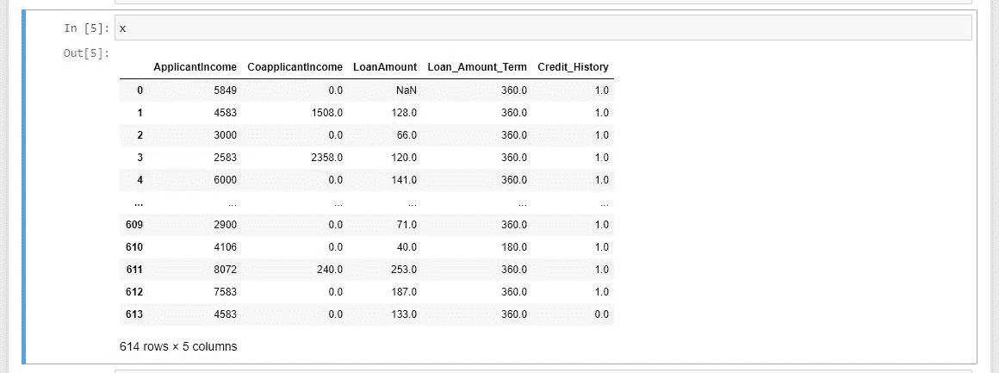
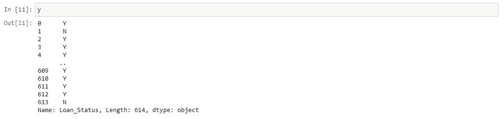
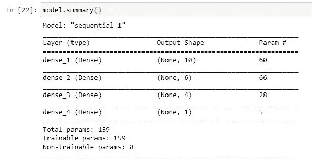

# 简而言之就是“快速编写神经网络代码”！

> 原文：<https://medium.com/analytics-vidhya/coding-a-neural-network-quick-in-nutshell-52b49cfa9b23?source=collection_archive---------16----------------------->



众所周知，理解神经网络的过程(数学上)有多复杂，但编写代码一样简单。KERAS 的世界让这一切变得简单易行。因此，让我们花点时间来感谢 Keras 库使整个过程变得更加容易。

Keras 是 python 的开源深度学习库，它使得构建网络变得简单而容易。它包括所有的代码示例和参数细节，用于构建网络架构，如层，以调整神经网络的超参数，如优化器和损失。这个库为你做了所有复杂的数学运算，并且给了你对编码的控制权，而不是让你为数学伤透了脑筋。


花点时间浏览一下 https://keras.io/[的主页，你会对他们记录事情的方式感到惊讶。](https://keras.io/)

现在让我们列出建立一个网络所需要的东西。在这里，我们将讨论建立一个人工神经网络结构的顺序模型。概括地说，人工神经网络由三部分组成:输入层、隐藏层和输出层。将存在偏差因子，且每个单元权重将被随机初始化，并且随后通过反向传播进行调整。更深入的直觉检查:

[](/analytics-vidhya/neural-networks-in-nutshell-7d1cc3ae6443) [## 简而言之，神经网络

### 神经网络

简单地说，神经 Networksmedium.com](/analytics-vidhya/neural-networks-in-nutshell-7d1cc3ae6443) 

上面的架构是顺序模型，在 keras 中构建它是关于堆叠层和为权重调整设置一些时期。

因此，让我们以贷款资格数据集为例，其特征列(我选择的)为“申请人收入”、“共同申请人收入”、“贷款金额”、“贷款金额期限”和“信用历史”，目标列为“贷款状态”。



数据集最初由 614 行和 13 列组成。我们不会在这里讨论特性工程(我已经注释掉了代码以供参考，并提供了下载的数据集链接),而是只关注构建模型。

```
import numpy as np
import pandas as pd
from sklearn.preprocessing import LabelEncoder as le
from sklearn.preprocessing import StandardScaler as ss#importing dataset
ds = pd.read_csv("train.csv")#feature columns
x = ds.iloc[:,[6,7,8,9,10]]#handling missing datas
x["LoanAmount"].fillna(0, inplace = True)
x["Loan_Amount_Term"].fillna(0, inplace = True)
x["Credit_History"].fillna(0, inplace = True)#target column
y = ds.iloc[:,-1]#handling categorical datas
y = le().fit_transform(y[0:614])#normalising the feature columns
x = ss().fit_transform(x)
```

[](https://www.kaggle.com/burak3ergun/loan-data-set) [## 贷款数据集

### 贷款数据集分类

www.kaggle.com](https://www.kaggle.com/burak3ergun/loan-data-set) 

现在我们完成了特征工程，让我们开始构建模型。要构建一个模型，你只需要两个库 Tensorflow(用于运行它的后端)和 Keras。粘贴下面的代码直接安装，我强烈推荐使用谷歌 Colab，因为它有免费的 GPU 来加快模型训练。

```
!pip install tensorflow
!pip install keras
```

现在导入两个主要函数 **Sequential** 用于构建序列模型，导入 **Dense** 用于堆叠模型的层。



这里我使用了四个密集层序列模型，其中 dense_1 是输入参数，dense_4 是输出层。dense_2 和 dense_3 是隐含层，有 159 个训练参数。让我们导入必要的库。

```
import keras
from keras.models import Sequential 
from keras.layers import Dense
```

因此，我们从 keras.models 导入 sequential 来构建序列模型，从 keras.layers 导入 dense 来创建层，我们完成了导入所需组件来构建神经网络，就这么简单！。现在让我们用我们想要的单位初始化层，但是记住选择正确的层数和单位是至关重要的，因为它直接影响模型的性能。

从我的角度来看，选择正确的层数和正确的单位是一种艺术，因为这需要实践和大量的计算，但你仍然可以用一种简单的方法来做到这一点。

因此，考虑 dense_1，第一层有 10 个单位(我刚才看到 feature 列有 5 个单位，所以增加了一倍)，dense_4 有一个单位，如您所知，我们在输出层只需要一个单位，因为 target 列只有一个值为“yes”或“no”的列。现在把第一层单位和最后一层单位加起来。然后除以 2，就是:10 + 1 / 2 = 5.5 四舍五入它 6，所以 dense_2 得了 6 个单位。同样像拿 dense_2 和 dense_4，就是:6 + 1 / 2 = 3.5 四舍五入到 4 个单位，dense_3 得到 4 个单位。

**注意**:这不是理想的方法，但效果很好。

```
#making function which got sequence architecture 
model = Sequential()
```

制作模型后，现在添加密集层。

```
model.add(Dense(units = 10, activation = "relu", input_dim = 5))
```

**model.add** 会为你创建层， **Dense** 会在层中添加单位。该层包括 10 个单元，参数来自这 5 个特征列，这使得 **input_dim = 5** ，最后我们添加 **relu** 作为单元的激活函数，以从模型中移除非线性。

```
model.add(Dense(units = 6, activation = "relu"))
```

这是第二层，由 6 个单元组成，如上所述，具有 relu 激活功能。注意，这一层没有 input_dim，因为这一层的输入单元来自前面的层。

```
model.add(Dense(units = 4, activation = "relu"))
```

这是第三层，正如我们在前面几层所做的，单位和激活功能也以同样的方式初始化。

```
model.add(Dense(units = 1, activation = "sigmoid"))
```

最后，我们通过添加一个单元将其作为输出层，我们添加了用于激活的 **sigmoid** 函数，因为 sigmoid 是输出层中非常需要的概率解决方案的更好选择。

现在，我们已经完成了模型架构的构建，但是我强烈建议调整层数和它们的单位，以便亲自了解一些事情。剩下的唯一事情是训练模型，这也很容易用一行代码完成。

```
model.fit(x, y, batch_size = 32, epochs = 100)
```

**model.fit** 取我们分别声明为“x”和“y”的特征值和目标值。时段的数量只是通过反复遍历网络来重新计算权重，这是“反向传播”方法，选择正确的时段数量至关重要，因为数量较少的模型会欠拟合，数量较多的模型会过拟合。batch_size 是将输入值划分到某个批次中并进行计算，该批次的默认值为 32。

下面是一段完整的代码:

```
import numpy as np
import pandas as pd
from sklearn.preprocessing import LabelEncoder as le
from sklearn.preprocessing import StandardScaler as ss#importing dataset and make sure the dataset in same folder.
ds = pd.read_csv("train.csv")#feature columns
x = ds.iloc[:,[6,7,8,9,10]]#handling missing datas
x["LoanAmount"].fillna(0, inplace = True)
x["Loan_Amount_Term"].fillna(0, inplace = True)
x["Credit_History"].fillna(0, inplace = True)#target column
y = ds.iloc[:,-1]#handling categorical datas
y = le().fit_transform(y[0:614])#normalising the feature columns
x = ss().fit_transform(x)import keras
from keras.models import Sequential 
from keras.layers import Densemodel = Sequential()model.add(Dense(units = 10, activation = "relu", input_dim = 5))
model.add(Dense(units = 6, activation = "relu"))
model.add(Dense(units = 4, activation = "relu"))
model.add(Dense(units = 1, activation = "sigmoid"))model.fit(x, y, batch_size = 32, epochs = 100)model.summary()
```

**注意**:尝试自己调整所有参数，也可以调整不同的数据集以获得更多理解，还可以使用 Google Colab 和 GPU 运行时进行深度学习。

谢谢，继续学习。！