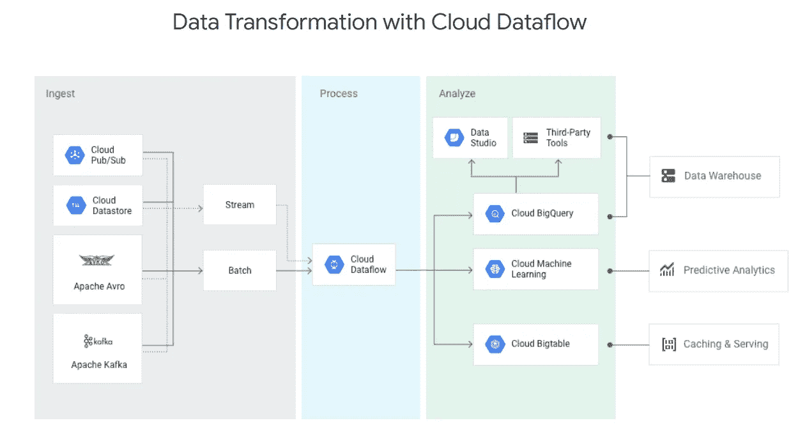
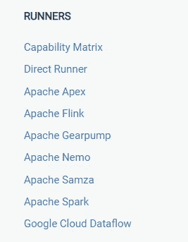

# 用 Google 数据流和 Apache Beam 编写批处理流水线

> 原文：<https://medium.com/analytics-vidhya/coding-a-pipeline-for-batch-processing-with-google-dataflow-and-apache-beam-e3726ef96998?source=collection_archive---------0----------------------->



# 语境

几个月前，我有一个需求，要处理来自不同来源的一些信息，然后将所有信息放入 Bigquery，使业务部门能够做出数据驱动的决策。

这些信息分布在不同的数据库中。因此，我有三个不同的 Google Datastore 实例，一个是运行在 Compute Engine 上的 CouchDb，另一个是 Firebase。

对于不知道 CouchDb 如何工作的人来说？嗯，主要是它的特点是它的 API 和它的工作原理是基于 map reduce 算法。因此，从 couchdb 消费数据的唯一方式是通过它的 API 使用 HTTP 请求。

所以如果你仔细想想。我们正在讨论数据流的一个常见用例，在故事的开头给出了特征图像。唯一的区别是 firebase 和 couchdb 是摄取列中的另外两个组件。

# 挑战

创建管道，因为该公司主要与谷歌云平台合作。他们决定使用谷歌数据流，你可以想象我会遇到一些挑战:

1.  首先，通过不同 Google 项目的认证。

2.最困难的事情是连接到 CouchDb。Dataflow 使用一个名为 Apache Bean 的强大 python 支持库来转换和操作数据。因此，为了建立到数据库的连接，Apache Bean 已经有了一些驱动程序。但不幸的是，对于 CouchDb 来说，它没有一个本地连接器来检索数据。

3.这是我第一次使用数据流。所以，我对 Apache Bean 和 Dataflow 的主要概念一无所知。

# 面对挑战

因为我有这些问题。今天，我想分享一些代码，讲述我是如何使用 apache beam 构建的自定义连接器从 couchdb 检索数据的，然后我将向您展示如何将数据格式化为所需的格式，然后将最终数据写入 Bigquery。

# 1.第一个挑战:启用身份认证:

对于认证没有太大的问题，因为 Google Dataflow 通过不同的 Google 项目支持本地认证。我唯一要做的事情是，在数据存储实例所在的项目中，从 Google cloud 控制台的 IAM 和 Admin 菜单中启用对数据流代理的访问。

比如说。假设我有两个谷歌项目。一个项目 Id 为 501078922177，其中数据流作为 appengine flex 实例运行，另一个数据存储所在的项目 Id 为 576371170178:因此，我想从数据流所在的另一个数据存储访问数据存储。

我要做的是在 IAM 和项目 576371170178 的管理是授予数据流用户作为云数据存储所有者。数据流用户它有一个你将在下面看到的格式。但是，在您的 Google 项目中启用数据流服务后，您可以在项目中找到它。

501078922177-compute@developer.gserviceaccount.com->数据流用户

576373870178-compute@developer.gserviceaccount.com->数据存储用户


# 2.第二个挑战:使用数据流:

数据流是谷歌提供的最大的服务之一，通过支持流和批处理来转换和操作数据。为 Dataflow 上的代码提供的主要库是 Apache beam，它不仅支持 Google Dataflow，还支持我稍后将提到的另一个类似的服务。Apache beam 也可用于 java、python 和 Go。

在开始分享代码之前，我建议您阅读一些关于 Beam 和数据流的关键术语:p 集合、输入、输出、管道和转换。我们将在后面的代码中看到它们中的大部分，但是你可以在这里阅读更多关于[的内容。](https://beam.apache.org/documentation/programming-guide/)

现在，让我们开始编码:

我们的示例将使用 Flask 和 python 创建一个 http 触发器来触发批处理管道执行，但是您也可以使用 [pubsub](https://cloud.google.com/pubsub/?utm_source=google&utm_medium=cpc&utm_campaign=na-US-all-en-dr-skws-all-all-trial-p-dr-1006141&utm_content=text-ad-none-any-DEV_c-CRE_338002380621-ADGP_Hybrid+%7C+AW+SEM+%7C+SKWS+%7C+RLSA+%7C+US+%7C+en+%7C+PHR+~+Big+Data+~+Pub/Sub+~+pub+sub-KWID_43700042031920858-aud-663326727744:kwd-380893598623&utm_term=KW_pub%20sub-ST_pub+sub&gclid=Cj0KCQjwnpXmBRDUARIsAEo71tQGfKVF1nDfuknqV3_KcSWAEp9Zg_0hRiyQUULQcG8RQCt8TGUsl5caAi8XEALw_wcB) 作为触发器。

我们的文件夹结构如下:

```
pipelines
  __init__.py
  api
     __init__.py
     endpoints
       __init__.py
       http_trigger.py tools
        pipe_options.py
        __init__.py  
  couch
    __init__.py
    beam
      __init__.py # Beam connector to retrieve data from CouchDb
      helper
    services
      __init__.py
      paginator.py
  tools
    __init__.py
    datastore.py transforms 
    __init__.py
    couch_data.pymain.py
requirements.txt
app.yaml
setup.py
appengine_config.py
README.md
```

第一步是创建 main.py 文件:

**2.1- > main.py:** 基本定义了烧瓶 App

```
**"""main.py"""**from __future__ import absolute_importimport os
from flask import Flask
from pipelines.api.endpoints.http_trigger import *APP = Flask(__name__)if __name__ == '__main__':
   print('serving on 0.0.0.0:8000')
   APP.run(host='0.0.0.0', port=8000, debug=True
```

**2.2->pipelines/API/tools/pipe _ options . py:**

在这个文件中，我们将定义关于如何执行管道的管道选项；作业名称、工人数量、运行者，可以是下列之一:



在我们的例子中，我们将使用 DataflowRunner，因为我们的项目将在 Google Dataflow 上运行。如果你想在阿帕奇射束可用的跑步者中潜水更多，在这里阅读更多。

```
"""**pipelines/api/tools/pipe_options.py**"""def get_pipeline_options(job_name, runner='DataflowRunner',m
   max_num_workers=10):
   """Build pipeline options for profile_api."""

   project = 'PROJECT_ID' #replace with your projectId
   bucket = 'BUCKET' # replace with your cloudstorage bucket

   pipe_options = {
      'project': project,
      'staging_location': 'gs://%s/dataflow' % bucket,
      'runner': runner,
      'setup_file': './setup.py',
      'job_name': '%s-%s' % (project, job_name),
      'max_num_workers': max_num_workers,
      'temp_location': 'gs://%s/temp' % bucket
   } return pipe_options
```

**2.3 - >管道/API/端点/http_trigger.py** - >烧瓶路线

```
"""**pipelines/api/endpoints/http_trigger.py**"""from __future__ import absolute_importfrom pipelines.api.tools.pipe_options import get_pipe_options
from pipelines.transform_couchdata import transform_couchdatafrom main import APP@APP.route('/services/v1/pipeline_trigger')
def migrate_session_data():
   pipe_options = get_pipeline_options('transform-couchdata')
   transform_couchdata(pipe_options) return 'Done', 200
```

看到参数 **transform-couchdata** 是我们的作业名，而**migrate _ data _ fromcuchdb**是执行我们的批处理的函数。

**2.4 - >管道/治疗床/服务/分页器. py**

您将在下面看到的分页装饰器帮助我们从 Couchdb 中检索数据。

为了创建我们的连接器，我们将利用 CouchDb 上可用的一个特性，即视图。

CouchDb 上的视图是如何工作的？

基本上，CouchDb 上的视图公开了存储在 Couchdb 上的数据，以便通过 http 请求使用。请在这里阅读更多关于 couchdb 视图的内容。

假设我们已经在 couchdb 上构建了一个视图，我们能够在来自[http://yourcuchdburl:5984/<数据库>/_ design/<design>/_ view/<v](http://35.226.21.246:5984/profile/_design/passport/_view/users_with_education)view _ name>的所有 http 请求中使用该视图，并且该视图以以下格式公开数据:

```
{
  "total_rows": "1000000",
  "offset": "",
  "rows": [
      {
        "**id**": "**1344fdfa-f057-460d-906f-3421ddf..0000785e-f057-460d-906f-822ad7d43969..career**",
        "key": "0000785e-f057-460d-906f-822ad7d43969",
        "value": "Software Engineering"
     },
     ...
  ]
}
```

如您所见，视图基本上是一个以 json 格式公开数据的 web 服务。在最后一个例子中， **id** 属性的格式为**客户端..用户标识..doc_name** ，所以我们将使用双点作为分隔符将其拆分，然后将其转换为下面的格式，然后将其写入 Bigquery 中名为 **UserCareer** 的表中:

```
{
   "client": "1344fdfa-f057-460d-906f-3421ddf",
   "user_id": "0000785e-f057-460d-906f-822ad7d43969",
   "value": "Software Engineering"
}
```

我们如何将这些数据处理到我们的管道中，然后进行转换？

请记住，数据流的主要思想是在数百台服务器之间执行数百个并行进程，以加快进程。因此，想象一下，我们将几乎同时使用不同的参数对 couchdb 视图执行数百个请求，以进行分页和其他操作。然后，我们将使用波束转换合并不同的响应，将所有内容放入同一个 pcollection 中。这个过程通常基于分布式编程的概念。因此，下面的 python 装饰器有助于处理 http 请求。

```
**"""pipelines/couch/service/paginator.py"""**import logging
import requests
import urllibdef paginate(func):
   """Paginator.""" def func_wrapper(self, *args, **kwargs):
       """
         Request a couchdb view.
         This decorator can be used to decorate
         methods part of the Requester class.
       """ couch_host = 'your couchdb host url or ip'
       couch_port = '5984' # default port 
       database = self.database
       design = self.design
       view = self.view
       limit = kwargs.get('limit', self.default_limit)
       skip = kwargs.get('skip', self.default_skip)
       params = {
          'limit': limit,
          'skip': skip
      }
      view_url = \
         '{host}:port}/{database}/_design/{design}/_view/{view}?\
           {params}'.format(
              host=couch_host, port=couch_port,
              database=database, design=design,
              view=view, params=urllib.urlencode(params)) try: req = requests.get(view_url) if req.status_code != 200 and req.status_code != 204: raise Exception(
                'Couch response with error, %s' % req.status_code)
         response = req.json() total_rows = response.get('total_rows')
         offset = response.get('offset')
         result = response.get('rows')
         more = True

         if total_rows == offset:
             more = False

         setattr(self, 'total_rows', total_rows)
         setattr(self, 'offset', offset)
         setattr(self, 'result', result)
         setattr(self, 'more', more) return func(self, *args, **kwargs) except ValueError, err:
          msg = 'Invalid response in: %s: %s' % (view_url, err) logging.error(msg)
          raise ValueError(msg) return func_wrapper
```

**2.5 - >管道/治疗床/服务/__init__。py**

在这个文件中，我将定义一个对向 couchdb api 发出 http 请求有用的类。

```
**"""pipelines/couch/service/__init__.py"""**import logging
import urllib
import requestsfrom pipelines.couch.services.paginator import paginateclass Requester(object):
   """Implement methods to retrieve documents from CouchDb
     using http calls.""" def __init__(self, database, design, view, limit=10, skip=0):
        self.database = database
        self.design = design
        self.view = view
        self.default_limit = limit
        self.default_skip = skip @paginate
    def request_view(self, *args, **kwargs):
       """Request the user-interests view using limit and skip  
          parameters"""        result = self.result
        total_rows = self.total_rows
        more = self.more logging.debug(total_rows)

        return result, total_rows, moreclass Couch(object):
   """Implement methods to manage documents from couch""" def __init__(self):
      self.couch_host = 'http: # your ip or dns'
      self.couch_port = '5984' # default couchdb port   def get_document(self, database, document):
      """Request a couchdb document""" document_url = '{host}:{port}/{database}/{document}'.format(
        host=self.couch_host,
        port=self.couch_port,
        database=database,
        document=document
     ) try: req = requests.get(document_url)
        if req.status_code != 200 and req.status_code != 204:
           raise Exception(
              'Couch response with error, %s' % req.status_code) response = req.json() return response except ValueError, err:
        msg = 'Invalid response in: %s: %s' % (document_url, err)
        logging.error(msg)
        raise ValueError(msg)
```

**2.6->pipelines/transform _ couch data . py**

该文件包含管道定义。正如您将看到的，代码的关键和平是 ReadFromCouchDb 类，它在文件 pipelines/couch/beam/__init__ 中定义。你将在 2.7 项中看到。此文件的另一个关键是自定义转换，它定义在文件 pipelines/transforms/couch _ data . py 中，您将在 2.8 项中看到。基本上，最后一个函数将数据转换成我们在 Bigquery 中需要的格式。最后**readfromcuchdb**返回一个 pcollection，它是一组带有格式键值元组的项目。然后，我们使用**formatcuchdatafn**将数据转换为格式 client，user_id，doc_name。

```
"""**pipelines/transform_couchdata.py**"""from __future__ import absolute_importimport logging
import timeimport apache_beam as beamfrom apache_beam.options.pipeline_options import PipelineOptions
from apache_beam.transforms import ParDofrom pipelines.couch import services
from pipelines.couch.beam import ReadFromCouchDbCOUCHDB_DATA_SCHEMA = ( # Bigquery schema
    'user_id:STRING, client:STRING, value:STRING')def transform_couchdata(pipe_options):
   pipe = beam.Pipeline(
       options=PipelineOptions.from_dictionary(pipe_options)) couchdb_data = (pipe | 'read data from couch' >>
       ReadFromCouchDb(services.Requester(
            'database', 'design',   'couchdb_view')))

   formatted_couchdb_data = (
      couchdb_data | 'Format Data' >> ParDo(FormatCouchDataFn())) output_couchdb_table = '{project}:Dataset.UserCareer'.format(
          project=project)formatted_couchdb_data | 
      'Write Couchdb data to BigQuery' >> beam.io.WriteToBigQuery(
      output_couchdb_table, # table name in bigquery
      schema=COUCHDB_DATA_SCHEMA,
      create_disposition=\
      beam.io.BigQueryDisposition.CREATE_IF_NEEDED,
      write_disposition=beam.io.BigQueryDisposition.WRITE_TRUNCATE
   )
```

**2.7 - >管道/治疗床/横梁/__init__。py**

```
"""**pipelines/couch/beam/__init__.py**"""from __future__ import print_function, absolute_importimport loggingfrom apache_beam.io import iobase
from apache_beam.transforms import (
     PTransform, Create, ParDo, DoFn, GroupByKey, FlatMap)from apache_beam.transforms.util import Values
from pipelines.couch import services__all__ = ['ReadFromCouchDb']class ReadFromCouchDb(PTransform):
    """Read data from couchdb."""
    _NUM_QUERY_SPLITS_MAX = 50000
    _NUM_QUERY_SPLITS_MIN = 12 def __init__(self, request, batch_size=20):
        """Constructor."""
        super(ReadFromCouchDb, self).__init__() if not request:
            ValueError('database cannot be empty') self._request = request
        self._batch_size = batch_size def expand(self, pcollection):
        """Read From Couch expand""" requests = (pcollection.pipeline 
            | 'UserQuery' >> Create(['1'])
            | 'CouchRequest' >> ParDo(ReadFromCouchDb.SplitQueryFn(
                self._request, self._batch_size))) shared_requests = (requests
            | GroupByKey() 
            | Values()
            | 'Flatten' >> FlatMap(lambda x: x)) documents = (shared_requests
            | 'Read' >> ParDo(ReadFromCouchDb.ReadFn())) return documents class SplitQueryFn(DoFn):
    """Split query""" def __init__(self, request, batch_size):
        self._request = request
        self._batch_size = batch_size def process(self, element):
        """Splitting Requests""" result, total, more = self._request.request_view(1, 0)
        batch_size = self._batch_size
        skip = 0 number_of_splits = total / batch_size
        requested_splits = [] logging.debug(
          'total: %s and more: %s, number_of_splits:%s',
          total, more, number_of_splits) for split in range(1, number_of_splits):
            requested_splits.append(
               (split, services.Requester(
                  self._request.database,
                  self._request.design,
                  self._request.view,
                  limit=batch_size,
                  skip=skip))) skip += batch_size return requested_splitsclass ReadFn(DoFn):
    """Make request to couch"""
    def __init__(self):
        super(ReadFromCouchDb.ReadFn, self).__init__()

    def process(self, request):
        """Execute the request for each Requester object.""" results, total, more = request.request_view()
        documents = [] if results:
           for document in results:
               documents.append((document.get('id'), document)) logging.debug('total: %s, more: %s', total, more) return documents
```

这个文件是最重要的文件之一，也是我投入大量时间的地方。这里我们定义了 couchdb 连接器来从 couchdb 中检索数据。它所做的基本上是多次请求 couchdb，将每个结果追加到最后返回的 pcollection 中。

**2.8 - >** **管道/转换/couchdb_data.py**

一个有用的 Beam 类是 DoFn 类，它允许定义一个转换，然后返回一个 pcollection。因此，下面的类定义了一个名为 FormatGoalFn 的转换。

```
"""**pipelines/transforms/couchdb_data.py**"""import loggingfrom apache_beam.transforms import DoFn class FormatGoalFn(DoFn): def process(self, element):
       """Process user goals before write to bigquery.""" doc_id, document = element
       splited_doc_id = doc_id.split('..')
       client_id = splited_doc_id[0]
       user_id = splited_doc_id[1]
       document_value = document.get('value') value = {
          'client_id': client_id,
          'profile_id': profile_id,
          'career_name': document_value
       }

       yield value # used to add a row to the PCollection
```

**2.9 - >** **管道/app.yaml**

```
service: couchdataflow # the name of our appengine flex service
runtime: python
env: flex # runs on appengine flexibleentrypoint: gunicorn -b :$PORT main:APPruntime_config:
  python_version: 2
```

**2.10 - >** **管道/需求. txt**

```
Flask==0.12.2
apache-beam[gcp]==2.5.0
gunicorn==19.9.0 
google-cloud-dataflow==2.5.0
google-cloud-storage==1.10.0
httplib2==0.11.3
requests
```

**2.11->****pipelines/setup . py**

这个文件是干什么用的？我之前告诉过你，你可能会想象我们的管道将在多个服务器上执行。因此，您可以推断我们的管道需要是一个 python 包。

因此，这个文件定义了一个使用 setuptools 构建的 python 包，可以安装在任何运行 python 2 的机器上。

```
from distutils.command.build import build as _buildimport subprocess
import setuptools# This class handles the pip install mechanism.class build(_build):  # pylint: disable=invalid-name
    """A build command class that will be
       invoked during package install. The package built
       using the current setup.py will be staged and
       later installed in the worker using 
       `pip install package'. This class will be 
        instantiated during install for this specific
        scenario and will trigger running the 
        custom commands specified.""" sub_commands = _build.sub_commands + [('CustomCommands', None)] # Some custom command to run during setup. 
    # The command is not essential for this workflow.
    # It is used here as an example. 
    # Each command will spawn a child process. 
    # Typically, these commands will include 
    # steps to install non-Python packages. For instance, 
    # to install a C++-based library libjpeg62 the following 
    # two commands will have to be added: ['apt-get', 'update'],
      ['apt-get', '--assume-yes', install', 'libjpeg62'], # First, note that there is no need to use the
    # sudo command because the setup script runs with 
    # appropriate access. # Second, if apt-get tool is used then the first 
    # command needs to be 'apt-get # update' so the tool refreshes itself and initializes 
    # links to download # repositories. Without this initial step the 
    # other apt-get install commands # will fail with package not found errors. 
    # Note also --assume-yes option which # shortcuts the interactive confirmation. # The output of custom commands (including failures) 
    # will be logged in the worker-startup log. CUSTOM_COMMANDS = [['echo', 'Custom command worked!']]class CustomCommands(setuptools.Command):
    """A setuptools Command class able to run arbitrary commands.""" def initialize_options(self):
        pass def finalize_options(self):
        pass def RunCustomCommand(self, command_list):
        print 'Running command: %s' % command_list p = subprocess.Popen(
           command_list, 
           stdin=subprocess.PIPE,
           stdout=subprocess.PIPE,
           stderr=subprocess.STDOUT) # Can use communicate(input='y\n'.encode()) 
        # if the command run requires some confirmation. stdout_data, _ = p.communicate() print 'Command output: %s' % stdout_data if p.returncode != 0:
            raise RuntimeError('Command %s failed: exit code: %s' %\
                   (command_list, p.returncode)) def run(self):
        for command in CUSTOM_COMMANDS:
            self.RunCustomCommand(command)REQUIRED_PACKAGES = []setuptools.setup(
    name='dataflow_python_pipeline',
    version='0.0.1',
    description='DataFlow Python Pipeline package.',
    install_requires=REQUIRED_PACKAGES,
    packages=setuptools.find_packages(),
    cmdclass={'build': build, 'CustomCommands': CustomCommands},
    include_package_data=True,
    zip_safe=False
)
```

# 3.第三个挑战:这是我第一次使用数据流

我很确定使用数据流和它的概念是非常困难的，总的来说，因为当我做这个项目的时候，有一个非常小的文档。

所以，我做的第一件事就是尽可能多的阅读。一切关于谷歌数据流和阿帕奇梁。

但是，在那一刻，我记得的主要事情是单元测试的重要性和价值。所以，我所做的就是克隆 Apache Beam 库，然后一遍又一遍地阅读和分析单元测试。这是我对刚开始学习的人的主要建议。

非常感谢。

我希望这个故事对你有用，如果你有任何问题或意见，请随时联系我[handerson.contreras@gmail.com](mailto:handerson.contreras@gmail.com)，或者更好的请在这里评论。

# 结论:

不管你现在使用哪种服务来托管你的应用，重要的是你为产品增加的价值。因此，在决定迁移或升级到新服务或新技术之前，您应该考虑附加值，而不是受欢迎程度或趋势。

作为一名软件开发人员，接触最新的技术是很好的，但是我们必须先考虑商业价值。

# **参考文献:**

[](https://beam.apache.org/documentation/) [## 了解 Beam

### Apache Beam 是一个开源、统一的模型和一组特定于语言的 SDK，用于定义和执行数据…

beam.apache.org](https://beam.apache.org/documentation/) [](https://cloud.google.com/dataflow/) [## 云数据流-流和批量数据处理|云数据流|谷歌云

### 简化的流和批处理数据处理，具有同等的可靠性和表现力

cloud.google.com](https://cloud.google.com/dataflow/)