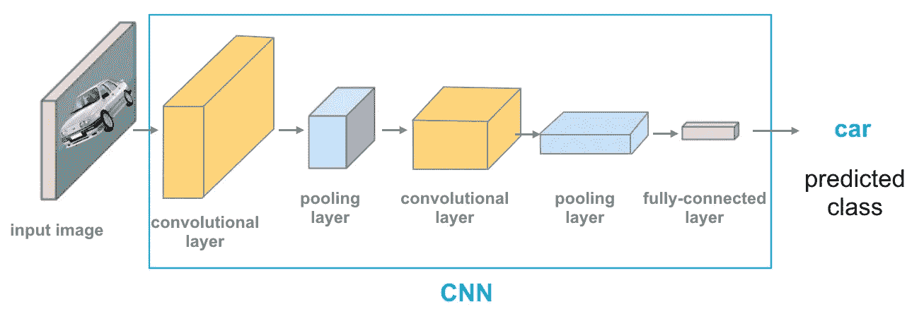

# 用张量流编码卷积神经网络

> 原文：<https://medium.com/analytics-vidhya/coding-convolutional-neural-networks-cnn-with-tensorflow-2b72647a522c?source=collection_archive---------22----------------------->

来源[https://cezannec.github.io/assets/cnn_intro/CNN_ex.png](https://cezannec.github.io/assets/cnn_intro/CNN_ex.png)

> 通过使用 TensorFlow 构建 CNN 模型来学习用于计算机视觉和图像处理的卷积神经网络的代码

*CNN*是最先进的人工神经网络设计架构之一，在图像识别和分类等领域拥有最好的深度学习工具之一。CNN 工作背后的基本原理是卷积的思想，产生相互叠加的过滤特征图。

我们将使用 MNIST 数据集，它在不同的图书馆都可以很容易地得到。我们将从 tensorflow 库中导入数据集。

代码已经在通用模板中编写，以便进行非常小的修改，并且可以在许多数据集上运行，只需很小的更改。

**关于 CNN**

每一个 CNN 都是由多层组成的，三种主要的层是卷积层、汇聚层和全连接层。

1.  **卷积层(Conv 层)**

Conv 层是卷积神经网络的核心构件。Conv 图层的主要用途是从输入影像中提取要素。

卷积层可以被认为是这个网络的*特征提取器*，它学习在输入图像中寻找空间特征。这一层是通过将一系列不同的图像滤波器(也称为卷积核)应用于输入图像而产生的。这些过滤器是非常小的网格值，逐个像素地滑过图像，并产生与输入图像大小大致相同的过滤输出图像。多个内核将产生多个过滤的输出图像。

2.**汇集层**

池层通过使用一些函数来汇总子区域，例如取平均值或最大值，来减小特征地图的大小。池的工作原理是在输入上滑动一个窗口，并将窗口的内容提供给池函数。

**3。全连接层**

完全连接的层正如其名称所暗示的那样进行配置:它与前一层的输出完全连接。全连接层将前一层中的所有神经元(无论是全连接、池连接还是卷积连接)连接到它所拥有的每一个神经元。

# 我们将在代码中使用的网络架构

*   卷积层(32 个单位)，过滤器形状:(5，5，1)，步幅=1，填充= '相同'
*   最大池层，窗口形状:(2，2)，步幅=1，填充= '相同'
*   卷积层(64 个单位)，过滤器形状:(5，5，32)，步幅=1，填充= '相同'
*   最大池层，窗口形状:(2，2)，步幅=1，填充= '相同'
*   致密层(1024 个单位)
*   输出层(10 个单位)

**代码:**

通过最少的努力，我们设法达到了 96%的准确率，对于一个有 10 个标签的分类任务来说，这个准确率还不错。这个结果是在没有对卷积神经网络的参数进行最小优化，也没有任何形式的正则化的情况下实现的。

对于正则化，我们可以调整我们的成本函数或优化器，或者简单地说，我们可以在密集层后添加一个下降层。脱落层广泛用于防止过度拟合。

为了提高性能，我们可以建立一个更复杂的模型结构，以便改进特征提取。

# 结论

通过这篇文章，我们能够使用 Python 编程和 TensorFlow 库编写简单的卷积神经网络架构。

感谢阅读！

如果您有任何疑问/反馈，敬请评论。