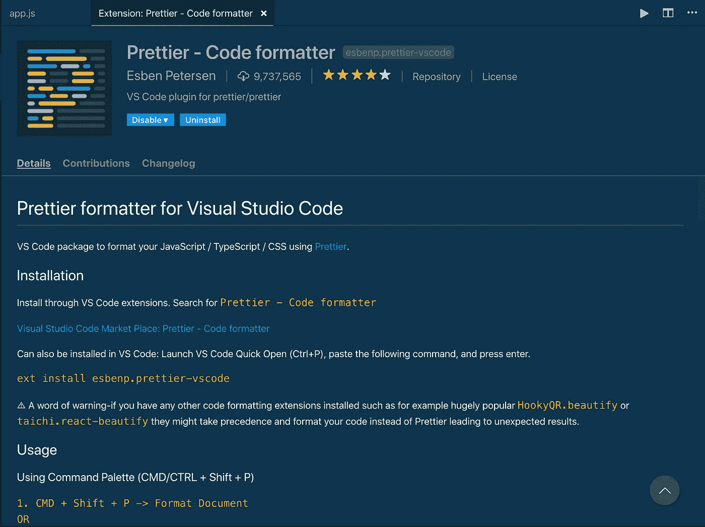
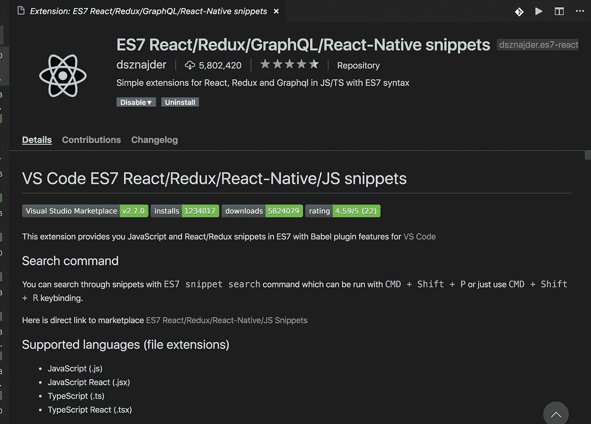
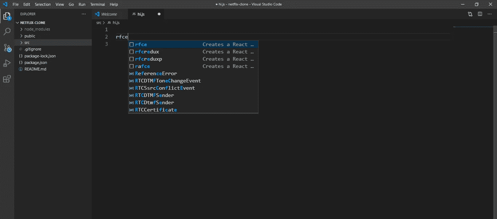
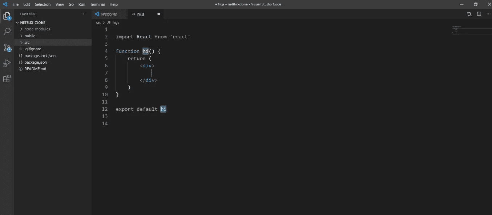
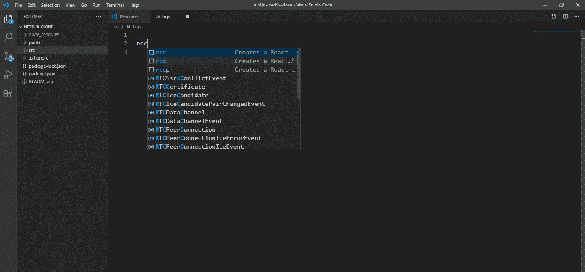
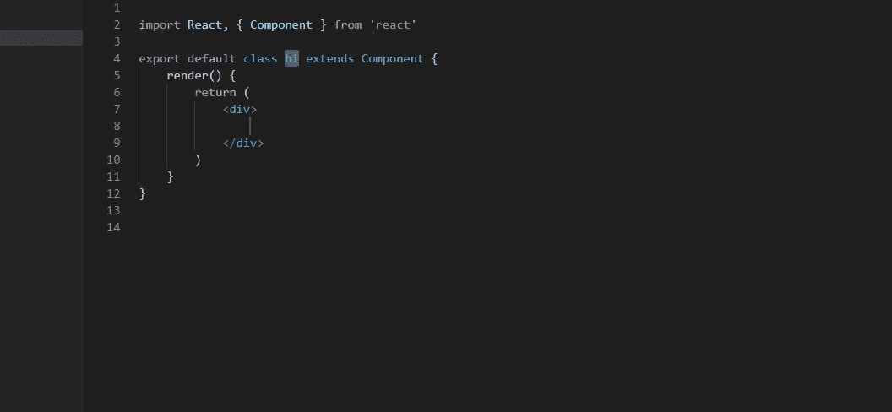
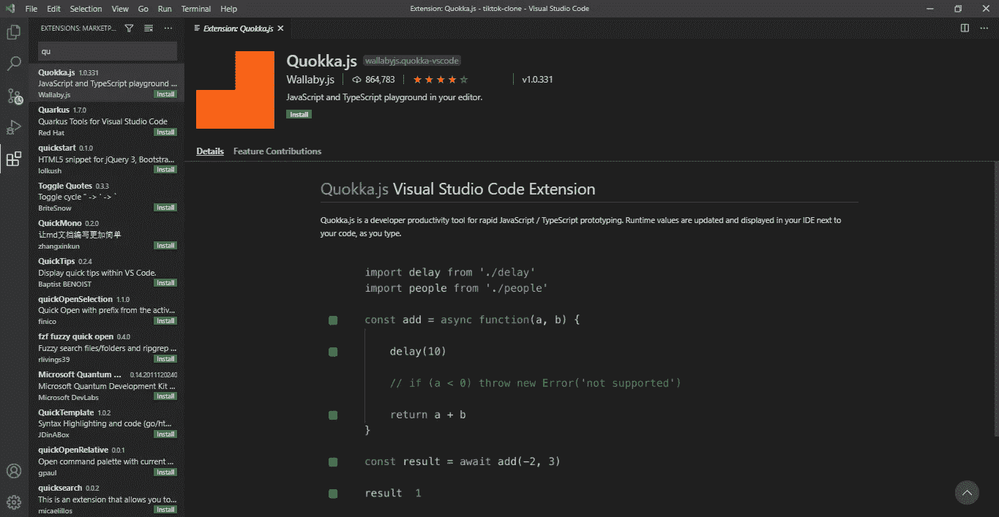
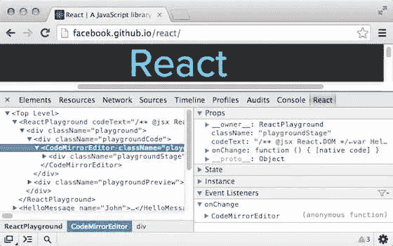
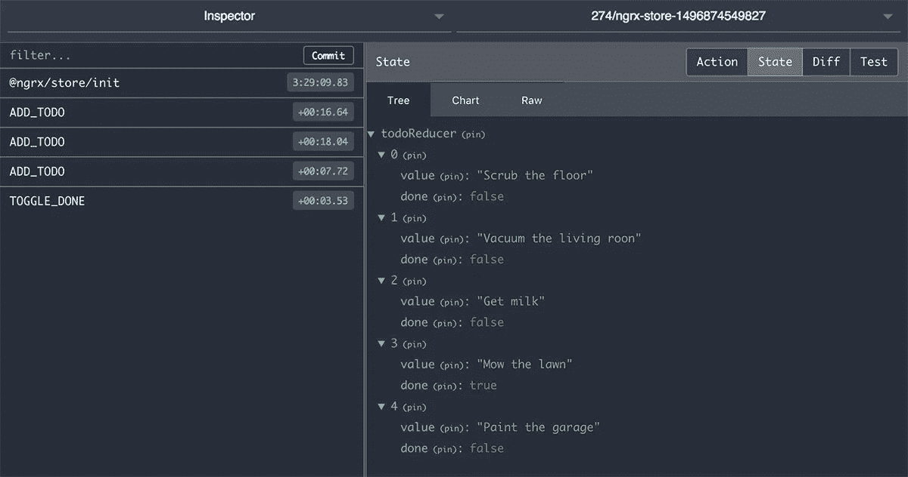

# 使用这些工具，React 中的编码变得容易多了

> 原文：<https://medium.com/analytics-vidhya/coding-in-react-made-lot-easier-with-these-tools-1ae5c12c6e27?source=collection_archive---------17----------------------->


嘿你！

从头开始写所有代码，你累了吗？

如果是这样的话，这个可以让你离开那个州。

想知道怎么做吗？

让我们来了解一下！

顺便说一句，伙计们，我是 Agbejule Kehinde Favour。

事不宜迟，我们上路吧！！

> 使 React 中的编码更容易的工具

1.  **更漂亮的代码格式器**

更漂亮是 visual studio 代码中的一个扩展，它有助于格式化并保存您的代码，以便您的代码可以在浏览器(本地主机)上呈现



2 **。es7 React/Redux/graph QL/React-Native-snippets**

这个扩展减少了你写代码语法的时间。



比如说；

如果你想在 react 中编写一个基于功能的组件，你只需要在你的应用程序中创建一个文件，并根据你想给你的组件命名。

在该文件中，键入 ***rfce*** 并按 enter 键。



这将为您提供组件语法，以组件的名称作为文件名。



基于功能的组件

如果它是一个基于类的组件，你可以做上面同样的事情，但是唯一的不同是你可以键入 ***rcc*** 并点击回车键。



它会给你同样的结果，但它会是一个不同的语法从基于功能的组件。



基于类的组件

3. **Emmet 代码编辑器**

这个扩展帮助你使用短代码语法或描述在短时间内编写 html 标签，包括带有属性的嵌套标签。

就像这样。

```
div>ul>li
```

会产生；

```
<div>
    <ul>
        <li></li>
    </ul>
</div>
```

还有，就在这里。

```
div#header+div.page+div#footer.class1.class2.class3
```

会给你；

```
<div id="header"></div>
<div class="page"></div>
<div id="footer" class="class1 class2 class3"></div>
```

# 很神奇吧？

 [## Emmet 文档

### Emmet 是一个网络开发工具包，可以极大地改善你的 HTML & CSS 工作流程:基本上，大多数文本编辑器…

docs.emmet.io](https://docs.emmet.io/) 

4.Quooka.js

这个扩展是 JavaScript 和 TypeScript 的快速原型游乐场。我会在你输入的时候立即运行你的代码，让你的代码阅读起来更容易、更快，并且从本质上调试你的代码。您也可以在使用 React 编码时使用它。

Quokka 甚至会显示错误，说明函数为什么不能返回。



5. **React 开发工具**

**React 开发者工具**是 Chrome DevTools 对开源 React JavaScript 库的扩展。它允许您检查 React 组件层次结构。它有助于您轻松调试 React 代码

[](https://chrome.google.com/webstore/detail/react-developer-tools/fmkadmapgofadopljbjfkapdkoienihi?hl=en) [## React 开发人员工具

### 将 React 调试工具添加到 Chrome 开发者工具中。根据 2020 年 11 月 12 日的版本 11a2ae3a0d 创建。

chrome.google.com](https://chrome.google.com/webstore/detail/react-developer-tools/fmkadmapgofadopljbjfkapdkoienihi?hl=en) 

6. **Redux 开发工具**

它可以帮助您轻松调试 redux 代码。

[](https://chrome.google.com/webstore/detail/redux-devtools/lmhkpmbekcpmknklioeibfkpmmfibljd) [## Redux 开发工具

### 用于调试应用程序状态变化的 Redux DevTools。

chrome.google.com](https://chrome.google.com/webstore/detail/redux-devtools/lmhkpmbekcpmknklioeibfkpmmfibljd) 

Redux 开发工具

额外提示:

这些扩展的下载统计数据非常高。

所以你想让你的编码生活变得更加简单，对吗？

如果你想下载任何带有 Vscode 的扩展**1–4**，

#转到侧面菜单栏上的扩展图标


从上图来看；

*   红色箭头显示扩展图标
*   白色箭头显示您输入延期请求的搜索栏
*   绿色圆圈显示了 install 按钮，单击该按钮可以安装扩展。


你很高兴能在压力减轻的情况下编码，对吗？

太好了！！

完成后，谢谢你们的时间！

你可以在评论区留下你的想法，如果对你有帮助的话，别忘了按下拍手按钮。

下次见，伙计们！！

Agbejule Kehinde 赞成。

祝你们平安！