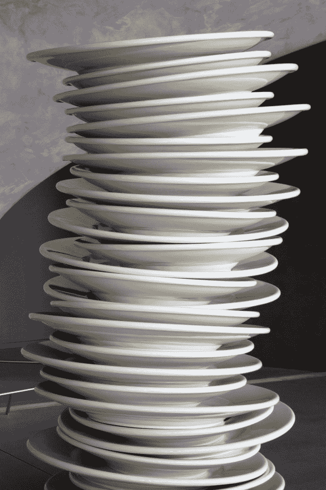
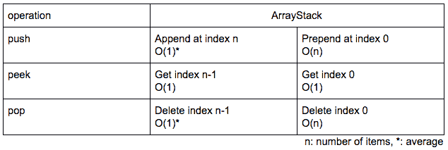
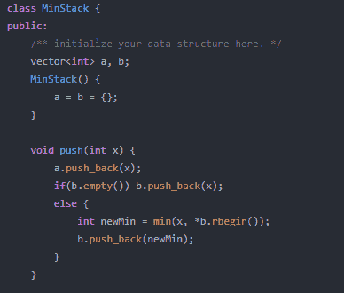
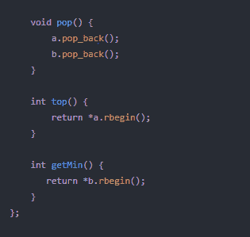

# 编码面试问题

> 原文：<https://medium.com/analytics-vidhya/coding-interview-question-c8f2520faf72?source=collection_archive---------22----------------------->

# 常数时间 O(1)中的堆栈操作

去厨房吧。

你看到了什么？

盘子、碗、容器和小吃以及更多美味佳肴。

仔细看。

你也可能会看到这样的东西。

认出那些叠在一起的盘子了吗？

这正是堆栈概念的来源。

想想你能用这么一堆盘子做些什么。

你可以在上面放一个新的盘子，也可以取下上面的盘子。

如果你想把盘子放在底部，你必须先把上面的盘子都拿走。

这种安排被称为“后进先出”——放在最后的物品是第一个出去的。

# **堆栈编程术语**

用计算机的语言来说，把一个项目放在栈顶叫做“push”，把一个项目移走叫做“pop”。

堆栈是一个对象，或者更具体地说是一个抽象数据结构(ADT ),它允许下列操作:

1.  推送:将一个元素添加到堆栈的顶部

2.Pop:从堆栈顶部删除一个元素

3.IsEmpty:检查堆栈是否为空

4.IsFull:检查堆栈是否已满

5.Peek:获取顶部元素的值，而不删除它。

不用说，最顶层的元素叫做 top()

我们可以通过使用称为数组和/或链表的具体数据类型来实现堆栈。它们是线性数据结构。它们之间的区别与内存分配有关。

现在，这里的挑战是在 O(1)时间内执行以下操作:

*   推(x)
*   流行()
*   顶部()
*   getMin()

这里我们的主要竞争者将是 getMin()操作。

现在，存储整体最小值听起来是个好主意。但是一旦我们弹出一个元素，我们如何在 O(1)时间内再次找到最小值？

让我们看看这个例子

堆栈 A

第三点

我们这里的最小值是 3。

但是，如果我们弹出 3，我们的最小值转移到 5。

如果我们弹出 5，我们的最小值应该是 8。

我们如何实时地进行这项工作呢？

我们能做的是:

我们可以复制这个堆栈，得到另一个堆栈 B，除了。

堆栈 B

每当你在新的栈中插入一个元素时，你就插入了前一个栈中的最小值。

因此，最初您将插入 19，因为它是唯一的元素，然后比较 8 和 19，

8 是最小值，因此堆栈 B 的第二个元素应该是 8。

现在第三个元素是 23，比较这三个元素，8 是最小值，因此 8 再次被插入堆栈 B。

同样，插入 5 和 3。

所以，现在你可以看到第二个堆栈在 O(1)时间内告诉我们堆栈 A 中的当前最小数。

栈顶 B 指向栈 a 中当前最小的元素。

因此，通过使用空间和时间的权衡，我们实际上使用了更多的空间，但我们能够在 O(1)时间内解决整个问题。

下面给出了使用 C++的代码实现:

您可以在此处获得代码:

 [## shreya 869/get _ min-Stack-in-O-1-

### 恒定时间复杂度下的栈操作。为 shreya 869/get _ min-Stack-in-O-1-开发做出贡献，创建一个…

github.com](https://github.com/Shreya869/get_min-Stack-in-O-1-/tree/master) 

参考书目:

更多参考，你可以看下面的视频，它帮助我把我的基本概念讲清楚。