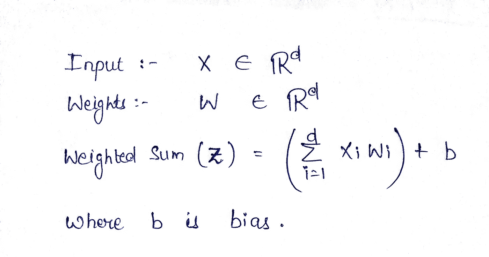
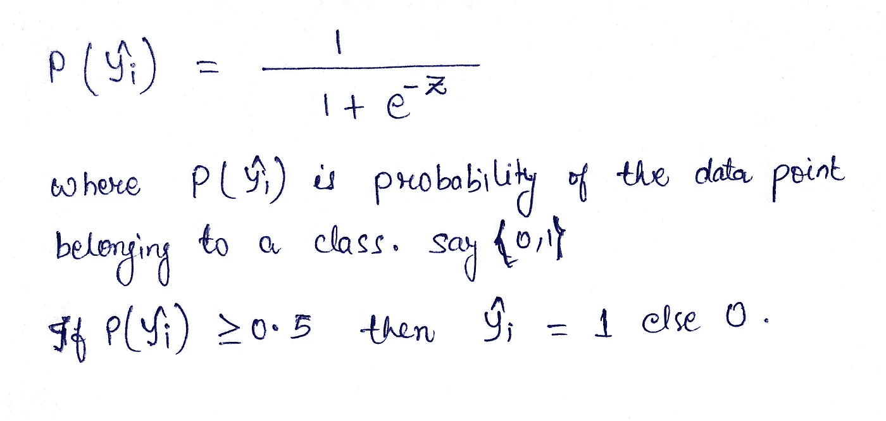
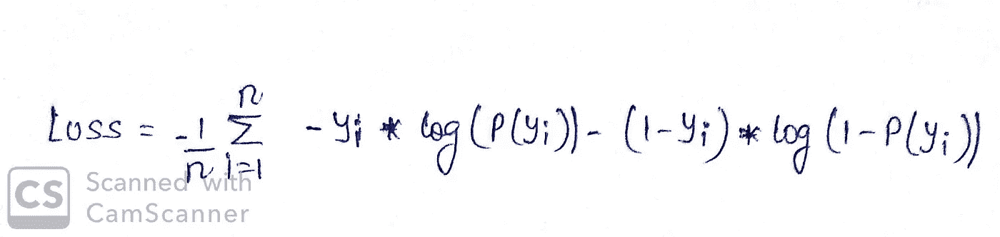
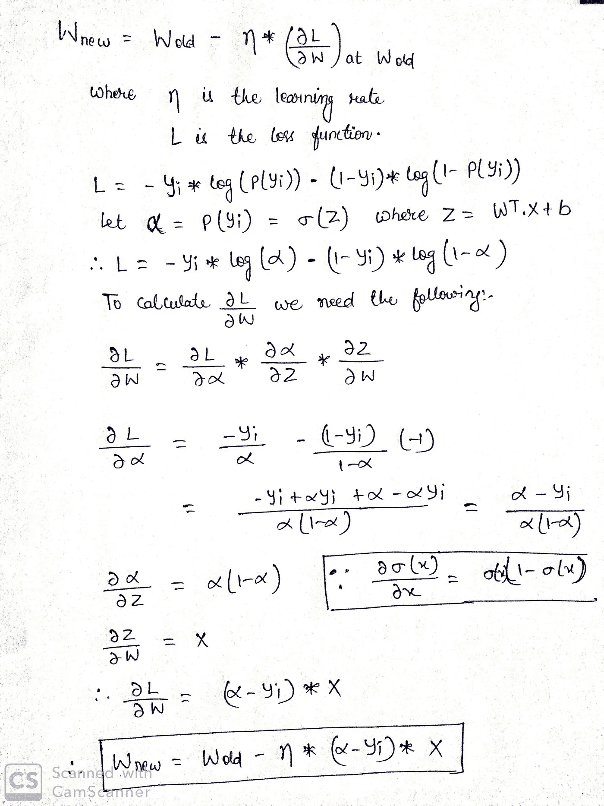
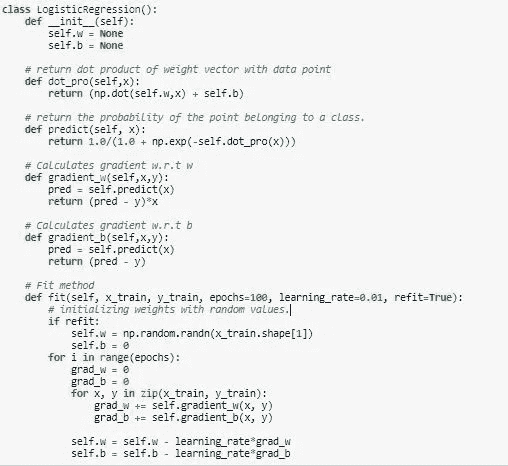
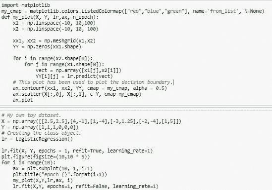
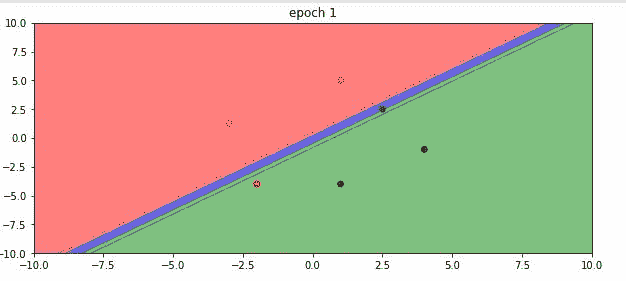
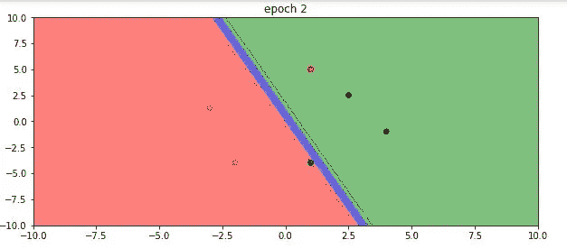
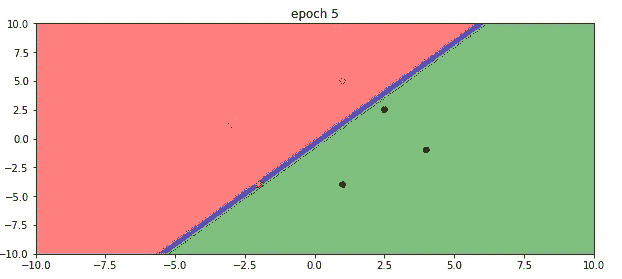
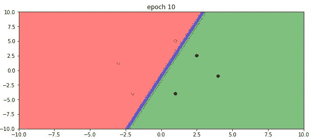

# 用 Python 编写逻辑回归代码

> 原文：<https://medium.com/analytics-vidhya/coding-logistic-regression-in-python-2ad6a0214b66?source=collection_archive---------2----------------------->

在这篇博客中，你将学习如何用 python 从头开始编写逻辑回归代码。

在进入代码之前，让我们了解一下**逻辑回归**背后的数学原理，并使用**梯度下降**来训练模型。

# **逻辑回归:**

这个算法的名字叫逻辑回归，因为我们在这个算法中使用了逻辑函数。在这种情况下，我们线性组合输入(X)和权重/系数，以给出输出(y)。

该模型的输出在 0 和 1 之间缩放，作为数据点属于特定类别的概率。我们使用 sigmoid 函数来实现这个目标。

# **嘿！等等。**

取自男高音

只要遵循以下步骤，你就会知道它是如何工作的。

1.  首先，所有输入乘以各自的权重并求和，我们称之为**加权和**。

计算权重和输入的点积

2.然后，我们将这个**加权和**传递给 sigmoid 函数，该函数给出一个介于 0 和 1 之间的值，该值是数据点属于某个类的概率。

使用 Sigmoid 在 0 和 1 之间缩放值。

3.然后，我们使用以下损失函数计算损失。

权重/系数是一个 n 维向量，我们必须使用梯度下降来学习。现在我们来看看如何学习这些重量。

**梯度下降:**

梯度下降是一种优化技术，其中我们使用损失函数的梯度来更新我们的权重。现在我们将看看如何使用它来更新权重。

# **给我看看代码:**

我已经实现了逻辑回归类。此代码没有实现正则化。

逻辑回归的实现。

绘制可视化图形的代码。

**让我们绘制一些图表来直观显示模型是如何学习的。**

纪元 1

纪元 2

纪元 5

时代 10

暂时就这些了。如果你有任何问题，请在评论中写下。

如果你是初学者，想知道什么是**校准**，那就去看看这个 [**博客**](/analytics-vidhya/calibration-in-machine-learning-e7972ac93555) 。

 [## 机器学习中的校准

### 在这个博客中，我们将学习什么是校准，为什么以及何时应该使用它。

medium.com](/analytics-vidhya/calibration-in-machine-learning-e7972ac93555)