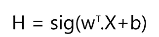
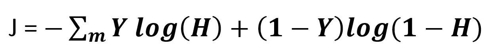
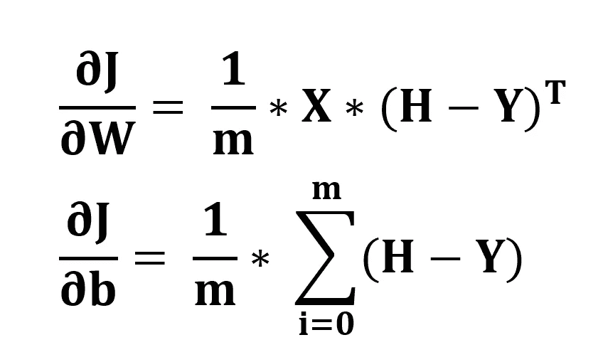
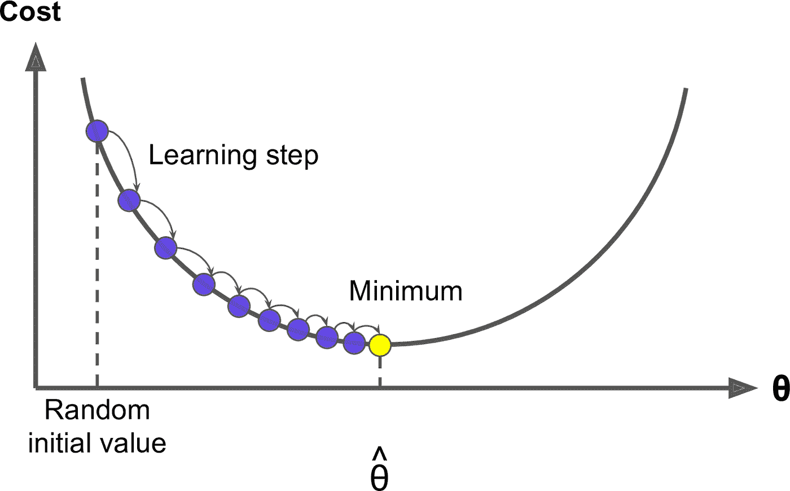
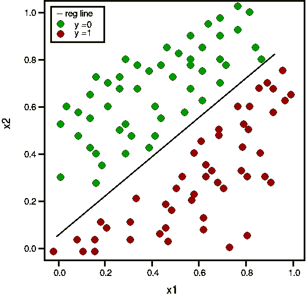

# 从头开始用 Python 编写逻辑回归代码

> 原文：<https://medium.com/analytics-vidhya/coding-logistic-regression-in-python-from-scratch-57284dcbfbff?source=collection_archive---------2----------------------->


目的是使用我们拥有的原始数学知识和概念，从零开始为二元分类编码逻辑回归。

这是逻辑回归系列的第二部分:

1.  [逻辑回归的基本原理](/@omrastogi/fundamentals-of-logistic-regression-bde451712652)
2.  从头开始用 Python 编写逻辑回归代码

首先我们需要导入 numpy。NumPy 是一个处理复杂数组计算的类，可以快速减少计算时间。你可以在这里 了解 numpy [*。*](/@omrastogi/master-numpy-in-45-minutes-74b2460ecb00)

```
import numpy as np
```

为了打包不同的方法，我们需要创建一个名为“MyLogisticRegression”的类。该类所采取的参数有:
**【learning _ rate】**-它确定模型的学习速度，在梯度下降算法中
**num_iteration** -它确定我们需要运行梯度下降算法的次数。

```
**class MyLogisticRegression:**

    **def __init__(self, learning_rate = 1, num_iterations = 2000):**
       self.learning_rate = learning_rate
       self.num_iterations = num_iterations
       self.w = []
       self.b = 0
```

我们都准备好了，首先要为主要的算法打下基础。

```
 **def initialize_weight(self,dim):**
    *"""
    This function creates a vector of zeros of shape (dim, 1)      for w and initializes b to 0.
    Argument:
    dim -- size of the w vector we want (or number of parameters  in this case)
    """*
       w = np.zeros((dim,1))
       b = 0
       return w, b
```

## 乙状结肠的


逻辑回归最基本和最重要的元素是逻辑函数，也称为 sigmoid。

```
 **def sigmoid(self,z):**
    *"""
    Compute the sigmoid of z
    Argument:
    z -- is the decision boundary of the classifier
    """*
        s = 1/(1 + np.exp(-z)) 
        return s
```

## 假设



现在我们写一个函数来定义假设。*‘w’*上的下标代表*权重向量*的转置。

```
 **def hypothesis(self,w,X,b):**
    *"""
    This function calculates the hypothesis for the present model
    Argument:
     w -- weight vector
     X -- The input vector
     b -- The bias vector
    """*
        H = self.sigmoid(np.dot(w.T,X)+b) 
        return H
```

## 成本函数和梯度

**代价函数** 是一个*函数*，它衡量机器学习模型对于给定数据的性能。当**梯度**量化时，模型的表现会有多好。



成本函数公式

```
 **def cost(self,H,Y,m):**
 *"""
    This function calculates the cost of hypothesis
    Arguments: 
     H -- The hypothesis vector 
     Y -- The output 
     m -- Number training samples
    """* cost = -np.sum(Y*np.log(H)+ (1-Y)*np.log(1-H))/m 
        cost = np.squeeze(cost)   
        return cost
```



梯度的计算

```
 **def cal_gradient(self, w,H,X,Y):**
 *"""
    Calculates gradient of the given model in learning space
    """*
        m = X.shape[1]
        dw = np.dot(X,(H-Y).T)/m
        db = np.sum(H-Y)/m
        grads = {"dw": dw,
                 "db": db}
        return grads **def gradient_position(self, w, b, X, Y):**
    """
    It just gets calls various functions to get status of learning model Arguments:
     w -- weights, a numpy array of size (no. of features, 1)
     b -- bias, a scalar
     X -- data of size (no. of features, number of examples)
     Y -- true "label" vector (containing 0 or 1 ) of size (1, number of examples)
    """

        m = X.shape[1]
        H = self.hypothesis(w,X,b)         # compute activation
        cost = self.cost(H,Y,m)               # compute cost
        grads = self.cal_gradient(w, H, X, Y) # compute gradient
        return grads, cost
```

## **梯度下降算法**

梯度下降是一种优化算法，用于通过沿梯度负值定义的最陡下降方向迭代移动来最小化某个函数。在机器学习中，我们使用梯度下降来更新我们模型的参数(w，b)。



该算法的意义在于更新规则，根据参数的当前陡度来更新参数。

```
 **def gradient_descent(self, w, b, X, Y, print_cost = False):**
 *"""
    This function optimizes w and b by running a gradient descent algorithm

    Arguments:
    w — weights, a numpy array of size (num_px * num_px * 3, 1)
    b — bias, a scalar
    X -- data of size (no. of features, number of examples)
    Y -- true "label" vector (containing 0 or 1 ) of size (1, number of examples)
    print_cost — True to print the loss every 100 steps

    Returns:
    params — dictionary containing the weights w and bias b
    grads — dictionary containing the gradients of the weights and bias with respect to the cost function
    costs — list of all the costs computed during the optimization, this will be used to plot the learning curve.
    """*

        costs = []

        for i in range(self.num_iterations):
        # Cost and gradient calculation 
            grads, cost = self.gradient_position(w,b,X,Y)

        # Retrieve derivatives from grads
        dw = grads[“dw”]
        db = grads[“db”]

 **# update rule 
        w = w — (self.learning_rate * dw) 
        b = b — (self.learning_rate * db)**

        # Record the costs
        if i % 100 == 0:
            costs.append(cost)

        # Print the cost every 100 training iterations
        if print_cost and i % 100 == 0:
             print (“Cost after iteration %i: %f” %(i, cost))

        params = {“w”: w,
                  “b”: b}

       grads = {“dw”: dw,
                “db”: db}

       return params, grads, costs
```

## 预测

假设函数给我们的概率是 y = 1。对于大于 0.5 的 h，我们通过指定 p = 1 来解决这个问题。

```
 **def predict(self,X):**
 *'''
    Predict whether the label is 0 or 1 using learned logistic regression parameters (w, b)

    Arguments:
    w -- weights, a numpy array of size (n, 1)
    b -- bias, a scalar
    X -- data of size (num_px * num_px * 3, number of examples)

    Returns:
    Y_prediction -- a numpy array (vector) containing all predictions (0/1) for the examples in X
    '''*
        X = np.array(X)
        m = X.shape[1]

        Y_prediction = np.zeros((1,m))

        w = self.w.reshape(X.shape[0], 1)
        b = self.b
        # Compute vector "H" 
        H = self.hypothesis(w, X, b)

        for i in range(H.shape[1]):
        # Convert probabilities H[0,i] to actual predictions p[0,i]
            if H[0,i] >= 0.5:
                Y_prediction[0,i] = 1
            else: 
                Y_prediction[0,i] = 0

       return Y_prediction
```

## 训练模型功能

这个方法由用户直接调用来训练假设。这是一种可行的方法。

```
 **def train_model(self, X_train, Y_train, X_test, Y_test, print_cost = False):**
    """
    Builds the logistic regression model by calling the function you’ve implemented previously

    Arguments:
    X_train — training set represented by a numpy array of shape (features, m_train)
    Y_train — training labels represented by a numpy array (vector) of shape (1, m_train)
    X_test — test set represented by a numpy array of shape (features, m_test)
    Y_test — test labels represented by a numpy array (vector) of shape (1, m_test)
    print_cost — Set to true to print the cost every 100 iterations

    Returns:
    d — dictionary containing information about the model.
    """# initialize parameters with zeros 
        dim = np.shape(X_train)[0]
        w, b = self.initialize_weight(dim)# Gradient descent 
        parameters, grads, costs = self.gradient_descent(w, b, X_train, Y_train, print_cost = False)

 # Retrieve parameters w and b from dictionary “parameters”
        self.w = parameters[“w”]
        self.b = parameters[“b”]

 # Predict test/train set examples 
        Y_prediction_test = self.predict(X_test)
        Y_prediction_train = self.predict(X_train)# Print train/test Errors
        train_score = 100 — np.mean(np.abs(Y_prediction_train — Y_train)) * 100
        test_score = 100 — np.mean(np.abs(Y_prediction_test — Y_test)) * 100
        print(“train accuracy: {} %”.format(100 — np.mean(np.abs(Y_prediction_train — Y_train)) * 100))
        print(“test accuracy: {} %”.format(100 — np.mean(np.abs(Y_prediction_test — Y_test)) * 100)) d = {“costs”: costs,
             “Y_prediction_test”: Y_prediction_test, 
             “Y_prediction_train” : Y_prediction_train, 
             “w” : self.w, 
             “b” : self.b,
             “learning_rate” : self.learning_rate,
             “num_iterations”: self.num_iterations,
             “train accuracy”: train_score,
             “test accuracy” : test_score}

         return d
```

## 在小数据集上测试

```
#Dataset
X_train = np.array([[5,6,1,3,7,4,10,1,2,0,5,3,1,4],[1,2,0,2,3,3,9,4,4,3,6,5,3,7]])
Y_train = np.array([[0,0,0,0,0,0,0,1,1,1,1,1,1,1]])
X_test  = np.array([[2,3,3,3,2,4],[1,1,0,7,6,5]])
Y_test  = np.array([[0,0,0,1,1,1]])
```



我们根据默认值调用该类

```
clf = MyLogisticRegression()
d = clf.train_model(X_train, Y_train, X_test, Y_test)
print (d["train accuracy"])***#Output
train accuracy: 100.0 %
test accuracy: 100.0 %
100.0***
```

我们将设置一个非常小的学习率和迭代次数

```
clf = MyLogisticRegression(0.001, 100)
d = clf.train_model(X_train, Y_train, X_test, Y_test)***#Output
train accuracy: 92.85714285714286 %
test accuracy: 83.33333333333334 %***
```


> 如果你坚持到最后——请鼓掌。这会让我有动力写更多。谢谢你。