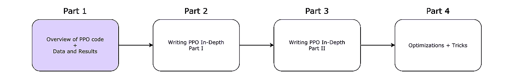
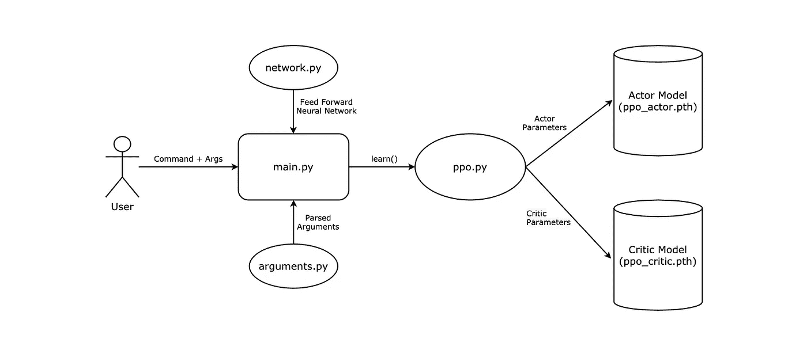
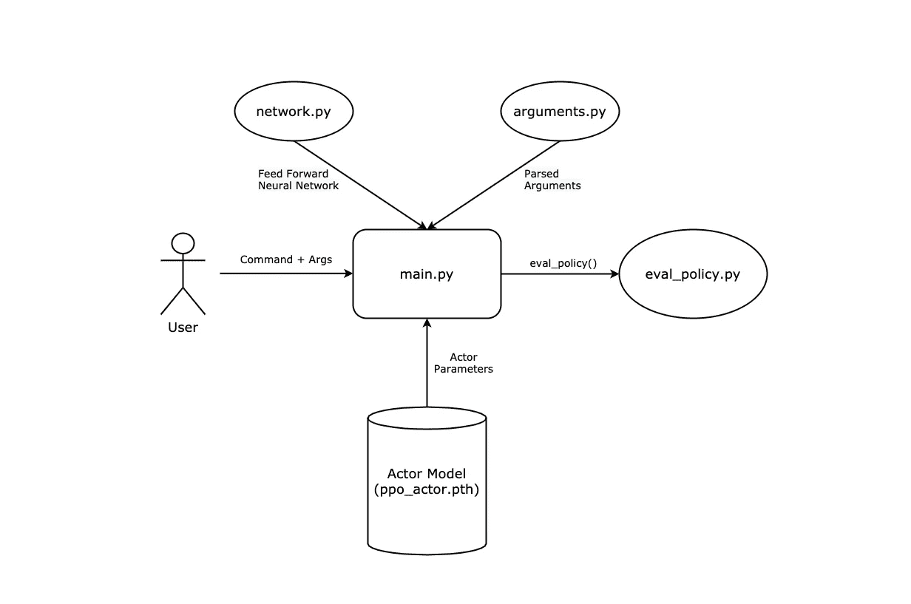
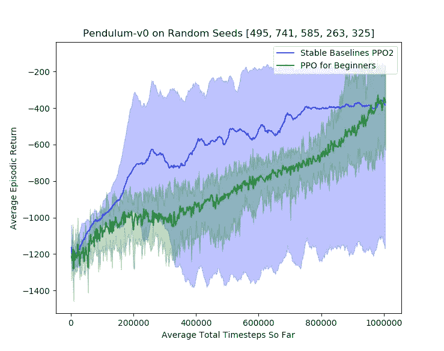
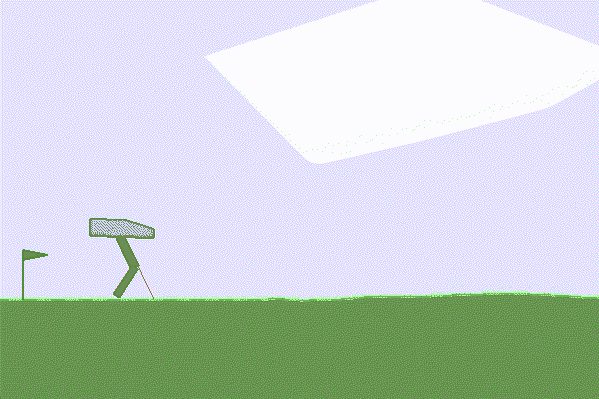
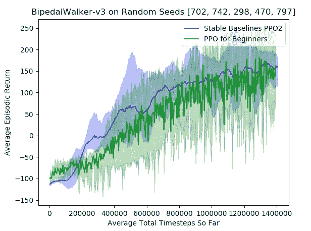
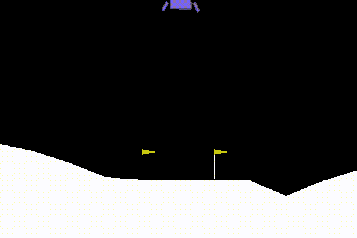
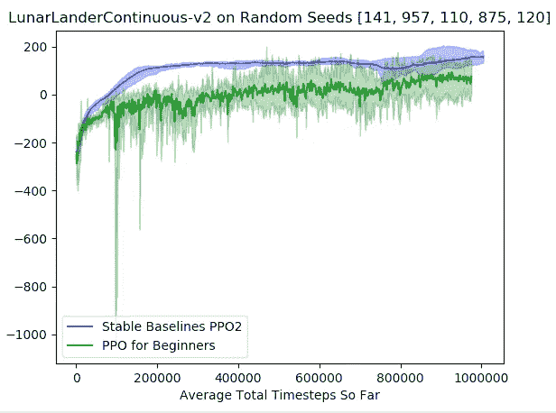
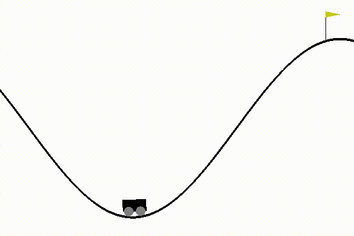
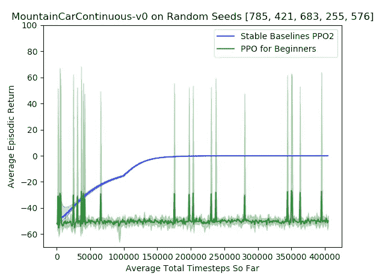

# 用 PyTorch 从头开始编写 PPO 代码(第 1/4 部分)

> 原文：<https://medium.com/analytics-vidhya/coding-ppo-from-scratch-with-pytorch-part-1-4-613dfc1b14c8?source=collection_archive---------1----------------------->

我的 4 部分系列的路线图。

# 介绍

这是预期的 4 部分系列的第 1 部分，读者将从零开始学习使用 PyTorch 实现一个基本的近似策略优化(PPO)。请参考上图查看该系列的大致路线图。我写这个指南是因为当我学习策略梯度算法和 PPO，并最终尝试自己从头开始实现它时，我发现网上很少有 PPO 实现是简单的、有良好文档记录的、风格良好的，并且实际上是正确的，这是很可笑的。甚至在 google 搜索“ppo github”的最初几个搜索中，你可以找到许多自我标榜的“简单”PPO 实现，这些实现经常是令人困惑的、注释糟糕的、不可读的和/或完全不正确的。

我在本系列中的目标是通过提供和运行一个可靠的、有良好文档记录的、风格良好的，最重要的是 PPO 的基本实现来解决这个问题。在这一系列文章中，我将向您介绍我从头开始编写 PPO 的步骤，并给出我在编写过程中对决策的思考过程。理想的读者是拥有 Python 和 PyTorch 经验的人，并且知道强化学习(RL)、策略梯度(pg)算法和 PPO 的基本理论(我包括 PPO，因为这是一个教你如何**编写** PPO 的指南，而不是学习 PPO 背后的**理论**)。如果你对以上任何一个都感到不舒服，这里有一些我发现的很棒的链接，你应该在继续之前熟悉一下:

[学习 Python](https://www.learnpython.org/en/Variables_and_Types)

[学习 PyTorch](https://www.youtube.com/watch?v=exaWOE8jvy8&list=PLqnslRFeH2UrcDBWF5mfPGpqQDSta6VK4&index=2&ab_channel=PythonEngineer)

[强化学习简介](https://spinningup.openai.com/en/latest/spinningup/rl_intro.html)

[政策梯度介绍](https://towardsdatascience.com/an-intuitive-explanation-of-policy-gradient-part-1-reinforce-aa4392cbfd3c)

[PPO 简介](https://stackoverflow.com/questions/46422845/what-is-the-way-to-understand-proximal-policy-optimization-algorithm-in-rl)

如果您不熟悉以上所有内容，我建议您在继续之前从上到下依次浏览每个链接。

在我们深入了解代码的本质(将从第 2 部分开始)之前，我想先概述一下我编写的代码及其性能的一些统计数据。

# 代码概述

代码:[新手 PPO](https://github.com/ericyangyu/PPO-for-Beginners)

在我的 PPO 实现中，我将所有的训练代码分成 4 个独立的文件:main.py、ppo.py、network.py 和 arguments.py。

**main.py** :我们的可执行文件。它将使用 arguments.py 解析命令行参数，然后初始化我们的环境和 PPO 模型。这里是我们可以训练或测试 PPO 模型的地方。

**ppo.py** :我们的 ppo 模型。所有的学习魔法都发生在这个文件中。

**network.py** :一个神经网络模块，用于在 PPO 模型中定义我们的演员/评论家网络。它包含一个样本前馈神经网络。

**arguments.py** :解析命令行参数。提供由 main 调用的函数。

演员/评论家模型定期保存到二进制文件 **ppo_actor.pth** 和 **ppo_critic.pth** 中，可以在测试或继续训练时加载。

我的测试代码主要在 eval_policy.py 中，由 main.py 调用。

**eval_policy.py** :在指定环境下测试训练好的策略。这个模块完全独立于所有其他文件。

这里有两个图表大致说明了培训和测试管道:

## 培训渠道

## 测试管道

# 结果

我用各种环境下的稳定基线 [PPO2](https://stable-baselines.readthedocs.io/en/master/modules/ppo2.html) 对我的 PPO 实现 [PPO for 初学者](https://github.com/ericyangyu/PPO-for-Beginners)进行了基准测试，如下所示。在图中，实线代表所有试验的平均值，突出显示的区域代表所有试验的方差。如果你不知道，[稳定基线](https://stable-baselines.readthedocs.io/en/master/)是一个优化的经典 RL 算法库，我们可以在研究中将其用作基准和可靠的 RL 算法实现。所有使用的超参数都可以在找到[。](https://github.com/araffin/rl-baselines-zoo/blob/master/hyperparams/ppo2.yml)

请注意，面向初学者的 PPO 主要坚持使用普通的 PPO 伪代码，而 PPO2 做了大量的优化和技巧，我们可以在本系列的第 4 部分中探索。

## 钟摆-v0

[连接至摆锤 v0](http://gym.openai.com/envs/Pendulum-v0/)

用 PPO 解决初学者问题后的 Pendulum-v0 的 GIF 图(左)|(右)显示初学者在 Pendulum-v0 上 PPO2 与 PPO 性能的图表。

## 两足步行机-v3

[链接到 BipedalWalker-v3](http://gym.openai.com/envs/BipedalWalker-v2/)

初学者使用 PPO 解决问题后的双足步行器-v3 的 GIF(左)|(右)显示 PPO2 相对于初学者使用 PPO 对双足步行器-v3 的性能的图表。

## lunarlAnDercontinous-v2

[链接至 LunarLanderContinuous-v2](http://gym.openai.com/envs/LunarLanderContinuous-v2/)

针对初学者使用 PPO 求解后的 lunarland rcontinuus-v2 的 GIF(左)|(右)显示针对 lunarland rcontinuus-v2 的 PPO2 与 PPO 的性能对比图

## 山峰连续-v0

[链接至山区 CarContinuous-v0](http://gym.openai.com/envs/MountainCarContinuous-v0/)

使用 PPO 未能解决初学者问题后的山峰 GIF Continuous-v0(左)|(右)显示 PPO2 与 PPO(初学者用)在山峰上的表现的图表 continuous-v0

mountacarcontinuous-v0 未能在两个 PPO 实现中解决问题(满分接近 100 分)；猜猜为什么会这样？

答:PPO 是一种在线算法，与大多数经典的 RL 算法一样，它通过密集的奖励系统学习效果最好；换句话说，它需要一致的信号，这些信号随着性能的提高而很好地扩展，以便一致地向期望的行为收敛。这个特殊的环境有一个稀疏的奖励系统:如果标志被击中，奖励= 100 - 0.1(动作)-否则- 0.1(动作)。因此，除非通过随机探索，PPO 没有得到很多好的学习指标，这种情况很少见。更糟糕的是，如果你仔细观察奖励函数，它实际上会惩罚随着时间的推移而移动；因此，除非你运气好，连续撞了几次旗子，否则 PPO 会倾向于通过最低限度的移动，朝着局部最大值优化(即，最大化负奖励)，因此卡在山谷底部，永远不会撞上旗子。

您可能会注意到，在初学者 PPO 图中，它在提高性能方面有不寻常的峰值，平均情景回报率高达 70%，但它仍然无法平均学习；这是因为，尽管 PPO 可能在几次运行中运气不错，并通过探索击中了旗帜，但单轮低学习率的政策梯度更新不足以让 PPO 持续击中旗帜。因此，在下一次迭代中，PPO 的性能会崩溃，直到它幸运地再次击中目标。在这些情况下，保单外算法的情况往往稍好一些，因为它们使用重放缓冲区对过去的经验(包括成功)进行训练，但由于 PPO 是一种保单内算法，因此每次迭代后都需要新的一批数据(因此需要通过探索重新生成成功的数据，以便学习)。

# 概述

正如你所看到的，与稳定的基线相比，初学者的普通 PPO 结果并不令人印象深刻；然而，这个库的目的不是击败 PPO2(它使用了许多在原始论文中没有的技巧和优化)，而是再次引导读者从头实现一个简单的 PPO。在第 4 部分中，我们可以探索一些优化和技巧，以合并到我们的普通 PPO 中。

同样，如果你只是想要 PPO 的初学者代码，[这里是](https://github.com/ericyangyu/PPO-for-Beginners)。

特别感谢秦志珍和高思存教授在我撰写这一系列文章的过程中给予我的帮助。

关于 eyyu@ucsd.edu 的任何事情，请随时联系我。

我们在[第二部](/@eyyu/coding-ppo-from-scratch-with-pytorch-part-2-4-f9d8b8aa938a)再见，从零开始深入撰写 PPO！