# 用 PyTorch 从头开始编写 PPO 代码(第 3/4 部分)

> 原文：<https://medium.com/analytics-vidhya/coding-ppo-from-scratch-with-pytorch-part-3-4-82081ea58146?source=collection_archive---------0----------------------->

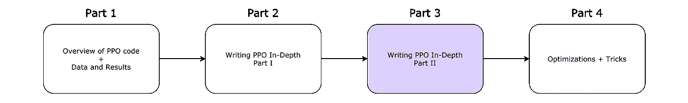

我的 4 部分系列的路线图。

欢迎阅读本系列的第 3 部分，在这里我们将使用 PyTorch 从头开始编写近似策略优化(PPO)代码。如果你还没有看过[第一部](/@eyyu/coding-ppo-from-scratch-with-pytorch-part-1-4-613dfc1b14c8)和[第二部](/@eyyu/coding-ppo-from-scratch-with-pytorch-part-2-4-f9d8b8aa938a)，请先阅读。

下面是代码:[https://github.com/ericyangyu/PPO-for-Beginners](https://github.com/ericyangyu/PPO-for-Beginners)

我们将从我们停止的地方开始:步骤 5。这里是伪代码的概述，也可以在[这里](https://spinningup.openai.com/en/latest/algorithms/ppo.html#id7)找到:

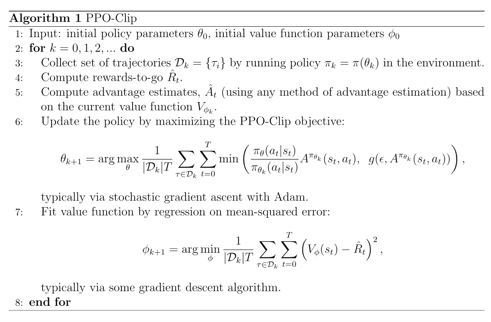

OpenAI 的 Spinning Up doc 上 PPO 的伪代码。

在我们继续之前，请注意，对于步骤 6 和 7，我们将在每个迭代中执行多个时期。我们将在后面的`_init_hyperparameters`中添加历元的数量 *n* ，作为超参数。我们这样做是因为如果你注意到，在步骤 5-7 中，参数θ和φ上有一个 *k* 下标。这表明第 k 次迭代的参数与训练中的当前时刻之间存在差异，这意味着每次迭代也有其自己的一组时期要运行。一旦我们到达这些步骤，我们将再次看到这一点，并为它们编写代码。

现在让我们看看第 5 步。

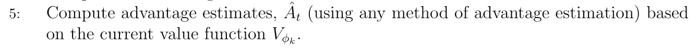

第五步

这里我们将使用[定义的优势函数](https://spinningup.openai.com/en/latest/spinningup/rl_intro.html#advantage-functions:~:text=reward%2Dplus%2Dnext%2Dvalue.-,Advantage%20Functions,The%20advantage%20function%20%20corresponding%20to%20a%20policy%20%20describes%20how%20much%20better%20it%20is%20to%20take%20a%20specific%20action%20%20in%20state%20%2C%20over%20randomly%20selecting%20an%20action%20according%20to%20%2C%20assuming%20you%20act%20according%20to%20%20forever%20after.%20Mathematically%2C%20the%20advantage%20function%20is%20defined%20by)。TL；这是用 Vᵩₖ:修正的方程式

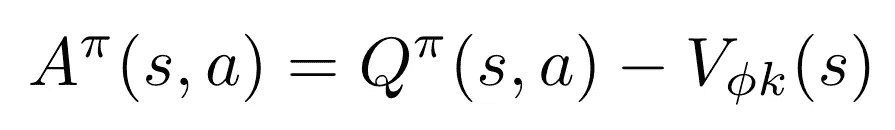

优势功能。

其中，Q^π是状态动作对(s，a)的 q 值，而 Vᵩₖ是由我们的评论家网络在第 *k* 次迭代上跟随参数φ确定的一些观察值 *s* 。

我们对公式[进行了修改，此处](https://spinningup.openai.com/en/latest/spinningup/rl_intro.html#advantage-functions:~:text=reward%2Dplus%2Dnext%2Dvalue.-,Advantage%20Functions,The%20advantage%20function%20%20corresponding%20to%20a%20policy%20%20describes%20how%20much%20better%20it%20is%20to%20take%20a%20specific%20action%20%20in%20state%20%2C%20over%20randomly%20selecting%20an%20action%20according%20to%20%2C%20assuming%20you%20act%20according%20to%20%20forever%20after.%20Mathematically%2C%20the%20advantage%20function%20is%20defined%20by)指定预测值跟随第 *k* 次迭代的参数φ，这很重要，因为稍后在步骤 7 中，我们需要重新计算第 *i* 个时期的参数φ之后的 V(s)。然而，由于 q 值是在每次部署之后确定的，并且 Vᵩₖ(s 必须在我们对我们的网络执行多次更新之前确定(否则，Vᵩₖ(s 将随着我们更新我们的 critic 网络而改变，这被证明是不稳定的并且与伪代码不一致)，并且优势必须在我们的纪元循环之前计算。

我们处理这个问题的方法是用子程序分别计算我们的 q 值和预测值 Vᵩₖ(s。我们已经用`compute_rtgs`计算出了 q 值，所以我们只需要担心 Vᵩₖ(s).

让我们创建一个函数`evaluate`来计算 Vᵩₖ(s).

```
def evaluate(self, batch_obs):
  # Query critic network for a value V for each obs in batch_obs.
  V = self.critic(batch_obs).squeeze() return V
```

请注意，我们对 critic 网络上正向传递的返回张量执行了一个`squeeze`操作。如果你不知道它的作用，它基本上改变了张量的维度。例如，在[[1]，[2]，[3]]上调用`squeeze`，将返回[1，2，3]。由于 batch_obs 保留了形状(每批的时间步长，观察的维度)，将 batch_obs 传递到我们的 critic 网络中返回的张量是(每批的时间步长，1)，而我们想要的形状只是(每批的时间步长)。`squeeze`就行了。如果你想深入了解，这里有一些关于`squeeze`的[文档](https://pytorch.org/docs/stable/generated/torch.squeeze.html)。

接下来，我们可以简单地计算优势:

```
# Calculate V_{phi, k}
V = self.evaluate(batch_obs)# ALG STEP 5
# Calculate advantage
A_k = batch_rtgs - V.detach()
```

注意，我们使用`V.detach()`,因为`V`是一个需要梯度的张量。然而，该优势将需要在每个历元循环中重复使用，并且在第 *k* 次迭代中与优势相关联的计算图在随机梯度上升的多个历元中将是无用的。

现在，我们在这段代码中使用的唯一技巧之一是:优势规范化。通过反复试验，我发现使用原始优势会使 PPO 训练非常不稳定(是的，甚至比我们在第 1 部分中描述的图表更不稳定，方差更高)。虽然归一化优势并不在伪代码中，但在实践中它是极其重要的，因为当不同的维度在规模上也不同时，数值算法表现不佳。我本来打算把优势规范化放在第 4 部分，因为从技术上来说它是一种优化，但是我发现为了保持 PPO 的合理性能水平，几乎有必要把它放在代码中。所以，这就是:

```
# Normalize advantages
A_k = (A_k - A_k.mean()) / (A_k.std() + 1e-10)
```

注意我们在优势的标准差上加 1e-10，只是为了避免被 0 除的可能。

以下是目前为止的代码:

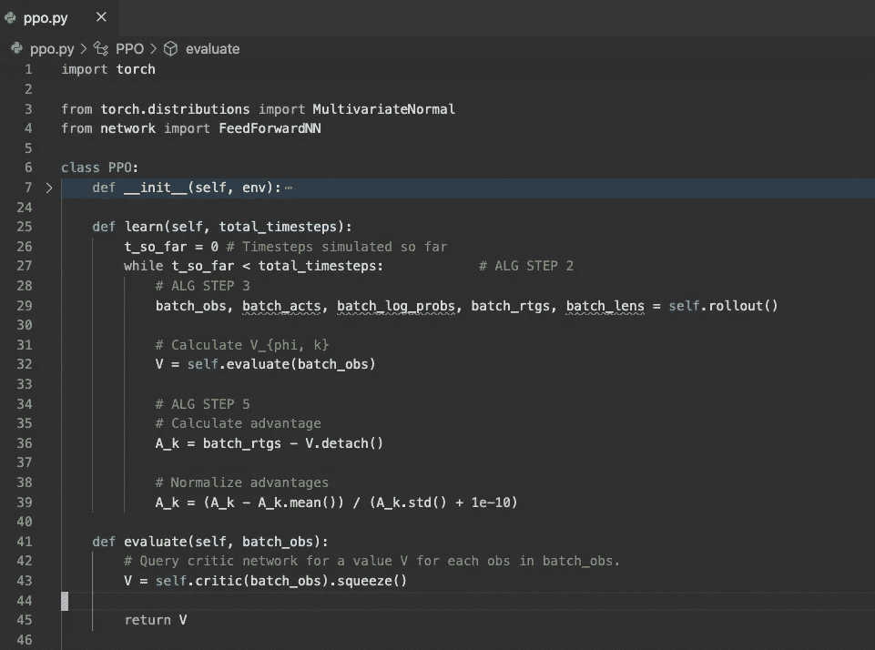

现在让我们看看第 6 步。

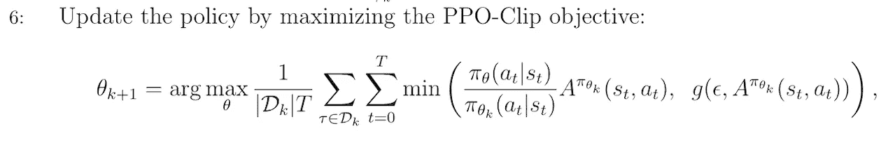

第六步。

啊，是的，房间里的大象。PPO 的生命和血液。这个公式告诉我们如何更新演员网络的参数θ。对我们来说幸运的是，我们需要的大部分东西要么已经计算出来，要么可以用现有的子程序计算出来。

首先，让我们解决左代理函数中的比率问题。

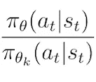

参数为θ的动作概率与参数为θₖ.的动作概率之比

好的，我们需要计算我们在最近一次展示中采取的行动的对数概率。同样，对于为什么我们发现日志问题而不是原始行动问题，这里的是解释原因的资源，这里的是另一个资源。

底部的对数问题集将与第 *k* 次迭代(我们已经有了`batch_log_probs`)的参数θ相关，而顶部正好在当前时期(原始伪代码也假设多个时期)。让我们在`evaluate`中完成它，而不是定义一个全新的子程序来计算 log probs。

首先，让我们修复`evaluate`来返回动作的日志问题。

```
def evaluate(self, batch_obs, batch_acts):
  ...
  # Calculate the log probabilities of batch actions using most 
  # recent actor network.
  # This segment of code is similar to that in get_action()
  mean = self.actor(batch_obs)
  dist = MultivariateNormal(mean, self.cov_mat)
  log_probs = dist.log_prob(batch_acts) # Return predicted values V and log probs log_probs
  return V, log_probs
```

接下来，让我们修复之前进行的 evaluate 调用，以解包一个额外的返回值来计算 advantage。

```
V, _ = self.evaluate(batch_obs, batch_acts)A_k = batch_rtgs - V.detach()...
```

现在，让我们开始我们的纪元循环，在我们的演员和评论家网络上执行多次更新。历元数是一个超参数，所以我们也可以将它添加到`_init_hyperparameters`中。

```
for _ in range(self.n_updates_per_iteration):
  # epoch codedef _init_hyperparameters(self):
  ...
  self.n_updates_per_iteration = 5
```

注意，我任意选择了 5。现在再次注意比率公式:


参数为θ的动作概率与参数为θₖ.的动作概率之比

我们已经有了最底层的日志问题。我们只需要找到π_θ(aₜ|sₜ)，我们也可以用`evaluate`来表示。注意，这是我们第二次调用`evaluate`，这一次它将在纪元循环中而不是之前。我们之前调用的`evaluate`只提取`V`用于计算优势，就在这个纪元循环之前。

```
for _ in range(self.n_updates_per_iteration):
  # Calculate pi_theta(a_t | s_t)
  _, curr_log_probs = self.evaluate(batch_obs, batch_acts)
```

现在，由于`batch_log_probs`和`curr_log_probs`都是对数概率，我们可以将它们相减，然后用 *e* 对对数求幂。很酷的小魔术。注意`curr_log_probs`没有被分离，这意味着它有一个与之相关联的计算图，我们希望在以后计算梯度时将它作为反向传播的一部分。这是我们计算图表的开始。

```
# Calculate ratios
ratios = torch.exp(curr_log_probs - batch_log_probs)
```

现在，让我们来计算替代损失。替代损失是我们将在步骤 6 中取最小值的两个损失。第一个替代损失使用原始比率来计算比率*优势，而第二个替代损失剪辑比率，以确保我们在梯度上升期间不会在任何方向上走得太远。这应该很容易，因为我们已经找到了公式的所有小部分。

```
# Calculate surrogate losses
surr1 = ratios * A_k
surr2 = torch.clamp(ratios, 1 - self.clip, 1 + self.clip) * A_k...def _init_hyperparameters(self):
  ...
  self.clip = 0.2 # As recommended by the paper
```

我使用 torch.clamp，它将参数 1 或者参数 2 和参数 3 之间的比率绑定为各自的下限和上限。有关`torch.clamp`、[的一些文档，请点击这里](https://pytorch.org/docs/stable/generated/torch.clamp.html)。

最后，我们计算我们的全部演员损失。

```
actor_loss = (-torch.min(surr1, surr2)).mean()
```

让我们后退一步。按照伪代码，我们取两个替代损失的最小值。我们有负面影响，因为我们试图通过随机梯度上升来最大化这一损失或性能/目标函数，但我们将使用的优化器是 Adam，它可以最小化这一损失。因此，最小化负损失可以最大化性能函数。然后，我们取平均值，生成一个单一的损失作为浮动。

让我们在演员网络上进行反向传播。首先，我们需要为我们的 actor 参数定义 Adam optimizer。让我们在`__init__`中这样做。

```
from torch.optim import Adamclass PPO:
  def __init__(self, env):
    ...
    self.actor_optim = Adam(self.actor.parameters(), lr=self.lr) def _init_hyperparameters(self):
    ...
    self.lr = 0.005
```

同样，`lr`或学习率是任意定义的。让我们现在做我们的反向传播，并在我们的演员网络执行一个时代。

```
# Calculate gradients and perform backward propagation for actor 
# network
self.actor_optim.zero_grad()
actor_loss.backward()
self.actor_optim.step()
```

这就是可怕的第六步！以下是目前为止的代码:

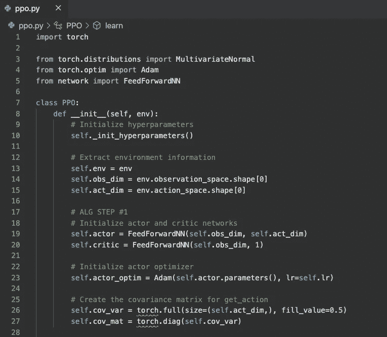

__init__

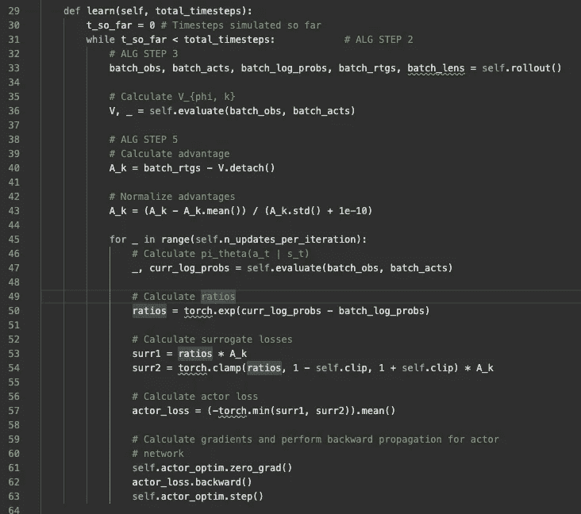

学习

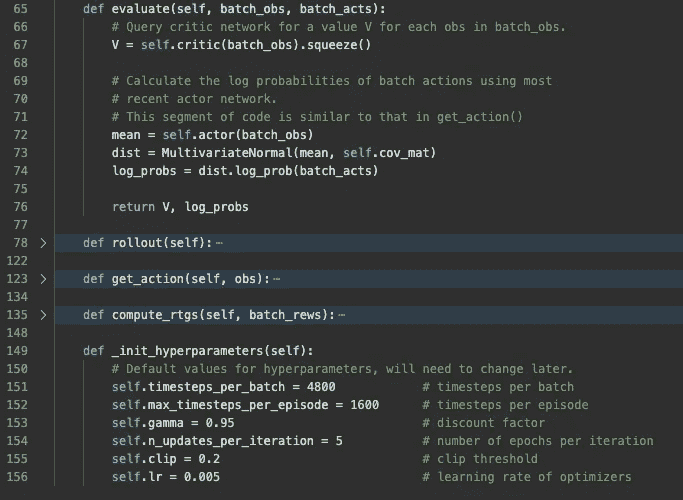

评估，_ init _ 超参数

让我们继续倒数第二步，第 7 步。

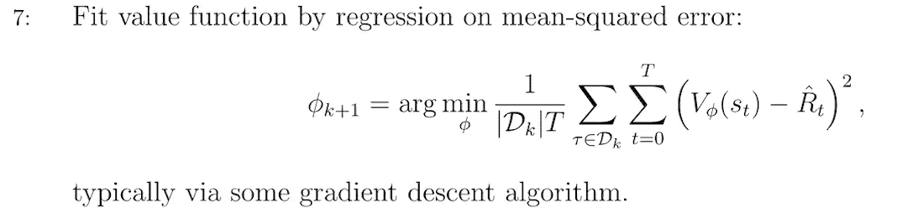

第七步。

这可能看起来真的很可怕，但我们真的只是用当前时期的预测值的均方误差(Vᵩ(sₜ)来更新 critic 参数，并进行奖励。我们将使用来自`torch.nn`的给定类，它将为我们计算 MSE，`torch.nn.MSELoss`。这里有一些[文档](https://pytorch.org/docs/stable/generated/torch.nn.MSELoss.html)。如果你愿意，你也可以自己写 MSE 函数来代替 torch 的，应该不会太难。

首先，让我们为我们的评论家网络定义另一个 Adam 优化器。

```
self.critic_optim = Adam(self.critic.parameters(), lr=self.lr)
```

然后，我们需要计算 Vᵩ(sₜ)和奖励。幸运的是，我们已经用`batch_rtgs`计算了奖励积分。对我们来说更幸运的是，我们可以找到 Vᵩ(sₜ),只需对现有代码做一个简单的修改:在 epoch 循环中调用`evaluate`的地方，只保留返回的`V`,而不是用`_`忽略它。

```
# Calculate V_phi and pi_theta(a_t | s_t)    
V, curr_log_probs = self.evaluate(batch_obs, batch_acts)
```

最后但同样重要的是，计算预测值和奖励的 MSE，并在 critic 网络上反向传播。

```
critic_loss = nn.MSELoss()(V, batch_rtgs)# Calculate gradients and perform backward propagation for critic network    
self.critic_optim.zero_grad()    
critic_loss.backward()    
self.critic_optim.step()
```

请注意，由于我们正在对计算图进行第二次反向传播，并且 actor 和 critic 损失计算图都在图中向上收敛了一点，因此我们需要为 actor 或 critic 添加一个`retain_graph=True`到`backward`(取决于我们首先反向传播哪个)。否则，我们将得到一个错误，表明当第二次试图通过图返回时，缓冲区已经被释放。

这就是第 7 步！以下是目前为止的代码:

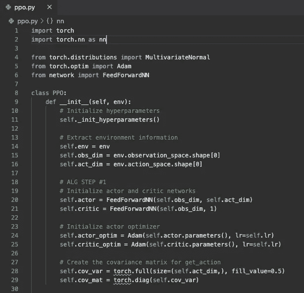

__init__

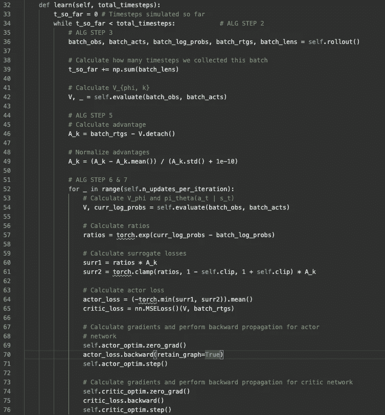

学习

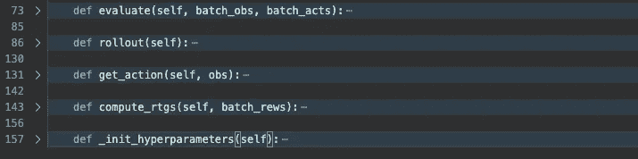

其余的代码，从第 6 步开始就没有改变。

现在，最后一步…第八步。

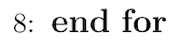

第八步。

是的，很可能是最难的一步。只要等到你看到第 9 步，这是很难的一步。

更严肃地说，我们不能忘记增加我们在第 2 部分开始时设置的`t_so_far`，以便记录要运行多少次迭代。让我们利用从`rollout`返回的`batch_lens`来做这件事。

```
import numpy as np...# ALG STEP 2
while t_so_far < total_timesteps:
  ... 
  batch_obs, batch_acts, batch_log_probs, batch_rtgs, batch_lens = self.rollout() # Calculate how many timesteps we collected this batch   
  t_so_far += np.sum(batch_lens)
```

而现在你有了一个功能齐全的裸机 PPO！为了测试到目前为止是否一切正常，您可以在您的 **ppo.py** 底部运行这段代码:

```
import gym
env = gym.make('Pendulum-v0')
model = PPO(env)
model.learn(10000)
```

如果程序运行没有任何错误(大约需要 10 秒钟)，您就成功了。如果到目前为止有任何问题或错误，请让我知道。你也可以用主要的 [PPO 初学者代码](https://github.com/ericyangyu/PPO-for-Beginners)来交叉引用你现在拥有的。

现在你可能想知道:Eric，你只写了 **ppo.py** 和 **network.py** ，但是在第 1 部分中你还有 **main.py** 、 **arguments.py** 和 **eval_policy.py** 。您还拥有许多其他功能，如日志记录、保存演员和评论家网络、解析命令行参数、自定义超参数等等。另外， [PPO for 初学者](https://github.com/ericyangyu/PPO-for-Beginners)代码看起来和上面的截图有点不一样。

你完全正确。然而，为了简单起见，我不会在本系列中讨论我是如何编写这些部分的，因为这与学习如何用 PyTorch 编写一个基本的 PPO 实现无关。我保证所有额外的东西都放在最基本的 PPO 之上，它是其余代码的基础。

相反，我鼓励您亲自探索额外的特性如何与基本的 PPO 实现同步工作。我强烈推荐使用`pdb`，或者 python 调试器，从 **main.py** 中的`if __name__ == '__main__':`开始逐步调试我的代码。如果你不知道如何使用`pdb`，在这里快速入门[。如果你已经是使用`pdb`的专家，这里有](https://www.youtube.com/watch?v=bHx8A8tbj2c&ab_channel=RealPython)[文档](https://docs.python.org/3/library/pdb.html)。

存储库 **README.md** 包含如何在“Usage”下运行代码的说明。我所有的文件和代码都设计得非常详细，并且有很好的文档记录，所以你可以尽情地探索它们。我把它们组织起来，希望事情尽可能简单和模块化。

本系列的第 3 部分到此结束；此时，您应该已经从伪代码中完全实现了 PPO，并且应该能够从第 1 部分中看到的图表中获得性能。我知道这有很多材料需要消化，所以如果你有任何问题，不要犹豫，联系我在 eyyu@ucsd.edu 或只是评论如下。

在第 4 部分中，我们将探索一些可以在基本的 PPO 上执行的优化，以提高性能并减少差异。然而，第 4 部分可能还需要一段时间。在此之前，希望这个系列到目前为止对你有所帮助！