# 编写不可能的代码:带正则表达式的回文检测器

> 原文：<https://medium.com/analytics-vidhya/coding-the-impossible-palindrome-detector-with-a-regular-expressions-cd76bc23b89b?source=collection_archive---------2----------------------->


安德烈·木桐在 [Unsplash](https://unsplash.com/s/photos/mirror?utm_source=unsplash&utm_medium=referral&utm_content=creditCopyText) 上的照片

我遇到了一个[堆栈溢出问题](https://stackoverflow.com/questions/233243/how-to-check-that-a-string-is-a-palindrome-using-regular-expressions)，它询问如何使用正则表达式检查一个字符串是否是回文。有 147 张赞成票的顶级答案指出这是**不可能的**，所以甚至没有尝试的意义。从技术上讲，他对任意长度的回文是对的，但这并不意味着我们不能对最大长度的回文做一个。顺便说一句，有更简单的方法来检查回文，例如反转字符串并将其与原始字符串进行比较。所以何必呢？为了智力挑战和锻炼我的正则表达式技能。我想让它处理我最喜欢的回文:“一个人，一个计划，一条运河，巴拿马！”所以我写了一个正则表达式来检测多达 22 个字符的回文，忽略制表符、空格、逗号和引号。我使用 JavaScript 风格的正则表达式。

以下是解决方案

```
\b(\w)[ \t,'"]*(?:(\w)[ \t,'"]*(?:(\w)[ \t,'"]*(?:(\w)[ \t,'"]*(?:(\w)[ \t,'"]*(?:(\w)[ \t,'"]*(?:(\w)[ \t,'"]*(?:(\w)[ \t,'"]*(?:(\w)[ \t,'"]*(?:(\w)[ \t,'"]*(?:(\w)[ \t,'"]*\11?[ \t,'"]*\10|\10?)[ \t,'"]*\9|\9?)[ \t,'"]*\8|\8?)[ \t,'"]*\7|\7?)[ \t,'"]*\6|\6?)[ \t,'"]*\5|\5?)[ \t,'"]*\4|\4?)[ \t,'"]*\3|\3?)[ \t,'"]*\2|\2?))?[ \t,'"]*\1\b
```

你可能在想，要么是一只猫在我的键盘上走过，要么这是用某种早已被遗忘的语言召唤克苏鲁的秘密咒语。不，它实际上是一个有效的正则表达式。请随意使用[regexr.com](http://regexr.com/4tmui)来检查它，这是一个很棒的工具，可以立即看到你的正则表达式的结果，并解释了每个部分的作用。我会告诉你我是怎么做到的，这样就说得通了。

首先，我们需要检测一个字符是否重复。

```
(.)\1
```

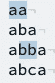

匹配正则表达式的文本被突出显示。

很简单。两个字重复？*新零件以* **粗体*显示。***

```
Old: (.)     \1
New: (.)**(.)\2**\1
```

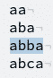

好的，这只适用于长度正好为 4 个字符的回文。如果第二次回看是可选的，我们可以用 3 个字符的回文来实现它。

```
Old: (.)(.)\2 \1
New: (.)(.)\2**?**\1
```

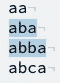

酷，现在我们可以让它为 2 个字符串工作，让内部部分可选。*把(？:…)创建非捕获组。*

```
Old: (.)   (.)\2?  \1
New: (.)**(?:**(.)\2?**)?**\1
```

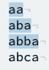

我们进展顺利，继续吧。

```
Old: (.)(?:(.)           \2?)?\1
New: (.)(?:(.)**(?:(.)\3?)?**\2)?\1
```

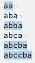

啊哦…我们设法检测到 5 和 6 个字符串，但是我们丢失了 3 个字符串。问题是 **\2** 不是可选的，例如，当 **aba** 到达第三个字符时，它在寻找第二个 **b** 字符，但没有找到。这仍然是一个有效的回文，因为 **b** 正好在字符串的中间。所有奇数长度的回文中间都有一个不重复的字符。我们能修好它。让我们使 **\2** 可选！

```
Old: (.)(?:(.)(?:(.)\3?)?\2 )?\1
New: (.)(?:(.)(?:(.)\3?)?\2**?**)?\1
```

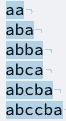

耶！等等…现在 **abca** 是假阳性🤦。这是最棘手的一点。如果你准备迎接一个挑战，在向下滚动查看答案之前，花一点时间想一想你会如何解决它。


Juan Rumimpunu 在 [Unsplash](https://unsplash.com/s/photos/thinking?utm_source=unsplash&utm_medium=referral&utm_content=creditCopyText) 上拍摄的照片

我们真的希望可以用 if 语句将 **\2** 替换为 **\2？**只有在没有 **\3** 的情况下，但是 regex 没有 if 语句…但是，它有一个 OR 运算符，我们可以用它来得到相同的结果。

```
Old: (.)(?:(.)(?:(.)\3?)? \2? )?\1
New: (.)(?:(.)(?:(.)\3?**\2|**\2?)**)**?\1
```

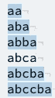

头奖！这是一个微妙的变化，使所有的差异。还是我有**(。)\3?\2** 意思是“如果有一个新的内部字符(或两个相同的)，我们必须重复第二组”，另一边是 **\2？**这意味着“如果没有新的内部字符，可选地重复第二组。”第二种情况表明我们现在正处于回文的中间，所以只有一个中间字符是可以的，或者有两个。这就是我们需要**的原因？**。否则，组 2 必须存在，它才是有效的回文。我们能继续吗？没错。

```
Old: (.)(?:(.)(?:(.)            \3? \2|\2?))?\1
New: (.)(?:(.)(?:(.)**(?:(.)\4?\3|\3?)**\2|\2?))?\1
```

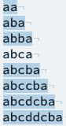

不错！我干脆把 **\3 换掉？**同**(？:(.)\4?\3|\3?)**，和之前的逻辑一样。现在我们可以不断替换内部组来制作任意长度的正则表达式回文检测器！唯一的问题是正则表达式的长度也会不断增长，因为我们不能在正则表达式中写循环。让我们做一个足够大的来检测我的目标句子。

```
(.)(?:(.)(?:(.)(?:(.)(?:(.)(?:(.)(?:(.)(?:(.)(?:(.)(?:(.)(?:(.)\11?\10|\10?)\9|\9?)\8|\8?)\7|\7?)\6|\6?)\5|\5?)\4|\4?)\3|\3?)\2|\2?))?\1
```

尽管 regex 中没有忽略空白，我还是添加了新的行和缩进来使这种混乱更容易阅读，但是请记住顶部的表达式是有效的。

```
(.)(?:
  (.)(?:
    (.)(?:
      (.)(?:
        (.)(?:
          (.)(?:
            (.)(?:
              (.)(?:
                (.)(?:
                  (.)(?:
                    (.)\11?\10|\10?)
                  \9|\9?)
                \8|\8?)
              \7|\7?)
            \6|\6?)
          \5|\5?)
        \4|\4?)\3|\3?)
    \2|\2?))?
\1
```

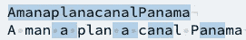

有用！现在困难的部分已经完成了。为了庆祝胜利，我们让回文字符只包含字母数字和独立的单词。我使用了不区分大小写的标志。

```
\b(\w)(?:(\w)(?:(\w)(?:(\w)(?:(\w)(?:(\w)(?:(\w)(?:(\w)(?:(\w)(?:(\w)(?:(\w)\11?\10|\10?)\9|\9?)\8|\8?)\7|\7?)\6|\6?)\5|\5?)\4|\4?)\3|\3?)\2|\2?))?\1\b
```

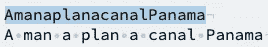

我换掉了每一个**。**用 **\w** 我把表达式用 **\b** 包起来，这样单词的内部部分就被排除了，就像 P **ana** ma 中一样。为了支持短语，让我们忽略空格、制表符、逗号和引号。

```
\b(\w)[ \t,'"]*(?:(\w)[ \t,'"]*(?:(\w)[ \t,'"]*(?:(\w)[ \t,'"]*(?:(\w)[ \t,'"]*(?:(\w)[ \t,'"]*(?:(\w)[ \t,'"]*(?:(\w)[ \t,'"]*(?:(\w)[ \t,'"]*(?:(\w)[ \t,'"]*(?:(\w)[ \t,'"]*\11?[ \t,'"]*\10|\10?)[ \t,'"]*\9|\9?)[ \t,'"]*\8|\8?)[ \t,'"]*\7|\7?)[ \t,'"]*\6|\6?)[ \t,'"]*\5|\5?)[ \t,'"]*\4|\4?)[ \t,'"]*\3|\3?)[ \t,'"]*\2|\2?))?[ \t,'"]*\1\b
```

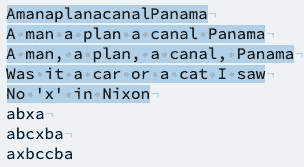

我只是在捕获组之外的每个字符之间插入了一串 **[ \t，' "]*** 表达式，所以这些字符可以存在于字符串中，而不需要在另一端进行镜像。

我们做到了！任务完成。他们说不可能！…他们是对的，有限的正则表达式不可能检测任意长度的回文，但是我们仍然可以做一个有限的来取乐！

你的家庭作业是写一个函数，它取一个长度，并输出一个正则表达式，这个正则表达式可以检测到这个长度的回文。