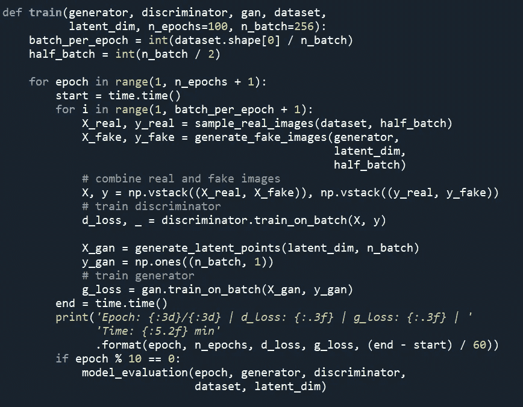

# 用 Keras 编写您的第一个 GAN 算法

> 原文：<https://medium.com/analytics-vidhya/coding-your-first-gan-algorithm-with-keras-ab2bdf761746?source=collection_archive---------11----------------------->

喝点咖啡，带上耳机，让我们开始编写你的第一个 GAN 算法吧！如果你不熟悉 GANs 或者 GANs 是如何工作的，在这里查看我的文章。

准备编码。[来源](http://Photo by Goran Ivos on Unsplash)

我们将马上开始，不浪费任何时间。gan 算法由以下组件组成:

1.  导入必要的库和数据集
2.  真实图像样本
3.  生成假图像
4.  创建模型:生成器、鉴别器、GAN
5.  培养
6.  模型评估
7.  预言

## 1.导入必要的库和数据集

我们将从导入基本库开始。神经网络是使用 keras API 和 tensorflow 后端创建的。我用的是 keras 版本' 2.2.5 '和 tensorflow 版本' 1.15.0 '。

导入库之后，我们需要导入训练数据集。我们将使用 MNIST 数据集来训练模型。MNIST 数据集是 70，000 个 28 x 28 大小的手写数字图像的集合，范围从 0 到 9。该数据集对初学者特别有用，因为该数据集是公开可用的，完全平衡的，并且只需要很少的预处理。所有的图像都是灰度级的，所以像素值在 0 到 255 的范围内。

来自 MNIST 数据集的样本图像

MNIST 数据集已经在 keras 库中可用，我们只需要加载数据集并将其分配给相应的变量。唯一需要的预处理是将无符号整数像素值从[0，255]转换为[0，1]。下面是导入和预处理数据的代码:

## 2.真实图像样本

为了对真实图像进行采样，我们将创建一个名为 *sample_real_images* 的函数。我们将从整个数据集中选择一批图像，并将每个图像标记为“1”。函数的输入将是整个*数据集* (x_train) 和 *batch_size。*请注意，我们将对真实图像使用标签“1 ”,对虚假图像使用标签“0”。因此，采样的真实图像的标签被设置为“1”。

## 3.生成假图像

生成假图像要稍微复杂一些，时间也更长。每幅图像都是从正态高斯分布中采样的 n 元素向量生成的。相应的，要生成一批图像，我们需要一批矢量。为此，我们将创建两个函数: *generate_latent_points* 来生成一批矢量，以及 *generate_fake_images* 来从这些矢量生成图像。 *generate_latent_points* 函数的输入将是 *latent_dim* (向量的长度)和 *batch_size。*

我们现在将定义一个名为 *generate_fake_images* 的函数，该函数将调用上述函数来生成一批向量，然后生成与每个向量对应的图像。该函数的输入将是一个*模型(生成器)*、*向量长度(潜在尺寸)*和*批量大小。*由于这些是假图像，所有这些图像的标签都被设置为“0”。

## 4.创建模型

在继续之前，我们先回忆一下 GAN 模型架构。如下图所示，GAN 模型由发电机模型和鉴别器模型串联而成。

GAN 模型架构

因此，我们将首先创建鉴别器和发生器的独立模型，然后将它们组合在一起，构成一个完整的 GAN 模型。还有其他方法来创造，但我发现这是非常简单的理解和实施。

**鉴别器模型为二元分类卷积神经网络。它的任务是区分真实和虚假的图像。我们将获取两个大小相等的小批量图像，一个是真实图像，一个是生成图像，并将其作为输入提供给鉴别器。鉴别器模型的输出将是图像属于真实(“1”)和虚假(“0”)类别的概率。**

以下参数已被证明可为鉴别器提供更好的性能结果:

1.  [*LeakyRELU*](https://keras.io/api/layers/activation_layers/leaky_relu/) 斜率为 0.2 的隐藏层激活功能
2.  [*丢失*](https://keras.io/api/layers/regularization_layers/dropout/) 正则化，神经元丢失率为 0.3~0.4
3.  [*亚当*](https://keras.io/api/optimizers/adam/) 优化器，学习率为 0.0002，动量为 0.5

现在让我们创建一个发电机模型。对于这个例子，我们将使用 100 元素的潜在向量来生成图像。100 的长度是任意的，我们可以自由选择 50、200、500 甚至 1000 作为向量的长度。

在卷积神经网络中，图像被转换成多个特征图，随后是汇集、展平过程，最后是几个完全连接的 [*密集*](https://keras.io/api/layers/core_layers/dense/) 层。网络的**输出将是相应图像的类别分数的向量**。由于生成器将从矢量创建图像，**它将遵循卷积神经网络**的精确逆过程**。**

1.  由 100 个元素组成的矢量将连接到一个*密集图层*上，该图层具有足够的节点，可在整形后创建多个要素地图。
2.  使用[*conv 2d transpose*](https://keras.io/api/layers/convolution_layers/convolution2d_transpose/)*层进行反卷积或上采样。*我们将使用(2x2)的步幅，使每一边的图像尺寸加倍，内核大小是步幅的倍数(CNN 的标准做法之一)。
3.  *斜率为 0.2 的隐藏层的 LeakyRELU* 激活功能
4.  输出层激活函数将是 *sigmoid* 以具有 0 和 1 之间的像素值。
5.  使用 [*批处理规范化*](https://keras.io/api/layers/normalization_layers/batch_normalization/) 是可选的，但建议用来提高性能。

> 理解我们为什么不编译发电机模型是很重要的。这是因为生成器模型不像鉴别器模型那样被直接训练。生成器模型的性能取决于鉴别器将伪图像分类为真实图像的能力。一旦我们投入到模型的训练中，我们会有更好的理解。

我们现在将使用 *create_gan_model* 函数创建一个完整的 GAN 模型。该合成模型由*生成器*模型(一批伪图像)组成，作为*鉴别器*模型的输入。我们将鉴别器权重的*可训练属性*设置为*假。*这样做是为了避免在生成器为假图像进行训练时改变鉴别器的权重。

## 5.培养

下图显示了两种不同的培训途径。鉴别器模型以独立的方式被训练和更新。之前，当我们将权重的*可训练*属性设置为 *False 时，*仅适用于 GAN 模型中的鉴别器模型。它不会以任何方式影响独立模型。

对于训练，我们将创建一个名为 *train* 的函数，它将连续训练这两个模型。我们将对模型进行 100 个时期的训练，并以 10 个时期为间隔对其性能进行评估。一旦训练开始，我们可以看到在 30 个时期之后，生成器模型能够生成相当真实的图像。

## 6.模型评估

GAN 模型的收敛性没有被完全理解和定义。生成器模型生成的图像需要进行主观评价来判断模型的性能。最常见的方法是定期检查鉴别器的准确性，保存发生器模型及其生成的图像。然后，这些生成的图像需要由用户进行主观评估。为此，我们有三个功能:

1.  **model _ evaluation:***我们将在生成的和真实的图像上检查鉴别器模型的准确性。我们还将定期保存生成器和鉴别器模型，以备将来使用和评估。*
2.  ***保存 _ 图像:**保存生成的图像*

**

*3. **create_animation:** 从生成的图像中创建动画。这将有助于可视化发电机模型的演变。*

**

## ***7。预测***

*一旦训练结束，就该预测和检查结果了。我们将使用最后保存的模型生成 20 幅图像。下面的结果表明，经过 100 个时期的训练后，该模型能够生成与训练数据集中的图像相似的相当好的图像。*

**

*使用 GAN 生成器模型生成的数字*

*完整的代码可以在我的 github [*这里*](https://github.com/kraken24/getting_started_with_gans) 找到。*

*下一步:我们可以试验不同的超参数，如输入向量的长度、批量、时期数、层数等，看看模型是否能产生更好的结果。*

*我希望你在这篇文章中找到一些有用的东西。如果你喜欢这篇文章，别忘了给它几个掌声！*

*参考资料:*

1.  *[https://arxiv.org/pdf/1406.2661.pdf](https://arxiv.org/pdf/1406.2661.pdf)*
2.  *[https://www.tensorflow.org/tutorials/generative/dcgan](https://www.tensorflow.org/tutorials/generative/dcgan)*
3.  *更详细的了解，请参考本教程:[https://machine learning mastery . com/how-to-develop-a-generative-adversarial-network-for-an-mnist-handled-digits-from-scratch-in-keras/](https://machinelearningmastery.com/how-to-develop-a-generative-adversarial-network-for-an-mnist-handwritten-digits-from-scratch-in-keras/)*
4.  *[https://keras.io/api/datasets/mnist/](https://keras.io/api/datasets/mnist/)*