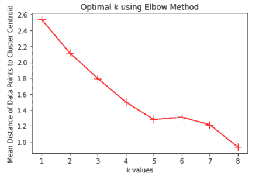

# 基于聚类算法的巴黎咖啡店选址

> 原文：<https://medium.com/analytics-vidhya/coffee-shop-site-selection-in-paris-a69065fffb41?source=collection_archive---------26----------------------->

对于咖啡和巴黎的爱好者

对我们许多人来说，早上做的第一件事是喝咖啡或思考在哪里可以喝一天的第一杯咖啡。这一事实使得咖啡成为一种有价值的产品，根据 OEC(经济复杂性观察站)的数据，咖啡的交易量排在第 107 位。

据[欧洲咖啡联合会](https://www.ecf-coffee.org/)统计，2015 年，法国人消费了约 36.6 万吨生咖啡，占欧盟生咖啡消费量的 13%。根据这一数据，在同一年里，每个人消耗 5.1 公斤。

数据显示，咖啡消费对法国市场非常重要，并且仍在增长。这导致了一个结论:这是一个开咖啡店并成为这个大生意一部分的好时机。为了使这项业务取得成功，关键是要选择一个有重要客户群的正确的咖啡店地址。

本研究的目的是提供一个信息地图，帮助选择在巴黎哪个社区开咖啡店更好。

用于选择地点的标准如下:
-中等家庭收入:目标高收入家庭
-人口密度:密集的社区会有更多的潜在客户
-雇员基础:有更多办公室和工业场所的社区会有更多的潜在客户
-就业状况:高就业率的社区更受欢迎
-竞争者:竞争者较少的社区更受欢迎

标准列表并非详尽无遗。由于缺乏数据，我只选择上述标准。例如，有可能包括邻域中的车辆交通。

# A.数据

为了获得地理数据，我使用了网站 [data.gouv.fr](https://www.data.gouv.fr/) ，该网站提供了许多我能找到的关于巴黎的数据。包含行政区和社区坐标的 json 文件。

为了进行这项研究，我还使用了来自 INSEE 网站的数据，该网站是法国国家统计和经济研究所。

在 INSEE 网站上，我找到了组成巴黎的 20 个区中每个区的家庭收入中位数、人口密度和就业状况的信息。数据是表格格式的，有必要使用抓取技术来生成干净的数据集。

INSEE 也给出了每个区的机构类型的数据。这些信息有助于确定一个社区是否可以被视为一个有趣的员工基地。

我用 Foursquare API 获取了巴黎每个街区最常见的场馆。该数据允许关注竞争对手并避免靠近其他咖啡店。

# B.方法学

## 1.获取数据

在这项研究中，我们有三个数据源，可以构建所有数据集并运行所需的分析。

*   **地理数据**

从[的法国公共数据开放平台](https://www.data.gouv.fr/)，我下载了两个 json 文件来构建巴黎的行政区和街区数据框架。

下图显示了巴黎的 5 个街区及其特征:*邮政编码，区，区表面，街区，纬度，经度*。

巴黎街区数据框架

巴黎由 20 个区组成，每个区又分为 4 个街区。我们总共有 80 个社区。下图显示了巴黎行政区和街区的地图。

巴黎地图

*   **场馆数据**

Foursquare API 用于获取每个街区的场地。下图显示了相应的数据帧。

巴黎场馆

*   **人口统计数据**

既然我们已经建立了社区和场馆数据框架，我们将重点从 [INSEE](https://insee.fr/) 网站获取人口统计数据:
-家庭收入中位数
-人口密度
-员工基数
-就业状况

INSEE 网站提供每个区的数据。因此，我将收集每个区的数据，然后将区值分配给组成它的邻域。使用 *BeautifulSoup* python 库执行抓取过程。
下图显示了人口统计数据框架。

巴黎每个区的人口统计数据

列*Preferred Section Employees*包含每个行政区的工业、行政和服务部门的工作数量。这些部门的员工越多，我们就越能认为这个区是一个员工基地。

## 2.探索和数据处理

*   **巴黎咖啡店与竞争力**

由于我们只对咖啡店感兴趣，我们需要根据类别从巴黎场馆中提取这些商店。咖啡店属于类别*咖啡馆*或*咖啡店*。

每个街区都有巴黎咖啡店

咖啡店的数量是检查附近是否有许多竞争者的重要信息。基于这些数据，我们可以设置每个邻域的竞争力水平。要做到这一点，让我们看看下图所示的咖啡店分布。

附近的咖啡店分布

根据上面的柱状图，每个社区的咖啡店数量，我们可以将社区分为三类。
**-低竞争力:**咖啡店数量少于 2 家
**-中等竞争力:**咖啡店数量在 2 到 4 家之间
**-高竞争力:**咖啡店数量大于 4 家

现在，邻域数据框架有了一个新列来标注竞争力水平，如下图所示。

邻域数据框-竞争力

*   **首选行业员工密度**

如果我们考虑所有区的人口统计数据，除了*首选部门员工*，我们可以将它们应用于形成区的邻近地区，因为它们相对于表面或人口是标准化的。我计算了*首选部门的员工密度*以便能够用于邻近地区。

*首选部门员工密度=首选部门员工/行政区面积*

最终的邻域数据框将如下图所示。

巴黎社区数据框架-竞争力和人口统计数据

## 3.**聚集巴黎街区**

现在我有了最终的数据集，我可以继续对巴黎的街区进行聚类，以便向创业者推荐一个更适合自己开咖啡店的街区。

在运行聚类算法之前，我使用 one hot 编码函数转换了*competitive*列，以便获得数字数据。然后，我用*标准缩放器*来归一化所有的特征。

我使用了 k-means 算法来分割巴黎的街区。为了选择最佳的 k 值，我应用了下图所示的**肘方法**。

KMeans 算法—肘方法

我们可以在图上看到，平均距离在 k 值为 5 时下降，并使图形呈肘形。所以可以得出我们的最优值是: **k = 5** 。

# C.结果

此后，意指用于定义不同聚类的每个聚类的特征。

聚类均值特征

从上面的结果中，我们可以很容易地根据*竞争力*特征区分出三种类型的集群(高、低和中)。然后，考虑*失业率*和密度，我们对其他集群进行分类。

因此，我选择以下集群名称:
**-集群 0 :** 低竞争力、低人口和偏好部门密度
- **集群 1 :** 低竞争力、高失业率
- **集群 2 :** 高竞争力
- **集群 3 :** 低竞争力、高人口和偏好部门密度
- **集群 4 :** 中等竞争力

下面的地图显示了巴黎集群。

巴黎集群

在描述了每个集群的特征后，我们可以很容易地注意到 **Custer 3** 是最有趣的一个，因为它集合了许多优势，如低竞争力、高人口和优先的部门密度。

下图显示了组成**簇 3** 的不同邻域。

集群 3 数据帧

我们可以从**聚类 3** 数据帧中注意到，街区 **Rochechouart** 、 **Chaussée-d'Antin** 和 **Faubourg-Montmartre** 具有偏好的人口特征。他们是推荐给想自己开咖啡店的人的最佳人选。

下图显示了三个选定的街区。

选定的社区

# D.讨论

许多数据显示，咖啡消费仍然很重要，而且还在增加。所以，开一家咖啡店总是创业的好主意，尤其是在像巴黎这样的大城市。

然而，选择咖啡店的位置并不简单。我们必须考虑许多因素，以使这项业务成功和有利可图。这项任务需要汇编多种类型的数据集，这些数据集考虑了社区的人口统计和竞争情况。

为了解决这个问题，我采用了一种细分方法，旨在根据人口统计和地点数据对巴黎街区进行聚类。我使用 Kmeans 算法和 elbow 方法来确定簇的数目和它们的质心。

分析给出了 5 个聚类，这使得选择推荐给创业者的候选社区变得容易。候选街区是 Rochechouart、Chaussée-d'Antin 和 Faubourg-Montmartre。

所执行的分析考虑了许多参数来确定最佳位置。但是，可以包括其他功能来使结果更好，并保证业务成功。例如，可以添加交通数据和与其他企业的接近度。

我使用地理库来显示邻域边界和聚类，这使得理解结果变得容易。

# 结论

实际研究提供了一个可扩展的解决方案，帮助创业者选择自己的商业网站。为了保证成功，它结合了许多特性。

完成这一分析后，business stater 可以继续关注商业选址过程中应该考虑的微观标准。

这种分析不仅适用于咖啡店选址，也适用于任何生产地点的选择。

# 参考

*   [经济复杂性观察站](https://oec.world/en/profile/hs92/0901/)
*   [欧洲咖啡联合会](https://www.ecf-coffee.org/)
*   [data.gouv.fr](https://www.data.gouv.fr/)
*   [INSEE](https://www.insee.fr/)

# 贮藏室ˌ仓库

这里有一个用于进行这项研究的笔记本的链接:[Paris _ Coffee _ Shop _ Site _ selection . ipynb](https://github.com/khaled-kch/Coursera_Capstone/blob/master/Paris_Coffee_Shop_Site_Selection.ipynb)。