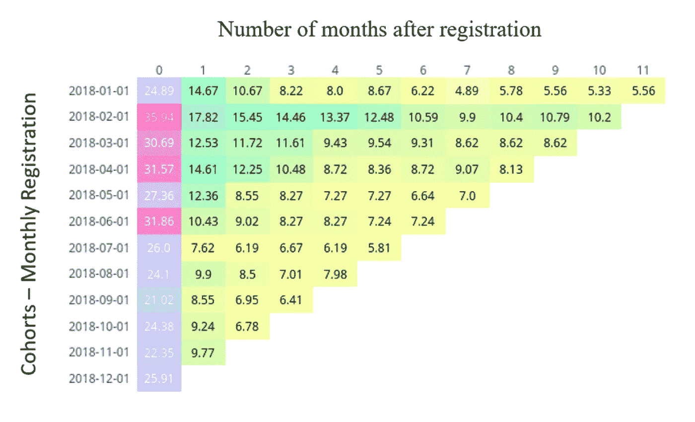

# 群组分析:从 SQL 到 Plotly 可视化

> 原文：<https://medium.com/analytics-vidhya/cohort-analysis-95a794b4e58c?source=collection_archive---------6----------------------->

## 从头开始构建交互式群组表

马库斯·斯皮斯克在 [Unsplash](https://unsplash.com?utm_source=medium&utm_medium=referral) 上拍摄的照片

# TL；速度三角形定位法(dead reckoning)

群组分析的温和方法，它的目的，它看起来如何以及如何建立它。代码可以在我的 [GitHub repo](https://github.com/IsmaelMasharo/behavioral-analytics/tree/master/cohort-analysis) 中找到，作为独立的脚本。外卖是用 Plotly 制作的可定制[队列表](https://plot.ly/~masharo/20/#/)。

## 把我们自己放在环境中

想象一个电子商务平台。它提供服务。用户开始注册。他们中的一些人频繁互动，一些人在一两个月后离开。我们如何总结这种行为？我们可以执行哪种报告来从收集的数据中获取价值？这就是群组分析的意义所在。

## 什么是队列？

这是一个和一个有着共同特征的人。再说一遍？以这群蓝色的学生为例:

米凯尔·克里斯滕森在 [Unsplash](https://unsplash.com/) 上拍摄的照片

想象一下他们都是 2018 年毕业的。这个团体就是`cohort`。都是共享毕业年份。

## 好吧，那么什么是队列分析？

它是对在给定时期聚集的这些个人的分析，他们与服务交互的频率以及这些交互如何随时间变化。

在一个更正式的定义中，它是在[行为分析](https://en.wikipedia.org/wiki/Behavioral_analytics)中使用的现有机制之一，用于识别客户保留的趋势及其与给定服务(比如我们的电子商务网站)的交互和演变。

## 它回答了什么问题？

让我们考虑用户`registration date`和用于聚类用户的`monthly time frame`。问题如下:

*   **在 Y 月注册的用户在 X 个月后仍然活跃的比例是多少？**

这里的`users registered in month Y`是一个`Cohort`。`X months after`对其行为进行分析，对其进行登记。

*   **不同群组的用户互动有何不同？**

第一个问题分析的是`one cohort and its evolution over time`，这里我们关注的是`how do different cohorts are compared to one another`。

## 输出是什么，看起来怎么样？

分析结果被总结为`Cohort Table`。

2018 年用户活动月度队列表。用[精心打造](https://plot.ly/)。

横轴代表独立组群随时间的演变，而纵轴比较它们之间的差异。

每个单元格中的值是给定`cohort month vs numbers of months ahead`交叉点中活动用户的百分比。这就是所谓的*用户留存百分比*。

让我们再深入一点。

## 如何解读这份报告？

在我们的例子中，我们将采用上面图中的值。我们再来考虑一下 1 月和 2 月的注册用户数分别为 [450 和 1010](#aad2)。

然后，分析一月份的队列，故事将是:

> 从 1 月份注册的用户来看，我们有 24.89%的用户保留率，其中只有 112 人进行了互动。注册五个月后，只有 39 家(8.67%)仍然活跃。

问题是关于什么的？我们想知道一组用户如何与我们的平台交互，不仅如此，还要知道这些交互的演变。

现在让我们比较一下一月和二月的队列:

> *看一下每个群组中活跃用户的百分比，我们可以看到留存率增加了 11 %, 1 月份 450 名活跃用户中有 112 名，而下个月 1010 名活跃用户中有 363 名。*

我们在这里看到了什么？两个不同的群体是如何彼此不同的。

# 变得有点技术化

我们已经讨论了队列分析的一些主要概念。现在，让我们简单谈谈如何构建这样一个报告。

## 我从哪里获得数据？它可能存储在数据库中

分析的来源将是具有以下模式的数据库模型:

这里，`user`保存注册用户的信息，而`interaction`记录不同的用户交互以及它们执行的日期。

## 几乎是一个队列表

直接通过查询数据库来构建队列表将是一项艰巨的任务。因此，我们将首先从模式转到如下内容:

然后，我们可以使用 Excel 或 Tableau 之类的数据操作工具来执行最终调整，并获得群组表。我已经用[熊猫](https://pandas.pydata.org/)完成了这个任务。

让我们检查上面的列:

*   `cohort month`相当于`Y`变量(每月分析的用户),`number of months ahead`相当于`X`变量(给定月数后的发展)。
*   `total user`在给定月份具有相同的值，因为它是该群组中分析的用户数量。
*   `retention percentage`的值是我们想要从分析中得到的。

## SQL 您最亲密的盟友

正如我们所看到的，要开始构建我们的群组表，我们需要在数据库上执行一些聚合和分组。解释构建这样一个查询的过程会偏离这篇文章的目的。更多细节请查看 Holistycs 的[这篇很棒的文章](https://www.holistics.io/blog/calculate-cohort-retention-analysis-with-sql/)，在那里他们详细描述了这些步骤。

下面是我们从中获取汇总表的查询:

## 让群组表格互动

SQL 查询返回一些我们可以轻松处理的内容。但是想象一下有几十个群组，那么每个群组都有几十个值。现在不太好办了。

幸运的是，我们可以使用一些非常简洁的工具来处理数据。我使用了 [pandas](https://pandas.pydata.org/) 来合并、堆叠和整形从 SQL 获得的表。你可以看一下[代码](https://github.com/IsmaelMasharo/behavioral-analytics/blob/master/cohort-analysis/cohort_analisis.ipynb)并用你自己的数据做实验。这是最终表格的样子:

`This is the actual Cohort Table`。它看起来很好，但如果我们能与它互动，它会更好。这就是[plottly](https://plot.ly/)闪耀的地方，将表格显示为一个交互的情节。然后，您可以自定义悬停时显示的内容、颜色渐变、图例，并将其嵌入到您的站点中，等等。同样，你可以查看[代码](https://github.com/IsmaelMasharo/behavioral-analytics/blob/master/cohort-analysis/cohort_analisis.ipynb)来了解构建它的步骤。

这是最终的视觉效果:

互动队列表由[图表工作室](https://plot.ly/online-chart-maker/)提供。

## 最终想法

记住`cohort analysis is a tool`开始解决其他有趣的问题，比如**为什么会这样？** **我们该怎么办？我们如何从中获利？**这样，您可以继续进行更丰富的分析。

这是我的第一篇帖子！希望你觉得有用。

开心分析！