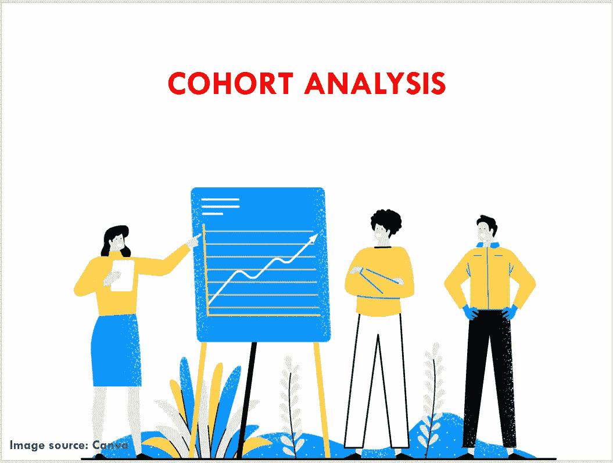
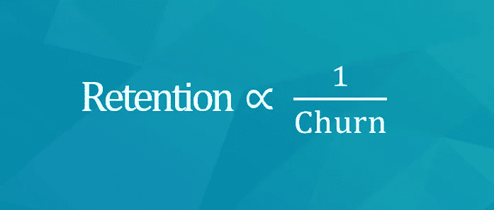
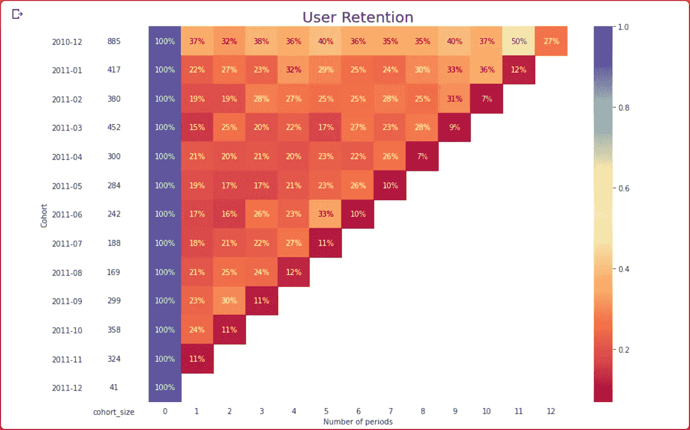
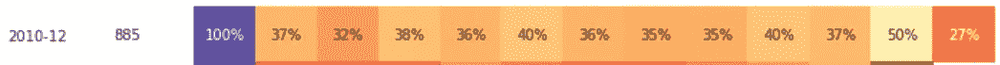
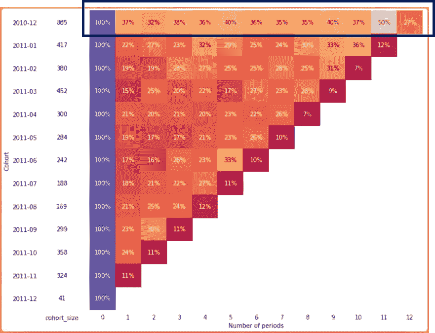
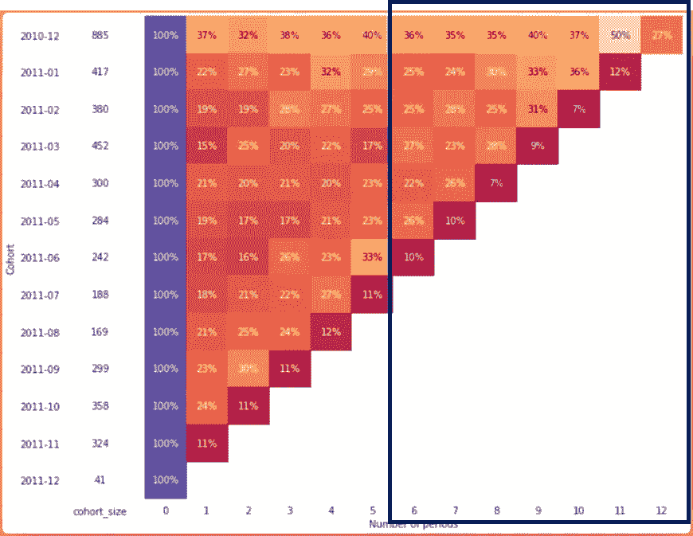

# 群组分析——简化、可行

> 原文：<https://medium.com/analytics-vidhya/cohort-analysis-simplified-actionable-bc124a95345?source=collection_archive---------26----------------------->

## 提高客户保持率，减少客户流失

我读过很多关于群组分析、客户流失和客户保持的文章和博客，其中大部分都非常专业，很难理解。所以，我决定选择一条不同的道路，试着让它简单可行。

如果你想更多地了解群组分析，以及如何应用它来改善你的业务，这个博客非常适合你。

让我们直接开始吧！

## **什么是队列分析？**

群体是指在一定时期内具有共同特征的一群人，例如首次购买日期、注册日期、他们所属的位置等。,

**举例:**2020 级是一个组群，当年毕业的所有学生都是同一个组群的一部分。

在群组分析中，我们在一段时间内跟踪这些人群，并试图得出见解，以更好地了解您的产品/服务/营销活动等。

群组分析是一种广泛使用的降低流失率和提高客户保持率的方法。在我们深入队列分析之前，首先尝试理解什么是流失率和客户保持率。

**流失率:**

在给定时间内，停止使用或购买您的网站/商店/电子商务网站等的客户的百分比。流失率有时也被称为“损耗率”。

**客户维系:**

它是你的企业在一段特定时间内留住客户的能力。高保留率意味着，您的客户会持续购买和使用您的产品或服务。

**据我:**

保留率与流失率成反比

**如何阅读队列分析图:**

乍一看，阅读队列图表有点混乱，很难理解。当我第一次看到一个队列图表时，我也有同样的感觉，但是相信我，它确实很容易解释。

群组分析图表

迷惑对吗？让我们打破它，只看一个队列…

1.  **2010–12:**一群客户在你这里注册或购买了一些东西。
2.  **885:** 在 2010 年至 2012 年，属于这一群体的客户总数或 885 名客户签约或从您的企业带来了一些东西。
3.  **37%:**(885 名顾客中的)37%在下个月光顾了你的商店。所以我们失去了大约 73%的客户。

**如何利用群组分析减少流失:**

如果你看看第一批(方框中突出显示的)，太多的客户正在大量生产。在前三个月，我们失去了大约 70 -80%的客户。

在上个月(用深红色突出显示)，只有 11-15%的客户决定与您联系，这意味着您正在失去 90%的客户，这是一个非常糟糕的迹象。

这背后的主要原因可能是，你最近开始了一些新的事情(可能推出了新产品或营销活动，等等..，)和您的现有客户对您的计划不满意。

**高流失率背后的主要原因:**

1.产品或服务与客户的期望不匹配。

2.客服或者售后服务差。

3.质量或信任问题。

4.结账流程。

**提高客户保持率的三步指南:**

**第一步:**在队列分析图中确定下降趋势。掉队:从哪个月开始大部分队列都在掉队。比方说，6 个月后，大多数团队都倒下了。

**第二步:**在下降趋势之前与你的客户沟通，从第 4 个月开始发送检查电子邮件，看看事情进展如何，了解你的客户是否满意，确保记下他们在你的产品或服务方面面临的所有问题。

**第三步:**跟进你的客户，直到他们的问题得到解决，之后别忘了听取反馈。在这一步中，不要强迫他们使用你的产品或服务，试着更专注于理解客户的问题并尽快解决。

**注:**

1.收集客户停止购买或使用你的产品或服务的所有原因。这将有助于你理解他们为什么要离开？

2.向那些留下来或与你有联系的客户发送一份调查。尝试找出他们喜欢和不喜欢产品或服务的地方。

3.比较 1 和 2，尝试找出你的产品或服务中的确切问题，以及找出你能做些什么来让你的客户满意。

python 中的群组实现点击此处

**结论:**

群组分析最好的部分是，它使我们能够发现哪些客户正在离开，他们离开的时间和原因。这对提高客户保持率和减少客户流失非常有帮助。

你觉得这个博客怎么样？评论！

*感谢阅读！*

关注:[**Shaik Subhani @ LinkedIn**](https://www.linkedin.com/in/shaik-subhani/)