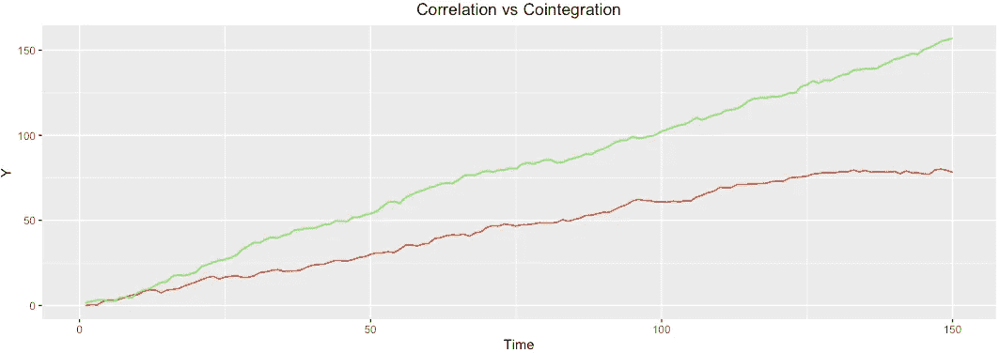
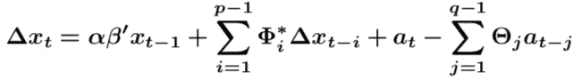

# 时间序列分析的协整

> 原文：<https://medium.com/analytics-vidhya/cointegration-for-time-series-analysis-1d0a758a20f1?source=collection_archive---------1----------------------->

这篇帖子最初出现在 [Ro 的数据团队博客](https://medium.com/ro-data-team-blog)。

平稳性是时间序列建模的一个重要属性。问题是，在实践中，很少有现象实际上是静止不变的。诀窍是采用正确的技术将时间序列重新组织成一种稳定的形式。其中一种技术利用了一种叫做*协整*的统计特性。协整从两个或多个非平稳序列的线性组合中形成一个合成平稳序列。

我们将使用模拟数据来展示 R 中协整背后的主要观点。Tsay [2005]，普法夫等人[2008]，以及普法夫和陶努斯[2007]的资料来源被用来放在一起进行以下演示，以及以下三个 R 包。

```
**require**(urca) 
**require**(vars) 
**require**(ggplot2)
```

# 背景

假设你有一组时间序列都遵循随机游走。你可以把协整看作是找出哪些序列倾向于“随机地走在一起”,以及哪些序列的分布(两个序列在每个时间步的差异)是稳定的。协整告诉你，虽然两个序列独立运动，但它们之间的平均距离保持相对恒定。

更正式的说法是，如果两个序列都是单位根非平稳的(1 阶积分: *I(1)* )，但存在一个单位根平稳的线性组合(0 阶积分: *I(0)* )。如果任何单个序列已经是平稳的，那么协整就是多余的，因为线性组合会着重强调平稳序列。

## 协整与相关性

虽然相关系数和协整都描述了变量之间的一些潜在关系，但这两个属性不是同义词。两个时间序列很有可能具有弱/强相关性，但具有强/弱协整性。

> 强相关，无协整

这两个系列明显相关，但它们之间的差异随时间而变化。

```
# Strong correlation and no cointegration
set.seed(1)
y1 = cumsum(rnorm(150,0.5))
y2 = cumsum(rnorm(150,1))
Y <- data.frame(cbind(y1,y2))ggplot(Y, aes(x=1:nrow(Y))) +
  geom_line(aes(y= y1),colour = "red") +
  geom_line(aes(y= y2),colour = "green") +
  labs(title = "Correlation vs Cointegration") +
  xlab(expression("Time")) +
  ylab(expression("Y")) +
  theme(plot.title = element_text(hjust = 0.5))
cor(Y)
```



> 强相关，无协整

这两个序列是完美的相关和协整的，因为两者之间的差异不会随着时间而改变。

```
# Strong correlation and no cointegration
y1 = sin(seq(1,100,1))
y2 = 1.5+sin(seq(1,100,1))
Y <- data.frame(cbind(y1,y2))ggplot(Y, aes(x=1:nrow(Y))) +
  geom_line(aes(y= y1),colour = "red") +
  geom_line(aes(y= y2),colour = "green") +
  labs(title = "Correlation vs Cointegration") +
  xlab(expression("Time")) +
  ylab(expression("Y")) +
  theme(plot.title = element_text(hjust = 0.5))
cor(Y)
```


> 无相关性和强协整性

在上面的基础上增加一个微小的相移可以消除所有的相关性，但仍然保持协整性。

```
# No correlation and strong cointegration
y1 = sin(seq(1,100,1))
y2 = 1.5+sin(seq(pi/2+1,pi/2+100,1))
Y <- data.frame(cbind(y1,y2))ggplot(Y, aes(x=1:nrow(Y))) +
  geom_line(aes(y= y1),colour = "red") +
  geom_line(aes(y= y2),colour = "green") +
  labs(title = "Correlation vs Cointegration") +
  xlab(expression("Time")) +
  ylab(expression("Y")) +
  theme(plot.title = element_text(hjust = 0.5))
cor(Y) # correlation = -0.002733781
```


## 模拟数据的协整

下面的代码片段模拟了三个时间序列，它们共享相同的基本随机行走过程。该图显示，尽管是单独的随机行走，但这三个系列似乎共享一个共同的基本过程。

```
iterations <- 1000
Y <- setNames(as.data.frame(matrix(0, iterations, 4)), c("y", "y1", "y2", "y3"))
set.seed(1)
for (ii in 2:iterations) {
  Y$y[ii] <- y[ii-1] + rnorm(1)
  Y$y1[ii] <- Y$y1[ii-1] + (0.01*(Y$y[ii-1] - Y$y1[ii-1])) + rnorm(1)
  Y$y2[ii] <- Y$y2[ii-1] + (0.05*(Y$y[ii-1] - Y$y2[ii-1])) + rnorm(1)
  Y$y3[ii] <- Y$y3[ii-1] + (0.1*(Y$y[ii-1] - Y$y3[ii-1])) + rnorm(1)
}
cor(Y)
#            y        y1        y2        y3
# y  1.0000000 0.4926226 0.9121291 0.9673797
# y1 0.4926226 1.0000000 0.5843223 0.5284070
# y2 0.9121291 0.5843223 1.0000000 0.9339683
# y3 0.9673797 0.5284070 0.9339683 1.0000000
```

相关矩阵显示，具有较大协整系数(0.01、0.05 和 0.1)的序列与原始序列的相关性更强。

```
ggplot(Y, aes(x=1:iterations)) +
  geom_line(aes(y= y),colour = "black") +
  geom_line(aes(y= y1),colour = "red") +
  geom_line(aes(y= y2),colour = "green") +
  geom_line(aes(y= y3),colour = "blue") +
  labs(title = "Simulated Series with Shared Underlying Random Walk") + 
  xlab(expression("Time")) +
  ylab(expression("Y")) +
  theme(plot.title = element_text(hjust = 0.5), plot.legend = TRUE)
```


起始随机游走(黑色)，第一个协整序列(红色)，第二个协整序列(绿色)，第三个协整序列(蓝色)

方程中具有较高协整系数的时间序列更接近原始序列。尽管第一个系列(红色)的相关性较低，但似乎确实有某种潜在的力量将这两个系列保持在一定范围内。这种行为在绿色和蓝色系列中更加明显。

现在我们将回顾检验协整的实际技术，而不仅仅是目测。

# 协整检验

## 恩格尔-格兰杰程序

这是罗伯特·恩格尔和克莱夫·格兰杰在他们的开创性论文恩格尔和格兰杰[1987]中提出的检验协整的原始程序。这两个步骤很容易遵循，并且很好地描绘了协整背后的一般思想。其想法是首先验证单个序列确实是按照 *I(1)* (非平稳)顺序整合的。然后，我们使用标准 OLS 一个接一个地回归，并检查残差序列是否按照 *I(0)* (表明平稳性)的顺序进行积分。如果残差是平稳的，那么我们可以从 OLS 模型中提取系数，并使用它们来形成两个时间序列的平稳线性组合。

我们将在前两个协整系列中运行这个。首先让我们使用流行的 ADF 测试来测试每个序列，以确认它们确实是非平稳的(存在单位根)。

```
y1Adf <- ur.df(Y$y1) *#ADF test: H0 of having a unit-root (nonstationary)* y1Adf@cval
**#       1pct  5pct 10pct
# tau1 -2.58 -1.95 -1.62**y1Adf**@**teststat *# fail to reject null of unit-root* **#                tau1
# statistic -1.609493**y2Adf <- ur.df(Y$y2) 
y2Adf@teststat *# fail to reject null of unit-root* **#                 tau1
# statistic -0.3265977**
```

上述 ADF 检验证实该序列是非平稳的。接下来，我们使用 OLS 拟合线性模型，并检查残差的平稳性

```
m1 <- lm(Y$y1 ~ Y$y2) 
m1**$**coefficients
**# (Intercept)        Y$y2 
#  -4.0986059   0.3059797**wt <- m1**$**residuals 
spreadAdf <- ur.df(wt) 
spreadAdf**@**cval
**#       1pct  5pct 10pct
# tau1 -2.58 -1.95 -1.62**spreadAdf**@**teststat *# reject H0 of unit-root (conclude it is stationary)* **# tau1
# statistic -2.982549**
```

分布(wₜ)的检验统计量小于所有三个置信水平的检验统计量。我们很乐意假设我们现在有一个平稳的序列来处理。因为我们无法拒绝平稳性的零假设，Engle-Granger 检验表明存在协整关系。协整方程由下式给出:


## 约翰森试验

恩格尔-格兰杰程序有几个缺点。第一个是它不能同时测试多个系列之间的协整关系。此外，在 y1 上回归 y2 而不是在 y2 上回归 y1(如我们上面所做的)将产生不同的协整向量。因此，选择哪一个序列回归另一个序列在某种程度上是任意的。另一个缺点是，它忽略了潜在的误差校正模型对传播序列的影响。

方便的是，所有上述缺点都可以通过 Johansen 手术来解决。此程序估计 VECM(向量误差修正模型)形式的协整 VARMA( *p* ， *q* )，用于 xₜ.*k*不同序列之间的 *m* 协整关系



上图中，α 和β 都是 *k x m* 矩阵，∆xₜ将一阶差分表示为∆xₜ=xₜxₜ₋₁，φI**是 AR 系数，θj**是 MA 系数。协整方程由β′x { t1 }定义，其中β包含 *m* 协整向量的系数。****

****VECM 表示法的另一个好处是，它能够在考虑协整关系的情况下生成预测。创建这些预测超出了本文的范围，但可能会在以后的文章中涉及。****

****Johansen 检验对π**矩阵进行特征值分解，并依次检验其秩 *r* 以确定存在多少协整关系。r = 0 的零假设意味着，如果我们不拒绝它，就不存在这样的关系。然后继续测试 r ≤ j ∀j < k，其中 k 是被测试的级数(我们不能有 k 个有效的协整关系)。如果我们只测试两个数列，那么这两个测试是 r = 0 和 r = 1。******

******特征值分解产生特征向量，其中对应于最大特征向量的分量用于协整系数β。******

```
****cot=ca.jo(Y[,c(2:4)],ecdet="const", type='trace', K=2, spec='transitory')summary(cot)
# ###################### 
# # Johansen-Procedure # 
# ###################### 
# 
# Test type: trace statistic , without linear trend and constant in cointegration 
# 
# Eigenvalues (lambda):
# [1] 3.947760e-02 2.063349e-02 8.268313e-04 4.336809e-19
# 
# Values of teststatistic and critical values of test:
# 
#           test 10pct  5pct  1pct
# r <= 2 |  0.83  7.52  9.24 12.97
# r <= 1 | 21.63 17.85 19.96 24.60
# r = 0  | 61.83 32.00 34.91 41.07
# 
# Eigenvectors, normalised to first column:
# (These are the cointegration relations)
# 
#              y1.l1      y2.l1       y3.l1   constant
# y1.l1     1.000000  1.0000000   1.0000000  1.0000000
# y2.l1     2.918063 -1.0330340   0.1625347  0.2206172
# y3.l1    -3.830987  0.5674745   0.8981619  0.1276251
# constant -1.536007  2.8054993 -10.6323941 15.9087882
# 
# Weights W:
# (This is the loading matrix)
# 
#              y1.l1        y2.l1         y3.l1     constant
# y1.d -0.0016638564 -0.020254936  0.0002125480 5.487152e-18
# y2.d -0.0111657363  0.003239633 -0.0001845491 1.099864e-18
# y3.d  0.0007776353 -0.005012261 -0.0010935382 3.262192e-18****
```

******查看测试统计和临界值，我们看到我们没有拒绝 r <= 2 test but we can reject the r <= 1 case at the 0.05 level of significance. Therefore, we can accept the alternate hypothesis that the rank of the matrix is r=2\. This means that we can form a stationary series from a linear combination of just two out of the three series tested.******

******The eigenvectors corresponding to the largest eigenvalue (3.947760e-02) are [1, 2.918063, -3.830987, -1.536007], which can be found under column y1.l1 in the Eigenvector section . This leads to our cointegrating equation******

************

******The ADF test also supports our resulting series being stationary.******

```
****xMat <- t(data.matrix(cbind(Y[c(2:4)],ones)))
beta <- data.matrix(cot@V[,1])
wt <- t(beta) %*% (xMat) 
# wt = Y$y1 + 2.918063*Y$y2 - 3.830987*Y$y3 - 1.536007plot(t(wt), type="l", main="Stationary Spread Series",
     xlab="Time", ylab="Spread")wtAdf <- ur.df(t(wt))
wtAdf@cval
#      1pct  5pct 10pct
# tau1 -2.58 -1.95 -1.62
wtAdf@teststat # fail to reject null of unit-root
#                tau1
# statistic -4.037032****
```

************

# ******References******

******Robert F Engle and Clive WJ Granger. Co-integration and error correction: representation, estimation, and testing. *计量经济学:计量经济学学会杂志*，251–276 页，1987。******

******伯恩哈德·普法夫和克朗伯格·伊姆·陶努斯。使用 vars 包。*克朗伯格:im Taunus* ，2007 年第 2007 页。伯恩哈德·普法夫等人的 var、svar 和 svec 模型:在 r 包 Var 中的实现。*统计学杂志*******

*******软件*，27(4):1–32，2008。蔡瑞诗。*金融时间序列分析*，第 543 卷。约翰·威利的儿子们，2005 年。******