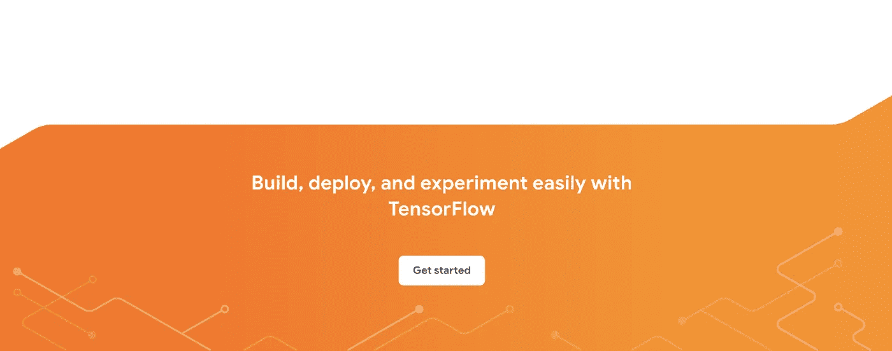
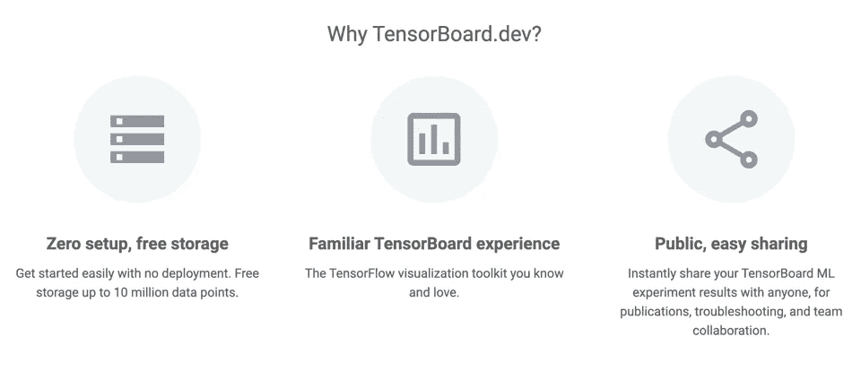
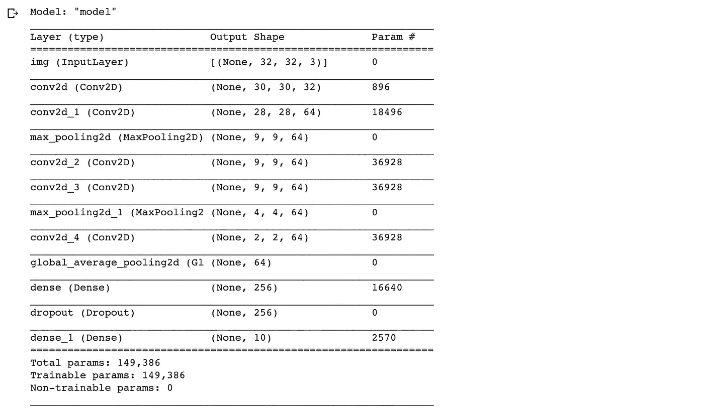
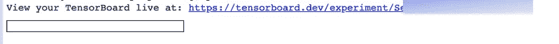
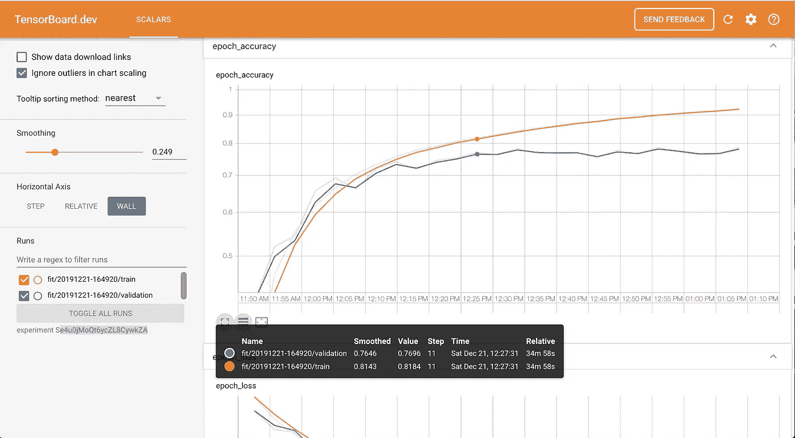

# 与 TensorBoard.dev 合作

> 原文：<https://medium.com/analytics-vidhya/collaborating-with-tensorboard-dev-7a2d6af3f5cb?source=collection_archive---------12----------------------->



协作是深度学习的一个关键方面，它需要共享细节，如可视化模型，理解模型的偏差等。TensorBoard，可视化工具包，被广泛用于可视化和与更广泛的社区共享结果，但 TensorBoard 有几个缺点-截图和共享静态结果。这既无效又容易出错。

**输入 TensorBoard.dev**

Tensorflow.dev 是一项托管服务，使您能够轻松托管、跟踪并与任何人免费共享您的 ML 实验。



与 TensorBoard.dev 共享和协作非常简单明了。我将强调使用 TensorBoard 所需的所有步骤，并强调关键输出。

首先，使用 Google Colab，在 TensorFlow 2.0 中建立一个模型(或者复用已有的模型)并编译该模型。我已经使用 tf.keras API 构建了一个自动编码器，下面是模型摘要:



已训练模型的摘要

接下来，让我们使用回调函数*TF . keras . callbacks . tensor board:*创建一个临时目录来记录所有回调值

```
import datetime
log_dir=”logs/fit/” + datetime.datetime.now().strftime(“%Y%m%d-%H%M%S”)
tensorboard_callback = tf.keras.callbacks.TensorBoard(log_dir=log_dir, histogram_freq=1)# Training the model autoencoder using callbacks option 
autoencoder.fit(x_train, y_train,epochs=25, batch_size=128, validation_data=(x_val, y_val),callbacks=[tensorboard_callback])
```

之后，使用以下命令将日志上传到 Tensorflow.dev

```
!tensorboard dev upload — logdir ./logs
```

要上传，您需要使用您的 Google 帐户(如 Gmail)进行授权。使用您的 Gmail 帐户授权并将代码粘贴到提供的单元格中后，您将获得特定实验的 TensorBoard.dev 的唯一 URL:



点击链接将带你到实验的具体 TensorBoard。



TensorBoard.dev 对于上述实验

通过训练和测试，历元精度和损失被相对于时间绘制(25 个历元在上午 11:50 和下午 1:10 开始)。您可以更改水平轴，以通过历元步长查看精度和损耗。

TensorBoard 将保持活动状态，直到特定实验终止。任何有链接的人都可以看到特定的 TensorBoard。

要终止，你需要获取*实验 id* ，并将其传递给*删除*命令

```
# EXPERIMENT_ID is available in 
tensorboard dev delete --experiment_id EXPERIMENT_ID.
```

在这个练习中，我使用了准确性和损失回调，有些方面可以分享，包括偏差直方图、模型图和张量随时间的变化。