# 基于奇异值分解的协同推荐系统

> 原文：<https://medium.com/analytics-vidhya/collaborative-based-recommendation-system-using-svd-9adc5b6b3b8?source=collection_archive---------0----------------------->


协作推荐系统是什么意思？

[**协同过滤**](https://en.wikipedia.org/wiki/Collaborative_filtering) 方法基于用户过去的行为(先前购买的项目、观看的电影和评级等)以及当前和其他用户做出的使用决策来构建模型。该模型然后被用于预测用户可能感兴趣的项目(或项目的评级)。

**它与基于内容的推荐系统有何不同？**

基于内容的过滤方法基于项目的描述和用户偏好的配置文件。这些方法最适合于已知项目数据(名称、位置、描述等)的情况。)，但不在用户身上。基于内容的推荐器将推荐视为特定于用户的分类问题，并根据产品特征学习用户喜欢和不喜欢的分类器。

**什么是惊喜库？**

名字*惊喜*(大致:)代表简单的 Python 推荐系统引擎。

[惊奇](http://surpriselib.com/)是一个 Python [scikit](https://www.scipy.org/scikits.html) 构建和分析推荐系统，处理显式评级数据。

**数据收集步骤:**

我们从 Kaggle 网站获取数据，在那里我们有 4 个数据文件和一个电影标题文件:

MovieIDs 的范围从 1 到 17770。CustomerIDs 的范围从 1 到 2649429，有间隔。有 480189 个用户。等级是从 1 到 5 的五星(积分)等级。日期的格式为 YYYY-MM-DD。

[](https://www.kaggle.com/netflix-inc/netflix-prize-data/data) [## Netflix 奖项数据

### 来自网飞竞赛的数据集来改进他们的推荐算法

www.kaggle.com](https://www.kaggle.com/netflix-inc/netflix-prize-data/data) 

**机器学习问题类型:**

对于给定的电影和用户，我们需要预测他/她对电影的评价。给定的问题是一个推荐问题，也可以看作是一个回归问题。

因此，性能指标用于最小化 RMSE。

**探索性数据分析(EDA):**

我们把所有的文件组合在一起，形成了给定格式的数据帧。

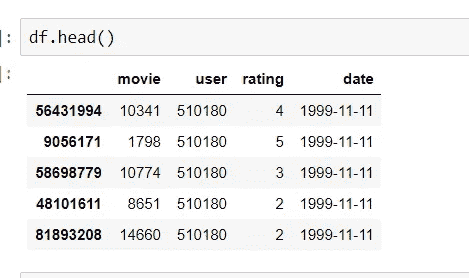

然后我们检查了 Nan 值和重复值，但是没有。

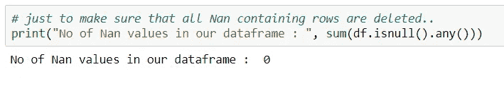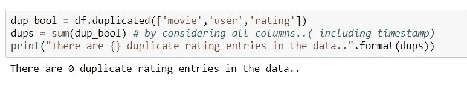

对数据应用基本统计数据:

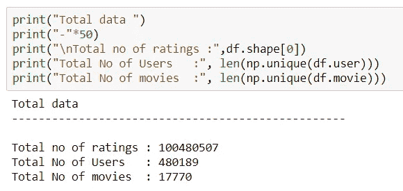

因此，我们在数据集中总共有 480189 个用户和 17770 部电影。

我们以 80:20 的比例将数据分成训练和测试以预测模型

在火车数据上，我们发现

评级分布:

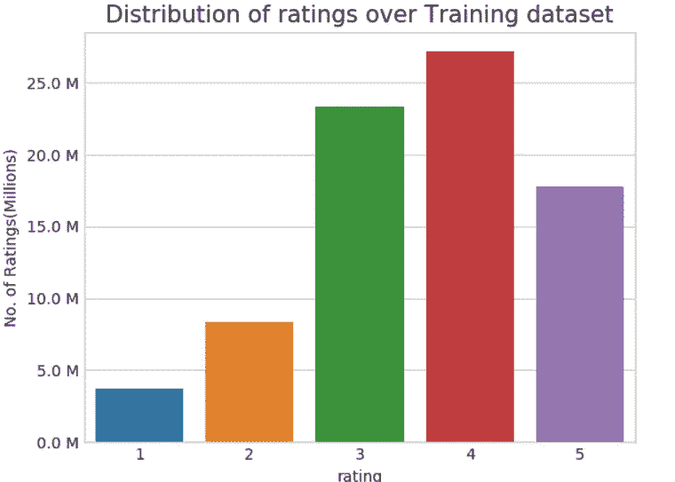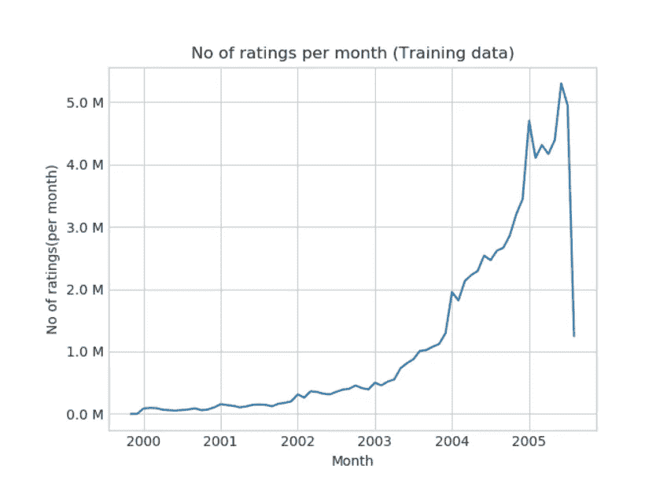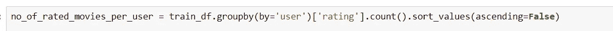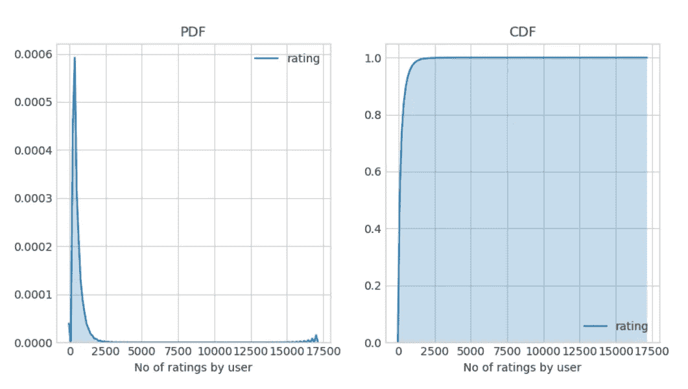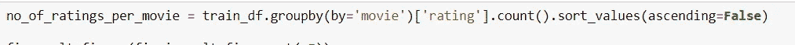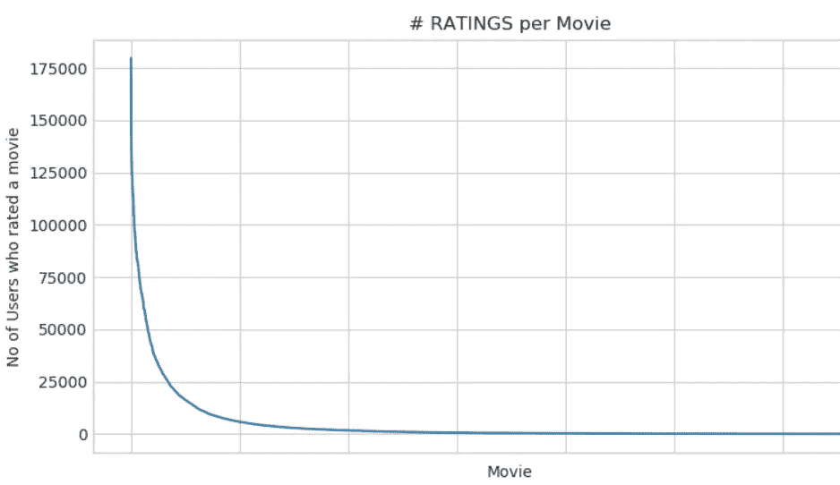

有一些电影被很多人评价，大多数的评价都有几百个评价。

由于数据非常稀疏，我们创建了训练和测试稀疏矩阵以节省空间。

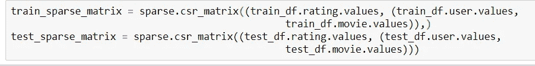

查找所有电影评级的全球平均值:

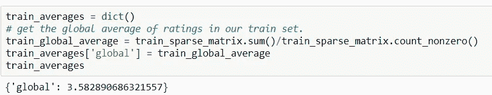

**冷启动问题:**

冷启动问题是指系统无法向用户推荐项目的问题。对于每一个推荐系统，都需要考虑用户的偏好和喜好来建立用户模型。用户简档是通过考虑她用系统执行的活动和行为来开发的。基于用户以前的历史和活动，系统作出决定并推荐项目。当新用户或新物品进入系统时，问题就出现了，因为这样的用户/物品系统没有足够的信息来做出决定。例如，新用户还没有对某些项目进行评级，并且还没有访问/查看某些项目，那么系统将很难在此基础上建立模型。冷启动问题出现在三种不同的情况下，即新用户、新项目和新社区。

**如何解决冷启动问题？**

人们处理冷启动问题有多种方法。那些是

1.你根据电影的内容获取电影的特征，然后根据新用户观看的 2 到 3 部电影来评估他的相似类型的电影。

2.你首先向新用户推荐全球热门电影。

3.你试着从你的 IP 地址指向的地区播放最近流行的电影。

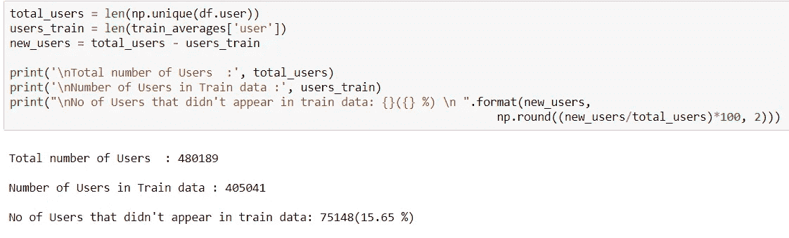

这里，15%的用户没有出现在训练数据中。

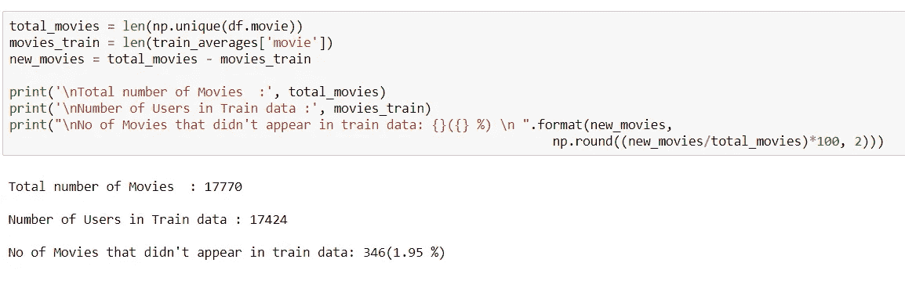

并且，测试数据中有 1.96%的电影是新的。

**电影-电影相似矩阵:**

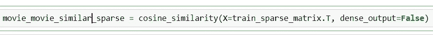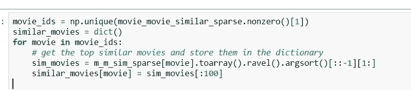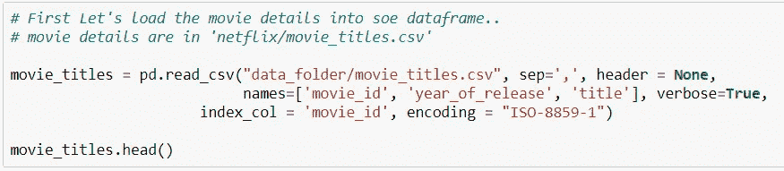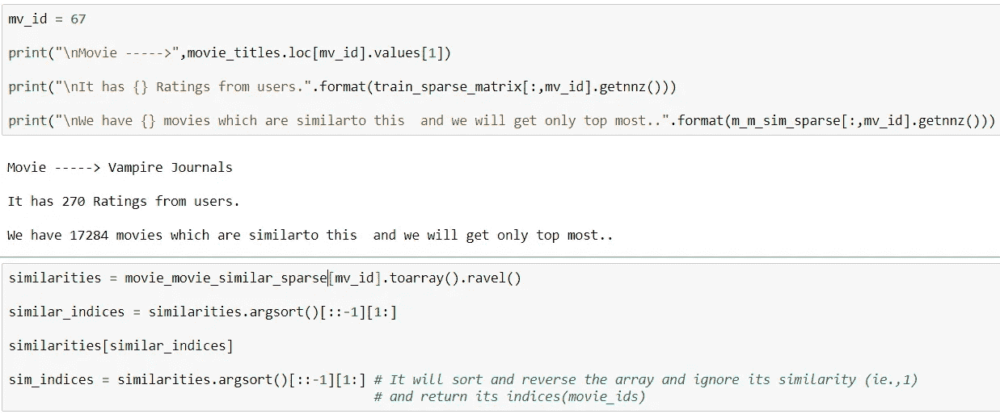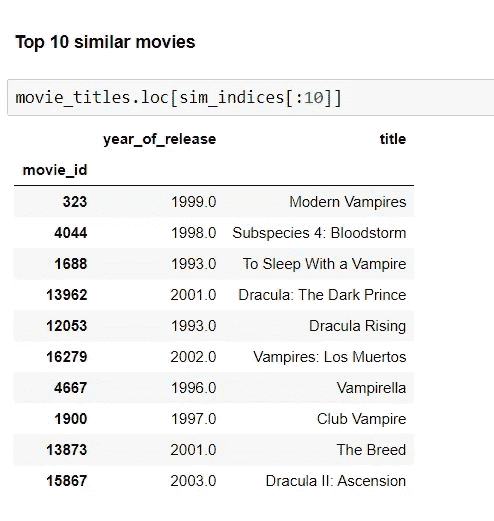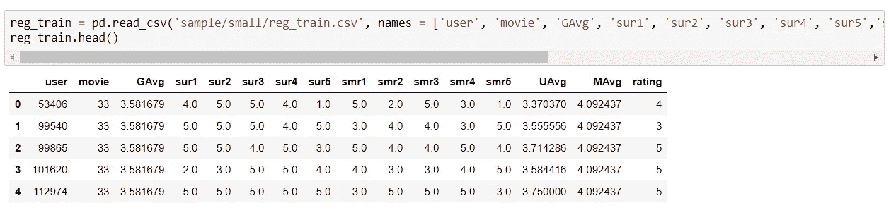

我们数据集中的要素:

*   **GAvg** :所有评分的平均评分
*   **该电影的相似用户评分** : sur1、sur2、sur3、sur4、sur5(对该电影评分的前 5 名相似用户..)
*   **该用户评价的相似电影** : smr1、smr2、smr3、smr4、smr5(该电影评价最高的 5 部相似电影..)
*   **UAvg** :用户平均评分
*   **MAvg** :这部电影的平均评分
*   **评分**:该用户对该电影的评分。

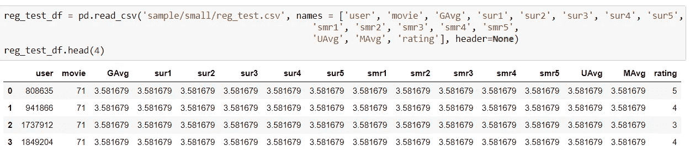

使用 python 的惊奇库:

我们可以通过阅读以下提供的文档来了解更多关于惊喜的信息:

 [## 入门-惊喜 1 文档

### 编辑描述

surprise.readthedocs.io](http://surprise.readthedocs.io/en/stable/getting_started.html#load-dom-dataframe-py) 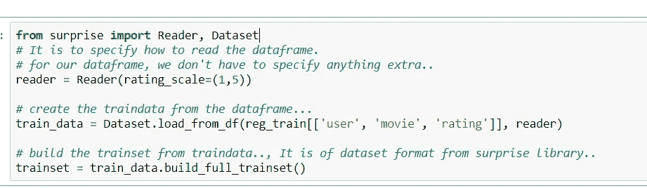

我们选择了 SVD 和 SVD++作为良好的矩阵分解系统，并使用 XgBoost 构建了一个使用特性的单一模型。

因此，模型的训练从创建一个包含 13 个特性的 XGboost 模型开始。

**模型 1:具有 13 个特性的 Xgboost:**

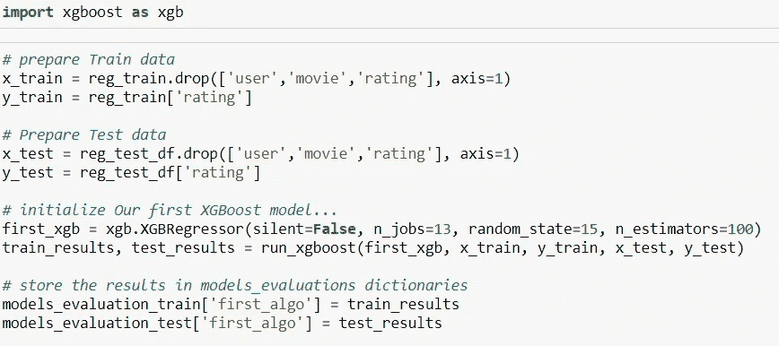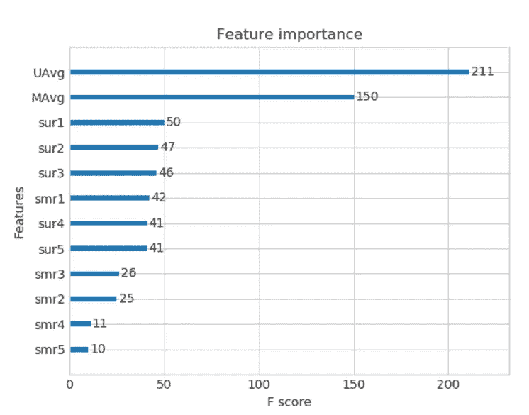

```
TEST DATA for Xgboost with 13 Features:
------------------------------
RMSE :  1.0761851474385373
MAPE :  34.504887593204884
```

**模式二:突击基线模式**

什么是基线模型？

基线模型是一个简单的模型，我们将使用一个“起点”,并将其与其他模型进行比较。是的，尝试各种模型并查看哪些模型在该数据集上工作良好是很重要的，因为实验的成本不是很高，并且我们不能完全确定哪个模型将工作得最好。

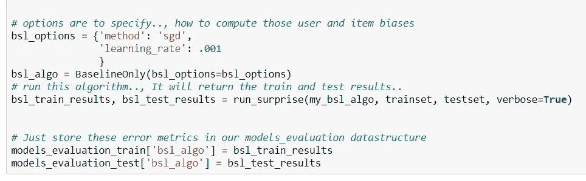

```
Test Data Surprise baseline model:
---------------
RMSE : 1.0730330260516174

MAPE : 35.04995544572911
```

**模型 3: SVD 矩阵分解用户电影交互**

假设是包含用户对项目的评级的评级矩阵。每个矩阵元素指的是用户对项目的评分。给定一个较低的维度，MF 将原始矩阵分解为两个潜在因子矩阵:一个是用户因子矩阵，另一个是项目因子矩阵。进行因子分解，使得近似为和的内积(即)，并且每个观察到的评级近似为(也称为预测值)。但是，仅捕获用户和项目之间的关系。在现实世界中，观察到的评级可能会受到用户偏好或项目特征的影响。换句话说，用户和项目之间的关系可以由偏好信息来代替。例如，假设有人想预测用户“汤姆”对电影“蝙蝠侠”的评价现在，一个网站上所有电影的平均评级是 3.5，汤姆倾向于给出比平均水平低 0.3 的评级，因为他是一个挑剔的人。电影《蝙蝠侠》比一般的电影好看，所以倾向于高于平均 0.2 的评分。因此，考虑到用户和电影偏见信息，通过执行计算，预测汤姆将给予电影“蝙蝠侠”3.4 的评级。用户和项目偏差信息能更客观地反映评分的真实性。SVD 是一种典型的因子分解技术(在一些文献中称为基线预测器)。因此，预测评级被更改为，其中是总体平均评级，和分别表示用户和项目的观察偏差。

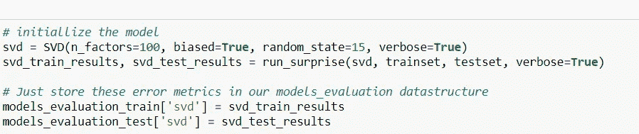

```
Test Data
---------------
RMSE : 1.0726046873826458

MAPE : 35.01953535988152
```

**模型 4:具有来自用户的隐式反馈的 SVD 矩阵分解(用户评级的电影)**

SVD++模型引入了基于 SVD 的隐式反馈信息；即，它为每个项目添加一个因子向量()，这些项目因子用于描述项目的特征，而不管它是否已被评估。然后，对用户的因素矩阵进行建模，这样可以得到更好的用户偏好。

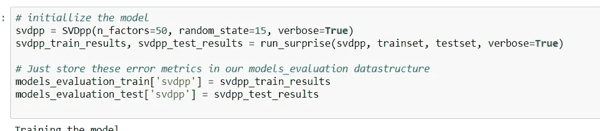

```
Test Data
---------------
RMSE : 1.0728491944183447

MAPE : 35.03817913919887
```

所有模型之间的比较:

1.  Xgboost 有 13 个特性:1 . 53686 . 36868686861
2.  令人惊讶的基线模型:1 . 15360 . 386386868675
3.  奇异值分解矩阵分解用户电影交互:1 . 53860 . 63863868661
4.  具有来自用户的隐式反馈的奇异值分解矩阵分解(用户评价的电影):1 . 53860 . 66363636361

因此，SVD 矩阵分解基础模型产生最小的 RMSE。

因此，我们将使用这个模型来预测我们对测试数据的评级。