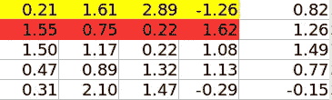

# 使用 fastai 的推荐系统

> 原文：<https://medium.com/analytics-vidhya/collaborative-filtering-a-sincere-perspicacity-ad034113878b?source=collection_archive---------3----------------------->

## 当我第一次读到协同过滤时，我发现它要严格得多。所以，我花了很多天才带着些许满足感理解了这个概念。从那以后，我将尽我所能用最简单的方式来烹饪这个概念。我将解释关于 fastai 库的协同过滤。所以，忍耐一下，让我们开始吧。


图片由[免费提供-照片](https://pixabay.com/photos/?utm_source=link-attribution&utm_medium=referral&utm_campaign=image&utm_content=1149416)来自 [Pixabay](https://pixabay.com/?utm_source=link-attribution&utm_medium=referral&utm_campaign=image&utm_content=1149416)

**❓什么是协同过滤**

协同过滤知识用于制定推荐系统。大多数主要的 IT 公司都在使用这项技术来吸引用户，了解用户，这样他们就可以根据他们的兴趣向他们推荐东西。现在，如果我们看一下我们得到的用于分析的数据，它通常是下面的格式。


*   通常，我们以第一种格式存储数据。如果你把它保存为一个矩阵，每个客户和产品的组合都是这个矩阵中的一个单独的单元，那么它将会是巨大的。
*   所以要么你倾向于像左图那样存储，要么你可以用某种独特的稀疏矩阵格式保存为矩阵。

为了获得实际的见解，我使用了 fastai 提供的学术数据集，即 GroupLens 创建的 MovieLens。

**❓什么是冷启动问题**

冷启动问题主要由以下原因引起:

*   当新用户来到网站时，由于缺少关于用户的元数据，向用户推荐电影变得具有挑战性。
*   当一部新电影到来时，我们没有关于这部电影的任何信息，除非并且直到一些用户对这部电影进行评级。

我们可以通过询问用户一些问题来收集关于他们的元数据，从而解决冷启动问题。

# 在幕后

在协同过滤问题中，我们首先对每个用户和每部电影随机加权。


*   每个移动和每个用户的随机权重如上所示。我们可以为每个电影和用户选择任意数量的权重，但是用户和电影的数量应该相同。
*   任何用户对任何电影的评级是通过分别对电影和用户的相应权重的点积的和来获得的。神经网络的一个基本出发点是，你对两个矩阵进行矩阵乘法，这就是你的第一层，这也是我们所做的。
*   所以我们想出了一些方法，来说明我们可以相乘的两个矩阵是什么。显然，你需要一个用户的向量(一个所有用户的矩阵)和一个电影的向量(一个所有电影的矩阵)并将它们相乘，你会得到一些数字。所以它们还没有任何意义。它们只是随机数。
*   宣布评级后，我们计算实际评级和预测评级之间的 RMSE 损失。然后，神经网络的正常行为开始，权重被调整以减少损失。
*   这就是为特定用户和特定电影设置权重的方式。
*   现在，我们已经为这种情况定义了最无聊的神经网络，它有一个线性层和一个非线性层(你马上就会知道)。但这就是你解决问题所需要的。🆓
*   上面的唯一缺点是它不是稀疏存储。但是，我们会尽快调查。

# 一些实用的东西

现在，我将使用 fastai 库编写代码。我们会在了解更多的同时一点一点的理解代码。

Fastai 创建了一个电影评论的样本数据集，我将使用它。

```
from fastai import *
from fastai.collab import *path = untar_data(URLs.ML_SAMPLE); path= PosixPath('/root/.fastai/data/movie_lens_sample')ratings = pd.read_csv(path/'ratings.csv')
ratings.head()
```


像往常一样，现在我们将创建数据束。我会 CollabDataBunch，主要在 fastai 中定义，用于协同过滤。

```
data = CollabDataBunch.from_df(ratings, seed=42)
```

定义了数据束之后，我们需要定义学习者。像 CollabDataBunch，我们 CollabLearner。

```
y_range = [0,5.2]learn = collab_learner(data, n_factors=50, y_range=y_range)
```

*   collab_learner 用于创建一个学习者，以便对数据进行协同过滤。
*   y_range 被定义为限制范围之间的结果。在内部，collab_learner 使用非线性 sigmoid 函数作为最后一层。从统计学上讲，sigmoid 函数在我们定义的范围内渐近。因此，我们定义了上述范围，以便我们可以获得大于 0 且小于 5.2 的用户评分。现在，添加乙状结肠是没有必要的。我们的模型可以学习预测评级和分级其权重，但是，我们希望我们的模型花大部分时间来学习我们想要的范围内的东西。因此，我们的模型将以这样的方式设置其权重/参数，使得结果(即评级)位于 0 到 5.5 之间。


乙状结肠()

*   n _ factors——我们稍后会了解它，但现在你可能认为它等于我们为上面的用户和电影定义的随机权重数。稍后在神经网络中的那些权重被认为是不同的特征/因素，例如电影是否有特定的女演员/男演员，或者用户是否喜欢任何特定男演员/女演员的电影，并且电影有它，这有助于神经网络更好地了解电影和用户。

```
learn.fit_one_cycle(3, 5e-3)
```


这就是我们如何使用 fastai 进行协同过滤。现在，我们将挖掘出这些概念，并找出上述可怕代码背后的一切。😆

# collab _ learner 里面有什么

如果您将看到 collab_learner 的 fastai 代码，它将创建两种类型的模型，如下图中突出显示的。


collab_learner()

让我们来看看上面强调的一个模型。


嵌入点偏差()


嵌入()

*   我们正在为我们如上所述初始化的随机权重/参数创建嵌入矩阵。现在，我们为什么要创建嵌入矩阵，它的用途是什么，我们将在下面讨论，但现在，让我们清楚地知道，我们正在创建类似嵌入的东西，用于存储为电影和用户定义的权重。如果你看到上面创建嵌入矩阵的代码，我们只调用 PyTorch 嵌入。
*   如果你了解 PyTorch nn 的基础知识。模块，那么您可能知道 forward 是在 dunder init 函数之后自动调用的。而 forward 函数内部的内容我们已经很熟悉了。
*   我们正在增加随机电影和用户权重。那我们就是在给它加上偏见。然后我们比较是否定义了 y_range，然后我们应用 sigmoid 函数，否则我们返回值。

## ❓什么是嵌入

嵌入只是一个数组查找。我们可以从嵌入矩阵中提取一个向量。这是一个重量矩阵，你基本上可以从中查找，并从中抓取一个项目。顾名思义，它嵌入了信息，并让用户广泛地查看它。它是一个热编码矩阵乘以另一个矩阵的收缩。当我们说我们有用于用户和电影的嵌入矩阵时，我们指的是下面的。



*   黄色的向量是 id 为 0.82 的用户的嵌入矩阵。红色的向量是 id 为 1.26 的用户的嵌入矩阵。


*   与上面类似，黄色的 vector 是 id 为 2.39 的电影的嵌入矩阵。红色的向量是 id 为 1.13 的电影的嵌入矩阵。

现在，问题出现了 **❔为什么我们使用嵌入**

如前所述，嵌入是某事物的独热编码版本和输入权重的乘积。如果它是用户嵌入矩阵，那么它是独热编码用户矩阵和如上定义的用户输入权重的乘积。如果它是用于电影的，那么它是独热编码电影矩阵和用于电影的输入权重的乘积，如上所述。所以，让我们用图表来理解它。


*   现在，如果你理解了上面的操作，那么我们基本上是用输入用户激活乘以一个热编码的用户矩阵。
*   现在，对于每个输入的独热编码用户向量，用户输入权重中的向量对应于相同的位置。对于具有输入 id 1 的用户，用户权重矩阵中的向量也在相同的索引处。
*   因此，我们可以做数组查找来节省内存，并且运算会更快，而不是像上面显示的那样再做一次矩阵乘法。
*   这就是为什么我们定义和使用嵌入——一种数组查找。


用户嵌入

**❓What 是潜在的特征**

在为用户和矩阵定义的权重背后有命令性的语义。我们可以认为权重代表与用户或电影相关的一些特征。现在，我不是说重量定义了令人兴奋的东西，但是我们可以这样想。如果在通过梯度下降优化权重之后，如果我们得到用户的特定权重高，并且电影中的相应权重也高，那么我们可以将喜欢用户与喜欢特定女演员(如朴雅卡·乔普拉)联系起来，并且电影中有女主角。或者我们可以推断它是动画电影并且用户喜欢动画电影。我仍然对神经网络内部发生的事情持怀疑态度，但这种梯度下降可能得出一个好答案的唯一方式是，如果它找出电影品味的各个方面以及电影的相应特征。那些出现的潜在特征被称为**潜在因素或潜在特征**。它们是这些一直存在的隐藏的东西，一旦我们训练了这个神经网络，它们就会突然出现，或者我们突然试图将这些点连接起来。

现在，如果你记得你可能必须学习的主要神经网络，我们总是添加一个除矩阵乘法之外的术语，那就是所谓的**偏差**。现在，我们也将在上面的例子中加入偏差。参考上面的 EmbeddingDotBias()，可以看到我们为用户和电影都声明了偏差。你可能会认为添加偏见是一件普通的琐事，但在这里它可能意味着别的东西。让我们明白这种偏见意味着什么。

## ❓偏见是怎么定义的

考虑以下两种情况:

*   如果我们能想到一个特定的用户，他通常对电影评价很高，即使这部电影很差并且它的评价很低。
*   或者，如果我们可以想到一部有威尔·史密斯的电影，每个人都喜欢他和他的电影，所以我们对威尔·史密斯电影的权重定义很高，但接下来有一部有威尔·史密斯的电影，但这部电影不是很棒。

现在，在上述两种情况下，我们不能改变一些特定的穷人和反对情况的一般权重，然后我们为用户和电影定义偏差。因此，对于威尔·史密斯的那部差电影的偏差将是低的，并且类似地，对于通常评价电影高但是电影总体上差的用户的偏差将具有小的偏差。偏差通常被添加到相乘后的矩阵中。我们可以用这些偏见来解释结果。

之前，我使用了 fastai 提供的电影评论样本数据集。现在，让我们尝试使用来自 http://files.grouplens.org/datasets/movielens/ml-100k.zip[的完整 Movielens 100k 数据集。](http://files.grouplens.org/datasets/movielens/ml-100k.zip)

如果你用的是 google collab，那就把 zip 文件上传到目录下。我们主要需要`u.data`和`u.item`。

```
ratings = pd.read_csv('/content/u.data', delimiter='\t', header=None, names=['userId','movieId','rating','timestamp'])ratings.head()
```


```
movies = pd.read_csv('/content/u.item',  **delimiter**='|', **encoding**='latin-1', **header**=None, **names**=['userId', 'movieId', 'date', 'N', 'url', *[f'g{i}' for i in range(19)]])movies.head()
```


让我们合并电影标题和分级表，如下所示。

```
rating_movie = ratings.merge(movies[['movieId', title]])
rating_movie.head()
```


默认情况下，CollabDataBunch 假设您的第一列是用户，第二列是项目，第三列是评级。但是现在我们要使用标题列作为项目，所以我们必须告诉它项目列的名称是什么(`item_name=title`)。

```
data = CollabDataBunch.from_df(rating_movie, seed=42, valid_pct=0.1, item_name=title)data.show_batch()
```


```
learn = collab_learner(data, n_factors=40, y_range=y_range, wd=1e-1)
learn.fit_one_cycle(6, 5e-3)learn.save('movie-reviews')
```

# 解释偏差

现在，为用户帐户定义的偏见如果用户喜欢动漫电影，并且有很多动漫电影，我们就会有电影偏见，对电影的偏见会告诉我们哪部电影最好，以及为什么与其他电影相比，人们会评价或喜欢这部电影。

```
**g** = rating_movie.groupby(title)['rating'].count()
**top_movies** = g.sort_values(ascending=False).index.values[:1000]
**top_movies**[:10]**movie_bias** = learn.bias(top_movies, is_item=True)
**ratings** = [(b, i) for i,b in zip(top_movies,movie_bias)]sorted(ratings)[:15]
```

所以`is_item=True`，你可以通过`True`说我想要项目(电影)的偏见，或者通过`False`说我想要用户。


偏见越少的电影评级越低


有更多偏见的电影会得到更多评价

所以，这就是你如何使用 fastai 中定义的协同过滤技术向用户推荐比其他电影更受欢迎的电影。