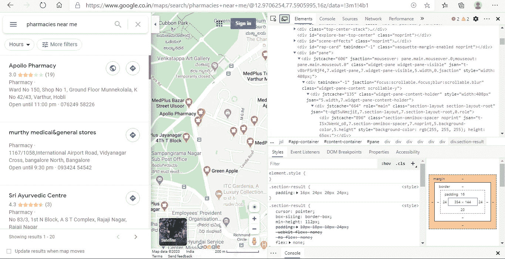
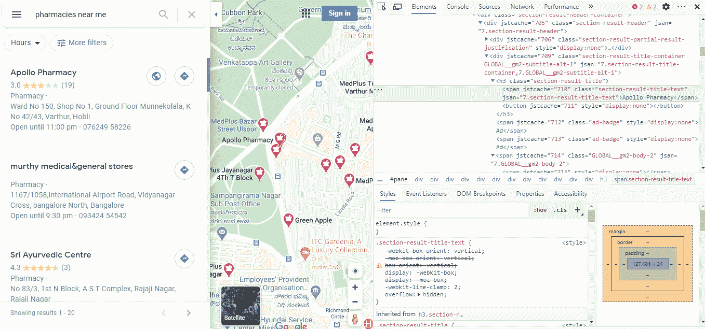
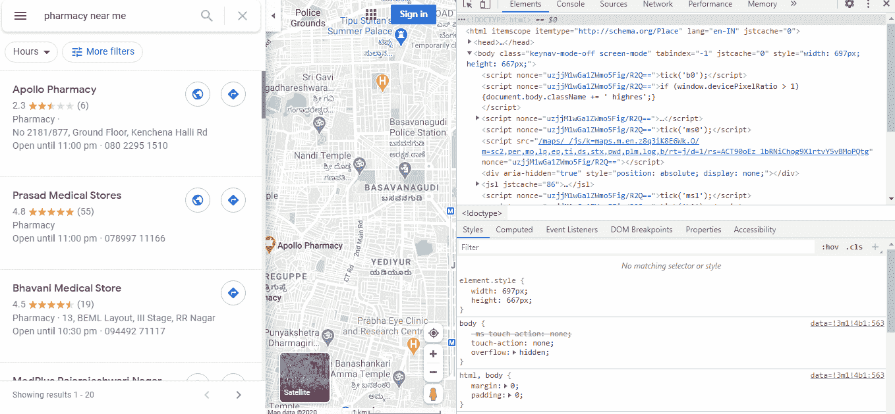
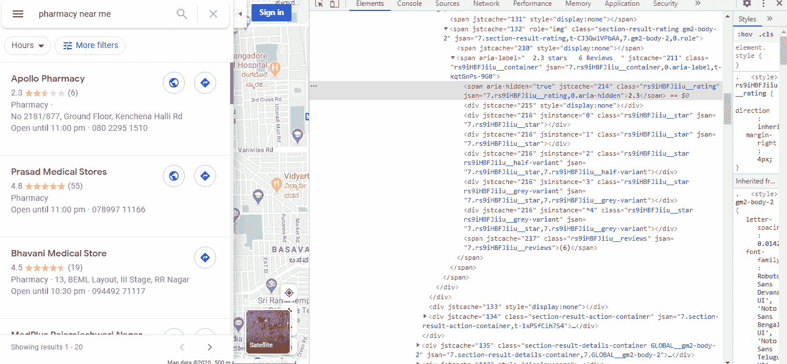
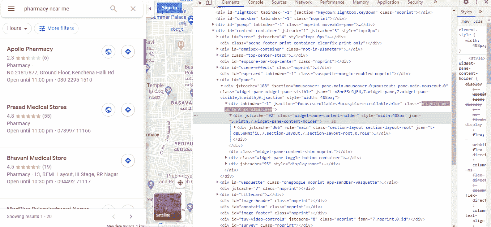
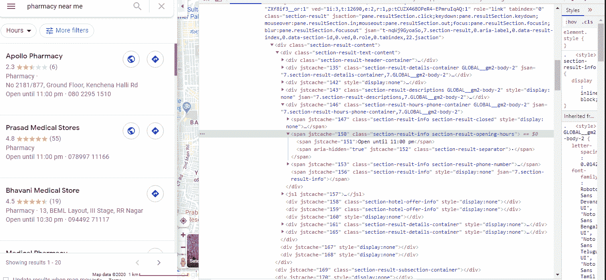
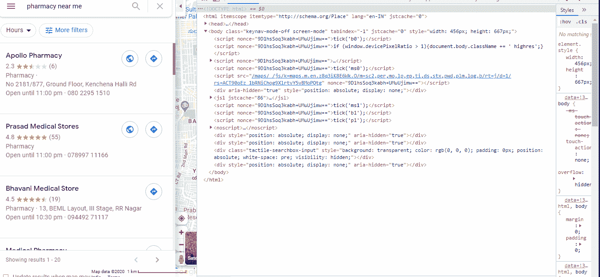

# 使用网络搜集，在 5 分钟内为您的企业收集线索。

> 原文：<https://medium.com/analytics-vidhya/collect-leads-for-your-business-in-5-minutes-using-web-scraping-10b01b55e96?source=collection_archive---------18----------------------->

**这篇文章描述了如何从 google places 获取企业名录。其可用于任何进一步的数据分析任务**

# 介绍

## 该项目的目的。

任何成功企业的第一步是确定目标客户或潜在的线索。

这个项目旨在通过谷歌企业名录为您的企业收集线索，并将详细信息存储为 CSV 格式，以后可用于冷消息，促销信息等。在本文中，我将通过一个**企业的例子来解释网络抓取**的**应用，我们需要为其生成销售线索**。

## **问题陈述**

XYZ 先生是一名批发商，他拥有一家消毒剂企业，他知道他的目标客户是他周围地区的所有药店零售商，现在他想找到接近所有客户的方法，为此他需要一些基本信息，如他周围的一些目标半径内和周围的药店数量、商店的地址、营业时间、店主的电话号码、对商店的评价和评论数量等。

## 解决问题…

我们都知道这些信息可以在 google places 中找到，但是直接使用这些信息并不方便。这就是 ***网页抓取*** 派上用场的地方，我们可以将所有这些信息存储到一个文件中，以后可以用于各种用途。

# 什么是网页抓取？

简单来说，它是从不同的网页(HTML 源)收集信息或数据的过程。这样收集的信息或数据可以用于为不同的应用建立数据集或数据库，例如数据分析、建立价格比较应用、线索生成等。)

**先决条件:-**

1.对 Python 3.0 编程有基本的了解。

2.您的系统中安装了 Python 3.0 或更高版本(安装时不要忘记将 Python 添加到路径中)。

3.确保你的系统中安装了 Chrome 浏览器，这在这个项目中是必不可少的。

## 使用的库:-

1.  ***beautiful soup:-****这个库用来解析网页中的 HTML。*
2.  ***Csv :-*** *这个库是用来把我们收集的所有数据存储成 Csv 文件的。*
3.  ***熊猫:-*** ***这个库可以用来操作/清理采集的数据。***
4.  Selenium:-*Selenium 是一个浏览器自动化工具，它在自动化测试中有几个应用，这里我用它来自动改变网页。*

对于初始步骤，请参考我的另一篇文章

***第一步:-创建 Virtualenv。***

***步骤 2:-激活 Virtualenv 并安装所需的库。***

 [## 冠状病毒实时更新的图形视图—使用 python

### 使用 python 从网页的表格中抓取数据

medium.com](/analytics-vidhya/graphical-view-of-coronavirus-live-update-using-python-f83903e5870) 

***步骤 3 :-通过点击 inspect 元素来理解你想要抓取的页面的 HTML。***

这是我们要刮的那一页。

***我们需要的信息是:-*** 1。药房的名称。
2。评级和评论数量。
3。地址。
4。电话号码(如果有)。
5。开门和关门时间。

1.  ***药店的名称。***

**药店名称**

注意元素的**标签**和**类**。这里 tag = **span** ，class =**section-result-title-text**

**2*。评级和评论数量。***

药房的评级

这里 tag = **span** ，class =**RS 9 ihbfjiiu _ _ rating**

药房评论

这里 tag = **span** ，class =**RS 9 ihbfjiiu _ _ 点评**

***3。地址/位置。***

药房的位置

这里 tag = **span** ，class =**section-result-location**

***4。电话号码***

药房的电话号码

这里 tag = **span** ，class =**section-result-info section-result-phone-number**

***5。开门和关门时间。***

药房的开门和关门时间

这里 tag = **span** ，class =**section-result-info section-result-opening-hours**

## **步骤 4 :-继续执行程序，将数据完全收集到一个 csv 文件中。**

***步骤 4.1 :-导入所需的库。***

**导入所需的库**

***步骤 4.2 :-硒设置。***

在此步骤中
1。我们正在提供我们想要刮的网址。
2。为 selenium 驱动程序设置选项。
**此过程要求您根据您的 chrome 版本下载 chrome webdriver。**

**下载链接:**[**https://chromedriver.chromium.org/**](https://chromedriver.chromium.org/)

**注意:-将下载的 Chrome 网络驱动程序放入你的项目文件夹**

**硒设置。**

***步骤 4.3 :-编写一个函数来收集数据并存储到 csv 中。***

**收集数据功能**

***第 4.5 步:-刮多页功能。***

我的 github 中有完整的代码，请随意使用

 [## saicharankr/Google _ business _ listings _ scraper

### 在 GitHub 上创建一个帐户，为 saicharankr/Google _ business _ listings _ scraper 开发做贡献。

github.com](https://github.com/saicharankr/Google_business_listings_scraper) 

让我们在:-[linkedin.com/in/saicharan-kr](https://www.linkedin.com/in/saicharan-kr)连线