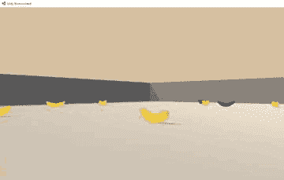
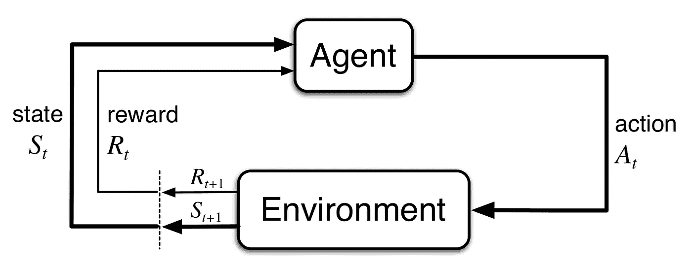
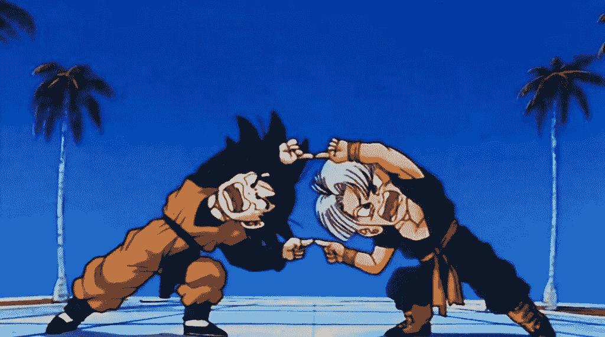
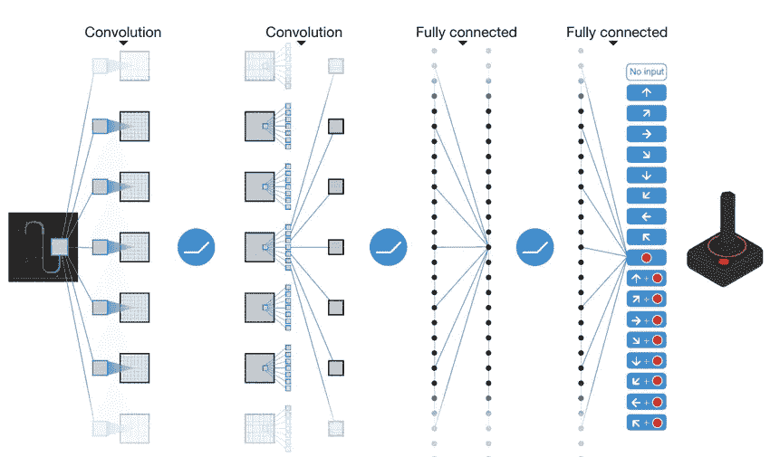
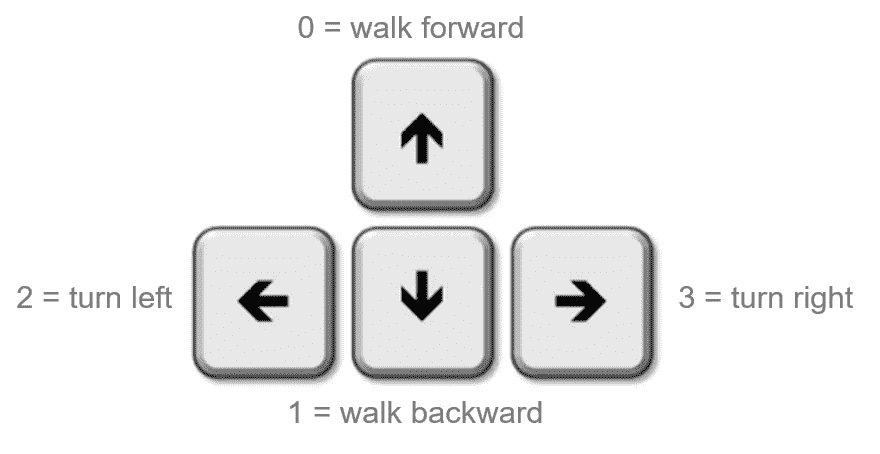
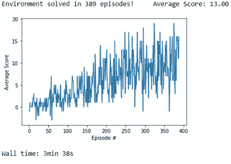
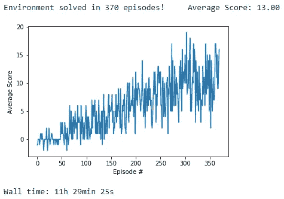
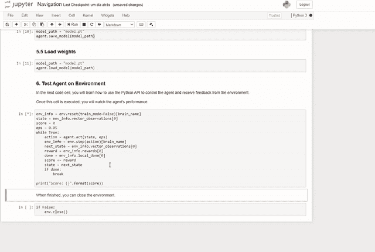
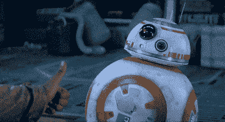

# 用深度强化学习代理收集香蕉

> 原文：<https://medium.com/analytics-vidhya/collecting-bananas-with-drl-agent-bdd8bf216d11?source=collection_archive---------9----------------------->

今天，我将与大家分享一个惊人的算法，它从零开始学习(不需要标记数据)收集黄色香蕉，同时避免蓝色香蕉。非常好，不是吗？



在我们讨论算法和代理之前，让我们了解一下强化学习是如何工作的。


你在等我关于强化学习的快速概述吗

# 强化学习是如何工作的？

强化学习是机器学习的一个子类。


机器学习的类型

我们将有一个**环境**和一个**代理** …酷

代理向环境提供**动作**。

环境返回**状态**和**奖励**给代理。

代理人的目标是**最大化累计报酬**。



我们有一些强化算法，通过映射导致最佳累积奖励的状态来工作。

它可以处理一些简单的问题(状态中有少量的数据和少量的动作)，但是当我们有大量的动作或无限数量的可能动作时，问题就开始了(֊)

然后……这就产生了深度强化学习算法！！

基本上，我们在其上添加了深度学习算法。



强化学习+深度学习=深度强化学习

对于这个环境，我使用了深度 Q 学习，见下面这个算法的架构。



深度 Q 学习算法

既然你已经知道了强化学习和深度强化学习的基础，那就来说说香蕉吧！

# 挑战:香蕉收藏家

这个环境是 Unity 提供的。

Unity 是这个领域的领导者，他们有其他人的环境，在这里查看更多关于 Unity。

在下面的视频中，他们解释了这种环境是如何工作的。

unity ML-代理环境—香蕉收集器

## 状态矢量空间

状态空间有 **37** 个维度，包含代理的速度，以及代理前进方向周围物体的基于光线的感知。

## 行动

我们有 **4 个**代理可以采取的行动:



## **奖励**

收集一个黄色香蕉提供`+1`的奖励，收集一个蓝色香蕉提供`-1`的奖励。

## 代理体系结构

在这个项目上创建的 agent 由一个 **agent** 、一个**深度** **Q-Learning** 模型和一个 M **记忆单元**组成。

**代理**

代理具有与环境交互的方法:`step()`、`act()`、`learn()`等。

深度 Q 学习和记忆单元将是代理的一部分(作为属性)。

**深度 Q 学习**

该模型的功能是理解状态并提供更好的行动，同时代理了解更多关于环境的信息。

这个模型的架构太简单了，它有一个**输入层**，一个**隐藏层**，然后是一个**输出层**。

这个神经网络是由 https://pytorch.org/开发的

**存储单元**

对于存储单元，我们有两个选项可以使用:

*   重放记忆

> *用两种简单的方法* `*add()*` *和* `*sample()*` *这种记忆可以存储经验，也可以返回一些随机的经验用于特工训练。*

*   优先内存

> *这种记忆稍微复杂一点，因为* `*sample()*` *方法并不返回体验的偶然性。它将尝试理解如何利用经验来更好地培训代理，为每个经验应用权重。*

# 培训和测试代理

要解决此环境，代理必须获得+13 的平均分数。

代理有许多超参数，一些操作系统用于深度 Q 学习模型，另一些用于存储单元等。

```
agent = Agent(state_size=**37**, action_size=**4**, seed=**199**, nb_hidden=**(64, 64)**, learning_rate=**0.001**, memory_size=**int(1e6)**, prioritized_memory=**False**, batch_size=**64**, gamma=**0.9**, tau=**0.03**, small_eps=**0.03**, update_every=**4**)
```

我们有两个训练有素的代理(具有重放记忆和优先记忆)。

请参见下面每个代理的培训课程结果。



重放记忆

通过**回放记忆**，代理用 389 集解决了这个环境，用了大约 4 分钟。



优先存储

用**优先记忆**，代理用 370 集解决了这个环境，得到了大约 11 小时 30 分钟的学习时间。

我们将在环境中测试经过训练的具有优先记忆的代理。



测试具有优先内存的代理

你可以在我的 GitHub 的仓库里找到代码。

[](https://github.com/DougTrajano/ds_drl_bananas_collector) [## DougTrajano/ds _ drl _ 香蕉 _ 收集器

### 这个项目包含一个基于深度强化学习的代理，它可以从零(任何标记的数据)学习到…

github.com](https://github.com/DougTrajano/ds_drl_bananas_collector) 

# 考虑

我在使用这个算法的过程中得到了很多乐趣，一开始它有些复杂，但是我想你也会喜欢它的。

如果你研究一些关于神经科学的东西，你会看到一些关于它的关系。当我们“选择”一些经验来评估我们每天做出的选择和决定时，我们的记忆工作类似于优先记忆。

对于未来的工作，我认为我们可以测试决斗 DQN 来改进这个模型。点击这里查看更多信息[。](https://arxiv.org/abs/1511.06581)

那都是乡亲们！感谢您阅读本文，如果您能在下面与我分享您的评论，我将不胜感激。



# 参考

*   [深度强化学习 Nanodegree - Udacity](https://www.udacity.com/course/deep-reinforcement-learning-nanodegree--nd893)
*   [优先体验回放——谷歌 DeepMind](https://arxiv.org/pdf/1511.05952.pdf)