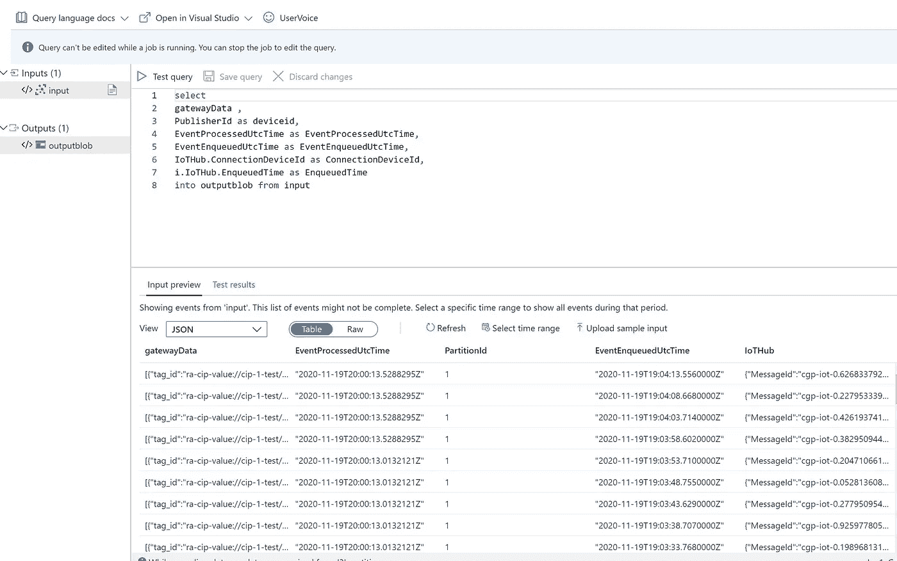

# 使用 Factory Talk Edge 网关从工业物联网收集数据到 Azure 物联网中心

> 原文：<https://medium.com/analytics-vidhya/collecting-data-from-industrial-iot-using-factory-talk-edge-gateway-to-azure-iot-hub-e830e65c0934?source=collection_archive---------7----------------------->

大多数工业控制使用罗克韦尔自动化 PLC、传感器和控制系统或西门子、施耐德和少数其他开源和供应商产品。

罗克韦尔自动化发布了一款名为 Factory talk edge gateway 的新产品，这将是我们的重点。Kepware 也是我们可以收集数据的另一个产品。

从 edge 收集数据对于大多数制造企业的运营和优化至关重要。我们可以用于机器学习和人工智能。现在面临的挑战是，将所有数据存储在本地数据中心或制造设施中并不容易，也不经济，因为存储空间和计算都很稀缺。

现在，如果我们可以在云中收集和存储数据，那么我们就可以从数据中建立或创造洞察力。

Factory talk edge gateway 具有称为智能标记的新功能，可以了解在工厂车间内收集和共享的数据的上下文。因此，本文将讨论如何从 PLC 中采集数据。

对于本文，我们正在测试 compact logix 5480，我们创建了一个简单的程序来生成计数器并增加值。为了检索数据，我们尝试了两种方法，一种是将网关安装在笔记本电脑或虚拟机上，另一种是安装在 Logix 5480 上。

体系结构


体系结构

首先安装 Compact Logix 5480 并更新固件。使用当前数据和时间配置 compact logix。在计算模块中，您可以安装 Factory Talk Edge Gateway。下载软件需要 2 条信息序列号和公司名称或产品密钥。

创建一个 Azure 物联网中心，创建一个物联网设备，并获取设备的名称和连接字符串。加载示例程序以生成一个计数器，并在 x 秒内递增。将程序保存在存储卡中，并翻转运行模式。这允许我们在每次系统重启时加载程序。

现在是配置网关的时候了:

*   创建 CIP 驱动程序，应该是本地计算模块的 IP 地址
*   要获取 ip 地址，请使用 monitor 并键入 ipconfig
*   创建数据源
*   一个用于紧凑型 logix 5480 中的 PLC
*   IP 通常显示在 LED 显示屏上。
*   创建模型
*   模型可以将标签分组并应用于不同的输出
*   创建应用程序
*   在这里，我们正在创建 IOT 枢纽
*   指定名称
*   指定设备名称
*   使用连接字符串(设备)
*   选择配置，选择标签并指定发送频率
*   部署代码
*   单击启用数据流
*   保存设置
*   等待系统应该显示全部绿色
*   选择“存储并转发”—以便在数据中断时保留数据


工厂对话边缘网关

一旦连接到 azure IoT hub，请检查概览页面以查看是否有任何消息被发送。如果网关没有显示任何错误并推送数据，那么是时候配置 Azure Stream analytics 以存储到 Azure Data lake store Gen2 中进行进一步处理。数据登陆后，可以批量处理大量数据(大数据)。

以下是流分析查询的代码

```
select 
gatewayData ,
PublisherId as deviceid,	
EventProcessedUtcTime as EventProcessedUtcTime,
EventEnqueuedUtcTime as EventEnqueuedUtcTime,
IoTHub.ConnectionDeviceId as ConnectionDeviceId,
i.IoTHub.EnqueuedTime as EnqueuedTime
into outputblob from input
```



流分析查询

运行流分析并确保数据存储如下


json 输出示例

有关更多信息，请查看此回购协议以了解更多详情

[IIoT-AI/ftedgetazure . MD](https://github.com/balakreshnan/IIoT-AI/blob/master/IIoT/FTEdgetoAzure.md)

请提供您的意见和想法